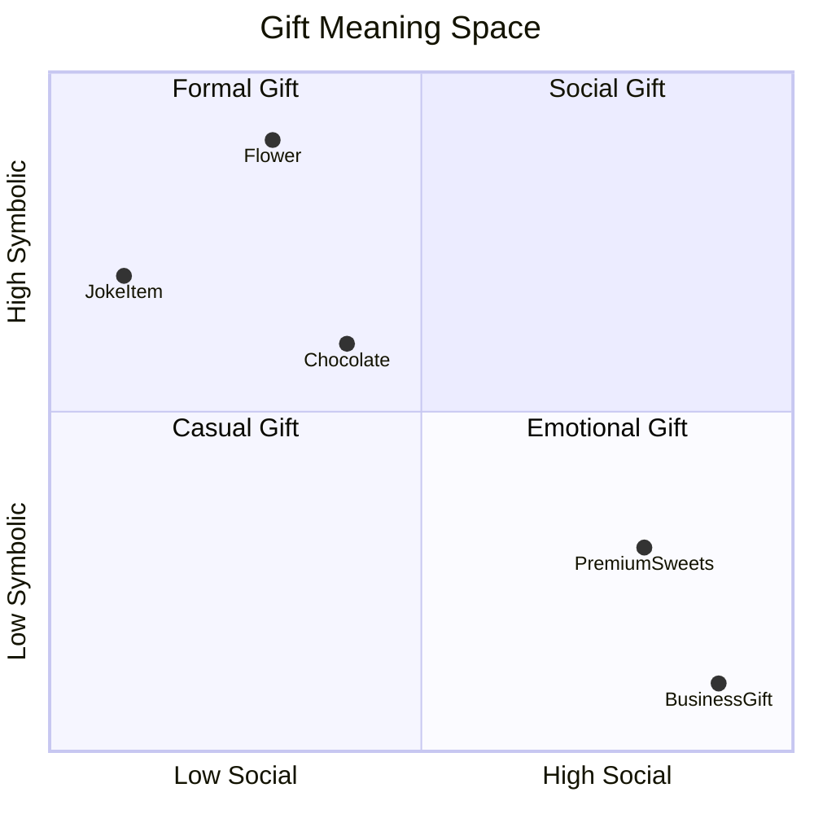
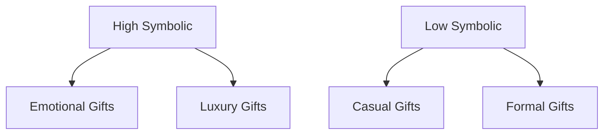
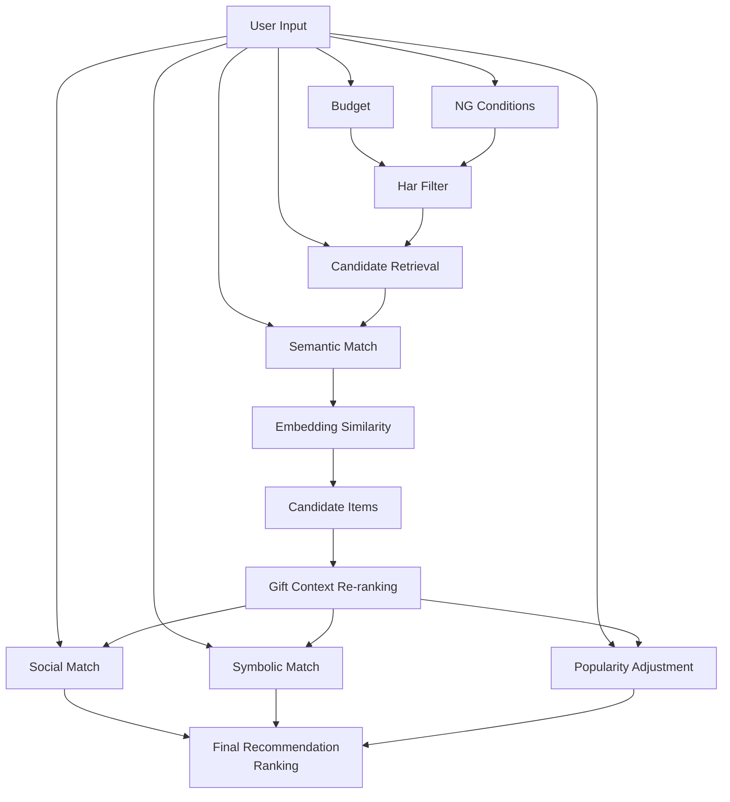
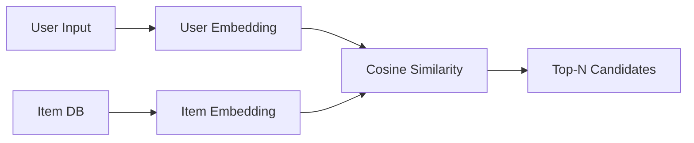
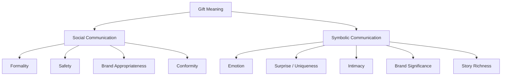
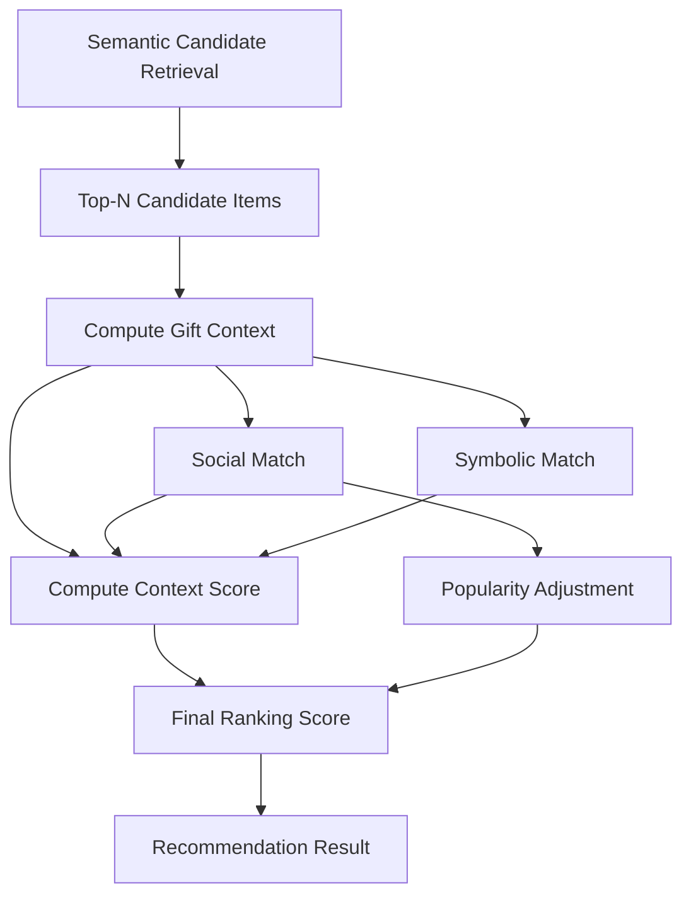
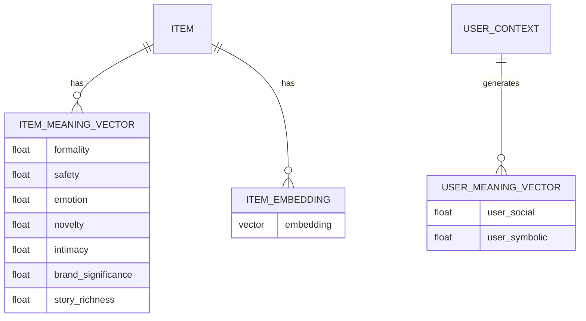

# Gift Recommendation Service

# レコメンドアーキテクチャ設計

---

# 1. サービスコンセプト

本サービスは通常のEC検索ではなく

**贈答意味（Gift Meaning）を理解して商品を推薦するサービス**

である。

通常ECでの商品検索は下記のフローとなるが、

```
商品特徴 → 商品検索
```

ギフトレコメンドサービスでは、ギフト選びの文脈（ニーズ、意味）を推察したうえでレコメンドを行うため、超外観フローは下記となる。

```
贈答文脈 → 贈答意味 → 商品推薦
```

## Gift Meaning 2次元空間

“贈答意味”を、心理学およびマーケティング学の観点から、ギフトの目的（≒ユーザー意味）を下記を2軸とした”**贈答意味空間（Gift Meaning Space）”**で捉える。

- 社会的コミュニケーション
  - そのギフトが、どれだけ社会関係の維持・調整に関わるか
    　⇒ギフト選びのフォーマルさに影響
- 象徴的コミュニケーション
  - どれだけ感情や意味を込めたいか
    　⇒ギフト選びの感情属性、パーソナライズ度合い（ユニークさ）に影響



### 各領域の意味

| 領域                        | 意味             | 例         |
| --------------------------- | ---------------- | ---------- |
| High Social / Low Symbolic  | フォーマルギフト | 菓子折り   |
| High Social / High Symbolic | 高級ギフト       | ブランド品 |
| Low Social / High Symbolic  | 感情ギフト       | 花束       |
| Low Social / Low Symbolic   | カジュアルギフト | 雑貨       |



---

# 2. サービスアーキテクチャ



---

# 3. レコメンド処理フロー

| Stage                   | 役割         |
| ----------------------- | ------------ |
| Hard Filter             | 予算・NG条件 |
| Candidate Retrieval     | 商品意味検索 |
| Gift Context Re-ranking | 贈答意味評価 |
| Final Ranking           | 最終順位     |

---

# 4. Candidate Retrieval

## 目的

商品として意味的に近い候補を取得する

---

## Semantic Score

```
semantic_score =
cosine_similarity(
  user_embedding,
  item_embedding
)
```

---

## User Embedding

```
embedding(
  好みの特徴
  避けたい特徴
)
```

---

## Item Embedding

```
embedding(
  商品名
  ジャンル
  タグ
  キャッチコピー
  商品説明
)
```

---

## Retrieval Architecture



---

# 5. Gift Meaning Model

本サービスの心理モデル。



---

# 6. User Meaning Vector

ユーザー文脈（Context）から生成。

```
user_social =
a1 * formality
+ a2 * safety
+ a3 * brand_appropriateness

```

```
user_symbolic =
b1 * emotion
+ b2 * novelty
+ b3 * intimacy
+ b4 * symbolic_identity
+ b5 * story_richness
```

## Context → Feature 推定モデル検討

| 方法   | 精度 | 実装 | 性能（推論速度）             | 利用ソフト/サービス              | データアクセス / 更新頻度            | コスト                   |
| ------ | ---- | ---- | ---------------------------- | -------------------------------- | ------------------------------------ | ------------------------ |
| ルール | 中   | 簡単 | **最速**（DB参照＋条件分岐） | Python / FastAPI / DBマスタ      | マスタ参照のみ・更新は手動追加       | **最安**（外部推論なし） |
| LLM    | 高   | 中   | 中（API呼び出しレイテンシ）  | OpenAI / Claude / Gemini / vLLM  | リクエスト毎推論・プロンプト調整あり | 中（トークン課金）       |
| ML     | 高   | 難   | 高（学習済モデルは高速）     | scikit-learn / XGBoost / PyTorch | 学習データ必要・再学習サイクル       | 中〜高（学習コスト）     |

---

# 7. Item Meaning Vector

商品特徴から生成。

```
item_social =
a1 * formality
+ a2 * safety
+ a3 * brand_appropriateness

```

```
item_symbolic =
b1 * emotion
+ b2 * novelty
+ b3 * intimacy
+ b4 * symbolic_identity
+ b5 * story_richness
```

---

# 8. Context Match

一致度

```
social_match =
1 - |user_social - item_social|
```

```
symbolic_match =
1 - |user_symbolic - item_symbolic|
```

---

# 9. Risk Tolerance

贈答リスク許容度

```
λ_ctx =
user_symbolic
/
(user_social + user_symbolic)
```

意味

| 値  | 意味       |
| --- | ---------- |
| 低  | 無難ギフト |
| 高  | 特別ギフト |

---

# 10. Popularity Score

人気スコア

```
popularity_score =
w1 * review_rating
+ w2 * log(review_count)
+ w3 * ranking_score
```

---

# 11. Context Score

```
context_score =
(1 - λ_ctx) * social_match
+
λ_ctx * symbolic_match
```

---

# 12. Final Re-ranking Score

```
rerank_score =
semantic_score
*
(
1
+ α * context_score
+ β * user_social * popularity_score
)
```

---

# 13. Ranking Pipeline



---

# 14. Meaning Feature Database

## Meaning Feature Table

| Feature               | Category | Description        |
| --------------------- | -------- | ------------------ |
| formality             | social   | 儀礼性・きちんと感 |
| safety                | social   | 無難さ・外しにくさ |
| brand_appropriateness | social   | ブランド格・品位   |
| conformity            | social   | 一般的受容性       |
| emotion               | symbolic | 感情表現           |
| novelty               | symbolic | 特別感             |
| intimacy              | symbolic | 親密性             |

※「商品が持つ意味」なのか「相手との関係に依存する意味なのか」が混在しやすい。
　例えば、香水はintimacy高めだが、だれにでも高いわけではない。
　なので、厳密には`item_symbolic`固有値というより`context interaction`が強い要素。
　暫定で、MVPでは商品側の傾向値として持つこととする。 |
| symbolic_identity | symbolic | ブランド・作り手・由来・文化的意味を含む象徴的な意味合いの強さ |
| story_richness | symbolic | ストーリー性の豊かさ |

---

# 15. Feature Weight Table

Notion DB

| Feature               | Weight | Category |
| --------------------- | ------ | -------- |
| formality             | a1     | social   |
| safety                | a2     | social   |
| brand_appropriateness | a3     | social   |
| emotion               | b1     | symbolic |
| novelty               | b2     | symbolic |
| intimacy              | b3     | symbolic |
| symbolic_identity     | b4     | symbolic |
| story_richness        | b5     | symbolic |

---

# 16. Meaning Vector Table

商品ごとの意味ベクトル。

| item_id | formality | safety | emotion | novelty | intimacy | symbolic_identity | story_richness |
| ------- | --------- | ------ | ------- | ------- | -------- | ----------------- | -------------- |

---

# 17. Recommendation Feature Store



---

# 18. 将来拡張

## Retrieval拡張

- ANN検索
- Hybrid検索
- BM25 + embedding

---

## Ranking拡張

- Diversity（MMR）
- User history
- CTR / CVR
- Seasonality

---

# 19. 本サービスの本質

通常EC

```
Product Recommendation
```

本サービス

```
Gift Meaning Recommendation
```

つまり

```
贈答意味理解AI
```

である。

---

# 次に作るべき重要設計

ここまで整理したので、次に作ると良いのはこの3つです。

1️⃣ **商品意味ベクトル生成アーキテクチャ**

（LLM / rule / embedding）

2️⃣ **贈答文脈 → user_social / user_symbolic 推定**

3️⃣ **評価指標（レコメンド品質測定）**

この3つを設計すると、

**レコメンドシステムとして完成形にかなり近づきます。**
