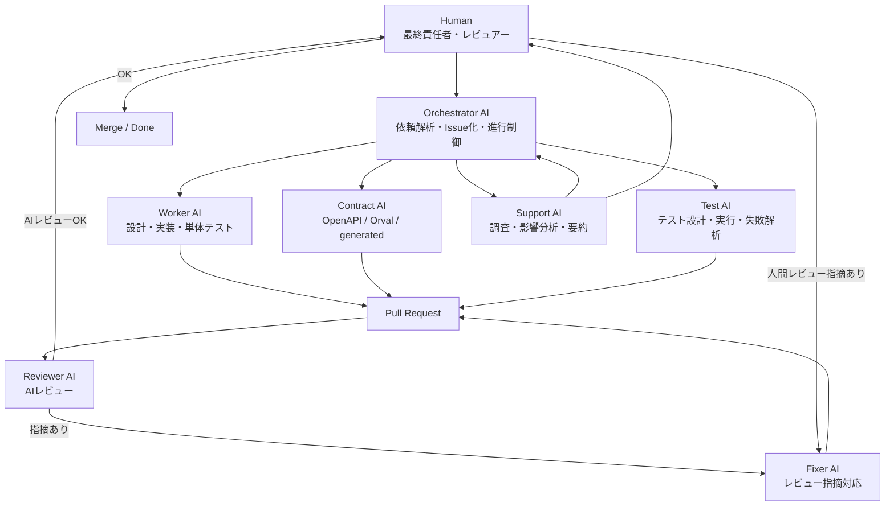
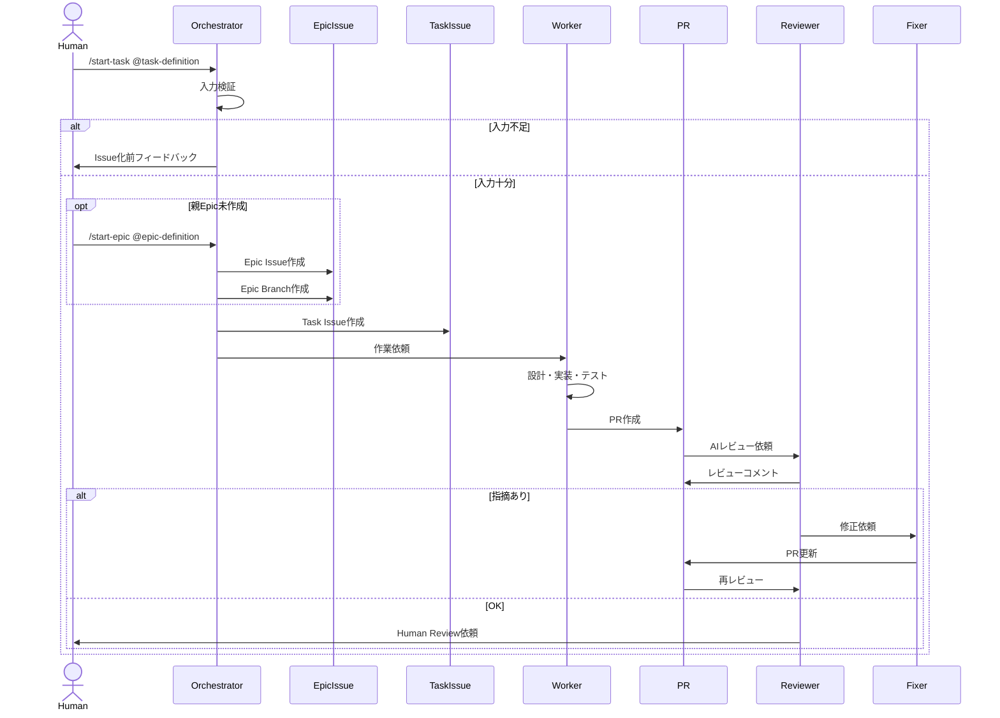
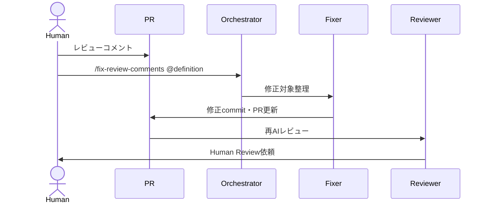

# AIエージェント体制・責務定義

## 1. 目的

本ドキュメントは、Gift Recommendation Service におけるAIエージェント活用型開発運用の体制と責務を定義する。

本プロジェクトでは、人間とAIエージェントが協業し、設計、開発、テスト、レビュー、修正対応を進める。

本ドキュメントでは、以下を明確にする。

- 人間とAIエージェントの役割分担
- AIエージェントの種類
- 各AIエージェントの責務
- 各AIエージェントの入力・出力
- Agent間の引き継ぎ関係
- AIレビューと人間レビューの責務分離
- 並列AI作業時の体制
- 作業不可時の人間エスカレーション方針

---

## 2. 本ドキュメントの位置づけ

本ドキュメントは、AIエージェントの体制・責務分担に関する正本である。

| 項目                       | 正本ドキュメント                           |
| -------------------------- | ------------------------------------------ |
| AIエージェント全体フロー   | AIエージェント活用型\_開発運用フロー設計書 |
| AIエージェントの体制・責務 | 本ドキュメント                             |
| Command仕様                | Commands設計書                             |
| Task Definition構造        | Task Definition設計書                      |
| Cursor Agent定義の実装仕様 | AI Agent定義設計書                         |
| AIレビュー観点             | AIレビュー運用設計書                       |
| AIログ方針                 | AIログ運用ルール                           |
| Slack通知方針              | Slack通知運用設計書                        |
| worktree運用               | worktree運用ルール                         |

本ドキュメントでは、AIエージェントの「役割」と「責務」を定義する。
`.cursor/agents/` に配置する具体的なAgent定義ファイルの仕様は、AI Agent定義設計書で定義する。

---

## 3. 基本方針

AIエージェントは、通常のシステム開発における役割をAIで代替・補助するものとして扱う。

AIエージェントは、以下を担う。

- 作業依頼の解析
- 作業計画案の作成
- Issue作成
- Branch上での設計・実装・テスト
- PR作成
- AIレビュー
- レビュー指摘対応
- 調査・影響分析
- Slack通知用サマリ作成

ただし、AIエージェントは最終責任者ではない。

最終的な以下の判断は、人間が行う。

- 事業判断
- 方針判断
- 要件確定
- 設計方針の最終判断
- PR merge判断
- リリース判断
- 優先度判断
- 作業停止時の方針判断

---

## 4. 体制全体像



---

## 5. 役割一覧

| 役割             | 位置づけ       | 主な責務                                     |
| ---------------- | -------------- | -------------------------------------------- |
| Human            | 最終責任者     | 方針判断、最終レビュー、merge、リリース判断  |
| Orchestrator AI  | AI作業の司令塔 | 依頼解析、入力検証、Issue作成、進行制御      |
| Worker AI        | 実作業者       | 設計、実装、単体テスト、成果物作成           |
| Reviewer AI      | AIレビュアー   | PR差分、Issue、docs、完了条件のレビュー      |
| Fixer AI         | 修正担当       | AIレビュー・人間レビュー指摘への対応         |
| Contract AI      | 契約変更担当   | OpenAPI / Orval / generated 等の横断契約変更 |
| Test AI          | テスト担当     | テスト観点、テスト実行、失敗解析、結果整理   |
| Docs Reviewer AI | docs品質担当   | docs整合性、テンプレート準拠、用語揺れ確認   |
| Support AI       | 補助担当       | 調査、影響分析、要約、判断材料作成           |

---

## 6. 「AIエージェントを分ける」の意味

本プロジェクトにおいて「AIエージェントを分ける」とは、必ずしも物理的に別サービス・別アカウント・別モデルを使うことを意味しない。

以下を分けることを指す。

| 分離対象     | 内容                                                             |
| ------------ | ---------------------------------------------------------------- |
| 責務         | Orchestrator、Worker、Reviewer、Fixerなど役割を分ける            |
| 指示         | 役割ごとに読み込ませるCommand / Agent定義 / Ruleを分ける         |
| 入力         | Task Definition、PR、Issue、docsなど、参照対象を役割ごとに変える |
| 出力         | Issue、PR、レビューコメント、docs、Slack通知など出力先を分ける   |
| 作業領域     | 並列作業ではBranch / worktreeを分ける                            |
| レビュー観点 | 作業者とレビュアーの観点を分ける                                 |

Cursor上では、主に以下で分離する。

```
.cursor/commands/
.cursor/agents/
.cursor/rules/
prompts/definitions/
prompts/templates/
```

将来的に必要であれば、モデル、実行環境、Cloud Agent、権限、Slack通知先も分ける。

---

## 7. Human

## 7.1 役割

Humanは、プロジェクトの最終責任者である。

AIエージェントが作業を実施しても、最終的な品質責任はHumanが持つ。

## 7.2 主な責務

- 事業方針の決定
- 要件・設計方針の判断
- AIエージェントへの作業依頼
- Task Definitionの作成・レビュー
- Orchestrator AIからのIssue化前フィードバックへの回答
- PRの最終レビュー
- PR merge判断
- リリース判断
- 作業優先度の決定
- AIエージェント運用ルールの改善

## 7.3 主な入力

- 事業構想
- ドメイン設計資料
- アプリケーション設計資料
- AIからのIssue化前フィードバック
- PR
- AIレビュー結果
- Slack通知

## 7.4 主な出力

- 作業依頼
- 方針判断
- レビューコメント
- merge判断
- 追加Issue化判断
- リリース判断

---

## 8. Orchestrator AI

## 8.1 役割

Orchestrator AIは、人間と各AIサブエージェントのインタフェースを担当する。

Humanからの作業依頼を解析し、作業に必要な入力情報が揃っているかを確認し、Issue化・作業分割・進行制御を行う。

## 8.2 主な責務

- Command + Definitionの解析
- Task Definitionの妥当性確認
- 入力docs・入力ファイルの存在確認
- 作業範囲の確認
- 出力先の確認
- 依存Issue / PRの確認
- Issue化前フィードバックの作成
- Epic / Task分割案の作成
- Issue本文の生成
- Project同期項目の確認
- Label付与方針の確認
- Branch作成条件の確認
- Worker AI / Reviewer AI / Fixer AIへの引き継ぎ
- Slack通知用サマリの作成または依頼

## 8.3 主な入力

- HumanからのCommand
- Task Definition
- 関連docs
- 既存Issue
- 既存PR
- Projects状態
- ブランチ状況

## 8.4 主な出力

- Issue化前フィードバック
- Issue本文
- Task分割案
- 作業計画
- Agent割当案
- Slack通知サマリ
- ai-logs/intakeへの記録

## 8.5 判断してよいこと

Orchestrator AIは、以下を判断してよい。

- 入力情報が不足しているか
- Issue化してよい状態か
- Taskを分割すべきか
- 横断影響がありそうか
- Worker AIに渡せる状態か
- 人間判断が必要か

## 8.6 判断してはいけないこと

Orchestrator AIは、以下を独断で確定してはいけない。

- 事業方針の変更
- MVPスコープの変更
- 重要な設計方針の変更
- リリース判断
- 人間レビューの省略
- 依存未解決のままの強行実行

---

## 9. Worker AI

## 9.1 役割

Worker AIは、Issue / Branch単位で実作業を行うAIエージェントである。

設計書作成、コード実装、単体テスト作成、テスト実行、成果物更新を担当する。

## 9.2 主な責務

- Issue本文の理解
- Task Definitionの理解
- 入力docsの確認
- 対象ファイルの確認
- 設計書・仕様書の作成
- ソースコードの作成・修正
- テストコードの作成・修正
- ローカル検証
- lint / typecheck / test実行
- commit作成
- PR本文案の作成
- 作業サマリの作成

## 9.3 主な入力

- Issue
- Task Definition
- input_docs
- target_files
- test_files
- 設計書テンプレート
- 既存コード
- 関連PRコメント

## 9.4 主な出力

- docs成果物
- ソースコード変更
- テストコード変更
- テスト結果
- commit
- PR本文
- 作業サマリ

## 9.5 判断してよいこと

Worker AIは、以下を判断してよい。

- 実装上必要な小さな補助関数の追加
- テストケースの補完
- 明確なtypoや表記揺れの修正
- 指定範囲内の軽微なリファクタリング
- テンプレートに沿った章立ての補完

## 9.6 判断してはいけないこと

Worker AIは、以下を独断で行ってはいけない。

- Issueの作業範囲を超える変更
- API契約の変更
- DB schemaの変更
- generatedファイルの手動編集
- 重要なアーキテクチャ変更
- MVPスコープ変更
- 依存Task未完了の前提での実装強行
- 人間判断が必要な仕様変更

---

## 10. Reviewer AI

## 10.1 役割

Reviewer AIは、人間レビュー前の品質確認を行うAIエージェントである。

作業者であるWorker AIとは責務を分け、PR差分、Issue、Task Definition、docs、テスト結果の整合性を確認する。

## 10.2 主な責務

- PR差分確認
- Issueの目的・作業範囲との整合確認
- Task Definitionとの整合確認
- 完了条件の充足確認
- 確認観点の充足確認
- docs配置・テンプレート準拠確認
- コード品質確認
- テスト不足確認
- CI結果確認
- generated差分確認
- 横断影響確認
- レビューコメント作成
- AIレビュー結果サマリ作成
- Projects StatusをHuman Reviewへ進めてよいかの判断材料作成

## 10.3 主な入力

- PR
- PR差分
- Issue
- Task Definition
- input_docs
- output_docs
- テスト結果
- CI結果
- 既存docs

## 10.4 主な出力

- AIレビューコメント
- AIレビュー結果サマリ
- 修正要否
- Human Reviewへ進める判断材料
- 必要に応じたfollow-up Issue候補

## 10.5 判断してよいこと

Reviewer AIは、以下を判断してよい。

- AIレビューとしてOKか
- 修正が必要か
- 同一Branch修正で足りるか
- 別Issue化すべき可能性があるか
- Human Reviewへ進めるべきか

## 10.6 判断してはいけないこと

Reviewer AIは、以下を独断で行ってはいけない。

- PR merge
- 人間レビューの省略
- 重大な仕様変更の確定
- リリース判断
- レビュー指摘なしで品質保証を完了扱いにすること

---

## 11. Fixer AI

## 11.1 役割

Fixer AIは、AIレビューまたは人間レビューの指摘に基づき、同一Branchで修正対応するAIエージェントである。

## 11.2 主な責務

- PRコメントの確認
- 人間レビューコメントの確認
- AIレビューコメントの確認
- 修正方針の整理
- 同一Branchでの修正
- テスト再実行
- commit追加
- PR本文またはPRコメントの更新
- 修正サマリ作成
- 再AIレビュー依頼

## 11.3 主な入力

- PRレビューコメント
- Issue
- Task Definition
- PR差分
- 既存Branch
- 既存テスト結果

## 11.4 主な出力

- 修正commit
- PR更新
- レビューコメントへの返信
- 修正サマリ
- 再レビュー依頼

## 11.5 判断してよいこと

Fixer AIは、以下を判断してよい。

- 指摘に対する具体的な修正方法
- テスト再実行範囲
- 軽微な補足修正
- PRコメントへの対応内容

## 11.6 判断してはいけないこと

Fixer AIは、以下を独断で行ってはいけない。

- 指摘範囲を超える大幅変更
- 別Issue化すべき内容の同一Branch混入
- API契約変更
- DB schema変更
- 人間コメントの意図が不明確なままの強行修正
- PR merge

---

## 12. Contract AI

## 12.1 役割

Contract AIは、OpenAPI、Orval、generated、API clientなど、横断影響が大きい契約変更を扱うAIエージェントである。

## 12.2 主な責務

- OpenAPI変更影響の確認
- Orval設定変更の確認
- generatedファイル生成
- generated差分確認
- API client利用側影響確認
- web / api / reco 間のIF整合確認
- Contract専用Taskの作成支援
- 横断影響ログの作成

## 12.3 主な入力

- OpenAPI定義
- Orval設定
- generated差分
- API設計書
- API仕様書
- 関連Task Definition
- 関連PR

## 12.4 主な出力

- OpenAPI変更案
- Orval生成結果
- generated差分確認結果
- 影響分析
- Contract Task案
- ai-logs/cross-cuttingへの記録

## 12.5 判断してよいこと

Contract AIは、以下を判断してよい。

- 契約変更の影響範囲
- generated差分が期待通りか
- Contract専用Taskに分離すべきか
- 利用側修正が必要か

## 12.6 判断してはいけないこと

Contract AIは、以下を独断で行ってはいけない。

- Public API仕様の大幅変更
- 後方互換性を壊す変更の確定
- 他Taskへの影響を無視したgenerated更新
- 人間判断なしのAPI設計方針変更

---

## 13. Test AI

## 13.1 役割

Test AIは、テスト観点確認、テスト作成、テスト実行、失敗解析、テスト結果整理を担当するAIエージェントである。

## 13.2 主な責務

- テスト観点の整理
- 単体テストケースの作成
- 結合テストケースの作成
- E2Eテスト観点の整理
- 非機能テスト観点の整理
- レコメンド品質評価観点の整理
- テスト実行
- 失敗原因分析
- テスト結果サマリ作成
- テスト不足の指摘

## 13.3 主な入力

- Issue
- Task Definition
- テスト仕様書
- 既存テストコード
- 実装差分
- CI結果
- エラーログ

## 13.4 主な出力

- テストコード
- テストケース
- テスト結果
- 失敗解析結果
- 追加修正提案
- PRコメント

## 13.5 判断してよいこと

Test AIは、以下を判断してよい。

- テスト観点の不足
- 境界値テストの追加
- 異常系テストの追加
- 再実行すべきテスト範囲
- テスト失敗の原因候補

## 13.6 判断してはいけないこと

Test AIは、以下を独断で行ってはいけない。

- 仕様そのものの変更
- テストを通すための不適切な実装修正
- 失敗テストの無断削除
- 品質基準の引き下げ

---

## 14. Docs Reviewer AI

## 14.1 役割

Docs Reviewer AIは、docs成果物の品質、整合性、テンプレート準拠、用語揺れを確認するAIエージェントである。

## 14.2 主な責務

- 設計書テンプレート準拠確認
- 既存docsとの整合確認
- 用語揺れ確認
- 章立ての不足確認
- 正本関係の矛盾確認
- 参照ドキュメントの不足確認
- Notion貼り付け適性の確認
- Mermaid図・表の可読性確認

## 14.3 主な入力

- 対象docs
- 関連docs
- 設計書テンプレート
- 用語集
- プロジェクト運用ルール

## 14.4 主な出力

- docsレビューコメント
- 修正提案
- 整合性確認結果
- 用語揺れ指摘

---

## 15. Support AI

## 15.1 役割

Support AIは、調査、影響分析、要約、判断材料作成などを補助するAIエージェントである。

## 15.2 主な責務

- 技術調査
- 既存docs調査
- 既存コード調査
- 影響分析
- 比較表作成
- 判断材料整理
- Slack通知用サマリ作成
- Issue化前の補助分析

## 15.3 主な入力

- 調査依頼
- docs
- Issue
- PR
- コード
- 外部仕様
- 技術資料

## 15.4 主な出力

- 調査結果
- 影響分析
- 比較表
- 判断材料
- サマリ

## 15.5 注意点

Support AIの出力は、原則として判断材料である。

方針確定、作業実施、PR mergeは行わない。

---

## 16. Agent別入出力一覧

| Agent            | 主な入力                                   | 主な出力                                           |
| ---------------- | ------------------------------------------ | -------------------------------------------------- |
| Orchestrator AI  | Command, Definition, docs, Issue, Projects | Issue本文, 作業計画, Issue化前フィードバック       |
| Worker AI        | Issue, Definition, docs, target_files      | docs, code, tests, commit, PR本文                  |
| Reviewer AI      | PR, Issue, Definition, diff, CI結果        | AIレビューコメント, 修正要否, Human Review判断材料 |
| Fixer AI         | PRコメント, Issue, Branch                  | 修正commit, PR更新, 修正サマリ                     |
| Contract AI      | OpenAPI, Orval, generated, API設計書       | 契約変更案, generated差分確認, 影響分析            |
| Test AI          | 実装差分, テスト仕様, CI結果               | テストコード, テスト結果, 失敗解析                 |
| Docs Reviewer AI | docs, テンプレート, 用語集                 | docsレビューコメント, 整合性指摘                   |
| Support AI       | 調査対象, docs, code, Issue                | 調査結果, 影響分析, 要約                           |

---

## 17. Agent間の標準引き継ぎ

## 17.1 新規AI主導タスク



---

## 17.2 レビュー指摘対応



---

## 18. RACI

| 作業                    | Human | Orchestrator | Worker | Reviewer | Fixer | Contract | Test | Docs Reviewer | Support |
| ----------------------- | ----- | ------------ | ------ | -------- | ----- | -------- | ---- | ------------- | ------- |
| 作業依頼                | A/R   | C            | -      | -        | -     | -        | -    | -             | C       |
| Task Definition確認     | A     | R            | C      | C        | -     | C        | C    | C             | C       |
| Issue化前フィードバック | A     | R            | -      | -        | -     | C        | -    | -             | C       |
| Issue作成               | A     | R            | -      | -        | -     | -        | -    | -             | -       |
| Project同期             | A     | C            | -      | -        | -     | -        | -    | -             | -       |
| Branch作成              | A     | C            | C      | -        | -     | -        | -    | -             | -       |
| 設計書作成              | A     | C            | R      | C        | C     | -        | -    | C             | C       |
| 実装                    | A     | C            | R      | C        | C     | C        | C    | -             | -       |
| 単体テスト              | A     | C            | R      | C        | C     | -        | R    | -             | -       |
| Contract変更            | A     | C            | C      | C        | C     | R        | C    | -             | C       |
| PR作成                  | A     | C            | R      | -        | -     | C        | C    | -             | -       |
| AIレビュー              | A     | C            | -      | R        | -     | C        | C    | C             | C       |
| 人間レビュー            | A/R   | C            | -      | C        | -     | C        | C    | C             | C       |
| レビュー指摘対応        | A     | C            | C      | C        | R     | C        | C    | C             | -       |
| merge                   | A/R   | -            | -      | -        | -     | -        | -    | -             | -       |
| リリース判断            | A/R   | C            | -      | C        | -     | C        | C    | -             | C       |

凡例：

| 記号 | 意味                  |
| ---- | --------------------- |
| R    | Responsible: 実行責任 |
| A    | Accountable: 最終責任 |
| C    | Consulted: 相談・確認 |
| I    | Informed: 通知対象    |

---

## 19. Agent割当方針

## 19.1 通常Task

| Task種別         | 主担当              | 補助             | レビュー                       |
| ---------------- | ------------------- | ---------------- | ------------------------------ |
| 設計書作成       | Worker AI           | Support AI       | Docs Reviewer AI / Reviewer AI |
| 実装             | Worker AI           | Test AI          | Reviewer AI                    |
| 単体テスト       | Worker AI / Test AI | Support AI       | Reviewer AI                    |
| docs修正         | Worker AI           | Docs Reviewer AI | Reviewer AI                    |
| レビュー指摘対応 | Fixer AI            | Worker AI        | Reviewer AI                    |

## 19.2 横断Task

| Task種別          | 主担当      | 補助       | レビュー            |
| ----------------- | ----------- | ---------- | ------------------- |
| OpenAPI変更       | Contract AI | Worker AI  | Reviewer AI         |
| Orval生成         | Contract AI | Test AI    | Reviewer AI         |
| generated差分確認 | Contract AI | Worker AI  | Reviewer AI         |
| DB migration      | Worker AI   | Support AI | Reviewer AI / Human |
| GitHub Actions    | Worker AI   | Support AI | Reviewer AI         |
| CI/CD             | Worker AI   | Support AI | Reviewer AI         |

---

## 20. モデル・モード指定方針

AIエージェントごとに、作業内容に応じてモデルや実行モードを使い分けてよい。

ただし、モデルやモードの具体名は利用サービスの更新により変わる可能性があるため、本ドキュメントでは固定しない。

| Agent            | 推奨特性                                       |
| ---------------- | ---------------------------------------------- |
| Orchestrator AI  | 推論力、文脈把握、タスク分解能力を重視         |
| Worker AI        | コード編集能力、docs作成能力、実行力を重視     |
| Reviewer AI      | 厳密性、差分確認、整合性確認能力を重視         |
| Fixer AI         | 指摘理解、限定修正、既存差分への追従力を重視   |
| Contract AI      | API契約、生成物、横断影響の把握力を重視        |
| Test AI          | テスト設計、失敗解析、再現確認能力を重視       |
| Docs Reviewer AI | 文章構造、用語整合、テンプレート準拠確認を重視 |
| Support AI       | 調査、要約、比較整理を重視                     |

Cursor上でモデル・モードを指定できる場合は、CommandまたはAgent定義側で指定する。

---

## 21. 並列AI作業時の体制

複数AIエージェントで並列作業する場合は、以下を原則とする。

```
1 Task Issue = 1 Branch = 1 worktree = 1 Worker AI
```

## 21.1 Orchestratorの責務

並列作業時、Orchestrator AIは以下を確認する。

- Task間の依存関係
- Branch base
- PR target
- target_filesの重複
- exclusive_filesの重複
- OpenAPI / Orval / generatedへの影響
- DB migrationの競合
- 同一docsの同時編集リスク
- 親Epic Branchへの統合順序

## 21.2 Worker AIの責務

Worker AIは、割り当てられたTask Issue / Branch / worktree内でのみ作業する。

他TaskのBranchを直接変更しない。

## 21.3 Reviewer AIの責務

Reviewer AIは、個別PR単位のレビューに加えて、必要に応じて親Epic Branch統合時の整合性も確認する。

---

## 22. エスカレーション方針

AIエージェントは、以下の場合に人間へエスカレーションする。

| 条件                         | 対応                           |
| ---------------------------- | ------------------------------ |
| 入力資料が不足している       | Issue化前フィードバックを返す  |
| 作業範囲が曖昧               | 人間へ確認する                 |
| 出力先が不明                 | 人間へ確認する                 |
| 既存設計と矛盾する           | 人間へ判断依頼する             |
| 依存Issueが未完了            | 作業停止または順序確認する     |
| 横断影響が大きい             | Contract Task化を提案する      |
| DB / API契約変更が必要       | 人間判断を求める               |
| セキュリティ・secretに関わる | 作業停止し、人間へ報告する     |
| CI失敗原因が不明             | 解析結果を添えて人間へ報告する |
| レビューコメントの意図が不明 | Fixer AIは強行修正せず確認する |

---

## 23. AIログ記録責務

AIログは、すべてのAgentが通常作業ログとして保存するものではない。

記録対象・ディレクトリ構成の正本は [AIログ運用ルール](./AIログ運用ルール.md) §4・§6 とする。

| Agent           | ai-logs利用方針                                                  |
| --------------- | ---------------------------------------------------------------- |
| Orchestrator AI | Issue化前フィードバックを `ai-logs/intake/` に記録する場合がある |
| Worker AI       | 通常作業はIssue / PR / docsへ記録し、原則ai-logsへ残さない       |
| Reviewer AI     | レビュー結果はPRへ記録し、原則ai-logsへ残さない                  |
| Fixer AI        | 修正内容はPRへ記録し、原則ai-logsへ残さない                      |
| 全Agent         | 人間判断が必要な場合に `ai-logs/human-decisions/` に記録する     |
| Contract AI     | 横断影響がある場合に `ai-logs/cross-cutting/` に記録する         |
| Test AI         | 通常のテスト結果はPRまたはdocsへ記録する                         |
| Support AI      | 実験・比較検証の場合に `ai-logs/experiments/` に記録する         |

Task Definitionの `operation_logging.level` に従って、ログ粒度を制御する。

---

## 24. Slack通知責務

Slackは通知・サマリ用途とする。

| 通知タイミング     | 主担当                      |
| ------------------ | --------------------------- |
| Issue作成時        | Orchestrator AI             |
| 作業開始時         | Orchestrator AI / Worker AI |
| PR作成時           | Worker AI                   |
| AIレビュー完了時   | Reviewer AI                 |
| PR更新時           | Fixer AI                    |
| Human Review依頼時 | Reviewer AI                 |
| 作業不可時         | Orchestrator AI / Worker AI |
| 横断影響検知時     | Contract AI                 |
| merge完了時        | GitHub Actions / Support AI |

Slack通知は補助であり、作業計画・レビュー・成果物の正本にはしない。

---

## 25. 禁止事項

以下は禁止する。

- AIエージェントが人間レビューなしでmergeすること
- Worker AIがIssue範囲外の変更を行うこと
- Reviewer AIがPRをmergeすること
- Fixer AIがレビュー指摘範囲を超えて大幅変更すること
- Contract AI以外がOpenAPI / Orval / generated変更を無断で混在させること
- AIエージェントがsecretやAPIキーをdocs、Issue、PR、ai-logsに記載すること
- AIエージェントが不明点を推測で確定し、作業を強行すること
- 同一Taskを複数Worker AIが同時に編集すること
- 同一ファイルを複数Taskで同時編集すること
- 通常作業ログをすべてai-logsへ保存すること
- Slack通知だけで作業記録を完結させること

---

## 26. 関連ドキュメント

| ドキュメント                               | 役割                                              |
| ------------------------------------------ | ------------------------------------------------- |
| AIエージェント活用型\_開発運用フロー設計書 | AI主導運用の全体フローを定義                      |
| Commands設計書                             | Command仕様を定義                                 |
| AI Agent定義設計書                         | `.cursor/agents/` のAgent定義仕様を定義           |
| Task Definition設計書                      | AI作業依頼条件のschemaを定義                      |
| Prompts運用ルール                          | prompts配下の管理・命名・利用ルールを定義         |
| AIレビュー運用設計書                       | AIレビュー観点と結果反映ルールを定義              |
| AIログ運用ルール                           | ai-logsの記録対象・粒度・命名規則を定義           |
| Slack通知運用設計書                        | Slack通知タイミングと文面を定義                   |
| worktree運用ルール                         | 並列AI作業時の作業領域分離を定義                  |
| Projects運用ルール                         | Status、Phase、予定・実績管理を定義               |
| Issue運用ルール                            | Issue本文、Issueタイトル、ラベル、no-branchを定義 |
| ブランチ運用ルール                         | Branch命名、Branch base、PR targetを定義          |

---

## 27. 一言まとめ

本プロジェクトでは、AIエージェントを通常のシステム開発における役割へ対応させて活用する。

基本体制は以下である。

```
Human = 最終責任者
Orchestrator AI = 依頼解析・Issue化・進行制御
Worker AI = 設計・実装・テスト実行
Reviewer AI = AIレビュー
Fixer AI = レビュー指摘対応
Contract AI = OpenAPI / Orval / generated等の横断契約変更
Test AI = テスト観点・実行・失敗解析
Docs Reviewer AI = docs整合性確認
Support AI = 調査・影響分析・要約
```

AIエージェントは作業を高速化するが、最終的な品質責任、merge判断、リリース判断は人間が持つ。
