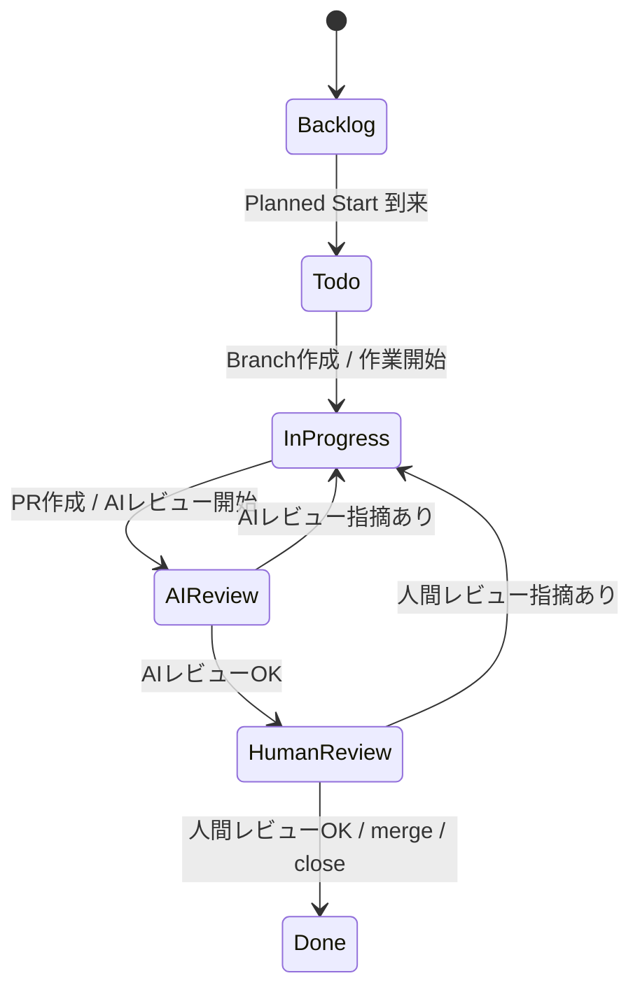
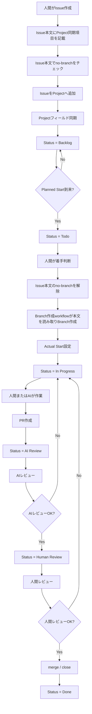
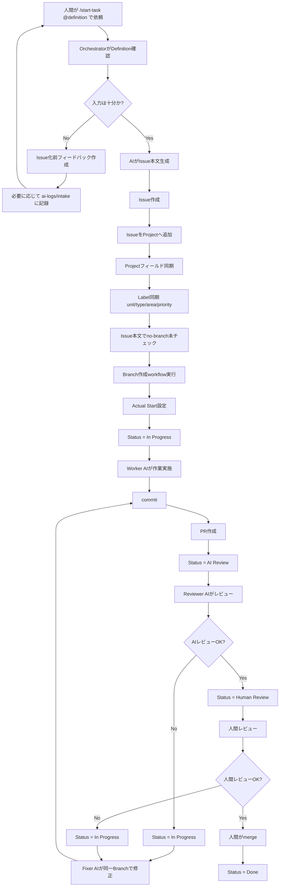
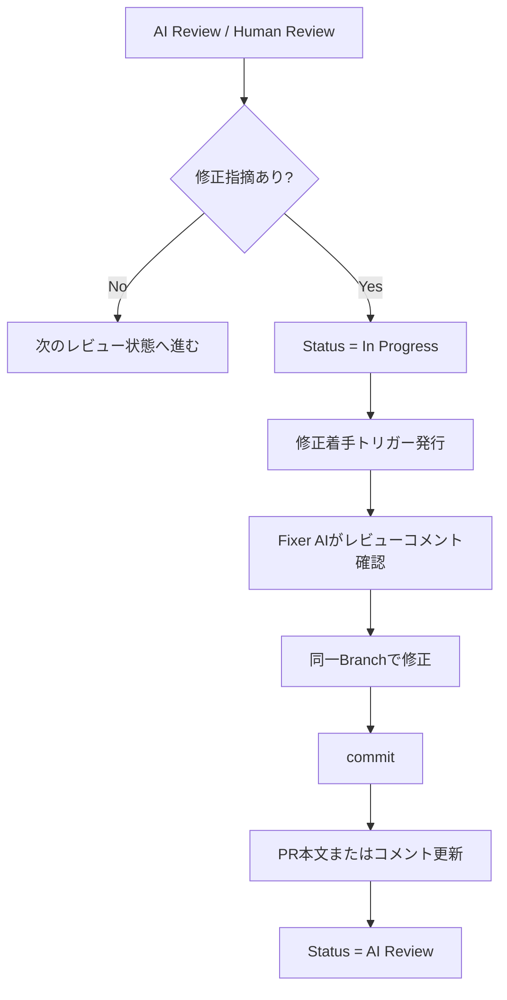
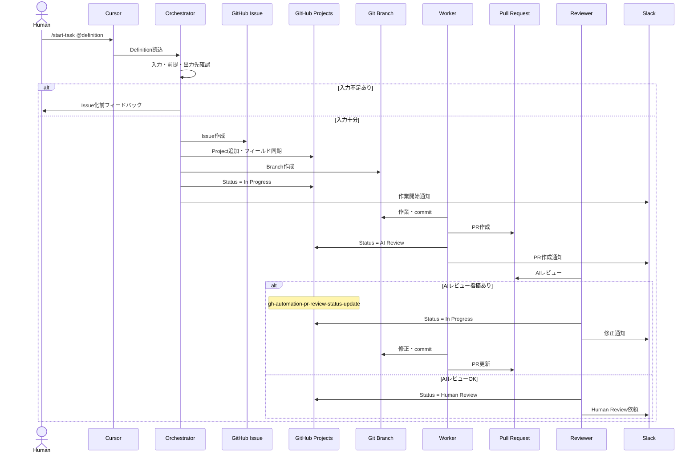
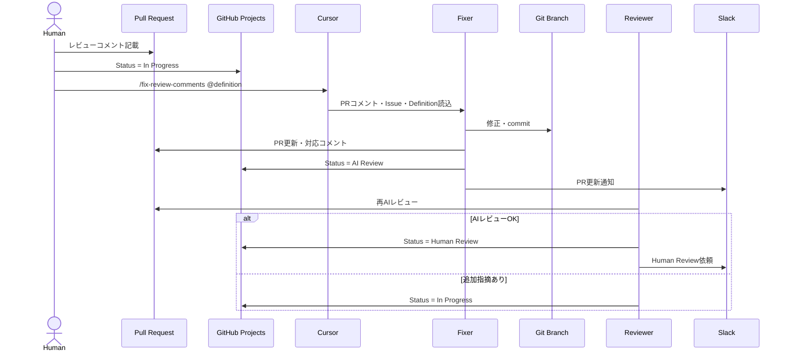

# AIエージェント活用型\_開発運用フロー設計書

## 1. 目的

本ドキュメントは、Gift Recommendation Service におけるAIエージェント活用型の開発運用フローを定義する。

本プロジェクトでは、人間とAIエージェントが協業し、設計・開発・テスト・レビュー・修正対応を進める。

本ドキュメントでは、特に以下を定義する。

- AIエージェント活用型開発の基本方針
- 人間とAIエージェントの責務分担
- 人主導運用とAI主導運用の使い分け
- Issue / Projects / Branch / PR / docs / Slack / ai-logs の正本関係
- AI主導タスクの標準フロー
- AIレビュー・人間レビュー後の修正フロー
- Orchestrator / Worker / Reviewer / Fixer 等の役割
- Command + Definition による作業依頼方式
- 並列AI作業時の管理方針
- エラー・フィードバック・AIログ運用の考え方
- 後続で個別設計すべき対象

---

## 2. 本ドキュメントの位置づけ

本ドキュメントは、AIエージェントを活用して設計・開発・テスト・レビューを進めるための全体運用フローを定義する。

詳細ルールは、以下の個別ドキュメントを正本とする。

| 項目                                           | 正本ドキュメント                   |
| ---------------------------------------------- | ---------------------------------- |
| プロジェクト全体方針                           | プロジェクト運営基本方針           |
| ProjectsのStatus / Phase / 予定・実績管理      | Projects運用ルール                 |
| Issue本文 / Issueタイトル / ラベル / no-branch | Issue運用ルール                    |
| Branch命名 / Branch base / PR target           | ブランチ運用ルール                 |
| ディレクトリ配置                               | プロジェクトディレクトリ構成定義書 |
| AI作業依頼ファイル構造                         | Task Definition設計書              |
| Cursor Command仕様                             | Commands設計書                     |
| AI Agent定義                                   | AIエージェント体制・責務定義       |
| AIレビュー詳細                                 | AIレビュー運用設計書               |
| AIログ詳細                                     | AIログ運用ルール                   |
| Slack通知詳細                                  | Slack通知運用設計書                |
| worktree詳細                                   | worktree運用ルール                 |
| GitHub Actions仕様                             | 各GitHub Actionsワークフロー仕様書 |

本ドキュメントでは、これらの詳細を重複定義せず、AI主導運用全体の流れと責務関係を定義する。

---

## 3. 基本思想

本プロジェクトでは、AIエージェントを単なる補助ツールではなく、設計・開発・テスト・レビューを実行する作業主体として扱う。

ただし、AIエージェントは最終責任者ではない。

最終的な方針判断、品質判断、PR merge、リリース判断は人間が行う。

| 区分           | 方針                                                                                  |
| -------------- | ------------------------------------------------------------------------------------- |
| AIエージェント | 作業計画案作成、Issue作成、設計、実装、テスト、PR作成、AIレビュー、修正対応を担当する |
| 人間           | 方針判断、依頼内容定義、最終レビュー、merge判断、リリース判断を担当する               |

AIエージェント運用では、会話履歴ではなく、GitHubとdocsを正本として扱う。

---

## 4. 正本関係

AIエージェント運用における正本関係は以下とする。

| 対象     | 位置づけ                            |
| -------- | ----------------------------------- |
| Issue    | 作業計画の正本                      |
| Projects | 進捗・予定・実績管理の正本          |
| Branch   | 作業実体                            |
| PR       | レビュー正本                        |
| docs     | 成果物正本                          |
| prompts  | AI作業指示・Task Definitionの正本   |
| ai-logs  | Issue化前・例外・横断影響・実験ログ |
| Slack    | 通知・サマリ                        |

Slackは通知・サマリ用途であり、作業計画や成果物の正本にはしない。

AIエージェントの作業結果は、最終的にIssue、PR、docsのいずれかに記録する。

---

## 5. 管理単位

**Task Issue** では、以下を原則とする。

```text
1 Task Issue = 1 Projects Task = 1 Branch = 1 PR
```

**Epic Issue** では、次を原則とする（上記の 1:1:1:1 は Task に限定する）。詳細は [ブランチ運用ルール](../プロジェクト管理/ブランチ運用ルール.md) §3 を参照する。

```text
1 Epic Issue = 1 Epic Branch = 1 Epic PR（PR target: develop）
```

配下の各 Task Issue は、それぞれ 1 Task Branch = 1 Task PR（PR target: 親 Epic Branch）を持つ。

| 要素          | 役割                                                                         |
| ------------- | ---------------------------------------------------------------------------- |
| Issue         | 作業目的、背景、範囲、完了条件、確認観点を定義する                           |
| Projects Task | Status、Phase、Planned Start、Due Date、Actual Start、Actual End等を管理する |
| Branch        | 実際の作業差分を保持する                                                     |
| PR            | 作業結果、レビュー結果、検証結果を管理する                                   |
| docs          | 成果物の正本を保存する                                                       |

Epic Issueは、複数Task Issueを束ねる親Issueとして扱う。

Epic Branchは、配下Task Branchの統合先として扱う。

---

## 6. 対象工程

AIエージェント運用は、工程の性質に応じて人主導・AI主導を使い分ける。

| 工程                     | 主導方針            | 理由                                         |
| ------------------------ | ------------------- | -------------------------------------------- |
| 事業構想                 | 人主導              | 事業判断・価値判断が中心となるため           |
| ドメイン探索             | 人主導              | 概念整理・方針判断が中心となるため           |
| ドメイン要件定義         | 人主導              | 要件・制約・正本判断が必要なため             |
| ドメインモデル設計       | 人主導              | ドメイン構造の意思決定が重要なため           |
| アプリケーション設計     | 人主導 + AI支援     | 設計方針は人間、整理・作成はAI支援           |
| 実装設計                 | AI主導 + 人レビュー | 入力・出力・雛形・完了条件を定義しやすいため |
| 開発・単体テスト         | AI主導 + 人レビュー | Issue単位で作業分割しやすいため              |
| モジュール結合テスト     | AI主導 + 人レビュー | テスト仕様に基づく実行・記録が中心となるため |
| コンポーネント結合テスト | AI主導 + 人レビュー | 連携検証を定型化しやすいため                 |
| システムテスト           | AI主導 + 人レビュー | テスト観点・結果記録を定型化しやすいため     |
| 非機能テスト             | AI主導 + 人レビュー | 観点・計測・結果記録を定型化しやすいため     |
| レコメンド品質評価テスト | AI主導 + 人レビュー | 評価観点・結果整理を定型化しやすいため       |
| 受入テスト               | 人主導 + AI支援     | 最終受入判断は人間が行うため                 |
| 運用・改善               | 人主導 + AI支援     | 改善方針・優先度判断が必要なため             |
| リリース                 | 人主導 + AI支援     | リリース判断は人間が行うため                 |

上記は原則であり、作業内容に応じて切り替えてよい。

---

## 7. 利用技術・運用資材

| 領域               | 利用技術・資材                     | 役割                                            |
| ------------------ | ---------------------------------- | ----------------------------------------------- |
| AI開発支援         | Cursor                             | AIエージェントによる設計・開発・レビュー作業    |
| AI作業指示         | Cursor Commands                    | `/Command @definition` による作業開始           |
| AI共通ルール       | `.cursor/rules/`, `AGENTS.md`      | 設計・実装・GitHub運用の共通ルール              |
| AI専門Agent定義    | `.cursor/agents/`                  | Orchestrator / Worker / Reviewer 等の役割定義   |
| 個別タスク定義     | `prompts/definitions/`             | 作業対象・入力資料・出力先・確認観点の定義      |
| AI補助テンプレート | `prompts/templates/`               | Issue本文、PR本文、フィードバック文面の生成補助 |
| 成果物雛形         | `docs/00_共通/設計書テンプレート/` | 設計書・仕様書の標準フォーマット                |
| 成果物正本         | `docs/`                            | 設計書・仕様書・テスト結果・運用成果物          |
| GitHub管理         | Issue / Projects / Branch / PR     | 作業計画、進捗、作業実体、レビューの管理        |
| 自動化             | GitHub Actions                     | Project同期、Branch作成、Status更新、通知、CI   |
| 通知               | Slack                              | 作業通知・サマリ共有                            |
| AIログ             | `ai-logs/`                         | Issue化前・例外・横断影響・実験ログ             |

---

## 8. AIエージェント体制

AIエージェントは、責務別に分けて定義する。

| Agent            | 主な責務                                                              |
| ---------------- | --------------------------------------------------------------------- |
| Orchestrator AI  | 人間からの依頼を解析し、入力検証、Task分解、Issue起票、進行制御を行う |
| Worker AI        | Issue / Branch単位で設計、実装、テストなどの作業を行う                |
| Reviewer AI      | PR差分、Issue、docs、完了条件、確認観点をレビューする                 |
| Fixer AI         | AIレビュー・人間レビューの指摘に基づき、同一Branchで修正する          |
| Contract AI      | OpenAPI / Orval / generated など横断契約変更を扱う                    |
| Test AI          | テスト観点確認、テスト実行、失敗解析、テスト結果整理を行う            |
| Docs Reviewer AI | docs間の整合性、テンプレート準拠、用語揺れを確認する                  |
| Support AI       | 調査、影響分析、要約、補助資料作成を行う                              |

AIを分ける目的は、責務分離、レビュー独立性、作業品質の安定化である。

---

## 9. 人間の責務

人間は、プロジェクトの最終責任者として以下を担当する。

- 事業方針の決定
- 要件・設計方針の判断
- AIエージェントへの作業依頼
- Task Definitionの作成・レビュー
- AIエージェントが提示したIssue化前フィードバックへの判断
- PRの最終レビュー
- merge判断
- リリース判断
- 運用改善方針の決定
- AIエージェント運用ルールの改善

---

## 10. 標準Status

ProjectsのStatus正式値は以下とする。

```
Backlog
Todo
In Progress
AI Review
Human Review
Done
```

各Statusの意味は以下とする。

| Status       | 意味                                                              |
| ------------ | ----------------------------------------------------------------- |
| Backlog      | 未着手。Planned Startが未来日のタスク                             |
| Todo         | 着手可能。Planned Startが到来済みで、まだ作業開始していないタスク |
| In Progress  | 作業中。Branch作成済み、またはAI・人間が作業中のタスク            |
| AI Review    | AIレビュー待ち、またはAIレビュー中のタスク                        |
| Human Review | 人間レビュー待ち、または人間レビュー中のタスク                    |
| Done         | 完了。PR merge、Issue close、または作業完了済みのタスク           |

Statusの正本はGitHub Projectsとする。

Issue本文やPR本文にStatusを記載する場合も、最終的な状態管理はProjectsで行う。

---

## 11. 標準状態遷移



Mermaid上の `InProgress` は図中識別子であり、Projects上の正式値は `In Progress` とする。

---

## 12. 人主導運用

人主導運用は、人間がIssueを作成し、必要に応じてAIを活用しながら進める運用である。

主に、事業構想〜アプリケーション設計、受入、リリース、運用改善で利用する。

### 12.1 初期設定

| 項目          | 値                           |
| ------------- | ---------------------------- |
| 作業主体      | human-led                    |
| Issue作成者   | 人間                         |
| no-branch     | 原則、Issue本文でチェック    |
| Planned Start | 人間が設定                   |
| Due Date      | 人間が設定                   |
| 初期Status    | 原則Backlog                  |
| Branch作成    | 本文のno-branch解除後        |
| レビュー      | 原則AI Review → Human Review |

### 12.2 人主導運用フロー



人主導運用でも、品質担保のためPR作成後は原則AI Reviewを経由する。

---

## 13. AI主導運用

AI主導運用は、人間がCommand + Definitionで作業依頼し、AIエージェントがIssue作成、Branch作成、作業、PR作成、AIレビューまで進める運用である。

主に、実装設計〜各種テスト工程で利用する。

### 13.1 初期設定

| 項目          | 値                               |
| ------------- | -------------------------------- |
| 作業主体      | ai-agent                         |
| Issue作成者   | AI                               |
| no-branch     | 原則、Issue本文で未チェック      |
| Planned Start | Issue作成日                      |
| Due Date      | Issue作成日 + 2日                |
| 初期Status    | Todo → Branch作成後にIn Progress |
| Branch作成    | Issue作成時                      |
| レビュー      | AI Review → Human Review         |

### 13.2 AI主導運用フロー



---

## 14. Command + Definition による依頼方式

AI主導運用では、作業依頼をCommandとDefinitionの組み合わせで行う。

標準形式は以下とする。

```
/<Command> @<definition>
```

例：

```
/start-epic @prompts/definitions/_examples/epic-definition.example.yaml
/start-task @prompts/definitions/tasks/scr-002-recommendation-input/screen-spec.yaml
/review-pr @prompts/definitions/_examples/review-definition.example.yaml
/fix-review-comments @prompts/definitions/tasks/scr-002-recommendation-input/screen-spec.yaml
```

| 要素       | 役割                                                     |
| ---------- | -------------------------------------------------------- |
| Command    | AIに実行させる作業手順を指定する                         |
| Definition | 作業対象、入力資料、出力先、完了条件、確認観点を指定する |

Commandは操作IF、Definitionは作業条件である。

---

## 15. 標準Command

| Command                 | 主な利用者              | 目的                                                         |
| ----------------------- | ----------------------- | ------------------------------------------------------------ |
| `/start-epic`           | Human / Orchestrator AI | Epic Definitionを読み、Epic Issue作成・Epic Branch作成・Project同期まで進める |
| `/start-task`           | Human / Orchestrator AI | Task Definitionを読み、Issue作成から作業開始まで進める       |
| `/work-issue`           | Worker AI               | 既存Issue / Branchに基づいて作業を実施する                   |
| `/create-pr`            | Worker AI               | 作業BranchからPRを作成する                                   |
| `/review-pr`            | Reviewer AI             | PR差分、Issue、docs、完了条件をAIレビューする                |
| `/fix-review-comments`  | Fixer AI                | AIレビュー・人間レビューコメントに対応する                   |
| `/create-contract-task` | Contract AI             | OpenAPI / Orval / generated など横断契約変更用Taskを作成する |
| `/summarize-work`       | Support AI              | 作業サマリやSlack通知文面を作成する                          |

Command仕様の詳細は、Commands設計書で定義する。

---

## 16. Task Definitionの役割

Task Definitionは、AIエージェントへの個別作業依頼条件を定義するファイルである。

Task Definitionには、原則として以下を含める。正本は [Task Definition設計書](./Task%20Definition設計書.md) §6・§7 とする。

| 区分        | 項目例（YAMLキー）                                                                                                                                 |
| ----------- | -------------------------------------------------------------------------------------------------------------------------------------------------- |
| 基本情報    | `task.id`, `task.title`, `task.summary`, `parent.epic_issue`, `parent.epic_branch`（配置は `workstream_key` 単位）                               |
| Project同期 | `project.fields.phase`, `priority`, `planned_start`, `due_date`, `issue.unit`, `issue.type`, `issue.area`                                          |
| Branch制御  | `branch.no_branch`, `branch.name`, `branch.base`, `branch.target`, `branch.worktree_required`                                                       |
| 作業条件    | `background`, `objective`, `scope`, `out_of_scope`                                                                                                 |
| 入力        | `input.docs`, `input.templates`, `input.files`, `input.issues`, `input.prs`                                                                       |
| 出力        | `output.docs`, `output.files`, `output.tests`, `deliverables`                                                                                      |
| 完了条件    | `acceptance_criteria`                                                                                                                              |
| 確認観点    | `review.review_points`, `review.human_review_required`, `review.ai_review_required`                                                                |
| AI運用      | `operation_logging.level`, `operation_logging.ai_logs.*`, `human_decision_points`, `stop_conditions`                                               |
| 並列制御    | `parallel_control.exclusive_files`, `depends_on`, `conflict_risk`, `contract_impact`, `generated_impact`, `db_impact`                              |
| テスト      | `test_policy`                                                                                                                                      |

Task Definitionの詳細なschemaは、Task Definition設計書および `prompts/definitions/_schemas/task-definition.schema.md` で定義する。

---

## 17. Issue作成方針

Issueは作業計画の正本である。

AI主導運用でも、人主導運用でも、Issue本文は共通構造に従う。

### 17.1 Issueタイトル

Issueタイトルは以下に統一する。`[Epic]` / `[Task]` の直後に**半角スペースを入れない**（[Issue運用ルール](../プロジェクト管理/Issue運用ルール.md) §5 参照）。

```text
[Epic]<概要>
[Task]<概要>
```

例（識別子付き Epic / Task：原則）：

```text
[Epic]API-PUB-002:レコメンド実行
[Task]API-PUB-002:レコメンド実行API仕様書作成
[Task]API-PUB-002:レコメンド実行API実装
[Task]API-PUB-002:レコメンド実行API単体テスト
```

例（識別子なし: ID 未整備領域の例外）：

```text
[Epic]GitHub Projects自動化
[Task]Issue作成時Project同期workflow仕様書作成
```

Epic 粒度は識別子単位を原則とし、ID 未整備領域のみ機能・領域単位を例外として残す（[Issue運用ルール](../プロジェクト管理/Issue運用ルール.md) §4.1、[成果物一覧×Task Definition化方針書](./成果物一覧×Task%20Definition化方針書.md) §3.5）。

### 17.2 ラベル表記

GitHubラベルは、スペースあり形式に統一する。

```
unit: task
type: docs
area: api
priority: high
```

### 17.3 Issue本文の役割

Issue本文は以下の入力として利用する。

- Project追加
- Projectフィールド同期
- Label同期
- Milestone同期
- Parent / Sub-issue同期
- no-branch制御
- Branch作成条件判定

同期後の進捗・予定・実績管理はProjectsを正本とする。

---

## 18. no-branch制御

`no-branch` は、Issue作成時点でBranch作成を抑止するための制御である。正本は [Issue運用ルール](../プロジェクト管理/Issue運用ルール.md) §15 とする。

| 対象                         | 役割                                       |
| ---------------------------- | ------------------------------------------ |
| Issue本文のno-branchチェック | **唯一の正本**                             |
| GitHub Label `no-branch`     | **定義しない・付与しない**                 |

```text
Issue本文の no-branch チェック
  ↓
Branch作成 workflow が Issue 本文を読み取り Branch 作成要否を判定
```

workflow / Issue テンプレートの実装は後続タスクとする（現行 `.github` は旧仕様の場合あり）。

### 18.1 人主導タスク

人主導タスクでは、未来着手予定Issueを先に作成することがある。

そのため、Issue作成時は原則として Issue 本文で `no-branch` をチェックする。

着手する場合は、人間が Issue 本文の `no-branch` を解除する。

### 18.2 AI主導タスク

AI主導タスクでは、Issue作成後にAIが即時着手する。

そのため、Issue作成時は原則として Issue 本文で `no-branch` をチェックしない。

---

## 19. Branch作成方針

Branchは、Issueに紐づく作業実体である。

Branch命名規則は以下とする。

```
<type>/<unit>-<issue番号>-<english-summary>
```

例：

```
feature/epic-101-recommendation-api
docs/task-111-recommendation-api-design
feature/task-112-recommendation-api-implementation
test/task-113-recommendation-api-unit-test
```

Branch base / PR target は以下を原則とする。

| Issue種別 | Branch base   | PR target     |
| --------- | ------------- | ------------- |
| Epic      | develop       | develop       |
| Task      | 親Epic Branch | 親Epic Branch |

Task Branchからdevelopへ直接PRを作成しない。

---

## 20. PR作成方針

PRはレビュー正本である。

PR本文には、原則として以下を記載する。

- 作業サマリ
- 対象Issue
- 変更内容
- 作成・更新した成果物
- 実施した確認
- テスト結果
- AIレビュー結果
- 人間レビュー観点
- 残課題
- 関連Issue
- Issue 参照キーワード（種別に応じて下表）

| 対象    | PR本文のIssue参照（原則）               |
| ------- | --------------------------------------- |
| Task PR | `Related to #<Task Issue番号>`          |
| Epic PR | 必要に応じて `Closes #<Epic Issue番号>` |

Task PR では、原則として `Closes #<Task Issue番号>` を使用しない。Task Issue の close / Projects `Done` は、PR merge 時の GitHub Actions workflow で制御する。正本は [Task Definition設計書](./Task%20Definition設計書.md) §22・§39 および `prompts/templates/pr/task-pr.md` とする。

PR作成時、対象IssueのProjects Statusを `AI Review` へ更新する。

---

## 21. AIレビュー方針

AIレビューは、人間レビュー前の品質底上げとして実施する。

AIレビューでは、主に以下を確認する。

| 観点             | 確認内容                                                  |
| ---------------- | --------------------------------------------------------- |
| Issue整合        | Issueの目的・作業範囲・完了条件と作業結果が一致しているか |
| Definition整合   | Task Definitionの入力・出力・確認観点を満たしているか     |
| docs整合         | 成果物が指定場所に配置され、既存docsと矛盾していないか    |
| テンプレート準拠 | 指定された設計書雛形・PRテンプレートに従っているか        |
| コード品質       | 型、lint、責務分離、命名、例外処理が妥当か                |
| テスト           | 必要なテストが追加・実行されているか                      |
| CI               | CI結果に問題がないか                                      |
| 生成物           | Orval等のgenerated差分が妥当か                            |
| 横断影響         | 他Task / 他Epicへの影響がないか                           |

AIレビュー完了時の Projects Status 更新は [PRレビュー完了時Status更新ワークフロー仕様書](../../06_実装設計/github_actions/PRレビュー完了時Status更新ワークフロー仕様書.md) が実施する。

- AIレビューOK（`approve_for_human_review`）の場合、`Human Review` へ進める
- AIレビュー指摘あり（`request_changes` 等）の場合、`In Progress` に戻す。Fixer AIが同一Branchで修正する
- Human Review で `changes_requested` の場合、同 workflow が `In Progress` へ戻す

---

## 22. 人間レビュー方針

人間レビューは、最終品質判断として実施する。

人間レビューでは、主に以下を確認する。

- 方針として妥当か
- 要件・設計意図に合っているか
- 成果物として利用可能か
- MVPスコープと整合しているか
- 過剰実装・過剰設計になっていないか
- リリースまたは後続工程へ進めてよいか

人間レビューOKの場合、人間がPRをmergeする。

人間レビュー指摘ありの場合、Projects Statusを `In Progress` に戻し、Fixer AIまたはWorker AIが同一Branchで修正する。

---

## 23. レビュー指摘対応フロー

AIレビューまたは人間レビューで修正指摘がある場合は、原則として同一Issue・同一Branchで対応する。



新しいIssueを作成するのは、以下の場合に限定する。

- 指摘内容が当初Issueの作業範囲を超える
- 別成果物として管理すべき
- 別Epic / 別Taskとして分割すべき
- 横断影響が大きい
- 人間判断が必要な追加要件である

---

## 24. In Progressへ戻した後の作業着手トリガー

Projects Statusを `In Progress` に戻しただけでは、AI作業開始とはみなさない。

AIに修正作業を開始させるには、明示的な作業着手トリガーを発行する。

### 24.1 標準トリガー

| トリガー                           | 用途                                 |
| ---------------------------------- | ------------------------------------ |
| `/fix-review-comments @definition` | AIレビュー・人間レビュー指摘への対応 |
| `/work-issue @definition`          | 既存Issueの作業再開                  |
| PRコメント                         | 修正指摘の入力情報                   |
| Issueコメント                      | 作業再開条件・補足指示の入力情報     |

### 24.2 標準手順

```
1. Reviewer AI または人間がPRへ修正コメントを記載する
2. Projects Statusを In Progress へ戻す
3. 人間またはOrchestrator AIが /fix-review-comments @definition を実行する
4. Fixer AIがPRコメント・Issue本文・Definitionを読み込む
5. 同一Branchで修正する
6. commitしてPRを更新する
7. Projects Statusを AI Review へ戻す
```

---

## 25. Slack通知方針

Slackは通知・サマリ用途に限定する。

Slack通知の対象は以下とする。

| タイミング         | 通知内容                                    |
| ------------------ | ------------------------------------------- |
| Issue作成時        | Issue番号、タイトル、作業概要、担当AI、予定 |
| Branch作成時       | Branch名、base branch、作業開始通知         |
| PR作成時           | PR番号、作業サマリ、確認観点                |
| AIレビュー完了時   | AIレビュー結果、指摘有無、人間確認依頼      |
| PR更新時           | 修正内容、再レビュー依頼                    |
| Human Review到達時 | 人間レビュー依頼                            |
| merge完了時        | 完了サマリ                                  |
| 作業不可時         | 不足情報、判断依頼、停止理由                |
| 横断影響検知時     | 影響範囲、対応案、判断依頼                  |

Slackに作業計画や成果物の正本を置かない。

---

## 26. AIログ方針

`ai-logs/` は通常作業ログをすべて保存する場所ではない。

Issue作成後の作業計画はIssue、作業結果とレビューはPR、成果物はdocsに記録する。

`ai-logs/` は以下に限定して利用する。

| ログ種別                | 配置先                      | 用途                                                   |
| ----------------------- | --------------------------- | ------------------------------------------------------ |
| Issue化前フィードバック | `ai-logs/intake/`           | OrchestratorがIssue化前に人間判断を求める場合          |
| 作業不可・例外          | `ai-logs/incidents/`        | 入力不足、権限不足、依存未完了など                     |
| 人間判断待ち            | `ai-logs/human-decisions/`  | Issue化後もAIだけでは判断できない設計・仕様・運用判断  |
| 横断影響                | `ai-logs/cross-cutting/`    | OpenAPI / Orval / generated など複数Taskに影響する場合 |
| 実験ログ                | `ai-logs/experiments/`      | AI運用やPoC的な試行錯誤を記録する場合                  |

Task Definitionの `operation_logging.level` により、ログ作成レベルを制御する。

---

## 27. operation_logging

Task Definition には、トップレベルの `operation_logging` オブジェクトを持たせる。正本キーは [Task Definition設計書](./Task%20Definition設計書.md) §33 とする。

```yaml
operation_logging:
  level: "standard"
  ai_logs:
    intake: false
    incidents: false
    cross_cutting: false
    experiments: false
  reason: ""
```

| キー                      | 値の例                                      | 方針                                                                                      |
| ------------------------- | ------------------------------------------- | ----------------------------------------------------------------------------------------- |
| `operation_logging.level` | `minimal` / `standard` / `detailed`       | ログ粒度の正本                                                                            |
| `operation_logging.ai_logs.*` | `intake` / `incidents` / `cross_cutting` / `experiments` | 種別ごとの記録要否（`level` と併用）                                                       |
| `operation_logging.reason`    | 文字列                                      | ログ方針の理由                                                                            |

| `operation_logging.level` | 方針                                                                                      |
| ------------------------- | ----------------------------------------------------------------------------------------- |
| `minimal`                 | 原則ログを作成しない。Issue / PR / docsへの記録を基本とする                               |
| `standard`                | 標準。Issue化前フィードバック、作業不可、横断影響、人間判断が必要な場合のみログを作成する |
| `detailed`                | 検証・実験・複雑作業向け。判断経緯や比較結果を詳細に記録する                              |

通常タスクの標準値は `standard` とする。

ただし、Issue化後の通常作業ログを毎回 `ai-logs/` に保存する運用にはしない。

---

## 28. エラー・フィードバック設計

AIエージェントが作業を継続できない場合は、無理にIssue作成や作業実行を進めない。

### 28.1 Issue化前フィードバック

Orchestrator AIが人間からの依頼を解析した時点で、以下に該当する場合はIssue化前フィードバックを返す。

| 条件           | 例                                       |
| -------------- | ---------------------------------------- |
| 入力資料不足   | 参照すべき設計書が存在しない             |
| 作業範囲不明   | どこまで作るか判断できない               |
| 出力先不明     | 成果物配置先が不明                       |
| 前提不整合     | 既存設計と依頼内容が矛盾している         |
| 依存未完了     | 前提Issue / PRが未完了                   |
| 人間判断が必要 | 方針決定なしに進めると危険               |
| 横断影響あり   | OpenAPI / Orval / generated 等に影響する |

Issue化前フィードバックは、必要に応じて `ai-logs/intake/` に保存する。

### 28.2 Issue化後の作業停止

Issue化後に作業不可となった場合は、IssueまたはPRに停止理由を記録する。

必要に応じて以下を付与する。

```
blocked
needs-human-decision
follow-up-required
```

---

## 29. 並列AI作業方針

複数AIエージェントで並列作業する場合は、Task単位でBranchとworktreeを分離する。

```
1 Task Issue = 1 Branch = 1 worktree = 1 Worker AI
```

### 29.1 並列作業の管理観点

| 観点            | 管理内容                                             |
| --------------- | ---------------------------------------------------- |
| 依存関係        | 前提Taskが完了しているか                             |
| 変更範囲        | target_files / exclusive_files が重複していないか    |
| Branch base     | Task Branchが正しい親Epic Branchから作成されているか |
| PR target       | Task PRが親Epic Branchに向いているか                 |
| generated差分   | 自動生成物の変更が他Taskへ影響しないか               |
| OpenAPI / Orval | 契約変更が専用Taskとして管理されているか             |
| DB変更          | migration競合がないか                                |
| docs整合        | 同一成果物を複数Taskで同時編集していないか           |
| CI結果          | 並列作業後に統合先でCIが通るか                       |

### 29.2 並列実行時の原則

- 同一ファイルを複数Taskで同時編集しない
- OpenAPI / Orval / generated は原則Contract専用Taskで扱う
- DB migrationは競合リスクが高いため並列実行対象にしない、または専用管理する
- Task Branchは親Epic BranchへPRを作成する
- 親Epic Branchへ統合後、developへの統合確認を行う

---

## 30. OpenAPI / Orval / generated の扱い

OpenAPI / Orval / generated は横断影響が大きいため、通常の個別機能Taskに混ぜない。

原則として、Contract専用Taskとして扱う。

### 30.1 Contract専用Taskの対象

| 対象                 | 方針                                                |
| -------------------- | --------------------------------------------------- |
| OpenAPI変更          | Contract専用Taskで実施する                          |
| Orval設定変更        | Contract専用Taskで実施する                          |
| generated差分        | Contract専用Taskで生成・検証する                    |
| API client利用側修正 | 影響範囲に応じて個別TaskまたはContract Taskに含める |

### 30.2 横断影響ログ

複数Taskに影響する場合は、必要に応じて `ai-logs/cross-cutting/` に影響分析を記録する。

---

## 31. worktree運用方針

AI並列作業では、Git worktreeにより作業領域を分離する。

worktreeは原則としてリポジトリ外に配置する。

例：

```
workspace/
├─ gift-reco/
└─ gift-reco-worktrees/
   ├─ docs-task-111-api-design/
   ├─ feature-task-112-api-implementation/
   └─ test-task-113-api-unit-test/
```

| 方針                    | 内容                                   |
| ----------------------- | -------------------------------------- |
| 1 Branch = 1 worktree   | AIエージェントごとに作業領域を分離する |
| リポジトリ外配置        | Git管理対象との混在を防ぐ              |
| 作業完了後削除          | 不要なworktreeを残さない               |
| 親Epic Branch単位で統合 | Task Branchを親Epic BranchへPRする     |

詳細はworktree運用ルールで定義する。

---

## 32. 標準ユースケース一覧

| UC     | ユースケース                    | 主体                          | 概要                                              |
| ------ | ------------------------------- | ----------------------------- | ------------------------------------------------- |
| UC-001 | Task Definitionを作成する       | Human / Orchestrator AI       | AI作業依頼条件を定義する                          |
| UC-002 | 作業着手依頼を行う              | Human                         | `/start-task @definition` でAIに依頼する          |
| UC-003 | 入力情報を検証する              | Orchestrator AI               | 必要資料、出力先、前提条件を確認する              |
| UC-004 | Issue化前フィードバックを返す   | Orchestrator AI               | 入力不足・人間判断事項を返す                      |
| UC-005 | Issueを作成する                 | Orchestrator AI               | 共通Issue本文構造でIssueを作成する                |
| UC-006 | IssueをProjectへ追加する        | GitHub Actions / Script       | IssueをProjectsへ明示的に追加する                 |
| UC-007 | Projectフィールドを同期する     | GitHub Actions / Script       | Phase、Priority、Area、Planned Start、Due Date 等を同期する |
| UC-008 | Labelを同期する                 | GitHub Actions / Script       | unit、type、area、work mode等を同期する           |
| UC-009 | Branchを作成する                | GitHub Actions / Script       | Issue本文・ラベルに基づきBranchを作成する         |
| UC-010 | StatusをIn Progressへ更新する   | GitHub Actions / Script       | Branch作成後にActual StartとStatusを更新する      |
| UC-011 | 設計書を作成する                | Worker AI                     | テンプレートとinput docsに基づきdocsを作成する    |
| UC-012 | 実装を行う                      | Worker AI                     | 対象コードを作成・修正する                        |
| UC-013 | 単体テストを作成・実行する      | Worker AI / Test AI           | テスト作成・実行・結果整理を行う                  |
| UC-014 | OpenAPI / Orval整合性を確認する | Contract AI / CI              | 契約変更・生成物差分を確認する                    |
| UC-015 | PRを作成する                    | Worker AI                     | PRテンプレートに基づきPRを作成する                |
| UC-016 | Slackへ作業サマリを通知する     | AI Agent / Script             | Issue作成、PR作成、PR更新時に通知する             |
| UC-017 | PRをAIレビューする              | Reviewer AI                   | PR差分、Issue、docs、完了条件を確認する           |
| UC-018 | AIレビューコメントに対応する    | Fixer AI                      | 同一Branchで修正する                              |
| UC-019 | レビュー完了時にProjects Statusを更新する | Reviewer AI / GitHub Actions | AIレビュー完了時にReview Resultに応じHuman ReviewまたはIn Progressへ更新する。Human Review指摘時にIn Progressへ更新する（[PRレビュー完了時Status更新ワークフロー仕様書](../../06_実装設計/github_actions/PRレビュー完了時Status更新ワークフロー仕様書.md)） |
| UC-020 | 人間がPRを最終レビューする      | Human                         | 方針・品質・リリース可否を確認する                |
| UC-021 | 人間レビューコメントに対応する  | Fixer AI / Worker AI          | 同一Branchで修正する                              |
| UC-022 | mergeしてDoneへ更新する         | Human / GitHub Actions        | PR merge後、IssueをDoneへ更新する                 |
| UC-023 | 並列AI作業を管理する            | Orchestrator AI / Human       | 複数Taskの依存・競合・影響を管理する              |
| UC-024 | 横断影響ログを作成する          | Contract AI / Orchestrator AI | 複数Taskに影響する内容を記録する                  |
| UC-025 | AI運用検証ログを作成する        | Human / AI Agent              | AI運用改善のための実験結果を記録する              |

---

## 33. 標準シーケンス：AI主導タスク



---

## 34. 標準シーケンス：レビュー指摘対応



---

## 35. 自動化対象

GitHub Actionsまたはscriptにより、以下を自動化する。

| 自動化対象                 | 概要                                                    |
| -------------------------- | ------------------------------------------------------- |
| Issue作成時Project追加     | IssueをProjectsへ明示的に追加する                       |
| Projectフィールド同期      | Issue本文からPhase、Priority、Area等を同期する          |
| Label同期                  | Issue本文からunit、type、area等を同期する               |
| no-branch判定              | Issue本文のno-branchチェックのみを参照する（Label `no-branch` は付与しない。正本: [Issue運用ルール](../プロジェクト管理/Issue運用ルール.md) §15.1） |
| Branch作成                 | Issue本文のno-branchチェックと `unit` / `type` 等からBranchを作成する（no-branchは本文のみ） |
| Planned Start更新          | BacklogからTodoへ自動更新する                           |
| PR作成時Status更新         | PR作成時にAI Reviewへ更新する                           |
| PRレビュー完了時Status更新 | AI/Humanレビュー完了時にReview Resultまたはchanges_requestedに応じStatusを更新する |
| PR merge時Status更新       | merge後にDoneへ更新しActual Endを設定する               |
| Slack通知                  | Issue作成、PR作成、PR更新、レビュー依頼を通知する       |
| CI                         | lint、typecheck、test、OpenAPI検証、Orval生成検証を行う |

Workflowは、仕様書を作成してから `.github/workflows/` に実装する。

---

## 36. 後続設計対象

本運用フローを前提に、以下を個別設計する。

| 設計対象                         | 内容                                                                                      |
| -------------------------------- | ----------------------------------------------------------------------------------------- |
| AIエージェント体制・責務定義     | Orchestrator / Worker / Reviewer / Fixer / Contract 等の定義                              |
| Commands設計書                   | `/start-epic`, `/start-task`, `/work-issue`, `/create-pr`, `/review-pr`, `/fix-review-comments` 等の定義 |
| Task Definition設計書            | YAML項目、schema、サンプル、operation_logging定義                                         |
| Prompts運用ルール                | `prompts/definitions/`, `prompts/templates/` の管理ルール                                 |
| AIレビュー運用設計書             | AIレビュー観点、出力形式、PR反映方針                                                      |
| AIログ運用ルール                 | `ai-logs/` の記録対象、命名規則、保存粒度                                                 |
| Slack通知運用設計書              | 通知タイミング、通知先、通知本文                                                          |
| worktree運用ルール               | 並列AI作業時のworktree配置・削除・競合回避                                                |
| Issueテンプレート設計書          | 共通Issueテンプレートの構造                                                               |
| PRテンプレート設計書             | PR本文構造、AIサマリ、人間確認観点                                                        |
| GitHub Actionsワークフロー仕様書 | Project同期、Branch作成、Status更新、通知の仕様                                           |
| 設計書テンプレート設計           | 画面仕様書、API仕様書、モジュール仕様書など                                               |

---

## 37. 禁止事項

以下は禁止する。

- Issueなしで作業を開始すること
- Projects Statusの変更だけでAI作業開始とみなすこと
- AIレビューだけで完了判断すること
- 人間レビューなしでmergeすること
- Slack通知だけで作業記録を完結させること
- docsに残すべき成果物をPRコメントだけで済ませること
- Issue化後の通常作業ログをすべてai-logsへ保存すること
- `ai-logs/` を通常作業サマリの保管場所として濫用すること
- AI主導タスクでTask Definitionなしに大規模作業を依頼すること
- 人主導の未来着手Issueを、Issue 本文で no-branch をチェックせずに作成すること
- AI主導Issueを、Issue 本文で no-branch をチェックしたまま作成すること
- Task Branchからdevelopへ直接PRを作成すること
- OpenAPI / Orval / generated変更を通常Taskへ無断で混在させること
- 同一ファイルを複数AIエージェントで同時編集すること
- secretやAPIキーをdocs、prompts、ai-logs、Issue、PRに記載すること
- AIの内部推論や長大な生ログをそのまま保存すること

---

## 38. 関連ドキュメント

| ドキュメント                       | 役割                                                        |
| ---------------------------------- | ----------------------------------------------------------- |
| プロジェクト運営基本方針           | 人間とAIの協業方針、プロジェクト全体運営方針を定義          |
| プロジェクトディレクトリ構成定義書 | docs、prompts、ai-logs、.github、.cursor等の配置を定義      |
| Projects運用ルール                 | Status、Phase、予定・実績管理、Project同期を定義            |
| Issue運用ルール                    | Issue本文、Issueタイトル、ラベル、no-branch、親子関係を定義 |
| ブランチ運用ルール                 | Branch命名、Branch base、PR targetを定義                    |
| AIエージェント体制・責務定義       | Agent別の責務を定義                                         |
| Commands設計書                     | AIへの操作IFを定義                                          |
| Task Definition設計書              | AI作業依頼条件のschemaを定義                                |
| Prompts運用ルール                  | prompts配下の管理・命名・利用ルールを定義                   |
| AIレビュー運用設計書               | AIレビューの観点と結果反映ルールを定義                      |
| AIログ運用ルール                   | ai-logsの記録対象・粒度・命名規則を定義                     |
| Slack通知運用設計書                | Slack通知条件と文面を定義                                   |
| worktree運用ルール                 | 並列AI作業時の作業領域分離を定義                            |
| Issueテンプレート設計書            | 共通Issueテンプレート構造を定義                             |
| PRテンプレート設計書               | PR本文構造を定義                                            |
| GitHub Actionsワークフロー仕様書   | 自動化workflowの仕様を定義                                  |

---

## 39. 一言まとめ

本プロジェクトでは、AIエージェントを設計・開発・テスト・レビューの作業主体として活用する。

ただし、最終的な品質責任、方針判断、merge判断、リリース判断は人間が持つ。

正本関係は以下とする。

```
Issue = 作業計画
Projects = 進捗・予定・実績管理
Branch = 作業実体
PR = レビュー正本
docs = 成果物正本
```

AI主導タスクでは、以下の流れを標準とする。

```
/start-task @definition
  ↓
Issue作成
  ↓
Project同期
  ↓
Branch作成
  ↓
AI作業
  ↓
PR作成
  ↓
AI Review
  ↓
Human Review
  ↓
merge / Done
```

レビュー指摘がある場合は、原則として同一Issue・同一Branchで修正する。

Projects Statusを `In Progress` に戻すだけでは作業開始とはみなさず、`/fix-review-comments @definition` などの明示的な作業着手トリガーを発行する。

AIログは通常作業ログではなく、Issue化前・例外・横断影響・実験ログに限定する。
