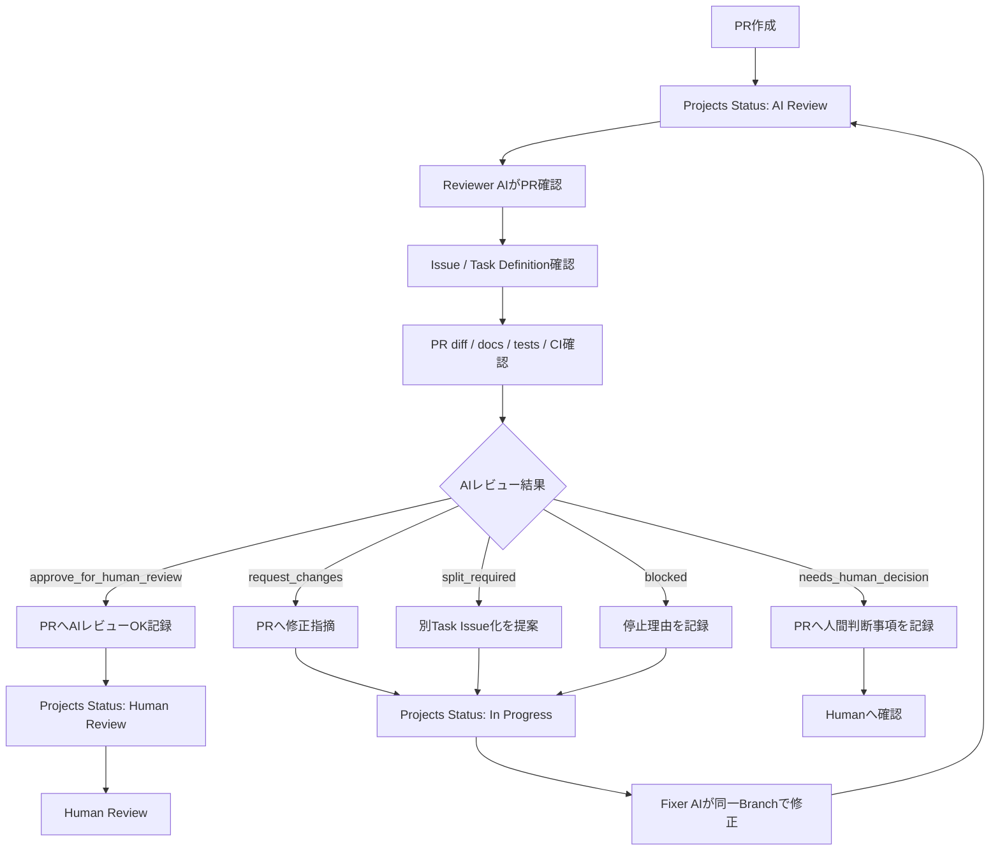

# AIレビュー運用設計書

## 1. 目的

本ドキュメントは、Gift Recommendation Service におけるAIレビュー運用を定義する。

本プロジェクトでは、AIエージェントが設計、開発、テスト、ドキュメント作成を行うが、AI作業の品質を担保するため、Human Reviewの前にAI Reviewを実施する。

本ドキュメントでは、以下を明確にする。

- AIレビューの目的
- AIレビューの対象
- AIレビューの実施タイミング
- AIレビュー担当Agent
- AIレビュー観点
- AIレビュー結果分類
- 指摘対応フロー
- Projects Statusとの関係
- Human Reviewとの責務分離
- PRコメント形式
- レビュー時の禁止事項

---

## 2. 本ドキュメントの位置づけ

本ドキュメントは、AIレビュー運用に関する正本である。

| 項目                     | 正本ドキュメント                           |
| ------------------------ | ------------------------------------------ |
| AIエージェント運用全体   | AIエージェント活用型\_開発運用フロー設計書 |
| AIエージェント体制・責務 | AIエージェント体制・責務定義               |
| Command仕様              | Commands設計書                             |
| Task Definition構造      | Task Definition設計書                      |
| prompts配置・命名        | Prompts運用ルール                          |
| AIレビュー運用           | 本ドキュメント                             |
| AIログ運用               | AIログ運用ルール                           |
| Slack通知                | Slack通知運用設計書                        |
| worktree運用             | worktree運用ルール                         |
| Projects Status管理      | Projects運用ルール                         |
| Issue運用                | Issue運用ルール                            |
| Branch / PR target       | ブランチ運用ルール                         |

---

## 3. AIレビューの基本方針

AIレビューは、Human Reviewの前に実施する品質確認プロセスである。

AIレビューでは、以下を確認する。

- Issueの目的とPR差分が一致しているか
- Task Definitionの完了条件を満たしているか
- 作業範囲外の変更が含まれていないか
- 成果物が指定パスに作成・更新されているか
- docs、コード、テスト、生成物の整合性があるか
- CI / テスト結果に問題がないか
- Human Reviewへ進めてよい状態か
- 修正が必要な場合、同一Branch修正で足りるか
- 別Issue化すべき内容が混在していないか

AIレビューは、人間レビューの代替ではない。

AIレビューがOKでも、最終的なmerge判断はHumanが行う。

---

## 4. AIレビューの対象

AIレビューの対象は、原則としてPull Requestである。

| 対象            | レビュー要否 | 備考                                 |
| --------------- | -----------: | ------------------------------------ |
| Task PR         |         必須 | Human Review前にAI Reviewを実施する  |
| Epic PR         |         必須 | develop merge前にAI Reviewを実施する |
| docs変更PR      |         必須 | 成果物正本のためAI Review対象        |
| code変更PR      |         必須 | 実装品質・テスト結果を確認する       |
| test変更PR      |         必須 | テスト観点・妥当性を確認する         |
| generated変更PR |         必須 | Contract AI観点を含める              |
| 緊急hotfix PR   |     原則必須 | 省略する場合はHumanが明示判断する    |

---

## 5. AIレビューの実施タイミング

AIレビューは、PR作成後、Human Review前に実施する。

```text
In Progress
  ↓ PR作成
AI Review
  ↓ AIレビューOK
Human Review
  ↓ Human承認・merge
Done
```

指摘がある場合は、`In Progress` に戻して同一Branchで修正する。

```text
AI Review
  ↓ 指摘あり
In Progress
  ↓ 修正
AI Review
```

---

## 6. Projects Statusとの関係

AIレビューは、GitHub ProjectsのStatusと連動する。

| Status         | 意味                         | AIレビューとの関係           |
| -------------- | ---------------------------- | ---------------------------- |
| `Backlog`      | 未着手                       | AIレビュー対象外             |
| `Todo`         | 着手予定                     | AIレビュー対象外             |
| `In Progress`  | 作業中・修正中               | AIレビュー前または指摘対応中 |
| `AI Review`    | AIレビュー待ち・レビュー中   | AIレビュー対象               |
| `Human Review` | 人間レビュー待ち・レビュー中 | AIレビューOK後の状態         |
| `Done`         | 完了                         | PR merge後の状態             |

Statusの正本はGitHub Projectsとする。

AIレビュー結果により、次のStatus遷移を判断する。

| AIレビュー結果             | 次Status                            |
| -------------------------- | ----------------------------------- |
| `approve_for_human_review` | `Human Review`                      |
| `request_changes`          | `In Progress`                       |
| `needs_human_decision`     | `Human Review`（自動化の既定。下記注記参照） |
| `split_required`           | `In Progress`                       |
| `blocked`                  | `In Progress`                       |

**`needs_human_decision` の自動化**

- GitHub Actions（[PRレビュー完了時Status更新ワークフロー仕様書](../../06_実装設計/github_actions/PRレビュー完了時Status更新ワークフロー仕様書.md)）では、PR コメントの Review Result が `needs_human_decision` のとき、**既定で `Human Review`** へ更新する。
- `In Progress` へ戻すのは、PR コメントの `次Status` に `In Progress` が明示されている場合に限る（[ai-review-comment.md](../../../prompts/templates/review/ai-review-comment.md) §22）。

**Status 更新の実施主体**

- Projects の Status 更新は、上記 workflow が実施する。Reviewer AI は PR に Review Result を含むコメントを投稿する（[review-pr.md](../../../.cursor/commands/review-pr.md)）。
- Human Review で修正指摘（`changes_requested`）があった場合も、同一 workflow が `Human Review` → `In Progress` を実施する。

---

## 7. AIレビュー担当Agent

AIレビューの主担当は `Reviewer AI` とする。

必要に応じて、専門Agentが補助する。

| Agent            | 役割                                               |
| ---------------- | -------------------------------------------------- |
| Reviewer AI      | AIレビュー全体の主担当                             |
| Docs Reviewer AI | docs、テンプレート、用語、正本関係の確認           |
| Test AI          | テスト観点、テスト結果、失敗解析の確認             |
| Contract AI      | OpenAPI / Orval / generated / API client影響の確認 |
| Support AI       | 影響分析、要約、判断材料作成                       |
| Fixer AI         | AIレビュー指摘・人間レビュー指摘への修正対応       |

Reviewer AIは、原則としてレビューコメントを作成する。  
実際の修正はFixer AIまたはWorker AIが担当する。

---

## 8. AIレビューCommand

AIレビューは、以下のCommandで実行する。

```text
/review-pr @<review-definition>
```

例：

```text
/review-pr @prompts/definitions/_examples/review-definition.example.yaml
```

PR番号を併記してもよい。

```text
/review-pr @prompts/definitions/_examples/review-definition.example.yaml #123
```

レビュー指摘対応は、以下のCommandで実行する。

```text
/fix-review-comments @<fix-definition>
```

例：

```text
/fix-review-comments @prompts/definitions/tasks/scr-002-recommendation-input/screen-spec.yaml #123
```

## 8.1 `.cursor/rules/` との関係

AI Review実行時は、`.cursor/rules/` および `AGENTS.md` に定義された適用対象ルールに従う。

特に、以下の共通ルールはAI Review時の必須確認観点として扱う。

- docs整合性確認ルール
- 用語統一ルール
- アーキテクチャ整合性確認ルール
- コード整合性確認ルール
- API契約整合性確認ルール
- テスト整合性確認ルール
- GitHub運用ルール

Task Definitionには共通ルール全文を重複記載しない。

タスク固有の追加確認観点は、Task Definitionの `review_points` に記載する。

---

## 8.2 BugBot段階導入

本プロジェクトでは、PRレビューの一次検知を強化するために BugBot を段階導入する。

### 導入方針

| フェーズ | 方針 | マージブロック |
| -------- | ---- | -------------- |
| Phase 1 | BugBot通知のみ。Reviewer AI / Human Reviewで最終判断する | しない |
| Phase 2 | 効果が高い変更領域（例: `security`, `api`）で準必須化を検討 | 条件付き |
| Phase 3 | 必要な領域のみ必須化。誤検知時の例外手順を明記する | 領域限定で実施 |

### 役割分担

| 役割 | 担当 |
| ---- | ---- |
| バグ・セキュリティの一次検知 | BugBot |
| 仕様妥当性、ドメイン判断、誤検知判定 | Reviewer AI / Human Review |
| 修正対応 | Fixer AI / Worker AI |

### 評価指標

- 有効指摘率（真陽性率）
- 指摘受け入れ率
- レビュー遅延への影響（PR滞留時間）

### 例外手順

- 誤検知が疑われる場合は、PRコメントに理由を残して Human Review で扱う。
- BugBot結果のみで merge 可否を確定しない。

---

## 9. AIレビュー入力

AIレビュー時に参照する入力は以下とする。

| 入力            |     必須 | 用途                     |
| --------------- | -------: | ------------------------ |
| PR              |     必須 | レビュー対象             |
| PR diff         |     必須 | 変更内容の確認           |
| Issue           |     必須 | 作業目的・作業範囲の確認 |
| Task Definition |     必須 | 完了条件・確認観点の確認 |
| output docs     | 条件付き | 作成・更新成果物の確認   |
| source files    | 条件付き | 実装差分の確認           |
| test files      | 条件付き | テスト差分の確認         |
| CI結果          |     推奨 | 自動検証結果の確認       |
| テスト実行結果  |     推奨 | 実施済み検証の確認       |
| 関連docs        | 条件付き | 仕様・設計整合性の確認   |
| 関連Issue / PR  | 条件付き | 依存関係・前提確認       |

---

## 10. AIレビュー出力

AIレビュー結果は、Pull Requestへコメントとして記録する。

必要に応じてSlack通知用サマリも作成する。

| 出力                         | 反映先               | 正本性       |
| ---------------------------- | -------------------- | ------------ |
| AIレビュー結果               | Pull Request         | レビュー正本 |
| 修正指摘                     | Pull Request         | レビュー正本 |
| Human Reviewへ進める判断材料 | Pull Request         | レビュー正本 |
| Slack通知サマリ              | Slack                | 通知・補助   |
| follow-up Issue候補          | Pull Request / Issue | 判断材料     |
| ai-logs                      | 原則不要             | 例外時のみ   |

AIレビュー結果の正本はPRとする。

Slackは通知・サマリ用途であり、レビュー正本にはしない。

---

## 11. AIレビュー結果分類

AIレビュー結果は以下に分類する。

| 結果                       | 意味                       | 次Status                            |
| -------------------------- | -------------------------- | ----------------------------------- |
| `approve_for_human_review` | Human Reviewへ進めてよい   | `Human Review`                      |
| `request_changes`          | 同一Branchで修正が必要     | `In Progress`                       |
| `needs_human_decision`     | 人間判断が必要             | `Human Review` または `In Progress` |
| `split_required`           | 別Issue化が必要            | `In Progress`                       |
| `blocked`                  | 前提不足でレビュー継続不可 | `In Progress`                       |

### 11.1 `approve_for_human_review`

以下を満たす場合に使用する。

- 完了条件を満たしている
- 重大な指摘がない
- 作業範囲外の変更がない
- CI / テスト結果に問題がない、または未実施理由が明確
- Human Reviewで確認すべき観点が整理されている

### 11.2 `request_changes`

以下の場合に使用する。

- 同一Branchで修正可能な不備がある
- docsの不足・矛盾がある
- 実装・テストの軽微から中程度の修正が必要
- PR本文の情報が不足している
- 完了条件を満たしていない

### 11.3 `needs_human_decision`

以下の場合に使用する。

- 仕様判断が必要
- MVPスコープ判断が必要
- 設計方針の判断が必要
- 複数案がありAIだけでは決められない
- 人間レビューで判断すべき論点がある

### 11.4 `split_required`

以下の場合に使用する。

- 現在のTask scopeを超える変更が必要
- 別Issue化すべき作業が混在している
- 前段成果物の大きな修正が必要
- API契約変更、DB変更、generated変更など横断影響がある

### 11.5 `blocked`

以下の場合に使用する。

- 必須入力資料が不足している
- PR差分を確認できない
- IssueとPRの紐づきが不明
- Task Definitionが存在しない
- Branch / targetが不正
- CI結果が確認できず、レビュー継続が危険

---

## 12. 指摘レベル

AIレビューの指摘は、以下のレベルで分類する。

| レベル     | 意味     | 対応方針                             |
| ---------- | -------- | ------------------------------------ |
| `must`     | 修正必須 | 修正しない限りHuman Reviewへ進めない |
| `should`   | 修正推奨 | 原則修正。見送る場合は理由をPRに記載 |
| `nit`      | 軽微指摘 | 文言、表記、読みやすさ等             |
| `question` | 確認質問 | HumanまたはWorkerが回答              |
| `info`     | 補足     | 修正不要の参考情報                   |

`must` が1件以上ある場合、原則として結果は `request_changes` とする。

---

## 13. AIレビュー観点

AIレビューでは、以下の観点を確認する。

| 観点                     | 内容                                                                                |
| ------------------------ | ----------------------------------------------------------------------------------- |
| Issue整合性              | Issueの目的・作業範囲とPR差分が一致しているか                                       |
| Definition整合性         | Task Definitionの完了条件・確認観点を満たしているか                                 |
| Scope遵守                | out_of_scopeの作業が混在していないか                                                |
| Branch整合性             | Branch命名、base、PR targetが正しいか                                               |
| Branch鮮度               | Task Branchが親Epic Branchの最新状態を取り込んでいるか                              |
| 成果物配置               | output_docs / files / tests が指定場所にあるか                                      |
| docs品質                 | 章立て、粒度、正本関係、用語が適切か                                                |
| 実装品質                 | 責務分離、可読性、型、安全性、拡張性が適切か                                        |
| テスト品質               | 必要な単体テスト・異常系・境界値があるか                                            |
| Contract影響             | OpenAPI / Orval / generatedへの影響が管理されているか                               |
| DB影響                   | DB schema / migration影響が混在していないか                                         |
| CI結果                   | lint / typecheck / test等の結果が問題ないか                                         |
| PR本文                   | 変更内容、確認結果、残課題、関連Issueが記載されているか                             |
| Human確認事項            | 人間が判断すべき事項が明確か                                                        |
| docs間整合性             | 関連docs、上位方針書、正本定義、既存成果物と矛盾していないか                        |
| 用語整合性               | ドメイン用語、機能名、モジュール名、リソース名、Status名、Phase名に表記揺れがないか |
| 方針書・コード整合性     | 開発方針書、設計方針、ディレクトリ責務とソースコードが一致しているか                |
| ソース間整合性           | 関連ソース間で命名、型、責務、依存方向、I/Fが矛盾していないか                       |
| 設計・実装・テスト整合性 | 設計書、実装、テストコード、テスト結果が同じ仕様を前提にしているか                  |
| Epicスコープ遵守         | 識別子付き Task PR の差分 path が親 Epic の `epic_scope.allowed_paths` 内か。識別子 prefix の一致。API 層と reco モジュール層の混在がないか |

## 13.1 整合性確認の必須観点

AI Reviewでは、PRの変更種別に関わらず、以下の整合性確認を必須で行う。

特に、docs変更、コード変更、API変更、テスト変更を含むPRでは、成果物単体の妥当性だけでなく、関連する設計書・方針書・既存ソース・テストとの整合性を確認する。

| 確認分類             | 必須確認内容                                                                           | 主担当Agent                    |
| -------------------- | -------------------------------------------------------------------------------------- | ------------------------------ |
| docs間整合性         | 変更対象docsが、関連docs、上位方針書、正本定義と矛盾していないか                       | Reviewer AI / Docs Reviewer AI |
| 用語整合性           | ドメイン用語、機能名、モジュール名、リソース名、Status名、Phase名に表記揺れがないか    | Docs Reviewer AI               |
| 方針書整合性         | 開発方針書、API設計方針書、DevOps方針書、CI/CD方針書、テスト計画書等と矛盾していないか | Reviewer AI / Docs Reviewer AI |
| ディレクトリ整合性   | ディレクトリ構成定義書、配置ルール、成果物配置方針と一致しているか                     | Reviewer AI / Docs Reviewer AI |
| 設計書・コード整合性 | 設計書で定義した責務、I/F、入出力、エラー、状態、制約がコードに反映されているか        | Reviewer AI / Worker AI        |
| コード間整合性       | 関連ソース間で命名、型、責務、依存方向、I/F、例外処理が矛盾していないか                | Reviewer AI                    |
| テスト整合性         | 実装内容、設計書、テスト仕様、テストコードが一致しているか                             | Reviewer AI / Test AI          |
| Contract整合性       | API仕様書、OpenAPI、Orval、generated、API client、利用側実装が一致しているか           | Reviewer AI / Contract AI      |
| DB整合性             | DB設計、migration、repository、domain model、API responseが矛盾していないか            | Reviewer AI                    |
| 運用ルール整合性     | Issue、Projects、Branch、PR、ai-logs、Slack通知の運用ルールに従っているか              | Reviewer AI                    |

上記の必須観点を確認できない場合、Reviewer AIは `approve_for_human_review` を出してはならない。

確認不能な理由が入力不足・関連資料不足・PR差分不足である場合は、`blocked` または `needs_human_decision` としてPRへ記録する。

### 13.2 Epic スコープ・識別子整合

識別子付き Task（`task.title` が `{識別子}:{概要}` 形式）の PR では、以下を必須で確認する。

| 確認項目 | 内容 |
| -------- | ---- |
| allowed_paths | PR 差分の全 path が親 Epic Definition の `epic_scope.allowed_paths` の glob に収まっているか |
| 識別子 prefix | PR タイトル / 関連 Issue タイトル先頭の識別子と、親 Epic 識別子が一致しているか |
| API / モジュール境界 | API Epic 配下 Task が `apps/reco/**` のモジュール実装を含まないか。`MOD-RECO-NNN` 配下 Task が `apps/reco/src/app/**`（API-INT エンドポイント層）を含まないか |

正本: [成果物一覧×Task Definition化方針書](./成果物一覧×Task%20Definition化方針書.md) §3.5、[Commands設計書](./Commands設計書.md) §17、[`.cursor/commands/review-pr.md`](../../../.cursor/commands/review-pr.md) §6.1。

以下の場合は `blocked` とし、`approve_for_human_review` を出してはならない。

- 差分 path が `allowed_paths` 外を含む
- 識別子 prefix が親 Epic と不一致
- `MOD-RECO-NNN` Epic 配下で `apps/reco/src/app/**` に差分がある

---

## 14. docsレビュー観点

docs変更を含むPRでは、以下を確認する。

| 観点             | 内容                                                                           |
| ---------------- | ------------------------------------------------------------------------------ |
| 配置             | 正しい工程・領域のディレクトリに配置されているか                               |
| 正本関係         | 他docsと正本関係が矛盾していないか                                             |
| テンプレート準拠 | 対応する設計書テンプレートに準拠しているか                                     |
| 章立て           | 必要な章が不足していないか                                                     |
| 粒度             | 実装・レビューに必要な粒度になっているか                                       |
| 過剰詳細化       | 実装設計段階に不要な詳細を書きすぎていないか                                   |
| 用語             | 用語集・既存docsと表記揺れがないか                                             |
| Mermaid          | 図が複雑すぎず、構文エラーがないか                                             |
| 表               | Notion / Markdownで読みやすい表になっているか                                  |
| リンク           | 参照先が存在するか                                                             |
| 関連docs整合     | 入力docs、上位方針書、関連設計書、既存成果物と矛盾していないか                 |
| 正本参照         | 正本ドキュメントを参照しており、副本・古い議論を正として扱っていないか         |
| 工程整合         | 対象docsが現在のプロジェクト工程定義と一致しているか                           |
| ディレクトリ整合 | ディレクトリ構成定義書に従った配置になっているか                               |
| 用語統一         | ドメイン用語、機能名、モジュール名、リソース名に表記揺れがないか               |
| 状態名統一       | Projects Status、Issue unit、Branch typeなどの名称が運用ルールと一致しているか |
| 前後工程整合     | 前工程成果物の前提を壊していないか、後工程成果物の入力として使えるか           |

---

## 15. コードレビュー観点

コード変更を含むPRでは、以下を確認する。

| 観点               | 内容                                                                           |
| ------------------ | ------------------------------------------------------------------------------ |
| 責務分離           | module / layer / functionの責務が混在していないか                              |
| 可読性             | 新人エンジニアが追える構造か                                                   |
| 型安全性           | TypeScript / Python等で型やvalidationが適切か                                  |
| エラーハンドリング | 異常系を握りつぶしていないか                                                   |
| 境界値             | null / undefined / empty / out-of-range等を考慮しているか                      |
| セキュリティ       | secret露出、過剰権限、入力未検証がないか                                       |
| 保守性             | 変更容易性を損なう密結合がないか                                               |
| 既存設計整合       | アーキテクチャ・モジュール責務と矛盾しないか                                   |
| ログ               | 必要なログが適切な粒度であるか                                                 |
| generated          | 自動生成物を手動編集していないか                                               |
| 方針書整合         | 開発方針書、アーキテクチャ方針、ディレクトリ構成定義と矛盾していないか         |
| 設計書整合         | 対応する設計書・仕様書の責務、入出力、I/F、エラー、状態を満たしているか        |
| モジュール責務整合 | モジュール一覧・処理構成定義・責務定義と実装責務が一致しているか               |
| ソース間I/F整合    | 呼び出し元・呼び出し先で型、引数、戻り値、例外、null許容が一致しているか       |
| 命名整合           | ファイル名、関数名、型名、変数名が既存の命名方針・ドメイン用語と一致しているか |
| 依存方向整合       | layer、module、domain、infra等の依存方向が逆転していないか                     |
| 設計逸脱           | Issue範囲外の設計変更、責務追加、共通化、抽象化を混在させていないか            |

---

## 16. テストレビュー観点

テスト変更または実装変更を含むPRでは、以下を確認する。

| 観点       | 内容                                            |
| ---------- | ----------------------------------------------- |
| 正常系     | 主要ユースケースがテストされているか            |
| 異常系     | 入力不備・外部失敗・例外が考慮されているか      |
| 境界値     | 0件、上限、下限、空配列、null等を考慮しているか |
| 回帰       | 既存機能を壊していないか                        |
| テスト粒度 | 単体テストとして適切な粒度か                    |
| モック     | 外部依存を適切に分離しているか                  |
| テスト名   | 何を検証しているか分かるか                      |
| 実行結果   | テスト結果がPRに記録されているか                |
| 未実施理由 | 未実施の場合、理由が明確か                      |

---

## 17. Contractレビュー観点

OpenAPI / Orval / generated / API clientに関係するPRでは、Contract AI観点を含める。

| 観点          | 内容                                           |
| ------------- | ---------------------------------------------- |
| OpenAPI整合   | API仕様書とOpenAPI定義が一致しているか         |
| 後方互換性    | 既存クライアントへの破壊的変更がないか         |
| Orval生成     | 正しいコマンドで生成されているか               |
| generated差分 | OpenAPI差分と生成差分が対応しているか          |
| 手動編集禁止  | generatedファイルを手動編集していないか        |
| 利用側影響    | web / api / reco側の修正要否が整理されているか |
| 横断影響      | 複数Taskに影響する場合、専用Task化されているか |
| ai-logs       | 必要に応じてcross-cuttingログが残されているか  |

---

## 18. Branch / PR targetレビュー観点

Task PRでは、BranchとPR targetを必ず確認する。

| 対象             | 確認内容                                                |
| ---------------- | ------------------------------------------------------- |
| Task Branch名    | `<type>/task-<issue番号>-<english-summary>` 形式か      |
| Epic Branch名    | `<type>/epic-<issue番号>-<english-summary>` 形式か      |
| Task Branch base | 親Epic Branchから作成されているか                       |
| Task PR target   | 親Epic Branchになっているか                             |
| Epic PR target   | `develop` になっているか                                |
| Task PR本文      | `Related to #<Task Issue番号>` が記載されているか       |
| Issue close      | Task PRで `Closes #<Task Issue番号>` に依存していないか |

Task Issueのclose / Projects Doneは、PR merge時workflowで制御する。

---

## 19. 前段成果物修正が必要な場合

後続Taskのレビュー中に、前段Taskで作成した成果物の修正が必要になる場合がある。

この場合、過去のTask Branchを再利用しない。

| 修正内容                             | 扱い                                          |
| ------------------------------------ | --------------------------------------------- |
| 軽微な文言修正                       | 現在のTask PR内で修正してよい                 |
| 実装に合わせた小さな設計書補正       | 現在のTask PR内で修正してよい                 |
| 仕様・設計方針に影響する修正         | 新しいTask Issue化を提案する                  |
| API契約・DB・generatedに影響する修正 | Contract Taskまたは専用Task化を提案する       |
| 他Taskへ影響する修正                 | Orchestrator AIが影響分析し、人間判断を求める |

前段Task Issueは、対応PRが親Epic Branchへmerge済みであれば `Done` のままとする。

---

## 20. AIレビュー標準フロー



---

## 21. AIレビューコメント形式

AIレビューコメントは、以下の形式を標準とする。

```markdown
## AIレビュー結果

- Review Result:
- Next Status:
- 対象PR:
- 対象Issue:
- 対象Definition:

## 総評

<!-- PR全体に対する簡潔な評価 -->

## 確認した内容

- [ ] Issue目的との整合
- [ ] Task Definition完了条件
- [ ] Task Definition確認観点
- [ ] PR差分
- [ ] 成果物配置
- [ ] docs間整合性
- [ ] 用語揺れ確認
- [ ] 方針書・設計書との整合
- [ ] 設計書・コード整合性
- [ ] ソースファイル間整合性
- [ ] テスト結果
- [ ] CI結果
- [ ] Branch / PR target
- [ ] Contract / generated影響
- [ ] DB影響
- [ ] 運用ルール整合性

## OK事項

-

## 指摘事項

| Level                                 | 対象 | 指摘内容 | 推奨対応 |
| ------------------------------------- | ---- | -------- | -------- |
| must / should / nit / question / info |      |          |          |

## Human Reviewで確認してほしいこと

-

## 別Issue化候補

-

## 結論

<!-- Human Reviewへ進めてよい / In Progressへ戻す / 人間判断が必要 -->
```

---

## 22. AIレビュー結果の記載例

### 22.0 AIレビュー指摘の具体性

AIレビューの指摘事項は、実運用では具体的に記載する。

サンプルでは説明簡略化のため抽象的な表現を含むが、実際のPRレビューコメントでは、以下を明記する。

- 対象ファイル
- 対象章・対象行・対象関数・対象コンポーネント
- 問題内容
- 矛盾している参照元
- 影響
- 推奨対応

以下のような抽象的な指摘だけで完結させてはならない。

- 「一部に揺れがあります」
- 「整合していません」
- 「テストが不足しています」
- 「確認してください」

ただし、差分や参照資料の制約により具体箇所を特定できない場合は、`question` または `blocked` として、確認不能な理由を明記する。

### 22.1 Human Reviewへ進める場合

```markdown
## AIレビュー結果

- Review Result: approve_for_human_review
- Next Status: Human Review
- 対象PR: #123
- 対象Issue: #111
- 対象Definition: prompts/definitions/tasks/scr-002-recommendation-input/screen-spec.yaml

## 総評

Task Definitionの完了条件を満たしており、Human Reviewへ進めてよい状態です。

## OK事項

- 指定された画面仕様書が作成されています。
- 入力docsとの大きな矛盾はありません。
- PR本文に変更内容と確認結果が記載されています。
- Task PR targetが親Epic Branchになっています。

## 指摘事項

| Level | 対象       | 指摘内容                   | 推奨対応                                     |
| ----- | ---------- | -------------------------- | -------------------------------------------- |
| nit   | 画面仕様書 | 一部の表現に揺れがあります | Human Review時に必要に応じて調整してください |

## Human Reviewで確認してほしいこと

- 画面項目の粒度が実装設計として十分か
- エラー表示方針がプロダクト方針と合っているか

## 結論

Human Reviewへ進めてください。
```

### 22.2 修正が必要な場合

```markdown
## AIレビュー結果

- Review Result: request_changes
- Next Status: In Progress
- 対象PR: #124
- 対象Issue: #112
- 対象Definition: prompts/definitions/tasks/api-int-002-reco-recommendation-run/api-spec.yaml

## 総評

実装方針は概ね妥当ですが、Task Definitionの完了条件を一部満たしていません。

## 指摘事項

| Level  | 対象   | 指摘内容                                 | 推奨対応                                     |
| ------ | ------ | ---------------------------------------- | -------------------------------------------- |
| must   | テスト | 異常系テストが不足しています             | validation error時のテストを追加してください |
| must   | PR本文 | 実施したテスト結果が記載されていません   | 実行コマンドと結果を追記してください         |
| should | 実装   | エラー文言が画面仕様書と一致していません | 仕様書と実装を揃えてください                 |

## 結論

In Progressへ戻し、同一Branchで修正してください。
```

---

## 23. レビュー指摘対応フロー

AIレビューで指摘がある場合は、以下の流れで対応する。

```text
AI Review
  ↓ request_changes
In Progress
  ↓ /fix-review-comments @definition
Fixer AIが同一Branchで修正
  ↓ commit追加
AI Review
  ↓ 再レビュー
```

レビュー指摘対応では、以下を守る。

- 原則として同一Issue・同一Branchで修正する
- 指摘範囲を超える大幅変更はしない
- scope外の内容は別Issue化を提案する
- 修正後は再度AI Reviewを実施する
- Human Review前にAI Reviewを通す

---

## 24. Human Reviewとの責務分離

AI ReviewとHuman Reviewの責務は分ける。

| 項目                | AI Review      | Human Review     |
| ------------------- | -------------- | ---------------- |
| 形式チェック        | 主担当         | 必要に応じて確認 |
| Task Definition整合 | 主担当         | 最終確認         |
| docs整合            | 主担当         | 重要箇所を確認   |
| コード品質          | 一次確認       | 最終確認         |
| テスト妥当性        | 一次確認       | 最終確認         |
| 仕様判断            | 判断材料を出す | 最終判断         |
| 事業判断            | 判断しない     | 最終判断         |
| merge判断           | 判断しない     | 最終判断         |
| リリース判断        | 判断しない     | 最終判断         |

AI ReviewはHuman Reviewの負荷を下げるための一次品質確認である。

---

## 25. Slack通知

AIレビュー完了時は、必要に応じてSlack通知を行う。

通知内容は簡潔にする。

| 通知タイミング | 内容               |
| -------------- | ------------------ |
| AIレビューOK   | Human Review依頼   |
| 修正必要       | 修正指摘サマリ（Projects Status は workflow により `In Progress` へ戻る） |
| 人間判断必要   | 判断依頼サマリ     |
| blocked        | 停止理由と確認依頼 |
| split_required | 別Issue化提案      |

Slack通知は正本ではない。  
詳細なレビュー結果はPRに記録する。

---

## 26. ai-logsとの関係

AIレビュー結果は、原則としてPRへ記録する。

通常のAIレビュー結果を `ai-logs/` に保存しない。

ai-logsを利用するのは、以下の場合に限定する。

記録対象・ディレクトリ構成の正本は [AIログ運用ルール](./AIログ運用ルール.md) §4・§6 とする。

| 種別                                        | 保存先                     |
| ------------------------------------------- | -------------------------- |
| AIレビュー前にIssue化前フィードバックが必要 | `ai-logs/intake/`          |
| レビュー継続不可の例外が発生                | `ai-logs/incidents/`       |
| 人間判断が必要な設計・仕様論点              | `ai-logs/human-decisions/` |
| OpenAPI / Orval / generated等の横断影響が大きい | `ai-logs/cross-cutting/` |
| AIレビュー運用の検証・実験                  | `ai-logs/experiments/`     |

---

## 27. AIレビューの停止条件

以下の場合、AIレビューを停止し、人間へ確認する。

| 条件                                       | 対応                                            |
| ------------------------------------------ | ----------------------------------------------- |
| PRとIssueの紐づきが不明                    | PRへblockedとして記録し確認依頼                 |
| Task Definitionが存在しない                | レビュー停止                                    |
| PR targetが不正                            | 修正依頼                                        |
| Task Branchが親Epic Branchの最新状態でない | 最新化を依頼                                    |
| input docsが存在しない                     | 人間へ確認                                      |
| output docsが存在しない                    | 修正依頼                                        |
| scope外の大きな変更が混在                  | split_required                                  |
| API契約変更が混在                          | Contract Task化を提案                           |
| DB schema変更が混在                        | 専用Task化を提案                                |
| secret混入の疑いがある                     | 作業停止・人間へ報告                            |
| 必須整合性確認ができない                   | `blocked` として理由をPRへ記録し、人間へ確認    |
| 関連docsが不足している                     | 入力資料不足として確認依頼                      |
| 方針書と実装の矛盾がある                   | `request_changes` または `needs_human_decision` |
| ソース間I/Fの矛盾がある                    | `request_changes`                               |
| 用語揺れが判断不能                         | `question` または `needs_human_decision`        |

---

## 28. AIレビューで扱わないこと

AIレビューでは、以下を行わない。

- PRをmergeする
- Human Reviewを省略する
- 事業方針を確定する
- MVPスコープを変更する
- 重要な設計方針を独断で変更する
- 仕様不明点を推測で確定する
- 指摘対応を同時に直接行う
- generatedファイルを手動編集する
- secretやAPIキーを出力する

---

## 29. AIレビュー品質基準

AIレビューは、以下の品質基準を満たす必要がある。

| 基準         | 内容                                                    |
| ------------ | ------------------------------------------------------- |
| 具体性       | 指摘対象と修正方針が明確である                          |
| 再現性       | 他のAI / 人間が同じ観点で確認できる                     |
| 範囲遵守     | Task scope外の過剰指摘をしない                          |
| 優先度明確   | must / should / nit 等の区分がある                      |
| 人間判断分離 | AIで決められない事項を人間判断として分離する            |
| 正本尊重     | Issue / PR / docs / Slack / ai-logsの役割を混在させない |
| 簡潔性       | 冗長なレビューコメントにしない                          |

---

## 30. AIレビュー運用改善

AIレビュー運用で以下が頻発する場合は、運用改善を検討する。

| 事象                         | 改善候補                                   |
| ---------------------------- | ------------------------------------------ |
| 同じ指摘が繰り返される       | `.cursor/rules/` へ共通ルール化            |
| Definition不備が多い         | Task Definition設計書・schemaを見直す      |
| PR本文不足が多い             | PR Templateを改善する                      |
| docs品質指摘が多い           | docsテンプレートを改善する                 |
| generated混在が多い          | Contract Task分離ルールを強化する          |
| scope外作業が多い            | Issue / Definitionのout_of_scopeを強化する |
| Human Reviewで重大指摘が多い | AIレビュー観点を追加する                   |

---

## 31. 禁止事項

以下は禁止する。

- AIレビューなしでHuman Reviewへ進めること
- AIレビューOKのみでmergeすること
- Reviewer AIがPRをmergeすること
- Reviewer AIが勝手に修正commitを作成すること
- AIレビュー指摘をPR以外の場所だけに記録すること
- Slack通知だけでレビュー結果を完結させること
- Task PRで `Closes #<Task Issue番号>` による自動closeに依存すること
- scope外の大幅修正を同一Branchへ混在させること
- generatedファイルを手動編集すること
- secretやAPIキーをレビューコメントへ記載すること
- 人間判断が必要な事項をAIが確定すること
- docs整合性、用語揺れ、方針書整合、設計書・コード整合、ソース間整合を未確認のまま `approve_for_human_review` とすること
- `.cursor/rules/` に定義されたAIレビュー共通ルールを無視すること
- 設計書とコードが矛盾している状態で、実装だけを正として扱うこと
- ソースファイル間のI/F不整合を軽微指摘として扱うこと

---

## 32. 関連ドキュメント

| ドキュメント                               | 役割                                               |
| ------------------------------------------ | -------------------------------------------------- |
| AIエージェント活用型\_開発運用フロー設計書 | AI主導運用の全体フローを定義                       |
| AIエージェント体制・責務定義               | Agentごとの責務を定義                              |
| Commands設計書                             | `/review-pr` / `/fix-review-comments` の仕様を定義 |
| Task Definition設計書                      | Review Definition / Fix Definitionの構造を定義     |
| Prompts運用ルール                          | review template / fix templateの配置を定義         |
| AIログ運用ルール                           | ai-logsの記録対象を定義                            |
| Slack通知運用設計書                        | AIレビュー完了通知を定義                           |
| worktree運用ルール                         | 並列作業時のBranch / worktree管理を定義            |
| Projects運用ルール                         | Status遷移を定義                                   |
| Issue運用ルール                            | Issue本文・ラベル・no-branchを定義                 |
| ブランチ運用ルール                         | Branch命名、base、PR targetを定義                  |

---

## 33. 一言まとめ

AIレビューは、Human Review前に実施する一次品質確認である。

基本フローは以下とする。

```text
PR作成
  ↓
AI Review
  ↓ OK
Human Review
  ↓ OK
merge / Done
```

指摘がある場合は、以下とする。

```text
AI Review
  ↓ 指摘あり
In Progress
  ↓ Fixer AIが同一Branchで修正
AI Review
```

AIレビューの正本はPRであり、Slackは通知、ai-logsは例外記録に限定する。

AIレビューはHuman Reviewの代替ではなく、最終的な品質責任、merge判断、リリース判断はHumanが持つ。
