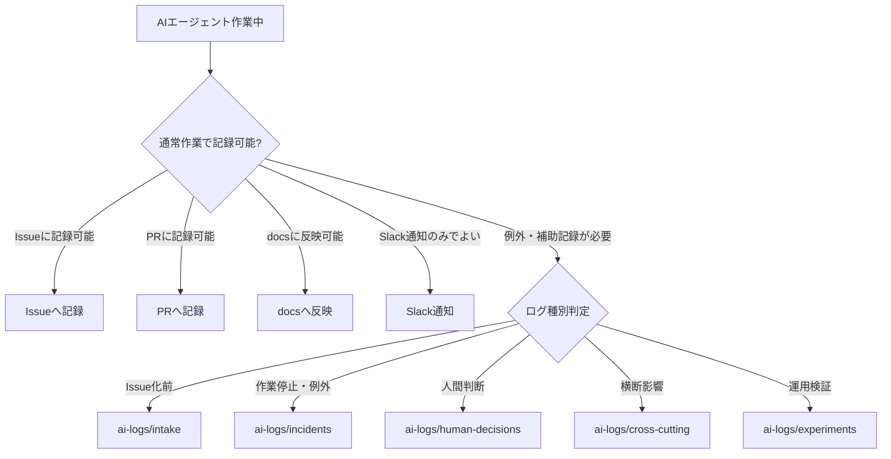

# AIログ運用ルール

## 1. 目的

本ドキュメントは、Gift Recommendation Service における `ai-logs/` の運用ルールを定義する。

AIログは、AIエージェントの通常作業履歴をすべて保存するためのものではない。  
Issue化前のフィードバック、作業停止、例外、横断影響、人間判断が必要な事項、AI運用検証など、通常のIssue / PR / docsだけでは追跡しにくい情報を補助的に記録するために使用する。

---

## 2. 本ドキュメントの位置づけ

本ドキュメントは、AIログの記録対象、配置、命名、記載内容、保存粒度に関する正本である。

| 項目                          | 正本ドキュメント                           |
| ----------------------------- | ------------------------------------------ |
| AIエージェント運用全体        | AIエージェント活用型\_開発運用フロー設計書 |
| AIエージェント体制・責務      | AIエージェント体制・責務定義               |
| Command仕様                   | Commands設計書                             |
| Task Definition構造           | Task Definition設計書                      |
| Prompts運用                   | Prompts運用ルール                          |
| AIレビュー運用                | AIレビュー運用設計書                       |
| AIログ運用                    | 本ドキュメント                             |
| Slack通知                     | Slack通知運用設計書                        |
| Issue / Projects / Branch運用 | 各運用ルール                               |

---

## 3. AIログの基本方針

AIログは、通常作業の正本ではない。

通常作業の正本は以下とする。

| 情報           | 正本            |
| -------------- | --------------- |
| 作業計画       | GitHub Issue    |
| 進捗状態       | GitHub Projects |
| 作業実体       | Branch / Commit |
| レビュー結果   | Pull Request    |
| 成果物         | docs            |
| 通知・要約     | Slack           |
| 例外・補助記録 | ai-logs         |

AIログは、Issue / PR / docs の代替として使わない。

---

## 4. 記録対象

AIログに記録する対象は、以下に限定する。

| 種別                    | 記録対象                                                              | 保存先                     |
| ----------------------- | --------------------------------------------------------------------- | -------------------------- |
| Issue化前フィードバック | Orchestrator AIがIssue化前に不足情報・確認事項を返した場合            | `ai-logs/intake/`          |
| 作業停止・例外          | AIエージェントが作業継続できない場合                                  | `ai-logs/incidents/`       |
| 人間判断待ち            | AIだけでは判断できない設計・仕様・運用判断が発生した場合              | `ai-logs/human-decisions/` |
| 横断影響                | OpenAPI / Orval / generated / DB / 共通設定など複数Taskへ影響する場合 | `ai-logs/cross-cutting/`   |
| AI運用検証              | Prompt、Command、Agent、Rule、モデル差分などを検証する場合            | `ai-logs/experiments/`     |

---

## 5. 記録しない対象

以下は、原則としてAIログに記録しない。

| 記録しないもの           | 記録先          |
| ------------------------ | --------------- |
| 通常の作業計画           | Issue           |
| 通常の作業結果           | PR              |
| 通常のレビュー結果       | PR              |
| 通常の成果物更新         | docs            |
| 通常の進捗変更           | GitHub Projects |
| 通常のSlack通知          | Slack           |
| 通常のAIとのやり取り全文 | 保存しない      |
| 作業中の思考過程         | 保存しない      |

AIログを作りすぎると、Issue / PR / docs との正本関係が崩れるため、通常作業ログとして濫用しない。

---

## 6. ディレクトリ構成

AIログは、リポジトリ直下の `ai-logs/` に配置する。

```text
ai-logs/
├─ README.md
├─ intake/
├─ incidents/
├─ human-decisions/
├─ cross-cutting/
└─ experiments/
```

| ディレクトリ               | 用途                    |
| -------------------------- | ----------------------- |
| `ai-logs/README.md`        | AIログの利用案内        |
| `ai-logs/intake/`          | Issue化前フィードバック |
| `ai-logs/incidents/`       | 作業停止・例外・エラー  |
| `ai-logs/human-decisions/` | 人間判断が必要な事項    |
| `ai-logs/cross-cutting/`   | 横断影響ログ            |
| `ai-logs/experiments/`     | AI運用検証・比較実験    |

---

## 7. ログ粒度

AIログの粒度は、Task Definitionの `operation_logging.level` で制御する。正本は [Task Definition設計書](./Task%20Definition設計書.md) §33 とする。

```yaml
operation_logging:
  level: "standard"
  ai_logs:
    intake: false
    incidents: false
    cross_cutting: false
    experiments: false
  reason: ""
```

| 値         | 方針                                                                                |
| ---------- | ----------------------------------------------------------------------------------- |
| `minimal`  | 原則AIログを作成しない。Issue / PR / docsへの記録を基本とする                       |
| `standard` | 標準。Issue化前フィードバック、作業不可、横断影響、人間判断が必要な場合のみ記録する |
| `detailed` | 検証・実験・複雑作業向け。判断経緯や比較結果を詳細に記録する                        |

通常タスクの標準値は `standard` とする。

---

## 8. operation_logging別の記録方針

| 発生内容                |    minimal |   standard |         detailed |
| ----------------------- | ---------: | ---------: | ---------------: |
| 通常作業開始            | 記録しない | 記録しない | 必要に応じて記録 |
| 通常作業完了            | 記録しない | 記録しない | 必要に応じて記録 |
| Issue化前フィードバック | 必要時のみ |   記録する |   詳細に記録する |
| 作業停止・例外          |   記録する |   記録する |   詳細に記録する |
| 人間判断が必要          |   記録する |   記録する |   詳細に記録する |
| 横断影響                |   記録する |   記録する |   詳細に記録する |
| AI運用実験              |     対象外 | 必要時のみ |         記録する |

---

## 9. ログ命名規則

AIログのファイル名は、以下の形式とする。

```text
<yyyy-mm-dd>_<workstream-key>_<log-type>_<short-summary>.md
```

例：

```text
2026-05-16_scr-002-recommendation-input_intake_missing-input-docs.md
2026-05-16_scr-002-recommendation-input_incident_branch-conflict.md
2026-05-16_api-contract-orval_cross-cutting_generated-impact.md
2026-05-16_scr-002-recommendation-input_human-decision_scope-confirmation.md
2026-05-16_prompt-operation_experiment_command-comparison.md
```

| 要素             | 内容                                                                  |
| ---------------- | --------------------------------------------------------------------- |
| `yyyy-mm-dd`     | ログ作成日                                                            |
| `workstream-key` | 関連作業群のキー                                                      |
| `log-type`       | `intake`, `incident`, `human-decision`, `cross-cutting`, `experiment` |
| `short-summary`  | 内容を表す短い英語kebab-case                                          |

---

## 10. workstream_keyの扱い

AIログでは、必ず関連する `workstream_key` を含める。

これにより、複数AIエージェントが並列で作業している場合でも、どの機能・モジュール・作業群のログか判別できる。

| 作業例                 | workstream_key（識別子スラッグ） |
| ---------------------- | -------------------------------- |
| SCR-002 画面仕様       | `scr-002-recommendation-input`   |
| API-INT-002 Reco API   | `api-int-002-reco-recommendation-run` |
| Item Feature生成       | `item-feature-generation`     |
| OpenAPI / Orval更新    | `api-contract-orval`          |
| GitHub Actions整備     | `github-actions-project-sync` |

---

## 11. Issue化前フィードバックログ

### 11.1 用途

`ai-logs/intake/` は、Orchestrator AIが人間の依頼を解析した結果、Issue化前に追加確認が必要と判断した場合に使用する。

### 11.2 記録条件

以下の場合に記録する。

- 入力資料が不足している
- 参照すべきdocsが存在しない
- 作業範囲が曖昧
- 出力先が不明
- 親Epicが不明
- 依存Taskが未整理
- 人間に確認しないとIssue化できない

### 11.3 テンプレート

```markdown
# Issue化前フィードバックログ

## 基本情報

| 項目           | 内容            |
| -------------- | --------------- |
| 作成日         |                 |
| workstream_key |                 |
| 起点Command    |                 |
| 起点Definition |                 |
| 担当Agent      | Orchestrator AI |
| ログ種別       | intake          |

## 依頼内容

<!-- 人間からの依頼概要 -->

## Issue化できない理由

-

## 不足情報

-

## 確認した入力資料

-

## 人間に確認したいこと

-

## 推奨対応

-

## 関連情報

| 種別      | 参照 |
| --------- | ---- |
| 関連docs  |      |
| 関連Issue |      |
| 関連PR    |      |
```

---

## 12. 作業停止・例外ログ

### 12.1 用途

`ai-logs/incidents/` は、AIエージェントが作業中に継続できない状態になった場合に使用する。

### 12.2 記録条件

以下の場合に記録する。

- Branch競合が発生した
- 依存Issueが未完了だった
- DefinitionとIssueが矛盾していた
- 入力docsが存在しなかった
- 出力先が不明だった
- 権限不足が発生した
- CI / testが原因不明で失敗した
- secret混入疑いがある
- AIが安全に判断できない状態になった

### 12.3 テンプレート

```markdown
# 作業停止・例外ログ

## 基本情報

| 項目           | 内容     |
| -------------- | -------- |
| 作成日         |          |
| workstream_key |          |
| 対象Issue      |          |
| 対象PR         |          |
| 対象Branch     |          |
| 起点Command    |          |
| 起点Definition |          |
| 担当Agent      |          |
| ログ種別       | incident |

## 発生内容

<!-- 何が発生したか -->

## 停止理由

-

## 影響範囲

-

## AIの判断

-

## 人間に確認したいこと

-

## 推奨対応

-

## 再開条件

-

## 関連情報

| 種別       | 参照 |
| ---------- | ---- |
| 関連docs   |      |
| 関連Issue  |      |
| 関連PR     |      |
| 関連Branch |      |
```

---

## 13. 人間判断ログ

### 13.1 用途

`ai-logs/human-decisions/` は、AIだけでは判断できない設計・仕様・運用判断を人間へエスカレーションする場合に使用する。

### 13.2 記録条件

以下の場合に記録する。

- MVPスコープ判断が必要
- 設計方針の選択が必要
- 仕様の解釈が複数あり判断できない
- 複数Taskに影響する意思決定が必要
- コスト・リスク・運用負荷の判断が必要
- AIが推奨案を出せるが、最終判断は人間が行うべき場合

### 13.3 テンプレート

```markdown
# 人間判断ログ

## 基本情報

| 項目           | 内容           |
| -------------- | -------------- |
| 作成日         |                |
| workstream_key |                |
| 対象Issue      |                |
| 対象PR         |                |
| 起点Command    |                |
| 起点Definition |                |
| 担当Agent      |                |
| ログ種別       | human-decision |

## 判断が必要な事項

-

## 背景

-

## 選択肢

| 案  | 内容 | メリット | デメリット |
| --- | ---- | -------- | ---------- |
| A   |      |          |            |
| B   |      |          |            |

## AIの推奨

-

## 人間に決めてほしいこと

-

## 判断後に必要な対応

-

## 関連情報

| 種別      | 参照 |
| --------- | ---- |
| 関連docs  |      |
| 関連Issue |      |
| 関連PR    |      |
```

---

## 14. 横断影響ログ

### 14.1 用途

`ai-logs/cross-cutting/` は、複数Task、複数コンポーネント、複数成果物に影響する変更を記録するために使用する。

### 14.2 記録条件

以下の場合に記録する。

- OpenAPI変更が複数API clientへ影響する
- Orval生成物に広範な差分が発生する
- generatedファイル差分が複数機能へ影響する
- DB schema変更が複数moduleへ影響する
- 共通型・共通component・共通設定の変更が複数Taskへ影響する
- GitHub ActionsやProjects同期workflowの変更が運用全体へ影響する

### 14.3 テンプレート

```markdown
# 横断影響ログ

## 基本情報

| 項目           | 内容          |
| -------------- | ------------- |
| 作成日         |               |
| workstream_key |               |
| 対象Issue      |               |
| 対象PR         |               |
| 起点Command    |               |
| 起点Definition |               |
| 担当Agent      |               |
| ログ種別       | cross-cutting |

## 横断影響の概要

-

## 影響対象

| 対象           | 影響内容 |
| -------------- | -------- |
| docs           |          |
| web            |          |
| api            |          |
| reco           |          |
| batch          |          |
| db             |          |
| generated      |          |
| GitHub Actions |          |

## 影響を受けるIssue / PR

-

## 対応方針

-

## 専用Task化の要否

| 判定       | 内容        |
| ---------- | ----------- |
| 専用Task化 | 必要 / 不要 |
| 理由       |             |

## 人間判断の要否

| 判定     | 内容        |
| -------- | ----------- |
| 人間判断 | 必要 / 不要 |
| 判断事項 |             |

## 関連情報

| 種別       | 参照 |
| ---------- | ---- |
| 関連docs   |      |
| 関連Issue  |      |
| 関連PR     |      |
| 関連Branch |      |
```

---

## 15. AI運用検証ログ

### 15.1 用途

`ai-logs/experiments/` は、AI運用そのものの改善・比較・検証を記録するために使用する。

### 15.2 記録条件

以下の場合に記録する。

- Prompt Templateの比較
- Command設計の比較
- Agent定義の比較
- `.cursor/rules/` の効果検証
- モデル・モード差分の比較
- AIレビュー品質の検証
- 並列作業運用の検証

### 15.3 テンプレート

```markdown
# AI運用検証ログ

## 基本情報

| 項目           | 内容       |
| -------------- | ---------- |
| 作成日         |            |
| workstream_key |            |
| 検証テーマ     |            |
| 起点Command    |            |
| 対象Agent      |            |
| ログ種別       | experiment |

## 検証目的

-

## 比較対象

| 対象 | 内容 |
| ---- | ---- |
| A    |      |
| B    |      |

## 検証方法

-

## 結果

-

## 分かったこと

-

## 採用方針

-

## 後続対応

-

## 関連情報

| 種別      | 参照 |
| --------- | ---- |
| 関連docs  |      |
| 関連Issue |      |
| 関連PR    |      |
```

---

## 16. AIログ作成フロー



---

## 17. AIログ作成判断

AIログを作成するか迷った場合は、以下で判断する。

| 判断質問                                  | Yesの場合                             |
| ----------------------------------------- | ------------------------------------- |
| Issue化前の確認事項か                     | `ai-logs/intake/` に記録する          |
| 作業が停止しているか                      | `ai-logs/incidents/` に記録する       |
| 人間判断が必要か                          | `ai-logs/human-decisions/` に記録する |
| 複数Task / 複数コンポーネントへ影響するか | `ai-logs/cross-cutting/` に記録する   |
| AI運用改善のための検証か                  | `ai-logs/experiments/` に記録する     |
| Issue / PR / docsで十分か                 | AIログを作成しない                    |

---

## 18. Issue / PRとの関係

AIログを作成した場合は、可能な限り関連IssueまたはPRにリンクを記載する。

| ログ種別       | Issue / PRへの記載                                 |
| -------------- | -------------------------------------------------- |
| intake         | Issue化前のため、後続Issue作成時に必要に応じて参照 |
| incident       | 対象IssueまたはPRにログパスを記載                  |
| human-decision | 対象IssueまたはPRに判断依頼として記載              |
| cross-cutting  | 関連IssueまたはPRに影響ログとして記載              |
| experiment     | 関連する運用改善Issueがある場合に記載              |

AIログだけに重要情報を閉じ込めない。

---

## 19. Slackとの関係

Slackは通知・サマリ用途であり、AIログの正本ではない。

AIログを作成した場合、必要に応じてSlackに以下を通知する。

- ログ種別
- 対象Issue / PR
- 発生内容の要約
- 人間が確認すべきこと
- ログファイルパス

Slack通知だけで作業停止理由や判断事項を完結させない。

---

## 20. AIレビューとの関係

AIレビュー結果は、原則としてPRに記録する。

ただし、以下の場合はAIログを併用する。

| 状況                              | 保存先                     |
| --------------------------------- | -------------------------- |
| レビュー不能な前提不足            | `ai-logs/incidents/`       |
| 人間判断が必要な設計論点          | `ai-logs/human-decisions/` |
| Contract / DB / generated横断影響 | `ai-logs/cross-cutting/`   |
| AIレビュー観点の運用検証          | `ai-logs/experiments/`     |

---

## 21. Commandとの関係

Command実行時にAIログを作成する可能性がある。

| Command                 | 主なAIログ                                |
| ----------------------- | ----------------------------------------- |
| `/start-epic` / `/start-task` | intake, human-decisions                   |
| `/work-issue`           | incidents, cross-cutting                  |
| `/create-pr`            | incidents                                 |
| `/review-pr`            | incidents, human-decisions, cross-cutting |
| `/fix-review-comments`  | incidents, human-decisions                |
| `/create-contract-task` | cross-cutting, human-decisions            |
| `/summarize-work`       | 原則作成しない                            |

Commandは、AIログ作成が必要な場合、対象ログ種別と保存先を明確にする。

---

## 22. Task Definitionとの関係

Task Definitionの `operation_logging.level` および `operation_logging.ai_logs.*` により、AIログの粒度と記録種別を制御する。

```yaml
operation_logging:
  level: "standard"
  ai_logs:
    intake: false
    incidents: true
    cross_cutting: true
    experiments: false
  reason: "通常作業ログは保存しないが、blockedや横断影響がある場合は記録する"
```

| Task Definition項目                 | AIログとの関係                                         |
| ----------------------------------- | ------------------------------------------------------ |
| `operation_logging.level`           | ログ粒度を制御する                                     |
| `operation_logging.ai_logs.*`       | 記録するログ種別（intake / incidents / cross-cutting / experiments）を制御する |
| `human_decision_points`             | 人間判断が必要な事項。必要に応じて `human-decisions/` に記録する |
| `parallel_control.contract_impact`  | trueの場合、横断影響ログを検討する                     |
| `parallel_control.generated_impact` | trueの場合、横断影響ログを検討する                     |
| `parallel_control.db_impact`        | trueの場合、横断影響ログを検討する                     |
| `parallel_control.conflict_risk`    | highの場合、incident / cross-cutting記録を検討する     |

---

## 23. ログ記載時の必須項目

AIログには、原則として以下を記載する。

| 項目           |     必須 | 内容                                                            |
| -------------- | -------: | --------------------------------------------------------------- |
| 作成日         |     必須 | ログ作成日                                                      |
| workstream_key |     必須 | 関連作業群                                                      |
| ログ種別       |     必須 | intake / incident / human-decision / cross-cutting / experiment |
| 起点Command    |     推奨 | 発生元Command                                                   |
| 起点Definition |     推奨 | 関連Definition                                                  |
| 対象Issue      | 条件付き | Issue化後の場合は必須                                           |
| 対象PR         | 条件付き | PR関連の場合は必須                                              |
| 対象Branch     | 条件付き | Branch関連の場合は必須                                          |
| 担当Agent      |     必須 | 記録したAgent                                                   |
| 発生内容       |     必須 | 何が起きたか                                                    |
| 影響範囲       |     推奨 | どこに影響するか                                                |
| 推奨対応       |     必須 | 次に何をするべきか                                              |

---

## 24. 記載粒度

AIログは、後から人間やAIが判断を再開できる粒度で記載する。

ただし、不要に長い逐語ログは残さない。

| 良い記載                      | 悪い記載                       |
| ----------------------------- | ------------------------------ |
| 何が発生したかが分かる        | 会話全文を貼る                 |
| 影響範囲が分かる              | 抽象的に「問題あり」とだけ書く |
| 次の対応が分かる              | 判断材料がない                 |
| 関連Issue / PR / docsが分かる | 参照先がない                   |
| 人間判断事項が明確            | AIの内部思考風の記録を書く     |

---

## 25. AIログのレビュー観点

AIログを含むPRでは、以下を確認する。

| 観点           | 内容                                    |
| -------------- | --------------------------------------- |
| 記録対象       | AIログを作成すべき内容か                |
| 保存先         | 適切なディレクトリに配置されているか    |
| 命名           | 命名規則に従っているか                  |
| workstream_key | 関連作業群が分かるか                    |
| 関連情報       | Issue / PR / docs への参照があるか      |
| 正本関係       | Issue / PR / docsの代替になっていないか |
| 粒度           | 必要十分な情報量か                      |
| secret         | 秘密情報が含まれていないか              |
| 個人情報       | 不要な個人情報が含まれていないか        |

---

## 26. secret / 個人情報の扱い

AIログに以下を記載してはならない。

- APIキー
- access token
- refresh token
- private key
- password
- cookie
- session情報
- `.env` の値
- 個人情報
- 不要な社外秘情報

secret混入が疑われる場合は、ログ作成を停止し、人間へ報告する。

---

## 27. 変更管理

AIログは、必要に応じてGit管理対象とする。

ただし、通常作業ログを大量に蓄積しない。

| 変更種別               | 扱い                               |
| ---------------------- | ---------------------------------- |
| intake log追加         | 後続Issue化時に必要ならcommit対象  |
| incident log追加       | 原則commit対象                     |
| human-decision log追加 | 原則commit対象                     |
| cross-cutting log追加  | 原則commit対象                     |
| experiment log追加     | 運用改善に有用な場合のみcommit対象 |
| 一時メモ               | commitしない                       |

---

## 28. 保管期間・整理方針

MVP期間中は、AIログをリポジトリ内で管理する。

将来的にログ量が増えた場合は、以下を検討する。

- 完了済みログのアーカイブ
- `ai-logs/archive/` の追加
- GitHub Issue / PRへの集約
- Notionや外部ログ基盤への移管
- 検索性を高めるindex作成

現時点では、AIログは最小限に抑える方針とする。

---

## 29. 禁止事項

以下は禁止する。

- 通常のAI作業ログをすべて `ai-logs/` に保存すること
- Issue / PR / docsの代替としてAIログを使うこと
- Slack通知だけでAIログ相当の内容を完結させること
- secretやAPIキーを記載すること
- 個人情報を不要に記載すること
- AIの内部思考過程を記録すること
- 関連Issue / PRがあるのに参照を書かないこと
- 横断影響を通常Task内に隠して記録しないこと
- 人間判断が必要な事項をAIログに書くだけで放置すること
- 古いAIログを正本として扱うこと

---

## 30. 関連ドキュメント

| ドキュメント                               | 役割                              |
| ------------------------------------------ | --------------------------------- |
| AIエージェント活用型\_開発運用フロー設計書 | AI主導運用の全体フローを定義      |
| AIエージェント体制・責務定義               | Agentごとの責務を定義             |
| Commands設計書                             | Command実行時のログ発生条件を定義 |
| Task Definition設計書                      | `operation_logging.level` 等を定義 |
| Prompts運用ルール                          | ai-logs templateの配置を定義      |
| AIレビュー運用設計書                       | AIレビュー時のログ併用条件を定義  |
| Slack通知運用設計書                        | AIログ発生時の通知方針を定義      |
| Issue運用ルール                            | 作業計画の正本を定義              |
| Projects運用ルール                         | 進捗状態の正本を定義              |
| ブランチ運用ルール                         | 作業実体の正本を定義              |

---

## 31. 一言まとめ

AIログは、AIエージェントの通常作業履歴をすべて保存する場所ではない。

正本関係は以下とする。

```text
Issue  = 作業計画
PR     = 作業結果・レビュー
docs   = 成果物
Slack  = 通知・サマリ
ai-logs = 例外・補助記録
```

AIログに記録するのは、以下に限定する。

```text
Issue化前フィードバック
作業停止・例外
人間判断が必要な事項
横断影響
AI運用検証
```

通常作業はIssue / PR / docsに記録し、AIログは必要最小限に抑える。
