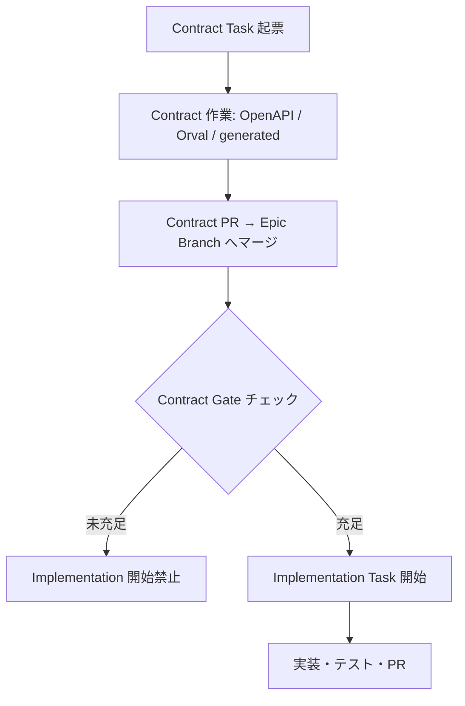

# Contract Gate運用設計書

## 1. 目的

本書は、**Contract Task**（OpenAPI / Orval / generated / API契約の横断変更）と **Implementation Task**（契約確定後の実装・結合・利用側変更）を分離する運用において、Implementation Task を開始してよい条件（**Contract Gate**）を定義する正本である。

Contract Gate を満たさない状態で Implementation Task を開始してはならない。

関連正本:

| ドキュメント | 役割 |
| ------------ | ---- |
| [成果物一覧×Task Definition化方針書](./成果物一覧×Task Definition化方針書.md) | Contract / Implementation の成果物分類 |
| [Task Definition設計書](./Task Definition設計書.md) | Task / Contract Definition の構造 |
| [プロジェクトディレクトリ構成定義書](../ディレクトリ構成/プロジェクトディレクトリ構成定義書.md) | OpenAPI / generated / Orval の正本パス |
| `prompts/definitions/_schemas/contract-definition.schema.md` | Contract Definition の `implementation_gate` |
| `prompts/definitions/_schemas/task-definition.schema.md` | Implementation Task の `contract_gate` |

Command への具体的な手順反映は、Epic #300 の「Command修正」Task で行う。本書は**条件の正本**とする。

---

## 2. 用語

| 用語 | 意味 |
| ---- | ---- |
| Contract Task | `definition_type: contract` の Task。OpenAPI / Orval / generated 等の横断契約変更を担当する |
| Implementation Task | 確定済み契約・generated を前提とする実装・結合・利用側変更の Task |
| Contract Gate | Implementation Task 開始前に満たすべき必須条件の集合 |
| Gate通過 | 本書 §4 の必須チェックをすべて満たし、人間が Implementation 開始を許可した状態 |

---

## 3. 適用範囲

### 3.1 Contract Gate が必須となる Task

以下のいずれかに該当する Implementation Task では、`contract_gate.required: true` とする。

- `output.generated.expected: true` または `output.generated.handling` が `regenerate_required` / `contract_task_required`
- `apps/**` のソースコードを変更し、generated API client を利用する
- 親 Epic または Task Definition で「先行 Contract Task 完了」を明示している

### 3.2 Contract Gate が不要となる Task

- 純粋な docs 作成 Task（`apps/**` / `packages/**` / generated 実体を変更しない）
- Contract Task 自体
- `output.generated.expected: false` かつ `handling: none` で、API契約変更を伴わない Task

---

## 4. Contract Gate 必須チェック（Gate通過条件）

Implementation Task 開始前に、以下を**すべて**確認する。1つでも未充足の場合は Gate未通過とし、作業を開始しない。

| No | チェック項目 | 確認方法（事実） | 未充足時の扱い |
| --: | ------------ | ---------------- | -------------- |
| 1 | 先行 Contract Task の完了 | 前提となる Contract Task の PR が **親 Epic Branch にマージ済み** | 停止。Contract Task 完了を待つ |
| 2 | OpenAPI 正本の反映 | 変更対象 API の定義が `packages/contracts/openapi/*.yaml` に存在し、Contract PR の差分と一致 | 停止。Contract Task または OpenAPI 更新を先行 |
| 3 | Orval 再生成（該当時） | Contract Task で `generated` 影響がある場合、正本パス（`apps/web/src/generated/api/`・`apps/api/src/generated/reco-client/`）に再生成差分が含まれる | 停止。再生成を Contract Task で実施 |
| 4 | generated 手動編集なし | generated 配下に意図しない手動編集がない（差分が Orval 生成由来である） | 停止。手動編集を revert し再生成 |
| 5 | 契約面 docs（該当時） | `api-contract-spec.md` / `openapi-spec.md` に基づく契約 docs が Contract Task または先行 Task で確定している | 停止。契約 docs Task を先行 |
| 6 | 破壊的変更の人間判断（該当時） | Contract Task で `breaking_change: true` の場合、Contract PR の **Human Review 完了** | 停止。人間判断待ち |
| 7 | Task Definition 上の依存 | `contract_gate.prerequisite_contract_tasks` / `parallel_control.depends_on` に列挙された Task が完了している | 停止。依存 Task を先行 |

### 4.1 正本パス（再掲）

| 種別 | 正本パス |
| ---- | -------- |
| OpenAPI | `packages/contracts/openapi/public-api.yaml` / `internal-reco-api.yaml` 等 |
| Orval 設定 | `orval.config.ts` |
| generated（web） | `apps/web/src/generated/api/` |
| generated（api→reco） | `apps/api/src/generated/reco-client/` |
| client wrapper | `apps/web/src/lib/` / `apps/api/src/infrastructure/reco-client/` |

---

## 5. Definition への記載方針

### 5.1 Contract Definition（`implementation_gate`）

Contract Task 完了時に、どの Implementation Task を解放するかを Contract Definition に記載する。

```yaml
implementation_gate:
  enabled: true
  gate_id: "contract-api-pub-002-recommendations"
  releases_after_merge:
    - "implementation tasks that consume POST /api/v1/recommendations generated client"
  prerequisite_checks:
    - "openapi_merged_to_epic_branch"
    - "orval_regenerated_if_generated_impact"
    - "human_review_if_breaking_change"
```

### 5.2 Task Definition（`contract_gate`）

Implementation Task 側では、開始前に確認すべき Contract Gate を記載する。

```yaml
contract_gate:
  required: true
  gate_id: "contract-api-pub-002-recommendations"
  prerequisite_contract_tasks:
    - issue: "#<Contract Task Issue>"
      definition: "prompts/definitions/cross-cutting/.../contract-task.yaml"
  verify_at:
    - "/start-task"
    - "/work-issue"
  blocked_message: "Contract Gate未通過。先行 Contract Task のマージと generated 再生成を確認してください。"
```

---

## 6. 標準フロー



---

## 7. 人間判断が必要な事項

以下は AI Agent が独断で Gate通過と断定してはならない。

- 破壊的 API 変更の許容
- Contract Task を省略して Implementation に契約変更を混在させること
- generated の手動編集を暫定許容すること
- Gate チェックの省略（「おそらく通過済み」）

---

## 8. 関連 Epic / Task

| 項目 | 内容 |
| ---- | ---- |
| Epic | #300 API契約・実装Task分離方針の整合 |
| 先行 Task | パス標準化、テンプレ分割、api-spec 廃止 |
| 本書を反映する Task | Contract Gate 定義（schema / 本設計書） |
| 後続 Task | Command 修正（`/start-task` 等への手順反映） |

---

## 9. 変更履歴

| 日付 | 変更内容 | 関連 |
| ---- | -------- | ---- |
| 2026-06-01 | 初版作成（Contract Gate 正本） | Epic #300 Task Contract Gate |
