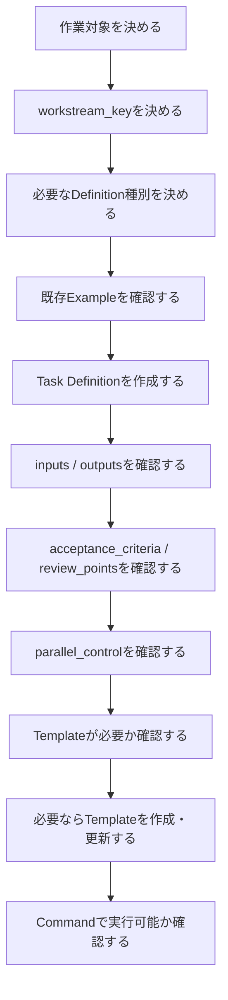
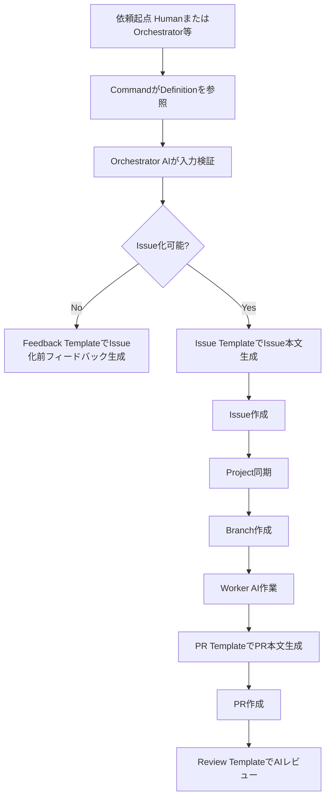

# Prompts運用ルール

## 1. 目的

本ドキュメントは、Gift Recommendation Service における `prompts/` 配下の運用ルールを定義する。

本プロジェクトでは、人間がAIエージェントへ作業依頼する際、自然文だけで依頼するのではなく、Command、Task Definition、Prompt Templateを組み合わせて依頼する。

本ドキュメントでは、以下を明確にする。

- `prompts/` の役割
- Task DefinitionとPrompt Templateの違い
- 配置場所
- 命名規則
- ファイル形式
- 作成・更新ルール
- Command / Agent / Rulesとの関係
- Issue / PR / Slack / ai-logs への展開方針
- 禁止事項

---

## 2. 本ドキュメントの位置づけ

本ドキュメントは、`prompts/` 配下の配置・命名・利用ルールの正本である。

| 項目                     | 正本ドキュメント                           |
| ------------------------ | ------------------------------------------ |
| AIエージェント運用全体   | AIエージェント活用型\_開発運用フロー設計書 |
| AIエージェント体制・責務 | AIエージェント体制・責務定義               |
| Command仕様              | Commands設計書                             |
| Task Definition構造      | Task Definition設計書                      |
| prompts配置・命名・運用  | 本ドキュメント                             |
| AIレビュー観点           | AIレビュー運用設計書                       |
| AIログ運用               | AIログ運用ルール                           |
| Slack通知                | Slack通知運用設計書                        |
| Cursor共通ルール         | `.cursor/rules/` / `AGENTS.md`             |

---

## 3. promptsとは

本プロジェクトにおける `prompts/` は、AIエージェントへ渡す作業条件・出力テンプレートを管理するディレクトリである。

`prompts/` は、チャット履歴や一時メモを保存する場所ではない。

| 種別             | 役割                                                               |
| ---------------- | ------------------------------------------------------------------ |
| Task Definition  | AIへの個別作業依頼条件を定義する                                   |
| Prompt Template  | Issue本文、PR本文、レビュー結果、Slack通知などの出力形式を定義する |
| Schema / Example | DefinitionやTemplateの検証・参考例を管理する                       |

---

## 4. 基本方針

| 方針                                 | 内容                                                             |
| ------------------------------------ | ---------------------------------------------------------------- |
| 作業条件と出力形式を分離する         | 作業条件はDefinition、文面・構成はTemplateで管理する             |
| 共通ルールを重複記載しない           | `.cursor/rules/` / `AGENTS.md` を正本とする                      |
| 1作業単位 = 1 Definitionを原則とする | Issue / Branch / PRと対応させるため                              |
| Templateは再利用可能にする           | Issue本文、PR本文、Slack通知などの形式を平準化する               |
| 日本語出力を基本とする               | Issue、PR、Slack、docsは人間が理解しやすい日本語を基本とする     |
| パス・キーは英語kebab-caseを使う     | ファイル名、`task.id`（task_id）、workstream_keyは英語で機械処理しやすくする |
| secretを含めない                     | APIキー、トークン、認証情報は記載禁止とする                      |

---

## 5. ディレクトリ構成

`prompts/` の標準構成は以下とする。

```text
prompts/
├─ README.md
├─ definitions/
│  ├─ _schemas/
│  ├─ _examples/
│  ├─ epics/
│  ├─ tasks/
│  ├─ reviews/
│  └─ cross-cutting/
└─ templates/
   ├─ issue/
   ├─ pr/
   ├─ review/
   ├─ slack/
   ├─ feedback/
   └─ ai-logs/
```

| パス                                 | 役割                             |
| ------------------------------------ | -------------------------------- |
| `prompts/README.md`                  | prompts配下の利用案内            |
| `prompts/definitions/`               | Task Definitionを配置する        |
| `prompts/definitions/_schemas/`      | Definitionのschemaを配置する     |
| `prompts/definitions/_examples/`     | Definition記述例を配置する       |
| `prompts/definitions/epics/`         | Epic Issue用Definitionを配置する |
| `prompts/definitions/tasks/`         | Task Issue用Definitionを配置する |
| `prompts/definitions/reviews/`       | PRレビュー用Definitionを配置する |
| `prompts/definitions/cross-cutting/` | 横断Task用Definitionを配置する   |
| `prompts/templates/`                 | AI出力テンプレートを配置する     |

---

## 6. Task DefinitionとPrompt Templateの違い

| 種別            | 役割                     | 例                                                     |
| --------------- | ------------------------ | ------------------------------------------------------ |
| Task Definition | 作業対象・条件を定義する | どの設計書を作るか、何を入力にするか、どこへ出力するか |
| Prompt Template | 出力形式を定義する       | Issue本文の章立て、PR本文の構成、Slack通知文面         |

### 6.1 Task Definition

Task Definitionは、AIエージェントへの作業依頼条件である。

例：

```text
prompts/definitions/tasks/scr-002-recommendation-input/screen-spec.yaml
```

用途：

```text
/start-task @prompts/definitions/tasks/scr-002-recommendation-input/screen-spec.yaml
```

### 6.2 Prompt Template

Prompt Templateは、AIがIssue本文、PR本文、レビュー結果、Slack通知などを生成する際の出力フォーマットである。

例：

```text
prompts/templates/issue/task-issue.md
prompts/templates/pr/task-pr.md
prompts/templates/slack/pr-created.md
```

---

## 7. Commandとの関係

AI作業依頼は、以下の形式を標準とする。

```text
/<Command> @<definition>
```

例：

```text
/start-task @prompts/definitions/tasks/scr-002-recommendation-input/screen-spec.yaml
/review-pr @prompts/definitions/_examples/review-definition.example.yaml
/fix-review-comments @prompts/definitions/tasks/scr-002-recommendation-input/screen-spec.yaml
```

| 要素       | 配置先                         | 役割                     |
| ---------- | ------------------------------ | ------------------------ |
| Command    | `.cursor/commands/`            | AIに実行させる操作・手順 |
| Definition | `prompts/definitions/`         | 作業対象・条件           |
| Template   | `prompts/templates/`           | 出力形式                 |
| Rules      | `.cursor/rules/` / `AGENTS.md` | 共通ルール               |
| Agent      | `.cursor/agents/`              | AIエージェントの責務     |

---

## 8. `.cursor/rules/` との関係

共通ルールの正本は `.cursor/rules/` および `AGENTS.md` とする。

Task DefinitionやPrompt Templateには、共通ルール全文を重複記載しない。

| ルール種別               | 正本                                  | Definition / Templateへの記載 |
| ------------------------ | ------------------------------------- | ----------------------------- |
| AIエージェント共通ルール | `.cursor/rules/` / `AGENTS.md`        | 原則記載しない                |
| docs作成ルール           | `.cursor/rules/docs.mdc`              | 原則記載しない                |
| GitHub運用ルール         | docs内の運用ルール / `.cursor/rules/` | 原則記載しない                |
| API作業ルール            | `.cursor/rules/api.mdc`               | 原則記載しない                |
| タスク固有条件           | Task Definition                       | 記載する                      |
| 出力形式                 | Prompt Template                       | 記載する                      |

重要な共通ルールは、Definitionに重複記載するのではなく、`.cursor/rules/` 側で適切な適用設定にする。

---

## 9. Definition配置ルール

Definitionは、作業種別ごとに以下へ配置する。

```text
prompts/definitions/
├─ epics/
├─ tasks/
├─ reviews/
└─ cross-cutting/
```

### 9.1 Epic Definition

```text
prompts/definitions/epics/<workstream_key>/epic.yaml
```

例：

```text
prompts/definitions/_examples/epic-definition.example.yaml
```

### 9.2 Task Definition

```text
prompts/definitions/tasks/<workstream_key>/<task-role>.yaml
```

例：

```text
prompts/definitions/tasks/scr-002-recommendation-input/screen-spec.yaml
prompts/definitions/tasks/api-int-002-reco-recommendation-run/api-spec.yaml
prompts/definitions/tasks/api-int-002-reco-recommendation-run/api-spec.yaml
```

### 9.3 Review Definition

```text
prompts/definitions/reviews/<workstream_key>/pr-review.yaml
```

例：

```text
prompts/definitions/_examples/review-definition.example.yaml
```

### 9.4 Cross-cutting Definition

```text
prompts/definitions/cross-cutting/<theme>/<task-role>.yaml
```

例：

```text
prompts/definitions/cross-cutting/api-contract-orval/contract-task.yaml
prompts/definitions/cross-cutting/github-actions/project-sync.yaml
```

---

## 10. Template配置ルール

Prompt Templateは、出力対象ごとに以下へ配置する。

```text
prompts/templates/
├─ issue/
├─ pr/
├─ review/
├─ slack/
├─ feedback/
└─ ai-logs/
```

| パス                  | 用途                                |
| --------------------- | ----------------------------------- |
| `templates/issue/`    | Issue本文テンプレート               |
| `templates/pr/`       | PR本文テンプレート                  |
| `templates/review/`   | AIレビューコメントテンプレート      |
| `templates/slack/`    | Slack通知テンプレート               |
| `templates/feedback/` | Issue化前フィードバックテンプレート |
| `templates/ai-logs/`  | ai-logs記録テンプレート             |

---

## 11. Template命名規則

Templateファイルは、用途が分かるkebab-caseで命名する。

```text
<target>-<purpose>.md
```

例：

```text
task-issue.md
epic-issue.md
task-pr.md
epic-pr.md
ai-review-result.md
human-review-request.md
issue-intake-feedback.md
cross-cutting-impact-log.md
```

推奨構成：

```text
prompts/templates/
├─ issue/
│  ├─ epic-issue.md
│  └─ task-issue.md
├─ pr/
│  ├─ epic-pr.md
│  └─ task-pr.md
├─ review/
│  ├─ ai-review-result.md
│  └─ review-fix-summary.md
├─ slack/
│  ├─ issue-created.md
│  ├─ pr-created.md
│  ├─ ai-review-completed.md
│  ├─ human-review-request.md
│  └─ pr-updated.md
├─ feedback/
│  └─ issue-intake-feedback.md
└─ ai-logs/
   ├─ intake-feedback-log.md
   ├─ incident-log.md
   ├─ human-decision-log.md
   ├─ cross-cutting-impact-log.md
   └─ experiment-log.md
```

---

## 12. ファイル形式

| 種別            | 形式               | 理由                                    |
| --------------- | ------------------ | --------------------------------------- |
| Task Definition | YAML               | 構造化しやすく、scriptからも扱いやすい  |
| Schema          | JSON Schema / YAML | 自動検証しやすい                        |
| Example         | YAML               | 実例として流用しやすい                  |
| Template        | Markdown           | Issue / PR / Slack / docsへ展開しやすい |
| README          | Markdown           | 人間が読みやすい                        |

---

## 13. キー・パス・文面の言語方針

| 対象           | 言語             | 例                                        |
| -------------- | ---------------- | ----------------------------------------- |
| ファイル名     | 英語kebab-case   | `screen-spec.yaml`                        |
| ディレクトリ名 | 英語kebab-case   | `scr-002-recommendation-input`            |
| YAMLキー       | 英語snake_case   | `planned_start`, `epic_scope`             |
| Branch summary | 英語kebab-case   | `scr-002-recommendation-input-screen-spec` |
| Issueタイトル  | 日本語または英語 | `[Task]SCR-002:レコメンド条件入力画面仕様書作成`（`[Task]` 直後に半角スペースなし。識別子付きは §15.3） |
| Issue本文      | 日本語           | 人間レビューしやすくするため              |
| PR本文         | 日本語           | 人間レビューしやすくするため              |
| Slack通知      | 日本語           | 通知内容を即時理解しやすくするため        |

---

## 14. 識別子スラッグ（ディレクトリ名）命名規則

`prompts/definitions/` 配下のディレクトリ名は、**成果物識別子**に対応する英語 kebab-case スラッグとする（[Task Definition設計書](./Task%20Definition設計書.md) §6、[Issue運用ルール](../プロジェクト管理/Issue運用ルール.md) §4.1）。

```text
<識別子小文字>-<概要英語>
```

例：

```text
scr-002-recommendation-input
api-int-002-reco-recommendation-run
batch-003-rakuten-item-pseudo-diff
api-contract-orval
```

| ルール                             | 内容                                       |
| ---------------------------------- | ------------------------------------------ |
| 英語kebab-case                     | 機械処理しやすくする                       |
| 識別子 prefix を含める             | 例: `scr-002`、`api-int-002`               |
| Epic / Task / Reviewで同一スラッグ | 関連 Definition を同一ディレクトリ群でまとめる |
| 機能名のみの曖昧スラッグは避ける   | 識別子未整備領域の例外 Epic のみ許容       |

---

## 15. task_id命名規則

`task_id` は、Definition単位の一意キーである。YAMLでは `task.id` に記載する。

```text
task-<識別子スラッグ>-<作業種別>
```

例：

```text
task-scr-002-recommendation-input-screen-spec
task-api-int-002-reco-recommendation-run-api-spec
task-batch-003-rakuten-item-pseudo-diff-batch-spec
epic-scr-002-recommendation-input
review-scr-002-recommendation-input-pr
```

---

## 16. Templateプレースホルダ

Templateでは、DefinitionやGitHub情報を差し込むためのプレースホルダを使用してよい。

プレースホルダ形式は以下を標準とする。

```text
{{placeholder_name}}
```

例：

```markdown
# {{issue_title}}

## 概要

{{summary}}

## 作業範囲

{{in_scope}}

## 対象外

{{out_of_scope}}
```

---

## 17. 標準プレースホルダ

| プレースホルダ              | 内容           |
| --------------------------- | -------------- |
| `{{issue_title}}`           | Issueタイトル  |
| `{{summary}}`               | 作業概要       |
| `{{phase}}`                 | Project Phase  |
| `{{priority}}`              | 優先度         |
| `{{area}}`                  | 対象領域       |
| `{{planned_start}}`         | 着手予定日     |
| `{{due_date}}`              | 期限日         |
| `{{branch_name}}`           | Branch名       |
| `{{pr_target}}`             | PR target      |
| `{{in_scope}}`              | 作業範囲       |
| `{{out_of_scope}}`          | 対象外         |
| `{{input.docs}}`              | 入力docs（Task Definition `input.docs`） |
| `{{output.docs}}`             | 出力docs（Task Definition `output.docs`） |
| `{{output.files}}`            | 出力files（Task Definition `output.files`） |
| `{{acceptance_criteria}}`     | 完了条件       |
| `{{review.review_points}}`    | 確認観点       |
| `{{related_issue}}`         | 関連Issue      |
| `{{related_pr}}`            | 関連PR         |
| `{{test_results}}`          | テスト結果     |
| `{{ai_review_result}}`      | AIレビュー結果 |
| `{{human_decision_points}}` | 人間判断事項   |

---

## 18. Template作成ルール

Template作成時は、以下を守る。

| ルール                       | 内容                                    |
| ---------------------------- | --------------------------------------- |
| 出力先ごとにTemplateを分ける | Issue、PR、Slack、ai-logsを混在させない |
| 章立てを固定する             | AI出力のばらつきを抑える                |
| プレースホルダを明示する     | Definitionから展開しやすくする          |
| 空欄許容項目を明確にする     | AIが無理に埋めないようにする            |
| 正本関係を崩さない           | Slackに作業計画正本を書かない           |
| 長すぎない                   | Template自体を複雑にしすぎない          |

---

## 19. Issue Templateとの関係

GitHub Issue Templateは `.github/ISSUE_TEMPLATE/` に配置する。
現行テンプレートは `.github/ISSUE_TEMPLATE/epic.yml`、`.github/ISSUE_TEMPLATE/task.yml`、`.github/ISSUE_TEMPLATE/contract-task.yml` とする。

一方、`prompts/templates/issue/` は、AIがIssue本文を生成するためのPrompt Templateである。

| 種別                  | 配置先                     | 用途                                 |
| --------------------- | -------------------------- | ------------------------------------ |
| GitHub Issue Template | `.github/ISSUE_TEMPLATE/`  | GitHub UIから人間がIssue作成するため |
| Prompt Issue Template | `prompts/templates/issue/` | AIがIssue本文を生成するため          |

AI主導Issue作成では、Epic / Task / Contract DefinitionとPrompt Issue Templateを使ってIssue本文を生成する。

人主導Issue作成では、GitHub Issue Templateを使う。

ただし、両者の項目構造は可能な限り揃える。

---

## 20. PR Templateとの関係

GitHub PR Templateは、共通の選択ガイドを `.github/PULL_REQUEST_TEMPLATE.md` に、種別別テンプレートを `.github/PULL_REQUEST_TEMPLATE/` に配置する。

一方、`prompts/templates/pr/` は、AIがPR本文を生成するためのPrompt Templateである。

| 種別               | 配置先                                      | 用途                             |
| ------------------ | ------------------------------------------- | -------------------------------- |
| GitHub PR Template | `.github/PULL_REQUEST_TEMPLATE.md`          | GitHub上のPRテンプレート選択案内 |
| GitHub PR Template | `.github/PULL_REQUEST_TEMPLATE/*.md`        | GitHub上のPR本文初期表示         |
| Prompt PR Template | `prompts/templates/pr/`                     | AIがPR本文を生成するため         |

Prompt PR Templateは、GitHub PR Templateの構造と整合させる。Task PR / Contract Task PRでは `Related to #<Task Issue番号>`、Epic PRでは必要に応じて `Closes #<Epic Issue番号>` を使用する。

PR本文には `/review-pr` などの次Actionコマンドを記載しない。次ActionはCommand実行手順またはレビュー依頼コメントで扱う。

---

## 21. Task Definition作成ルール

Task Definition作成時は、以下を守る。

| ルール                          | 内容                                            |
| ------------------------------- | ----------------------------------------------- |
| 1 Definition = 1作業単位        | Issue / Branch / PRと対応させる                 |
| scopeを明確にする               | AIが作業範囲外に出ないようにする                |
| out_of_scopeを必ず書く          | やらないことを明示する                          |
| inputsを明示する                | 参照すべきdocs / files / issues / prsを定義する |
| outputsを明示する               | 作成・更新先を定義する                          |
| acceptance_criteriaを具体化する | 完了判断を可能にする                            |
| `review.review_points`を具体化する | AIレビュー・人間レビュー観点を揃える         |
| parallel_controlを設定する      | 並列AI作業時の競合を避ける                      |
| `operation_logging.level` を設定する | ai-logs濫用を防ぐ（正本: Task Definition設計書 §33） |
| secretを含めない                | 認証情報の混入を防ぐ                            |

---

## 22. Task Definition更新ルール

Task Definitionを更新する場合は、以下を確認する。

| 確認観点           | 内容                                             |
| ------------------ | ------------------------------------------------ |
| 既存Issueとの整合  | 既にIssue化済みのDefinitionを変更してよいか      |
| 作業範囲の変更有無 | scope変更が実質的な追加要件になっていないか      |
| 出力先の変更有無   | docsや対象ファイルの配置が変わらないか           |
| Branch影響         | branch_summary、base、targetに影響しないか       |
| 並列作業影響       | exclusive_filesやdepends_onが変わらないか        |
| レビュー観点影響   | `acceptance_criteria`、`review.review_points`が変わらないか |

Issue化済みタスクのDefinitionを変更する場合は、IssueコメントまたはPR本文に変更理由を記録する。

---

## 23. Definitionの再利用方針

Definitionは、原則として個別作業単位で作成する。

似た作業があっても、無理に同じDefinitionを使い回さない。

| ケース                       | 方針                                  |
| ---------------------------- | ------------------------------------- |
| 同一Epic配下の別Task         | 別Definitionを作成する                |
| 同じ画面の設計・実装・テスト | それぞれ別Definitionを作成する        |
| レビュー指摘対応             | `review-fix.yaml` を作成する          |
| 複数機能で同じTemplateを使う | Templateを再利用する                  |
| 作業条件がほぼ同一           | `_examples/` をコピーして新規作成する |

Definitionは作業条件なので、過度な共通化をしない。

Templateは出力形式なので、再利用を推奨する。

---

## 24. AIレビュー用Definition

AIレビュー用Definitionは、`prompts/definitions/reviews/` に配置する。

```text
prompts/definitions/reviews/<workstream_key>/pr-review.yaml
```

AIレビュー用Definitionでは、以下を明確にする。

- レビュー対象PR
- 関連Issue
- 関連Task Definition
- `output.docs`
- `review.review_points`
- acceptance_criteria
- 確認すべきCI / テスト結果
- Human Reviewへ進める条件
- 差し戻し条件

AIレビューは人間レビューの代替ではない。

---

## 25. レビュー指摘対応Definition

レビュー指摘対応用Definitionは、通常Task配下に配置する。

```text
prompts/definitions/tasks/<workstream_key>/review-fix.yaml
```

レビュー指摘対応用Definitionでは、以下を明確にする。

- 対象PR
- 対象Issue
- 指摘コメントの確認方法
- 同一Branchで対応可能な範囲
- 別Issue化すべき条件
- 再テスト条件
- 再レビュー依頼条件

---

## 26. 横断Task用Definition

OpenAPI / Orval / generated / DB / GitHub Actionsなど、横断影響が大きい作業は `cross-cutting/` に配置する。

```text
prompts/definitions/cross-cutting/<theme>/<task-role>.yaml
```

例：

```text
prompts/definitions/cross-cutting/api-contract-orval/contract-task.yaml
prompts/definitions/cross-cutting/github-actions/project-sync.yaml
prompts/definitions/cross-cutting/db-migration/recommendation-run.yaml
```

横断Taskでは、以下を必ず明示する。

- 影響範囲
- exclusive_files
- generated_impact
- contract_impact
- db_impact
- human_decision_points
- 検証方法
- rollback方針が必要か

---

## 27. Prompts作成フロー

新しいAI作業を定義する場合は、以下の流れで作成する。



---

## 28. Prompts利用フロー

AI主導タスクの標準利用フローは以下とする。



AI-Led 運用では、人間が最初に Command + Definition で依頼する。以降、`/start-task`・`/work-issue`・`/create-pr`・`/review-pr` 等は、Commands設計書に定義された主担当 Agent（Orchestrator / Worker / Reviewer / Fixer 等）が Command 手順に従って実行する。

---

## 29. バリデーション

Definition作成・更新時は、以下を検証する。

| チェック       | 内容                            |
| -------------- | ------------------------------- |
| YAML構文       | YAMLとして正しいか              |
| schema         | 必須項目が揃っているか          |
| kind           | 定義済みのkindか                |
| `task.id`      | 一意であるか（task_id）         |
| workstream_key | ディレクトリと一致しているか    |
| issue title    | `[Epic]` または `[Task]` 形式か |
| labels         | スペースあり形式か              |
| phase          | 定義済み工程か                  |
| input docs     | 実在するか                      |
| output path    | 明確か                          |
| branch         | base / targetが妥当か           |
| scope          | in_scope / out_of_scopeが明確か |
| acceptance     | 完了条件が空でないか            |
| review_points  | 確認観点が空でないか            |
| secret         | secretが含まれていないか        |

---

## 30. Templateバリデーション

Template作成・更新時は、以下を確認する。

| チェック       | 内容                                       |
| -------------- | ------------------------------------------ |
| 目的           | 何の出力に使うTemplateか明確か             |
| 出力先         | Issue / PR / Slack / ai-logsのどれか明確か |
| プレースホルダ | 未定義のplaceholderがないか                |
| 章立て         | 必要な章が揃っているか                     |
| 正本関係       | Slackやai-logsに正本情報を書かせていないか |
| 日本語可読性   | 人間が読める文面になっているか             |
| 過剰記載       | Template自体が複雑になりすぎていないか     |

---

## 31. Issue本文生成方針

AI主導Issue作成時は、以下を組み合わせてIssue本文を生成する。

```text
Task Definition
+ prompts/templates/issue/task-issue.md
```

Issue本文には、以下を含める（`prompts/templates/issue/task-issue.md` に対応）。

- 概要
- Project同期項目（`project.fields.*`。Priority は Label `priority:*` の導出元でもある）
- no-branch（[Issue運用ルール](../プロジェクト管理/Issue運用ルール.md) §15 のチェックボックス。GitHub Label `no-branch` は使わない）
- Issue同期項目（`unit` / `type` / `area` の値。`task-issue.md` §12）
- 作業範囲
- 対象外
- 入力資料
- 出力対象
- 完了条件
- 確認観点
- 並列作業・競合管理
- AI運用補助項目

**GitHub Label は Issue 本文に列挙しない。** Definition の `issue.unit` / `issue.type` / `issue.area` および `project.fields.priority` から、`/start-task` 等が `unit: *` / `type: *` / `area: *` / `priority: *` を導出し、Issue 作成時に GitHub の Label として付与する（Task Definition設計書 §14、§36）。

Issue本文は作業計画の正本である。Label の正本は GitHub Issue のメタデータ（付与済み Label）とする。

---

## 32. PR本文生成方針

PR作成時は、以下を組み合わせてPR本文を生成する。

```text
Task Definition
+ prompts/templates/pr/task-pr.md
+ 実際のdiff / test results
```

Task PRでは、PR本文に以下を記載する。

```text
Related to #<Task Issue番号>
```

Task Issueの close / Projects Done は、PR merge時workflowで制御する。

PR本文には、以下を含める。

- 作業サマリ
- 対象Issue
- 関連Epic
- 変更内容
- 作成・更新した成果物
- 実施した確認
- テスト結果
- AIレビュー依頼観点
- 残課題
- 人間確認事項

---

## 33. AIレビュー結果生成方針

AIレビュー時は、以下を組み合わせてレビュー結果を生成する。

```text
Review Definition
+ prompts/templates/review/ai-review-result.md
+ PR diff / Issue / CI results
```

AIレビュー結果には、以下を含める。

- レビュー結果分類
- 確認対象
- OK事項
- 指摘事項
- 修正必須事項
- 任意改善事項
- Human Reviewへ進めるか
- Fixer AIへ渡す修正観点
- 別Issue化すべき事項

---

## 34. Slack通知生成方針

Slack通知は、以下を組み合わせて生成する。

```text
Task Definition
+ prompts/templates/slack/<notification-type>.md
+ Issue / PR / Review result
```

Slackは通知・サマリ用途であり、正本ではない。

Slack通知では、以下を重視する。

- 何が起きたか
- どのIssue / PRか
- 人間が確認すべきことは何か
- 次の状態は何か

---

## 35. ai-logs生成方針

ai-logsは、通常作業ログをすべて保存する場所ではない。

ai-logsを作成する場合は、以下を組み合わせる。

```text
Task Definition
+ prompts/templates/ai-logs/<log-type>.md
  （intake-feedback-log / incident-log / human-decision-log / cross-cutting-impact-log / experiment-log）
+ 発生内容
```

ai-logsの対象は以下に限定する。正本は [AIログ運用ルール](./AIログ運用ルール.md) §4・§6 とする。

| 種別                    | 保存先                     |
| ----------------------- | -------------------------- |
| Issue化前フィードバック | `ai-logs/intake/`          |
| 作業停止・例外          | `ai-logs/incidents/`       |
| 人間判断待ち            | `ai-logs/human-decisions/` |
| 横断影響                | `ai-logs/cross-cutting/`   |
| AI運用検証              | `ai-logs/experiments/`     |

---

## 36. 変更管理

prompts配下を変更する場合は、通常のdocs / code変更と同様にIssue・PRで管理する。

| 変更種別       | 扱い                                       |
| -------------- | ------------------------------------------ |
| Definition追加 | 対応Task Issueまたはprompts整備Issueで管理 |
| Definition修正 | 影響するIssue / PRを確認する               |
| Template追加   | prompts整備Issueで管理                     |
| Template修正   | 既存出力への影響を確認する                 |
| Schema変更     | 既存Definitionの互換性を確認する           |
| Example追加    | 軽微ならdocs整備Taskで対応可               |

既存Definitionの構造に影響する変更は、Task Definition設計書の更新も検討する。

---

## 37. レビュー観点

prompts配下の変更PRでは、以下を確認する。

| 観点         | 内容                                                        |
| ------------ | ----------------------------------------------------------- |
| 配置         | 定められたディレクトリに配置されているか                    |
| 命名         | kebab-case、workstream_key規則に従っているか                |
| 構造         | Task Definition設計書に準拠しているか                       |
| 正本関係     | Issue / PR / docs / Slack / ai-logsの役割が混在していないか |
| 入出力       | inputs / outputs が明確か                                   |
| 完了条件     | acceptance_criteria が具体的か                              |
| レビュー観点 | review_points が具体的か                                    |
| 並列制御     | exclusive_files / conflict_risk が妥当か                    |
| 秘密情報     | secretが含まれていないか                                    |
| 可読性       | 人間が理解しやすいか                                        |

---

## 38. 禁止事項

以下は禁止する。

- `prompts/` にチャット履歴を保存すること
- `prompts/` にsecretやAPIキーを記載すること
- Task Definitionに共通ルール全文を重複記載すること
- `.cursor/commands/` に置くべきCommandを `prompts/` に置くこと
- `.cursor/rules/` に置くべき共通ルールを `prompts/` に置くこと
- Task Definitionなしで大規模AI主導作業を開始すること
- 1つのDefinitionで複数Issue分の作業をまとめすぎること
- Templateに作業固有条件を書きすぎること
- Definitionに出力形式の細部を書きすぎること
- Slack通知を作業計画や成果物の正本にすること
- ai-logsを通常作業ログの保管場所として濫用すること
- generatedファイルを手動編集する前提のDefinitionを作成すること
- Task Branchからdevelopへ直接PRする前提のDefinitionを作成すること

---

## 39. 関連ドキュメント

| ドキュメント                               | 役割                                     |
| ------------------------------------------ | ---------------------------------------- |
| AIエージェント活用型\_開発運用フロー設計書 | AI主導運用の全体フローを定義             |
| AIエージェント体制・責務定義               | Agentごとの責務を定義                    |
| Commands設計書                             | Command仕様を定義                        |
| Task Definition設計書                      | Definitionの構造を定義                   |
| AIレビュー運用設計書                       | AIレビュー観点と結果反映ルールを定義     |
| AIログ運用ルール                           | ai-logsの記録対象・粒度を定義            |
| Slack通知運用設計書                        | Slack通知条件と文面を定義                |
| worktree運用ルール                         | 並列AI作業時の作業領域分離を定義         |
| Issue運用ルール                            | Issue本文、タイトル、ラベル、no-branch（本文のみ）を定義 |
| Projects運用ルール                         | Status、Phase、予定・実績管理を定義      |
| ブランチ運用ルール                         | Branch命名、Branch base、PR targetを定義 |

---

## 40. 一言まとめ

`prompts/` は、AIエージェントへの作業条件と出力テンプレートを管理する場所である。

役割分担は以下とする。

```text
.cursor/commands/      = AIに何を実行させるか
.cursor/agents/        = どの役割のAIが実行するか
.cursor/rules/         = AIが常に守る共通ルール
prompts/definitions/   = 何を対象に、どの条件で作業するか
prompts/templates/     = Issue / PR / Slack等をどの形式で出力するか
docs/                  = 成果物・運用ルールの正本
```

AI作業依頼の標準形式は以下である。

```text
/<Command> @<definition>
```

Task Definitionは作業条件、Prompt Templateは出力形式であり、両者を混同しない。
