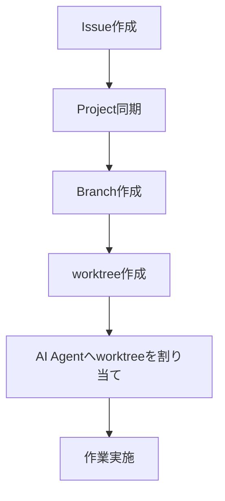
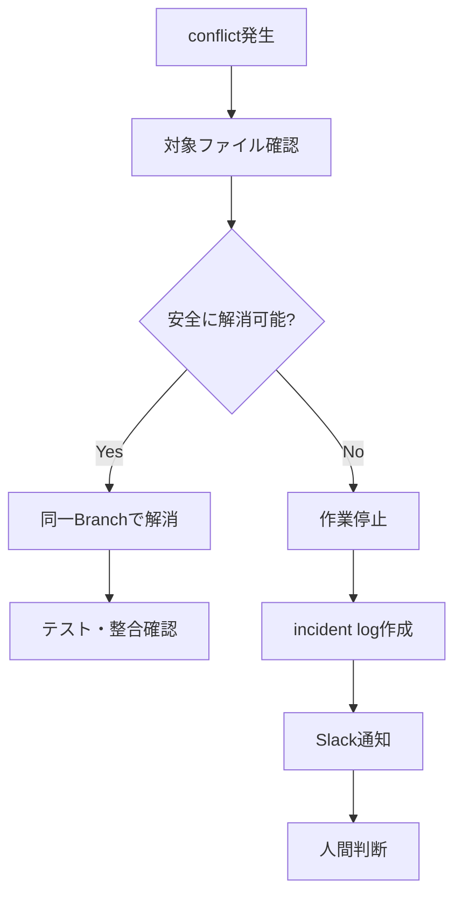

# worktree運用ルール

## 1. 目的

本ドキュメントは、Gift Recommendation Service における `git worktree` の運用ルールを定義する。

本プロジェクトでは、AIエージェントを活用して複数Issue / 複数Branchの作業を並列実行する。  
その際、同一作業ディレクトリで複数Branchを切り替えると、未コミット差分、依存関係、生成物、AI Agentの作業対象が混在しやすい。

そのため、並列AI作業では、原則として `git worktree` により作業ディレクトリを分離する。

---

## 2. 本ドキュメントの位置づけ

本ドキュメントは、AIエージェント並列作業時の作業ディレクトリ分離、worktree作成、削除、最新化、競合回避に関する正本である。

| 項目                     | 正本ドキュメント                           |
| ------------------------ | ------------------------------------------ |
| AIエージェント運用全体   | AIエージェント活用型\_開発運用フロー設計書 |
| AIエージェント体制・責務 | AIエージェント体制・責務定義               |
| Command仕様              | Commands設計書                             |
| Task Definition構造      | Task Definition設計書                      |
| Prompts運用              | Prompts運用ルール                          |
| AIレビュー運用           | AIレビュー運用設計書                       |
| AIログ運用               | AIログ運用ルール                           |
| Slack通知                | Slack通知運用設計書                        |
| Projects Status管理      | Projects運用ルール                         |
| Issue運用                | Issue運用ルール                            |
| Branch運用               | ブランチ運用ルール                         |
| worktree運用             | 本ドキュメント                             |

---

## 3. worktreeとは

`git worktree` は、1つのGitリポジトリに対して、複数の作業ディレクトリを持てるGit機能である。

通常のGit運用では、1つの作業ディレクトリでBranchを切り替える。

```text
gift-reco/
  └─ 現在のBranchを切り替えて作業する
```
worktreeを使うと、Branchごとに作業ディレクトリを分けられる。

```text
gift-reco/                                  # main worktree
gift-reco-worktrees/
  ├─ feature-epic-101-recommendation-api/   # Epic Branch用
  ├─ docs-task-111-api-design/              # Task Branch用
  ├─ feature-task-112-api-implementation/   # Task Branch用
  └─ test-task-113-api-unit-test/           # Task Branch用
```
これにより、複数AIエージェントが別Branchを同時に扱いやすくなる。

---

## 4. 基本方針

| 方針                                                | 内容                                               |
| --------------------------------------------------- | -------------------------------------------------- |
| 並列AI作業ではworktreeを使う                        | Branch切替による差分混在を防ぐ                     |
| 1 Task Branch = 1 worktreeを原則とする              | Issue / Branch / PR / 作業ディレクトリを対応させる |
| main worktreeでは直接作業しない                     | 管理・確認・同期用に使う                           |
| Task worktreeは親Epic Branchから作成する            | Task Branchのbaseを明確にする                      |
| PR作成前に親Epic Branchの最新状態を取り込む         | 後続Taskとのずれを防ぐ                             |
| 作業完了後はworktreeを削除する                      | ローカル環境の肥大化を防ぐ                         |
| generated / contract / DB変更は並列作業を慎重に扱う | 横断影響が大きいため                               |
| secretをworktree内に置かない                        | `.env` 等の管理に注意する                          |

---

## 5. 適用対象

worktree運用は、主に以下で使用する。

| 作業                         |           worktree使用 |
| ---------------------------- | ---------------------: |
| AI主導Task作業               |           原則使用する |
| 複数AIエージェントの並列作業 |                   必須 |
| 人主導の単発docs作業         |                   任意 |
| 人主導の軽微修正             |                   任意 |
| Epic Branch作業              |           使用してよい |
| Contract / generated作業     | 専用worktreeを使用する |
| hotfix作業                   |   状況に応じて使用する |

単独作業であっても、AI Agentに作業させる場合はworktreeを使用する方が安全である。

---

## 6. 正本関係

worktreeは作業場所であり、正本ではない。

| 情報         | 正本            |
| ------------ | --------------- |
| 作業計画     | GitHub Issue    |
| 進捗状態     | GitHub Projects |
| 作業Branch   | Git Branch      |
| 作業実体     | Branch / Commit |
| レビュー結果 | Pull Request    |
| 成果物       | docs            |
| 作業場所     | worktree        |

worktreeを削除しても、BranchとCommitが残っていれば作業内容は失われない。

---

## 7. 標準ディレクトリ構成

ローカル環境では、リポジトリ本体とworktree群を分離する。

```text
~/workspace/
├─ gift-reco/                    # main worktree
└─ gift-reco-worktrees/           # additional worktrees
   ├─ feature-epic-101-recommendation-api/
   ├─ docs-task-111-api-design/
   ├─ feature-task-112-api-implementation/
   └─ test-task-113-api-unit-test/
```
Windows / WSL環境では、WSL側のLinuxファイルシステム配下に配置することを推奨する。

例：

```text
/home/<user>/workspace/
├─ gift-reco/
└─ gift-reco-worktrees/
```
Windows側パス配下で大規模なNode.js / Python作業を行うと、I/Oが遅くなる場合があるため、WSL利用時はWSL側に置く。

---

## 8. worktreeディレクトリ命名規則

worktreeディレクトリ名は、Branch名の `/` を `-` に置換した形式を標準とする。

```text
<branch-nameの/を-に置換>
```
例：

| Branch                                | worktree directory                    |
| ------------------------------------- | ------------------------------------- |
| `feature/epic-101-recommendation-api` | `feature-epic-101-recommendation-api` |
| `docs/task-111-api-design`            | `docs-task-111-api-design`            |
| `feature/task-112-api-implementation` | `feature-task-112-api-implementation` |
| `test/task-113-api-unit-test`         | `test-task-113-api-unit-test`         |

---

## 9. Branch運用との関係

本プロジェクトのBranch命名規則は以下とする。

```text
<type>/<unit>-<issue番号>-<english-summary>
```
例：

```text
feature/epic-101-recommendation-api
docs/task-111-api-design
feature/task-112-api-implementation
test/task-113-api-unit-test
```
worktreeは、このBranch単位で作成する。

| Issue種別 | Branch base   | PR target     | worktree     |
| --------- | ------------- | ------------- | ------------ |
| Epic      | `develop`     | `develop`     | 作成してよい |
| Task      | 親Epic Branch | 親Epic Branch | 原則作成する |

Task Branchから `develop` へ直接PRを作成しない。

---

## 10. AI Agentとの関係

AI Agentには、原則として1つのworktreeだけを作業対象として渡す。

| Agent           | worktree利用方針                                |
| --------------- | ----------------------------------------------- |
| Orchestrator AI | 原則main worktreeまたは管理用worktreeを使用     |
| Worker AI       | Task worktreeを使用                             |
| Reviewer AI     | PR diff確認中心。必要に応じて対象worktreeを読む |
| Fixer AI        | 対象Task worktreeを使用                         |
| Contract AI     | Contract専用worktreeを使用                      |
| Test AI         | 対象Task worktreeまたは検証専用worktreeを使用   |

複数AI Agentが同じworktreeを同時に編集してはならない。

---

## 11. worktree作成フロー

Task Branch用worktreeは、以下の流れで作成する。


標準コマンド例：

```bash
git fetch origin

git worktree add \
  ../gift-reco-worktrees/docs-task-111-api-design \
  docs/task-111-api-design
```
新規Branch作成と同時にworktreeを作成する場合：

```bash
git fetch origin

git worktree add \
  -b docs/task-111-api-design \
  ../gift-reco-worktrees/docs-task-111-api-design \
  origin/feature/epic-101-recommendation-api
```
---

## 12. Epic worktree作成

Epic Branchをworktree化する場合は、`develop` をbaseにする。

```bash
git fetch origin

git worktree add \
  -b feature/epic-101-recommendation-api \
  ../gift-reco-worktrees/feature-epic-101-recommendation-api \
  origin/develop
```
作成後、必要に応じてremoteへpushする。

```bash
cd ../gift-reco-worktrees/feature-epic-101-recommendation-api
git push -u origin feature/epic-101-recommendation-api
```
---

## 13. Task worktree作成

Task Branchは親Epic Branchをbaseにする。

```bash
git fetch origin

git worktree add \
  -b docs/task-111-api-design \
  ../gift-reco-worktrees/docs-task-111-api-design \
  origin/feature/epic-101-recommendation-api
```
作成後、remoteへpushする。

```bash
cd ../gift-reco-worktrees/docs-task-111-api-design
git push -u origin docs/task-111-api-design
```
---

## 14. 既存Branchからworktreeを作成する場合

既にBranchが存在する場合は、`-b` を付けない。

```bash
git fetch origin

git worktree add \
  ../gift-reco-worktrees/docs-task-111-api-design \
  docs/task-111-api-design
```
remote tracking branchしかない場合は、以下のようにローカルBranchを作成してからworktree化する。

```bash
git fetch origin

git worktree add \
  ../gift-reco-worktrees/docs-task-111-api-design \
  -b docs/task-111-api-design \
  origin/docs/task-111-api-design
```
---

## 15. worktree一覧確認

現在のworktree一覧は以下で確認する。

```bash
git worktree list
```
例：

```text
/home/ryo/workspace/gift-reco                                      abc1234 [develop]
/home/ryo/workspace/gift-reco-worktrees/docs-task-111-api-design    def5678 [docs/task-111-api-design]
```
AI Agentに作業を渡す前に、対象Branchとworktreeの対応を確認する。

---

## 16. 作業開始前チェック

AI Agentがworktreeで作業を開始する前に、以下を確認する。

| チェック       | 内容                                      |
| -------------- | ----------------------------------------- |
| Issue確認      | 対象Issueが正しいか                       |
| Branch確認     | 対象BranchがIssueと一致しているか         |
| worktree確認   | 現在の作業ディレクトリが対象worktreeか    |
| base確認       | Task Branchが親Epic Branch由来か          |
| Status確認     | Projects Statusが `In Progress` か        |
| 差分確認       | 予期しない未コミット差分がないか          |
| 最新化確認     | 親Epic Branchの最新状態を取り込んでいるか |
| Definition確認 | Task Definitionが対象作業と一致しているか |

確認コマンド例：

```bash
pwd
git branch --show-current
git status --short
git remote -v
```
---

## 17. 親Epic Branchの最新化

Task作業では、親Epic Branchの最新状態を取り込んでから作業する。

```bash
git fetch origin

git merge origin/feature/epic-101-recommendation-api
```
または、rebase運用を採用する場合：

```bash
git fetch origin

git rebase origin/feature/epic-101-recommendation-api
```
本プロジェクトでは、AI Agentが自律実行する場合は、履歴の単純さより安全性を優先し、原則 `merge` を使用してよい。

ただし、チームでrebase運用を明示採用する場合は、ブランチ運用ルール側を更新する。

---

## 18. 最新化が必要なタイミング

以下のタイミングでは、Task Branchに親Epic Branchの最新状態を取り込む。

| タイミング                       | 理由                                               |
| -------------------------------- | -------------------------------------------------- |
| 作業開始前                       | 古い前提で作業しないため                           |
| PR作成前                         | merge時の差分ずれを防ぐため                        |
| AIレビュー指摘対応前             | レビュー中に親Epicが更新されている可能性があるため |
| 他Task PRが親Epicへmergeされた後 | 後続Task Branchの前提が変わるため                  |
| conflict発生後                   | 解消後の整合性を確認するため                       |

---

## 19. 作業中の差分管理

AI Agentは、作業中に以下を意識する。

| ルール                       | 内容                                         |
| ---------------------------- | -------------------------------------------- |
| 余計なファイルを変更しない   | Task Definitionのoutputs対象を中心に変更する |
| generatedを手動編集しない    | generatedは専用手順で生成する                |
| `.env` を作成・変更しない    | secret混入を防ぐ                             |
| lockfile変更に注意する       | 依存追加が必要な場合のみ変更する             |
| 未追跡ファイルを確認する     | 不要ファイルをcommitしない                   |
| 複数Taskの変更を混在させない | Issue / PR単位を守る                         |

確認コマンド：

```bash
git status --short
git diff
git diff --stat
```
---

## 20. commit作成ルール

commitは対象Task Branch上で作成する。

```bash
git add <files>
git commit -m "docs: add recommendation product list screen spec"
```
commit前に以下を確認する。

| チェック | 内容                           |
| -------- | ------------------------------ |
| Branch   | 対象Task Branchか              |
| diff     | Task scope内の変更か           |
| files    | 不要ファイルが含まれていないか |
| tests    | 必要な検証が完了しているか     |
| secrets  | secretが含まれていないか       |

---

## 21. PR作成前チェック

PR作成前に以下を確認する。

| チェック          | 内容                                              |
| ----------------- | ------------------------------------------------- |
| Task Branch最新化 | 親Epic Branchの最新状態を取り込んでいるか         |
| PR target         | 親Epic Branchになっているか                       |
| Issue紐づけ       | Task IssueとBranchが一致しているか                |
| diff確認          | out_of_scope変更が混在していないか                |
| CI / test         | 必要な検証が実施されているか                      |
| PR本文            | `Related to #<Task Issue番号>` が記載されているか |

Task PRでは `Closes #<Task Issue番号>` による自動closeに依存しない。

---

## 22. worktree削除タイミング

worktreeは、対象PRがmergeされ、IssueがDoneになった後に削除する。

| 対象              | 削除タイミング                                                |
| ----------------- | ------------------------------------------------------------- |
| Task worktree     | Task PRが親Epic Branchへmergeされ、Task IssueがDoneになった後 |
| Epic worktree     | Epic PRがdevelopへmergeされ、Epic IssueがDoneになった後       |
| Contract worktree | Contract PR merge後                                           |
| 検証用worktree    | 検証完了後                                                    |

未mergeのBranchに対応するworktreeを削除してはならない。

---

## 23. worktree削除手順

worktree削除前に、未コミット差分がないことを確認する。

```bash
cd ../gift-reco-worktrees/docs-task-111-api-design
git status --short
```
差分がなければ、main worktree側から削除する。

```bash
cd ~/workspace/gift-reco

git worktree remove ../gift-reco-worktrees/docs-task-111-api-design
```
不要な管理情報を掃除する。

```bash
git worktree prune
```
---

## 24. Branch削除との関係

worktree削除とBranch削除は別である。

| 操作                  | 意味                       |
| --------------------- | -------------------------- |
| `git worktree remove` | 作業ディレクトリを削除する |
| `git branch -d`       | ローカルBranchを削除する   |
| remote branch削除     | GitHub上のBranchを削除する |

PR merge後にGitHub側でBranch削除する場合、ローカルBranchも必要に応じて削除する。

```bash
git branch -d docs/task-111-api-design
```
remote tracking情報の整理：

```bash
git fetch --prune
```
---

## 25. 並列作業時の割当ルール

複数AI Agentへ並列作業を依頼する場合、以下のように割り当てる。

```text
Task Issue A → Branch A → worktree A → Worker AI A
Task Issue B → Branch B → worktree B → Worker AI B
Task Issue C → Branch C → worktree C → Worker AI C
```
同じworktreeを複数AI Agentに同時に渡さない。

同じファイルを編集するTaskは、parallel_control.exclusive_filesを確認し、同時作業を避ける。

---

## 26. 並列作業のリスク管理

並列作業では、以下のリスクがある。

| リスク            | 内容                                   | 対策                  |
| ----------------- | -------------------------------------- | --------------------- |
| ファイル競合      | 同じファイルを複数Taskが編集する       | exclusive_filesで制御 |
| 設計前提ずれ      | 前段Taskの変更が後続Taskに反映されない | 親Epic Branch最新化   |
| generated差分競合 | Orval等の生成物が複数Taskで変わる      | Contract Taskに分離   |
| DB変更競合        | migrationやschema変更が衝突する        | 専用Task化            |
| 依存関係変更      | package追加・lockfile変更が衝突する    | 依存追加Taskを分離    |
| AI Agent混線      | 別Taskのworktreeを編集する             | 作業開始前チェック    |
| PR target誤り     | Task BranchからdevelopへPRする         | PR作成前チェック      |

---

## 27. exclusive_filesとの関係

Task Definitionの `parallel_control.exclusive_files` に指定されたファイルは、同時編集禁止とする。

例：

```yaml
parallel_control:
  exclusive_files:
    - "docs/06_実装設計/web/SCR-002 レコメンド条件入力画面仕様書.md"
    - "apps/web/src/features/recommendation/"
```
Orchestrator AIは、複数Taskの `exclusive_files` を比較し、競合する場合は並列実行を避ける。

---

## 28. generated / contract / DB作業

以下の作業は、通常Taskの並列作業に混ぜない。

| 作業          | 扱い                         |
| ------------- | ---------------------------- |
| OpenAPI変更   | Contract Task化する          |
| Orval生成     | Contract Task化する          |
| generated差分 | Contract Taskで管理する      |
| DB schema変更 | 専用Task化する               |
| migration追加 | 専用Task化する               |
| 共通型変更    | 影響分析後に専用Task化を検討 |
| package追加   | 影響範囲を確認してから実施   |

これらは横断影響が大きいため、専用worktreeで作業する。

---

## 29. conflict発生時の扱い

親Epic Branchの最新化やPR merge時にconflictが発生した場合、AI Agentは推測で解消しない。

以下の流れで対応する。


conflict解消後は、必ず関連テスト・docs整合性確認を実施する。

---

## 30. 作業停止条件

以下の場合、AI Agentはworktree上の作業を停止し、人間へ確認する。

| 条件                             | 対応               |
| -------------------------------- | ------------------ |
| 現在Branchが対象Branchと異なる   | 作業停止           |
| 未コミット差分の由来が不明       | 作業停止           |
| 親Epic Branchとのmergeでconflict | incident記録       |
| generated差分が想定外に発生      | cross-cutting記録  |
| DB migration差分が想定外に発生   | human decision     |
| `.env` やsecretらしき差分が発生  | 即時停止           |
| out_of_scope変更が必要           | 人間確認           |
| PR targetが不明                  | 作業停止           |
| 他Taskのexclusive_filesと競合    | Orchestratorへ確認 |

---

## 31. Cloud Agentとの関係

Cloud Agentを利用する場合、サービス側が独立した作業環境を用意することがある。

その場合、ローカルの `git worktree` を直接使わない可能性がある。

ただし、運用原則は同じである。

| ローカルworktree運用           | Cloud Agent運用                   |
| ------------------------------ | --------------------------------- |
| 1 Task Branch = 1 worktree     | 1 Task Branch = 1 cloud workspace |
| worktreeで作業分離             | cloud workspaceで作業分離         |
| 親Epic Branchをbaseにする      | 親Epic Branchをbaseにする         |
| PR targetを親Epic Branchにする | PR targetを親Epic Branchにする    |
| 作業完了後にworktree削除       | 作業完了後にworkspace終了         |

Cloud Agentでも、Issue / Branch / PR / Projectsの運用ルールは変えない。

---

## 32. Cursorでの利用方針

Cursorでworktreeを使う場合は、対象worktreeディレクトリを別ウィンドウで開いて作業する。

例：

```text
Cursor Window 1: gift-reco
Cursor Window 2: gift-reco-worktrees/docs-task-111-api-design
Cursor Window 3: gift-reco-worktrees/feature-task-112-api-implementation
```
AI Agentへ依頼する際は、対象worktreeを開いたCursor Window上でCommandを実行する。

異なるTaskのCursor Windowを取り違えないよう、以下を確認する。

```bash
pwd
git branch --show-current
git status --short
```
---

## 33. 依存関係インストール

worktreeは作業ディレクトリが分かれるため、依存関係の扱いに注意する。

Node.js / pnpmの場合、以下を確認する。

```bash
pnpm install
```
Pythonの場合、**uv** と **worktree ごとの `.venv`** を正とする（[ローカル開発手順書 §6.2](../../docs/06_実装設計/cross_cutting/ローカル開発手順書.md)）。

```bash
./scripts/dev/setup-python.sh
./scripts/dev/pytest-python.sh
# reco 骨格 merge 後
./scripts/dev/setup-python-reco.sh
./scripts/dev/pytest-reco.sh
# batch 骨格 merge 後
./scripts/dev/setup-python-batch.sh
./scripts/dev/pytest-batch.sh
```

`python -m venv` / system `python3` 直叩きは使わない。worktree ごとに不要な依存再インストールが発生するが、`.venv` は Git 管理外のため並列 worktree と衝突しない。

---

## 34. `.env` の扱い

worktree内にsecretを含む `.env` を安易にコピーしない。

| ファイル       | 扱い                              |
| -------------- | --------------------------------- |
| `.env`         | Git管理禁止。必要最小限にする     |
| `.env.local`   | Git管理禁止                       |
| `.env.example` | Git管理してよい                   |
| `.env.test`    | secretを含まない場合のみGit管理可 |

AI Agentが `.env` の値を読み取って出力してはならない。

---

## 35. worktree運用レビュー観点

worktree関連のPRや運用変更では、以下を確認する。

| 観点       | 内容                                           |
| ---------- | ---------------------------------------------- |
| Branch対応 | Issue / Branch / worktree が一致しているか     |
| base       | Task Branchが親Epic Branchから作成されているか |
| target     | Task PR targetが親Epic Branchか                |
| 最新化     | PR作成前に親Epic Branchを取り込んでいるか      |
| 差分       | 他Taskの変更が混在していないか                 |
| generated  | 想定外のgenerated差分がないか                  |
| secret     | `.env` やsecretが混入していないか              |
| cleanup    | merge済みworktreeが残り続けていないか          |

---

## 36. よく使うコマンド一覧

### worktree一覧

```bash
git worktree list
```
### 新規Branch + worktree作成

```bash
git worktree add -b <branch-name> <path> <base-branch>
```
### 既存Branchのworktree作成

```bash
git worktree add <path> <branch-name>
```
### worktree削除

```bash
git worktree remove <path>
```
### 不要情報の掃除

```bash
git worktree prune
```
### remote branch整理

```bash
git fetch --prune
```
### 現在Branch確認

```bash
git branch --show-current
```
### 差分確認

```bash
git status --short
git diff --stat
```
---

## 37. 禁止事項

以下は禁止する。

- 複数AI Agentに同じworktreeを同時に編集させること
- Task Branchからdevelopへ直接PRを作成すること
- 親Epic Branchの最新状態を確認せずにPRを作成すること
- merge済みTask Branchを後続修正に再利用すること
- 過去のTask worktreeを使い回して別Taskを作業すること
- 未コミット差分の由来が不明なまま作業を続けること
- generatedファイルを通常Taskで手動編集すること
- `.env` やsecretをcommitすること
- conflictをAIが推測だけで解消すること
- worktree削除前に未コミット差分を確認しないこと
- worktreeを正本として扱うこと

---

## 38. 関連ドキュメント

| ドキュメント                               | 役割                                      |
| ------------------------------------------ | ----------------------------------------- |
| AIエージェント活用型\_開発運用フロー設計書 | AI主導運用全体を定義                      |
| AIエージェント体制・責務定義               | Agentごとの責務を定義                     |
| Commands設計書                             | `/work-issue`、`/create-pr`等の手順を定義 |
| Task Definition設計書                      | parallel_control、exclusive_filesを定義   |
| Prompts運用ルール                          | Definition / Templateの配置を定義         |
| AIレビュー運用設計書                       | PRレビュー観点を定義                      |
| AIログ運用ルール                           | incident / cross-cutting記録を定義        |
| Slack通知運用設計書                        | 作業停止・レビュー通知を定義              |
| Issue運用ルール                            | Issue単位の管理ルールを定義               |
| Projects運用ルール                         | Status管理を定義                          |
| ブランチ運用ルール                         | Branch命名、base、targetを定義            |

---

## 39. 一言まとめ

worktreeは、AIエージェント並列作業における作業ディレクトリ分離のために使用する。

基本単位は以下である。

```text
1 Issue
= 1 Projects Task
= 1 Branch
= 1 PR
= 1 worktree
```
Task作業では、以下を守る。

```text
Task Branchは親Epic Branchから作成する
Task PRは親Epic Branchへ向ける
PR作成前に親Epic Branchの最新状態を取り込む
作業完了後はworktreeを削除する
```
worktreeは正本ではない。  
作業計画はIssue、進捗はProjects、作業結果とレビューはPR、成果物はdocsで管理する。
