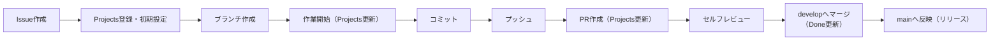

# Git運用手順書（標準フロー・完成版）

---

# 1. 全体フロー



---

# 2. 命名ルール

## ブランチ

{type}/{issue-number}-{summary}

### ルール

- 小文字
- kebab-case
- 動詞から始める
- 意味優先（単語数制限なし）

### 例

- feature/12-add-user-auth
- fix/45-fix-ranking-bug
- docs/78-update-readme

---

## PRタイトル

{type}: 日本語要約

### 例

- feat: ユーザー認証機能を追加
- fix: レコメンドランキングの不具合を修正
- docs: API仕様書を更新

---

## Commitメッセージ

{type}: 日本語要約（タイトルまたは本文に、ひらがな・カタカナ・漢字を最低1文字含める）

### 例

- feat: ユーザー認証のロジックを追加
- fix: レコメンドランキング計算の不具合を修正
- docs: API仕様書を更新

詳細ルールはリポジトリの `.cursor/rules/git_github.mdc`（コミットルール）に従う。

---

## type一覧

- feat : 機能追加
- fix : バグ修正
- docs : ドキュメント
- refactor : リファクタ
- test : テスト
- chore : 設定・CIなど

---

# 3. 手順詳細

---

## Step 1. Issue作成

### 目的

- 作業単位の固定
- 変更理由の明確化

### ルール

- 1 Issue = 1責務
- Issueテンプレート使用

---

## Step 2. Projects登録・初期設定（必須）

### 必ず実施

- IssueをProjectsに追加
- 以下を設定

| 項目          | 設定値              |
| ------------- | ------------------- |
| Phase         | 対応工程            |
| Priority      | High / Medium / Low |
| Status        | Backlog or Ready    |
| Planned Start | 任意                |
| Due Date      | 任意                |

---

## Step 3. ブランチ作成

```text
git checkout develop
git pull
git checkout -b {type}/{issue-number}-{summary}
```

---

## Step 4. 作業開始（Projects更新）

### 必ず実施

- Status → `Doing`
- Actual Start → 設定

---

## Step 5. 作業

- Cursorで実装 / docs修正
- docsと整合必須
- Sub-issue単位で作業する場合は分割

---

## Step 6. コミット

### ルール

- 1コミット = 1責務
- メッセージは日本語で簡潔に記述する（英語のみは不可）
- type必須

---

## Step 7. プッシュ

git push origin <branch>

---

## Step 8. PR作成

### ベース

- base: `develop`
- compare: 作業ブランチ

---

### 必須記載

```text
Issue

Fixes #12

種別

feat / fix / docs / refactor

目的

（なぜやるか）

変更内容

（何を変えたか）

影響範囲

（API / DB / Batch / UIなど）

docs更新

あり / なし

確認内容

（テスト・確認観点）

未対応

（あれば）

---

## Step 9. PR作成時のProjects更新

- Status → `Review`
```

---

## Step 10. セルフレビュー

### チェック項目

- docsと整合しているか
- 変更が1責務か
- commitが適切か
- 不要ファイルがないか

---

## Step 11. developへマージ

### 方法

- Squash Merge

---

### マージ後（必須）

- Status → `Done`
- Actual End → 設定

---

## Doneの定義

developにマージされた状態

---

## Step 12. mainへ反映（リリース）

### 方法

```text
git checkout main
git pull
git merge develop
git push origin main
```

または

- GitHubでPR（develop → main）

---

# 4. CI/CDルール

- PR作成時にテスト実行
- 成功しない限りマージ不可
- CIは必ずグリーンであること

---

# 5. ブランチ粒度ルール

- 原則：1 Issue = 1ブランチ
- Sub-issueがある場合は分割
- 大規模変更は分割推奨

---

# 6. 運用上の重要ポイント

## 状態遷移

```text
Backlog → Ready → Doing → Review → Done
```

---

## 原則

- Issueが起点
- Projectsが状態管理
- Gitは実行手段

---

# ■ 一言で本質

Git運用 = コード管理ではなく「IssueとProjectsの状態遷移管理」
