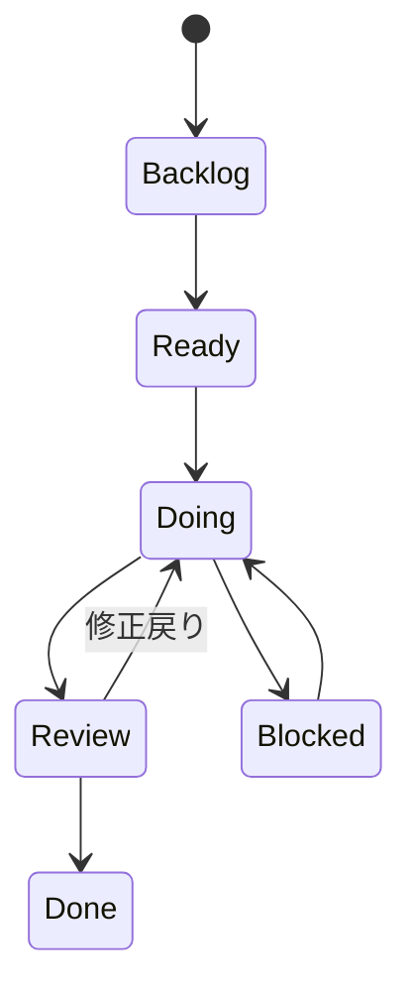

# Projects運用ルール

## Projects運用方針

- Projectsで進捗、課題管理を行う。
- スケジュールは、下記2つの粒度で管理する。
  - マスタスケジュール粒度
    - 開発工程（実装設計、開発、単体テスト、、、）の粒度で予実管理。
    - ツールはMilestoneを利用し、IssueにMilestoneを割り当てて各IssueをMilestoneでラップするイメージ。
  - WBS粒度
    - タスク（作業もしくはranking機能設計、ranking機能開発のような粒度）粒度で予実管理。
    - ツールはIssueをProjectsと紐づけて、Projects連携時にStart Date, Due Dateなどの予実管理用フィールドを設定するイメージ。
    - 成果物単位で予実管理したい場合は、Sub-issueを作成し、タスク（Issue）の子要素として管理する。

## Projcetsフィールド定義

| フィールド           | 概要                                               | 凡例                                       |
| -------------------- | -------------------------------------------------- | ------------------------------------------ |
| Title                | タスク名                                           | -                                          |
| Phase                | プロジェクト工程                                   | `docs\00_共通\プロジェクト工程定義.md`参照 |
| Priority             | 優先度                                             | High/Middle/low                            |
| Status               | 状況                                               | Backlog/Ready/Doing/Blocked/Review/Done    |
| Planned Start        | 予定開始日                                         | 2026/4/25                                  |
| Due Date             | 予定終了日                                         | 2026/4/26                                  |
| Actual Start         | 実績開始日                                         | 2026/4/25                                  |
| Actual End           | 実績終了日                                         | 2026/4/26                                  |
| Estimate             | 難易度・作業量目安 ※簡易的な工数見積もり       | XS/S/M/L/XL                                |
| Milestone            | マイルストーン ※マスタスケジュールの矢羽根期日 | 2026/5/21                                  |
| Linked pull requests | リンクされたPR                                     | -                                          |
| Area                 | 対象領域                                           | web/api/reco/batch/docs                    |
| Assignees            | 担当者                                             | -                                          |

---

### Status定義

| Status  | 説明                           |
| ------- | ------------------------------ |
| Backlog | 未整理・未着手の状態           |
| Ready   | 着手可能な状態                 |
| Doing   | 作業中                         |
| Blocked | 外部依存などにより作業停止     |
| Review  | レビュー・確認中               |
| Done    | 完了（完了条件を満たした状態） |

---

### Status状態遷移

