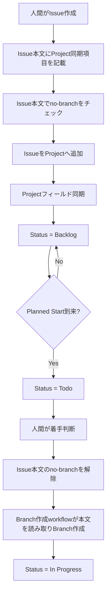
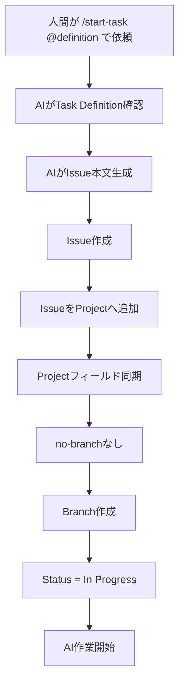

# Issue運用ルール

## 1. 目的

本ドキュメントは、Gift Recommendation Service におけるGitHub Issueの運用ルールを定義する。

Issueは、すべての作業の起点であり、作業計画の正本として扱う。
Issueには、作業目的、背景、作業範囲、参照資料、完了条件、確認観点を記録する。

進捗・予定・実績はProjectsで管理し、実作業はBranch、レビューはPR、成果物はdocsで管理する。

---

## 2. 関連ドキュメントとの責務分担

Issue運用に関連する正本は以下とする。

| 項目                                        | 正本ドキュメント                             |
| ------------------------------------------- | -------------------------------------------- |
| Issue種別、Issueタイトル、Issue本文、ラベル | 本ドキュメント                               |
| ProjectsのStatus、Phase、予定・実績管理     | Projects運用ルール                           |
| Branch命名、Branch base、PR target          | ブランチ運用ルール                           |
| GitHub Actions workflow仕様                 | 各GitHub Actionsワークフロー仕様書           |
| AI作業依頼条件                              | Task Definition設計書                        |
| Issueテンプレートの実装                     | `.github/ISSUE_TEMPLATE/` 配下のテンプレート |

本ドキュメントでは、ProjectsのStatus定義やBranch baseの詳細は重複定義しない。
必要な場合は、Projects運用ルールおよびブランチ運用ルールを参照する。

---

## 3. Issue運用の基本方針

本プロジェクトでは、リポジトリ運用の起点をIssueとする。

```text
Issue = 作業計画
Projects = 進捗・予定・実績管理
Branch = 作業実体
PR = レビュー正本
docs = 成果物正本
```

基本原則は以下とする。

| 原則                              | 内容                                                                          |
| --------------------------------- | ----------------------------------------------------------------------------- |
| すべての作業はIssue起点           | 作業前にIssueを作成する                                                       |
| 1 Issue = 1 Projects Task = 1 Branch = 1 PR（Task Issue） | Task Issueについて、1つのIssueに複数責務を混在させない。作業実体とレビュー単位を明確にする |
| 状態管理はProjectsで行う          | Status、Planned Start、Due Date、Actual Start、Actual EndはProjectsで管理する |
| レビューはPRで行う                | レビュー観点、レビュー結果、修正履歴はPRに残す                                |
| 成果物はdocsを正本とする          | 設計書・仕様書・テスト結果などはdocsに配置する                                |

---

## 4. Issue階層

Issueは、以下の2階層で管理する。

| 種別       | 役割                                                                 |
| ---------- | -------------------------------------------------------------------- |
| Epic Issue | **成果物識別子単位**（原則）または ID 未整備領域の機能・領域単位（例外）の親Issue |
| Task Issue | 実作業単位の子Issue                                                  |

### 4.1 Epic Issue

Epic Issueは、複数Task Issueを束ねる親Issueである。

Epic の粒度は、**成果物識別子単位を原則**とする。識別子の正本一覧（API一覧の `API-PUB-*` / `API-INT-*`、画面一覧の `SCR-*`、バッチ処理一覧の `BATCH-*`、モジュール一覧 / Recoモジュール一覧の `MOD-API-*` / `MOD-RECO-*` / `MOD-BATCH-*`）に対応する Epic を 1 つずつ作成する。

| 粒度区分 | 適用対象 | Epic タイトル例 |
| -------- | -------- | --------------- |
| 識別子単位（原則） | API-PUB / API-INT / SCR / BATCH / MOD-API / MOD-RECO / MOD-BATCH | `[Epic]API-PUB-002:レコメンド実行` / `[Epic]MOD-RECO-001:Recommendation Orchestrator` |
| 機能・領域単位（例外） | ID 体系未整備の DevOps / 横断運用領域 | `[Epic]GitHub Projects自動化` / `[Epic]OpenAPI / Orval導入` |

Epic Issueは、配下Taskの作業計画、依存関係、統合状況、および**配下 Task が触ってよいファイル境界**（Epic Definition の `epic_scope.allowed_paths`、[成果物一覧×Task Definition化方針書](../AIエージェント運用/成果物一覧×Task%20Definition化方針書.md) §3.5）を管理する。

Epic 境界を超えるファイル変更（例: API Epic 配下 Task が `apps/reco/**` のモジュール実装を編集する）は、別 `MOD-*` Epic（例: `MOD-RECO-001`）配下の Task として切り出す。

#### 4.1.1 Projects Phase / Milestone（識別子単位 Epic）

識別子単位 Epic は、`06_実装設計` の仕様書成果物と `07_開発・単体テスト` の実装・単体テスト成果物を**一気通貫で束ねる**コンテナである。GitHub Projects の `Phase` は 1 Issue あたり 1 値のため、Epic と子 Task で `Phase` の意味を分ける（[Projects運用ルール](./Projects運用ルール.md) §6.1 を正本とする）。

| 項目 | 識別子単位 Epic | 子 Task Issue |
| ---- | --------------- | ------------- |
| Phase の意味 | Epic 完了ゲート（原則 `07_開発・単体テスト`） | 主成果物の工程（仕様書 Task → `06_実装設計`、実装・UT Task → `07_開発・単体テスト`） |
| Milestone | 完了ゲートに整合（原則 `開発・単体テスト工程完了`） | 成果物工程に整合 |
| docs 配置 | Epic 本文で対象工程（06 / 07）を明示。配置正本は各 Task の成果物工程に従う | Task Definition の `output` / `project.fields.phase` に従う |

Epic Definition（`/start-epic`）では `project.fields.phase` を原則 `07_開発・単体テスト` とする。機能・領域単位 Epic（例外）は Epic Definition で個別に指定し、Issue 本文に理由を明記する。

---

### 4.2 Task Issue

Task Issueは、実際の作業単位である。

以下は**識別子なし・説明用の用途例**である。識別子付き成果物 Task の標準形式は §5.3 を正とする。

用途例：

- Recommendation API 実装設計（DevOps / 横断運用）
- Recommendation API 開発・単体テスト（DevOps / 横断運用）
- `[Task]SCR-002:レコメンド条件入力画面仕様書作成`（識別子付き成果物の例。詳細は §5.3）
- Issue作成時Project同期workflow実装（DevOps / 横断運用）

Task Issueは、原則としていずれかのEpic Issueに紐づける。

---

## 5. Issueタイトル命名規則

Issueタイトルは以下の形式に統一する。`[Epic]` / `[Task]` の直後に**半角スペースを入れない**。

```
[Epic]<概要>
[Task]<概要>
```

### 5.1 Epic Issue

Epic タイトルは、**成果物識別子単位を原則**とする（§4.1）。識別子付き Epic は **`[Epic]{識別子}:{概要}`** の形式で、Task と同じく**半角コロン `:`** で区切り、コロン前後・`[Epic]` 直後にスペースを入れない。

```
[Epic]<識別子>:<概要>         （原則）
[Epic]<機能名・領域名・工程名>（例外: ID 未整備領域のみ）
```

例（原則: 識別子単位）：

```
[Epic]API-PUB-002:レコメンド実行
[Epic]API-INT-002:Reco推薦実行
[Epic]SCR-002:レコメンド条件入力画面
[Epic]BATCH-003:楽天商品疑似差分取得バッチ
[Epic]MOD-RECO-001:Recommendation Orchestrator
```

例（例外: ID 未整備領域）：

```
[Epic]GitHub Projects自動化
[Epic]OpenAPI / Orval導入
```

- 識別子の正本: API一覧の `API-PUB-*` / `API-INT-*`、画面一覧の `SCR-*`、バッチ処理一覧の `BATCH-*`、モジュール一覧 / Recoモジュール一覧の `MOD-API-*` / `MOD-RECO-*` / `MOD-BATCH-*`。
- 識別子付き Epic の命名・成果物配置・Branch 命名は [Task Definition設計書](../AIエージェント運用/Task%20Definition設計書.md) §15.0（Epic タイトル規約）および §15.2〜§15.4 を正とする。
- 例外形式を選ぶ場合は、Epic 本文に「ID 体系未整備のため機能・領域単位を採用」旨を明記する。

---

### 5.2 Task Issue

**識別子付き成果物 Task**（API / 画面 / バッチ等）は §5.3 を正とする。本節は **DevOps・横断運用など識別子なし Task** の形式例である。

```
[Task]<作業内容>
```

例（識別子なし Task）：

```
[Task]Recommendation API 実装設計
[Task]Recommendation API 開発・単体テスト
[Task]Issue作成時Project同期workflow仕様書作成
```

識別子付き成果物の例は §5.3 を参照する（例: `[Task]SCR-002:レコメンド条件入力画面仕様書作成`）。

---

### 5.3 モジュール識別子付き Task（半角コロン区切り）

API-ID・画面ID・Epicキー等の**識別子**を Issue タイトルに含める Task では、識別子と概要を**半角コロン `:`** で区切る。コロン前後にスペースを入れない。全角コロン `：` は使用しない。`[Task]` の直後にも半角スペースを入れない。

```
[Task]<識別子>:<概要>
```

例：

```
[Task]API-INT-002:Reco推薦実行API仕様書作成
[Task]API-PUB-002:レコメンド実行API仕様書作成
[Task]SCR-002:レコメンド条件入力画面仕様書作成
[Task]BATCH-003:楽天商品疑似差分取得バッチ仕様書作成
```

- Task Definition の `task.title` には `[Task]` プレフィックスを含めず、`API-INT-002:Reco推薦実行API仕様書作成` のように記載する。Issueタイトルは `[Task]` + `task.title`（連結、半角スペースなし）。
- 成果物ファイル名・Branch 名の共通規則は Task Definition設計書 §15.1 を正とする（Issueタイトルは `:`、ファイルは `_`、Branch は kebab-case）。
- 種別ごとの識別子・ファイルパス・調査例は Task Definition設計書 §15.2（API）、§15.3（画面）、§15.4（バッチ）を正とする。
- 調査例（API）: `rg -F '[Task]API-INT-002:'` / `gh issue list --search 'API-INT-002: in:title'`
- 調査例（画面）: `rg -F '[Task]SCR-002:'` / `gh issue list --search 'SCR-002: in:title'`
- 調査例（バッチ）: `rg -F '[Task]BATCH-003:'` / `gh issue list --search 'BATCH-003: in:title'`

---

## 6. Issue作成方式

Issue作成方式は以下の2種類とする。

| 作成方式         | 主な利用工程                   | 作成者 | 特徴                                                                    |
| ---------------- | ------------------------------ | ------ | ----------------------------------------------------------------------- |
| 人主導タスク運用 | 事業構想〜アプリケーション設計 | 人間   | 未来着手予定Issueも作成する。原則no-branchあり                          |
| AI主導タスク運用 | 実装設計〜テスト               | AI     | Task Definitionを入力にIssue作成からPR作成まで進める。原則no-branchなし |

---

## 7. 人主導タスク運用

人主導タスク運用は、主に以下の工程で利用する。

- 事業構想
- ドメイン探索
- ドメイン要件定義
- ドメインモデル設計
- アプリケーション設計

ただし、実装設計以降でも、人間が先に予定タスクを起票したい場合は人主導タスク運用を利用してよい。

### 7.1 初期設定

| 項目          | 値                           |
| ------------- | ---------------------------- |
| 作業主体      | human-led                    |
| no-branch     | 原則、Issue本文でチェック    |
| Planned Start | 人間が設定                   |
| Due Date      | 人間が設定                   |
| 初期Status    | 原則Backlog                  |
| Branch作成    | 本文のno-branch解除後        |
| レビュー      | 原則AI Review → Human Review |

### 7.2 運用フロー



---

## 8. AI主導タスク運用

AI主導タスク運用は、主に以下の工程で利用する。

- 実装設計
- 開発・単体テスト
- モジュール結合テスト
- コンポーネント結合テスト
- システムテスト
- 非機能テスト
- レコメンド品質評価テスト
- 受入テスト
- リリース準備
- GitHub Actions実装
- CI/CD関連実装
- レビュー指摘対応

### 8.1 初期設定

| 項目          | 値                               |
| ------------- | -------------------------------- |
| 作業主体      | ai-agent                         |
| no-branch     | 原則なし                         |
| Planned Start | Issue作成日                      |
| Due Date      | Issue作成日 + 2日                |
| 初期Status    | Todo → Branch作成後にIn Progress |
| Branch作成    | Issue作成時                      |
| レビュー      | AI Review → Human Review         |

### 8.2 運用フロー



---

## 9. Issue本文記載方針

Issue本文は、以下の2つの役割を持つ。

| 役割           | 内容                                                               |
| -------------- | ------------------------------------------------------------------ |
| 作業計画の正本 | 目的、背景、作業範囲、成果物、完了条件、確認観点を記載する         |
| 自動同期の入力 | Project、Label、Milestone、no-branch、Branch作成条件の同期元とする |

Projectsの各フィールドは、同期後はProjectsを正本とする。

ただし、Issue作成時の同期入力として、Issue本文にも必要項目を記載する。

Issue本文のうち、workflowが機械的に参照する同期入力ブロックを本運用では **Issue運用メタデータ** と呼ぶ。  
Issue運用メタデータは `###` 見出し単位（例: `### 作業単位`）で記述し、人主導テンプレートとAI作成Issueで同じ構造を使う。

---

## 10. Issue本文に含める項目

Issue本文には、原則として以下を含める。

| 区分          | 項目              | 用途                              |
| ------------- | ----------------- | --------------------------------- |
| 基本情報      | Issue種別         | Epic / Task                       |
| 基本情報      | 作業主体          | human-led / ai-agent              |
| 基本情報      | 親Epic            | Task Issueの親を明示する          |
| Project同期   | Phase             | Projects Phaseへ同期              |
| Project同期   | Priority          | Projects Priorityへ同期           |
| Project同期   | Area              | Projects Areaへ同期               |
| Project同期   | Planned Start     | Projects Planned Startへ同期      |
| Project同期   | Due Date          | Projects Due Dateへ同期           |
| Milestone同期 | Milestone         | GitHub Milestoneへ同期            |
| Branch制御    | no-branch         | Branch作成抑止を制御              |
| Branch制御    | Branch summary    | Branch名末尾に利用                |
| 作業内容      | 目的              | なぜ実施するか                    |
| 作業内容      | 背景              | 判断経緯・前提                    |
| 作業内容      | 作業範囲          | 対象範囲                          |
| 作業内容      | 対象外            | 今回やらないこと                  |
| 作業内容      | 参照docs          | 作業前に参照すべき正本docs        |
| 作業内容      | 成果物            | 作成・変更するdocs / code / tests |
| 作業内容      | 完了条件          | Doneと判断する条件                |
| 作業内容      | 確認観点          | レビュー・自己確認観点            |
| AI運用        | operation_logging | AIログ作成レベル（Task Definition では `operation_logging.level`） |
| AI運用        | 補足指示          | AI作業時の制約・注意点            |

---

## 10.1 初回同期と継続同期の分離

Issue運用メタデータに基づく同期は、以下の方針で運用する。

| 区分 | トリガー | Status | 補足 |
| ---- | -------- | ------ | ---- |
| 初回同期 | `issues.opened` | 初期Statusを同期してよい | `ai-agent` では原則 `no-branch: false` のため、同一runでBranch作成後に `In Progress` へ遷移してよい |
| 継続同期 | `issues.edited` | 同期対象外 | `Phase` / `Priority` / `Area` / `Planned Start` / `Due Date`、Label、Milestone、親子のみ更新する |

`issues.edited` では `Status` / `Actual Start` / `Actual End` を更新しない。

---

## 11. Issueフィールド運用

| フィールド    | 利用方針                                              |
| ------------- | ----------------------------------------------------- |
| Assignees     | 担当者またはAI担当を設定する。MVPでは未設定でもよい   |
| Labels        | Issue分類、Branch作成、workflow制御に利用する         |
| Projects      | すべてのIssueをProjectsに追加する                     |
| Milestone     | 工程完了単位の管理に利用する                          |
| Relationships | Epic / Task の親子関係、関連Issue、依存関係に利用する |
| Development   | Branch / PRとの紐づけに利用する                       |

---

## 12. ラベル運用

Issueラベルは、Issueの分類、workflow制御、フィルタリングに利用する。

ラベル名は、スペースありの形式に統一する。

```
<分類>: <値>
```

例：

```
unit: task
type: docs
area: api
priority: high
```

---

## 13. 必須ラベル

Issueには、原則として以下のラベルを付与する。

| 分類     | 必須 | 個数    | 例                                  |
| -------- | ---- | ------- | ----------------------------------- |
| unit     | 必須 | 1つ     | `unit: epic`, `unit: task`          |
| type     | 必須 | 1つ     | `type: docs`, `type: feature`       |
| area     | 必須 | 1つ以上 | `area: api`, `area: docs`           |
| priority | 必須 | 1つ     | `priority: low`, `priority: medium`, `priority: high`, `priority: critical` |

---

## 14. ラベル定義

## 14.1 作業単位

```
unit: epic
unit: task
```

| ラベル     | 意味       |
| ---------- | ---------- |
| unit: epic | Epic Issue |
| unit: task | Task Issue |

---

## 14.2 作業種別

```
type: feature
type: fix
type: docs
type: refactor
type: chore
type: test
type: hotfix
type: spike
```

| ラベル         | 意味                   |
| -------------- | ---------------------- |
| type: feature  | 機能追加               |
| type: fix      | 不具合修正             |
| type: docs     | ドキュメント作成・修正 |
| type: refactor | リファクタリング       |
| type: chore    | 設定・CI・雑務         |
| type: test     | テスト追加・修正       |
| type: hotfix   | 緊急修正               |
| type: spike    | 調査・検証             |

---

## 14.3 対象領域

```
area: web
area: api
area: reco
area: batch
area: db
area: docs
area: infra
area: project
```

| ラベル        | 意味                                   |
| ------------- | -------------------------------------- |
| area: web     | Web / Next.js / UI                     |
| area: api     | API / Express                          |
| area: reco    | Recommendation / FastAPI               |
| area: batch   | Batch / ETL                            |
| area: db      | Database / schema / migration          |
| area: docs    | 設計書・ドキュメント                   |
| area: infra   | CI/CD / hosting / env / infrastructure |
| area: project | Issue / Projects / GitHub運用          |

---

## 14.4 優先度

```
priority: critical
priority: high
priority: medium
priority: low
```

| ラベル             | 意味     |
| ------------------ | -------- |
| priority: critical | 最優先   |
| priority: high     | 高       |
| priority: medium   | 中       |
| priority: low      | 低       |

---

## 15. no-branch運用

`no-branch` は、Branch作成を抑止するための制御である。

### 15.1 正本（Issue本文のみ）

| 対象                         | 役割                                       |
| ---------------------------- | ------------------------------------------ |
| Issue本文のno-branchチェック | **唯一の正本**（Branch作成抑止の判定入力） |
| GitHub Label `no-branch`     | **定義しない・付与しない**                 |

`no-branch` を Issue 本文と Label の二系統で管理しない。同期漏れや workflow トリガー分岐の複雑化を避けるため、Label による `no-branch` 運用は行わない。

流れは以下とする。

```text
Issue本文の no-branch チェック
  ↓
Branch作成 workflow が Issue 本文を読み取り Branch 作成要否を判定
```

[Issue同期とブランチ作成ワークフロー](../../06_実装設計/github_actions/Issue同期とブランチ作成ワークフロー.md) および `.github/workflows/` の実装は、本節の正本に合わせる。現行ファイルが旧 Label 運用の場合は後続タスクで更新する。

Task Definition の `branch.no_branch` は、Issue 本文の no-branch チェックを生成する際の設計入力である（[Task Definition設計書](../AIエージェント運用/Task%20Definition設計書.md) §17）。

---

## 15.2 人主導タスク

人主導タスクでは、Issue作成時に原則として Issue 本文の `no-branch` を**チェックする**。

理由は、未来着手予定Issueを先に作成し、着手タイミングまでBranch作成を遅延させるためである。

着手する場合は、Issue本文の `no-branch` を**解除する**。解除後、Branch作成 workflow が本文を読み取り Branch 作成対象とする。

---

## 15.3 AI主導タスク

AI主導タスクでは、Issue作成時に原則として Issue 本文の `no-branch` を**チェックしない**。

理由は、Issue作成後にAIが即時着手し、Branch作成まで進めるためである。

---

## 16. Projects同期

Issue作成時には、GitHub Actionsまたはscriptにより、IssueをProjectsへ明示的に追加する。

GitHub側のProject自動追加設定には依存しない。

同期対象は **Projects フィールド** と **GitHub Issue メタデータ** に分ける。Projects 上に Labels フィールドは定義しない（[Projects運用ルール](./Projects運用ルール.md) §5 参照）。`no-branch` は Projects 同期対象ではなく、§15 の Issue 本文チェックのみで扱う。

### 16.1 Projectフィールド同期

Issue 本文から以下を **Projects（ProjectV2）** へ同期する。同期後の正本は Projects とする。

| 同期対象      | 同期先                 |
| ------------- | ---------------------- |
| Phase         | Projects Phase         |
| Priority      | Projects Priority      |
| Area          | Projects Area          |
| Planned Start | Projects Planned Start |
| Due Date      | Projects Due Date      |

`Status` は初回同期（`issues.opened`）のみに同期し、継続同期（`issues.edited`）では更新しない。  
`Actual Start` / `Actual End` は Issue 本文編集では同期せず、Projects運用ルールで定義されたイベント（Branch作成、作業開始、PR merge / Issue close 等）で更新する。

Priority / Area は、Issue Label の `priority:*` / `area:*` と値を揃える運用とするが、**同期先は Projects フィールド**である（Label への付与は §16.2）。

### 16.2 Issueメタデータ同期

Issue 本文から以下を **GitHub Issue** へ同期する（Projects フィールドではない）。

| 同期対象                              | 同期先               | 内容                                                               |
| ------------------------------------- | -------------------- | ------------------------------------------------------------------ |
| unit / type / area / priority（本文） | GitHub Labels        | workflow が `unit:*` / `type:*` / `area:*` / `priority:*` 等へ付与 |
| Milestone                             | GitHub Milestone     | 本文の工程と一致するオープン Milestone へ紐づけ                    |
| Parent / Sub-issue                    | GitHub Relationships | 親 Issue 欄の `#番号` から Sub-issue を登録                          |

主な workflow 仕様書: [Issue同期とブランチ作成ワークフロー](../../06_実装設計/github_actions/Issue同期とブランチ作成ワークフロー.md)

---

## 17. IssueとBranchの関係

IssueとBranchの関係は、ブランチ運用ルールを正本とする。

基本方針は以下である。

```
1 Task Issue = 1 Branch
```

Branch名は以下の形式で作成する。

```
<type>/<unit>-<issue番号>-<english-summary>
```

例：

```
docs/task-111-recommendation-api-design
```

Task Branchは、親Epic Branchから作成する。

---

## 18. IssueとPRの関係

PRは必ずIssueに紐づける。

PR本文の Issue 参照キーワードは、[Task Definition設計書](../AIエージェント運用/Task%20Definition設計書.md) §22・§39 および `prompts/templates/pr/task-pr.md` を正本とする。

| 対象       | PR本文のIssue参照（原則）               | Issue close / Done の制御                          |
| ---------- | --------------------------------------- | -------------------------------------------------- |
| Task PR    | `Related to #<Task Issue番号>`          | PR merge 時 workflow で制御（`Closes` に依存しない） |
| Epic PR    | 必要に応じて `Closes #<Epic Issue番号>` | Epic PR merge 時 workflow または GitHub 自動 close |
| 追加修正PR | 対象 Issue に `Related to` または関連欄 | 対象 Issue の種別に従う                            |

Task PR では、原則として `Closes #<Task Issue番号>` を使用しない。

Task Issueの完了は、原則として紐づく Task PR の merge により判断する。

---

## 19. レビュー運用

人主導・AI主導にかかわらず、PR作成後は原則としてAI Reviewを経由する。

標準的なレビュー遷移は以下とする。

```
In Progress
  ↓ PR作成
AI Review
  ↓ AIレビューOK
Human Review
  ↓ 人間レビューOK / merge
Done
```

レビュー状態の正本はProjects運用ルールとする。

---

## 20. AIレビュー・人間レビュー指摘への対応

AIレビューまたは人間レビューで修正指摘がある場合は、同一Issue・同一Branchで対応する。

ただし、以下の場合は新しいIssueを作成する。

- 指摘内容が当初Issueの作業範囲を超える
- 別成果物として管理すべき
- 別Epic / 別Taskとして分割すべき
- 横断影響が大きい
- 人間判断が必要な追加要件である

---

## 21. Issue Closeルール

Issueは、以下の条件を満たした場合にCloseする。

| 条件                   | 内容                                |
| ---------------------- | ----------------------------------- |
| 成果物が作成・更新済み | docs / code / tests などが反映済み  |
| 完了条件を満たしている | Issue本文の完了条件を満たす         |
| PRがmerge済み          | 原則としてPR merge済み              |
| レビュー完了済み       | AI Review / Human Review が完了済み |
| Projects StatusがDone  | Projects上の状態がDone              |

Issue Close後、ProjectsのActual Endが未設定の場合は、workflowまたは手動で設定する。

---

## 22. Issueテンプレート運用

Issueテンプレートは、Issue種別ごとに独立して管理する。

GitHub UIから人間がIssueを作成するためのテンプレートは、以下を正とする。

| Issue種別 | テンプレート |
| --------- | ------------ |
| Epic Issue | `.github/ISSUE_TEMPLATE/epic.yml` |
| Task Issue | `.github/ISSUE_TEMPLATE/task.yml` |
| Contract Task Issue | `.github/ISSUE_TEMPLATE/contract-task.yml` |

配置先は以下とする。

```
.github/ISSUE_TEMPLATE/
```

各テンプレートは、Issue本文から以下を機械的に読み取れる構造にする。

- Issue種別
- 作業主体
- Phase
- Priority
- Area
- Planned Start
- Due Date
- Milestone
- no-branch
- type
- unit
- Branch summary
- 親Epic
- 作業範囲
- 参照docs
- 成果物
- 完了条件
- 確認観点
- operation_logging

AI AgentがIssue本文を生成するためのPrompt Templateは、以下を正とする。

| Issue種別 | Prompt Template |
| --------- | --------------- |
| Epic Issue | `prompts/templates/issue/epic-issue.md` |
| Task Issue | `prompts/templates/issue/task-issue.md` |
| Contract Task Issue | `prompts/templates/issue/contract-task-issue.md` |

---

## 23. AI作成Issue

AI主導タスクでは、AIがTask Definitionを入力としてIssue本文を生成する。

AIがIssueを作成する場合も、人間がテンプレートから作成する場合と同じIssue本文構造に従う。

AI作成Issueでは、以下を原則とする。

| 項目              | 値                      |
| ----------------- | ----------------------- |
| 作業主体          | ai-agent                |
| no-branch         | なし                    |
| Planned Start     | Issue作成日             |
| Due Date          | Issue作成日 + 2日       |
| Branch summary    | Task Definitionから生成 |
| 親Epic            | Task Definitionで指定   |
| operation_logging | Task Definition の `operation_logging.level` で指定 |

---

## 24. 人間作成Issue

人主導タスクでは、人間がIssueテンプレートを利用してIssueを作成する。

人間作成Issueでは、以下を原則とする。

| 項目              | 値               |
| ----------------- | ---------------- |
| 作業主体          | human-led        |
| no-branch         | あり             |
| Planned Start     | 人間が設定       |
| Due Date          | 人間が設定       |
| Branch summary    | 人間が設定       |
| 親Epic            | 人間が設定       |
| operation_logging | 必要に応じて設定 |

---

## 25. 禁止事項

以下は禁止する。

- Issueなしで作業を開始すること
- 1つのIssueに複数責務を混在させること
- Task Issueを親Epicなしで乱立させること
- Issueタイトル形式を `[Epic]` / `[Task]` 以外にすること
- ラベル名でスペースあり・なしを混在させること
- `unit` / `type` / `area` / 作業主体ラベルを未設定にすること
- 人主導の未来着手Issueをno-branchなしで作成すること
- AI主導Issueをno-branchありのまま作成すること
- Issue本文にProject同期項目を記載せず、Project同期不能なIssueを作成すること
- IssueをProjectに手動追加する運用を正とすること
- GitHub側のProject自動追加設定に依存すること
- Issueを再オープンして作業を戻すこと（修正が必要な場合は新しいTask Issueを作成する）
- PRをIssueに紐づけずに作成すること
- Slack通知だけで作業記録を完結させること
- Issueに残すべき作業計画をPRやSlackのみに記録すること

---

## 26. ロールアウト方針（Issue運用メタデータ）

Issue運用メタデータ（`###` 見出し形式）への統一は、以下の範囲で実施する。

| 対象 | 方針 |
| ---- | ---- |
| 新規Issue | 本ルールを適用する |
| 既存Issue（通常） | 非移行とし、既存運用のまま扱う |
| Issue #259 | 削除して最新形式で再作成する |

既存Issueを一括移行しない。必要な個別Issueのみ、人間判断で再作成または更新する。

---

## 27. 関連ドキュメント

| ドキュメント                                       | 役割                                             |
| -------------------------------------------------- | ------------------------------------------------ |
| Projects運用ルール                                 | Status、Phase、予定・実績管理、Project同期結果を定義 |
| ブランチ運用ルール                                 | Branch命名、Branch base、PR targetを定義         |
| Git運用ルール                                      | merge方針、保護ブランチ方針を定義                |
| Task Definition設計書                              | AI作業依頼条件を定義                             |
| Issueテンプレート設計書                            | Issueテンプレート構造を定義                      |
| Issue作成時Projectフィールド同期ワークフロー仕様書 | Project追加・Project同期を定義                   |
| Issue同期とブランチ作成ワークフロー仕様書          | Label同期、no-branch制御、Branch作成を定義       |
| PR作成時Status更新ワークフロー仕様書               | PR作成時のAI Review更新を定義                    |
| PRレビュー完了時Status更新ワークフロー仕様書       | AI/Humanレビュー完了時のStatus更新（双方向）を定義 |
| PR merge時Status更新ワークフロー仕様書             | merge後のDone更新を定義                          |
| ディレクトリ構成定義書                             | Issueテンプレート、workflow、scriptsの配置を定義 |

---

## 28. 一言まとめ

Issueは、すべての作業の起点であり、作業計画の正本である。

```
Issue = 作業計画
Projects = 進捗・予定・実績管理
Branch = 作業実体
PR = レビュー正本
docs = 成果物正本
```

Issueタイトルは以下に統一する（`[Epic]` / `[Task]` 直後に半角スペースなし）。

```
[Epic]<概要>
[Task]<概要>
```

ラベルはスペースあり形式に統一する。

```
unit: task
type: docs
area: api
```

Issue本文は、作業計画の正本であると同時に、Project同期・Label同期・Branch作成制御の入力として利用する。

人主導タスクでは、原則として `no-branch` を付与して未来着手予定Issueを作成する。

AI主導タスクでは、原則として `no-branch` を付与せず、Issue作成後にBranch作成まで進める。
