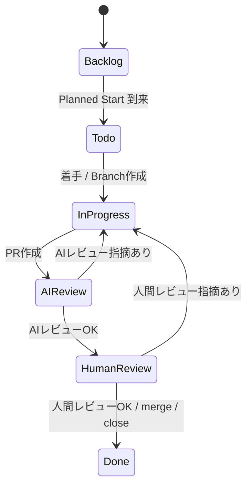

# Projects運用ルール

## 1. 目的

本ドキュメントは、Gift Recommendation Service における GitHub Projects の運用ルールを定義する。

Projects は、Issue を主アイテムとして、タスクの進捗、予定、実績、優先度、対象領域、マイルストーンを管理するために利用する。

本ドキュメントでは、以下を定義する。

- Projectsのフィールド定義
- Phaseの正式値
- Statusの正式値と状態遷移
- Planned Start / Due Date / Actual Start / Actual End の運用
- 作業主体別のProjectsフィールド初期値
- Project追加・Projectフィールド同期方針
- GitHub ActionsによるStatus・日付関連の自動化方針

Issue種別、Issue本文、ラベル、no-branch、Branch命名、Issueテンプレートは [Issue運用ルール](./Issue運用ルール.md) および [ブランチ運用ルール](./ブランチ運用ルール.md) を正本とし、本ドキュメントでは重複定義しない。

---

## 2. 関連ドキュメントとの責務分担

Projects運用に関連する正本は以下とする。

| 項目                                                 | 正本ドキュメント                                                             |
| ---------------------------------------------------- | ---------------------------------------------------------------------------- |
| Projects Status / Phase / Priority / Area / 予定・実績 | 本ドキュメント                                                               |
| Issue種別、Issueタイトル、Issue本文、ラベル、テンプレート | [Issue運用ルール](./Issue運用ルール.md)                                      |
| no-branch（入力・方針）                              | [Issue運用ルール](./Issue運用ルール.md) §15                                  |
| Branch命名、Branch base、PR target、no-branch実行    | [ブランチ運用ルール](./ブランチ運用ルール.md)                                |
| PR本文の Issue 参照キーワード                        | [Task Definition設計書](../AIエージェント運用/Task%20Definition設計書.md) §22・§39、`prompts/templates/pr/task-pr.md` |
| GitHub Actions workflow仕様（Projects同期・Status更新） | 各GitHub Actionsワークフロー仕様書                                           |

本ドキュメントでは、Issueタイトル形式、Branch命名、ラベル定義、no-branchの詳細は重複定義しない。必要な場合は、上記正本ドキュメントを参照する。

---

## 3. Projects運用方針

Projectsでは、以下の2つの粒度でスケジュール・進捗を管理する。

| 粒度                   | 管理対象                  | 利用するGitHub機能 |
| ---------------------- | ------------------------- | ------------------ |
| マスタスケジュール粒度 | 工程単位の予実管理        | Milestone          |
| WBS粒度                | Issue単位のタスク予実管理 | GitHub Projects    |

### 3.1 マスタスケジュール粒度

マスタスケジュール粒度では、プロジェクト工程単位で予定・実績を管理する。

GitHub上では、各IssueにMilestoneを設定し、工程単位の大枠スケジュールを管理する。

### 3.2 WBS粒度

WBS粒度では、IssueをProjectsに追加し、以下を管理する。

- Phase
- Priority
- Status
- Planned Start
- Due Date
- Actual Start
- Actual End
- Area
- Assignees
- Linked pull requests

Epic / Task の親子関係や Issue 階層の詳細は [Issue運用ルール](./Issue運用ルール.md) §4 を参照する。

---

## 4. 正本関係

Projects運用における正本関係は以下とする。

| 対象     | 役割                                |
| -------- | ----------------------------------- |
| Issue    | 作業計画の正本                      |
| Projects | 進捗・予定・実績管理の正本          |
| Branch   | 作業実体                            |
| PR       | レビュー正本                        |
| docs     | 成果物正本                          |
| ai-logs  | Issue化前・例外・横断影響・実験ログ |
| Slack    | 通知・サマリ                        |

Projectsのフィールド（Status、Phase、Priority、Area、Planned Start、Due Date、Actual Start、Actual End）は、進捗・予定・実績管理の正本である。

Issue本文は、Project追加・Projectフィールド同期の入力情報として利用する。同期入力項目の詳細は [Issue運用ルール](./Issue運用ルール.md) §9、§16 を参照する。

---

## 5. Projectsフィールド定義

| フィールド           | 概要               | 値・例                                                                                                                                                                                                                                                                                                                                                      |
| -------------------- | ------------------ | ----------------------------------------------------------------------------------------------------------------------------------------------------------------------------------------------------------------------------------------------------------------------------------------------------------------------------------------------------------- |
| Title                | タスク名           | Issueタイトル                                                                                                                                                                                                                                                                                                                                               |
| Phase                | プロジェクト工程   | `01_事業構想` / `02_ドメイン探索` / `03_ドメイン要件定義` / `04_ドメインモデル設計` / `05_アプリケーション設計` / `06_実装設計` / `07_開発・単体テスト` / `08_モジュール結合テスト` / `09_コンポーネント結合テスト` / `10_システムテスト` / `11_非機能テスト` / `12_レコメンド品質評価テスト` / `13_受入テスト` / `14_リリース`/ `15_運用・改善` / `90_PoC` |
| Priority             | 優先度             | high / medium / low / critical                                                                                                                                                                                                                                                                                                                              |
| Status               | 状況               | Backlog / Todo / In Progress / AI Review / Human Review / Done                                                                                                                                                                                                                                                                                              |
| Planned Start        | 予定開始日         | 2026/05/15                                                                                                                                                                                                                                                                                                                                                  |
| Due Date             | 予定終了日         | 2026/05/17                                                                                                                                                                                                                                                                                                                                                  |
| Actual Start         | 実績開始日         | 2026/05/15                                                                                                                                                                                                                                                                                                                                                  |
| Actual End           | 実績終了日         | 2026/05/17                                                                                                                                                                                                                                                                                                                                                  |
| Milestone            | マイルストーン     | 06\_実装設計工程完了                                                                                                                                                                                                                                                                                                                                        |
| Linked pull requests | リンクされたPR     | PR URL / PR番号                                                                                                                                                                                                                                                                                                                                             |
| Area                 | 対象領域           | web / api / reco / batch / db / docs / infra / project                                                                                                                                                                                                                                                                                                      |
| Assignees            | 担当者             | GitHub user                                                                                                                                                                                                                                                                                                                                                 |

---

## 6. Phase定義

Phaseは、Issueがどのプロジェクト工程に属するかを表す。

ProjectsのPhaseフィールドでは、以下の値を正式値として利用する。

| Phase                         | 対応docsディレクトリ                | 説明                                                                              |
| ----------------------------- | ----------------------------------- | --------------------------------------------------------------------------------- |
| `01_事業構想`                 | `docs/01_事業構想/`                 | 事業目的、提供価値、顧客課題、ビジネスモデル、MVP方針を定義する工程               |
| `02_ドメイン探索`             | `docs/02_ドメイン探索/`             | 業務領域、主要概念、業務ルール、関係者の言葉、ドメイン仮説を整理する工程          |
| `03_ドメイン要件定義`         | `docs/03_ドメイン要件定義/`         | ドメイン観点で実現すべき要件、リソース、正本、制約を定義する工程                  |
| `04_ドメインモデル設計`       | `docs/04_ドメインモデル設計/`       | ユビキタス言語、ドメイン概念、集約、状態遷移、論理データ構造を設計する工程        |
| `05_アプリケーション設計`     | `docs/05_アプリケーション設計/`     | システム構成、処理構成、機能、モジュール、API、画面、バッチ、外部IFを設計する工程 |
| `06_実装設計`                 | `docs/06_実装設計/`                 | 実装可能な粒度でAPI、画面、モジュール、DB、GitHub Actions、CI/CD等を設計する工程  |
| `07_開発・単体テスト`         | `docs/07_開発・単体テスト/`         | ソースコード、設定ファイル、ワークフロー等を実装し、単体テストを行う工程          |
| `08_モジュール結合テスト`     | `docs/08_モジュール結合テスト/`     | 同一コンポーネント内の複数モジュールを組み合わせて検証する工程                    |
| `09_コンポーネント結合テスト` | `docs/09_コンポーネント結合テスト/` | web / api / reco / batch / DB 等のコンポーネント間連携を検証する工程              |
| `10_システムテスト`           | `docs/10_システムテスト/`           | システム全体の業務フロー、E2E、主要ユースケースを検証する工程                     |
| `11_非機能テスト`             | `docs/11_非機能テスト/`             | 性能、セキュリティ、可用性、運用性、監視性などの非機能要件を検証する工程          |
| `12_レコメンド品質評価テスト` | `docs/12_レコメンド品質評価テスト/` | レコメンド結果の妥当性、説明理由、ランキング品質、意味空間の品質を評価する工程    |
| `13_受入テスト`               | `docs/13_受入テスト/`               | MVPとして受け入れ可能か、人間視点・業務視点で最終確認する工程                     |
| `14_リリース`                 | `docs/14_リリース/`                 | 本番反映、リリース手順、リリース判定、初期稼働確認を行う工程                      |
| `15_運用・改善`               | `docs/15_運用・改善/`               | 運用、障害対応、モニタリング、フィードバック、改善活動を管理する工程              |
| `90_PoC`                      | `docs/90_PoC`                       | 技術検証、外部API疎通検証、性能フィジビリティ等のPoCを行う工程（※補助工程）       |

`00_共通` は、原則としてProjectsのPhase値には設定しない。

`90_PoC` は、PoC Issue を管理する場合に Phase として設定してよい。成果物は `docs/90_PoC/` に配置し、Phase 値 `90_PoC` と対応させる。

---

## 7. Priority定義

| Priority | 説明                                                       |
| -------- | ---------------------------------------------------------- |
| critical | 最優先。即時対応が必要、または他作業を強くブロックする     |
| high     | 優先度が高い。直近の作業計画・依存関係に強く影響する       |
| medium   | 標準的な優先度。通常の計画に従って対応する                 |
| low      | 優先度が低い。後続対応または余裕があるタイミングで対応する |

---

## 8. Area定義

| Area    | 説明                                       |
| ------- | ------------------------------------------ |
| web     | Web / Next.js / UI領域                     |
| api     | API / Express / Backend API領域            |
| reco    | Recommendation / FastAPI 推薦処理領域      |
| batch   | Batch / ETL / 定期処理領域                 |
| db      | DB / schema / migration領域                |
| docs    | docs成果物・設計書領域                     |
| infra   | CI/CD / hosting / env / infrastructure領域 |
| project | Issue / Projects / GitHub運用領域          |

複数領域にまたがるIssueでは、複数Areaを設定してよい。

ただし、主作業領域が明確な場合は、主領域を優先して設定する。

---

## 9. Status定義

ProjectsのStatusフィールドの正式値は以下とする。

| Status       | 説明                                                              |
| ------------ | ----------------------------------------------------------------- |
| Backlog      | 未着手。Planned Startが未来日のタスク                             |
| Todo         | 着手可能。Planned Startが到来済みで、まだ作業開始していないタスク |
| In Progress  | 作業中。Branch作成済み、またはAI・人間が作業中のタスク            |
| AI Review    | AIレビュー待ち、またはAIレビュー中のタスク                        |
| Human Review | 人間レビュー待ち、または人間レビュー中のタスク                    |
| Done         | 完了。PR merge、Issue close、または作業完了済みのタスク           |

Status値は必ず上記表記に統一する。

特に、`In progress` ではなく **`In Progress`** を正式値とする。

---

## 10. Status状態遷移

### 10.1 標準状態遷移



Mermaid上の `InProgress` は図中の識別子であり、Projectsの正式なStatus値は `In Progress` とする。

### 10.2 Status更新トリガー

| タイミング                         | 更新後Status |
| ---------------------------------- | ------------ |
| 未来着手予定Issue作成              | Backlog      |
| Planned StartがJST当日以前になった | Todo         |
| Branch作成                         | In Progress  |
| PR作成                             | AI Review    |
| AIレビューOK                       | Human Review |
| AIレビュー指摘あり                 | In Progress  |
| 人間レビュー指摘あり               | In Progress  |
| PR merge / Issue close             | Done         |

---

## 11. Planned Start / Due Date運用

### 11.1 基本方針

Planned StartとDue Dateは、Issue単位の予定管理に利用する。

| フィールド    | 方針                                              |
| ------------- | ------------------------------------------------- |
| Planned Start | 原則すべてのIssueに設定する                       |
| Due Date      | 原則すべてのIssueに設定する                       |
| Actual Start  | Branch作成時または作業開始時に設定する            |
| Actual End    | PR merge、Issue close、またはDone更新時に設定する |

作業主体別の初期値と同期方針は §14 を参照する。

### 11.2 人主導タスクの日付設定

人主導タスクでは、人間がIssue作成時にPlanned Start / Due Dateを設定する。

未来着手予定のIssueも事前に作成してよい。

その場合、StatusはBacklogとし、Planned Start到来時にTodoへ自動更新する。

### 11.3 AI主導タスクの日付設定

AI主導タスクでは、Task DefinitionまたはAI作成Issue本文から以下の初期値を設定する。

| フィールド    | 初期値              |
| ------------- | ------------------- |
| Planned Start | Issue作成日         |
| Due Date      | Planned Start + 2日 |
| Actual Start  | Branch作成日        |
| Actual End    | Done更新日          |

AI主導タスクは、原則として即時着手するため、Issue作成後にBranch作成まで進め、StatusをIn Progressへ更新する。Issue作成からBranch作成までの流れは [Issue運用ルール](./Issue運用ルール.md) §8 を参照する。

---

## 12. Milestone運用

Milestoneは、マスタスケジュール粒度の工程管理に利用する。

| 項目      | 方針                                      |
| --------- | ----------------------------------------- |
| Milestone | 工程完了単位で設定する                    |
| Phase     | Issueが属する工程を表すProjectsフィールド |
| 関係      | PhaseとMilestoneは整合するように設定する  |

### 12.1 Milestone例

| Phase                    | Milestone例                      |
| ------------------------ | -------------------------------- |
| 事業構想                 | 事業構想工程完了                 |
| ドメイン探索             | ドメイン探索工程完了             |
| ドメイン要件定義         | ドメイン要件定義工程完了         |
| ドメインモデル設計       | ドメインモデル設計工程完了       |
| アプリケーション設計     | アプリケーション設計工程完了     |
| 実装設計                 | 実装設計工程完了                 |
| 開発・単体テスト         | 開発・単体テスト工程完了         |
| モジュール結合テスト     | モジュール結合テスト工程完了     |
| コンポーネント結合テスト | コンポーネント結合テスト工程完了 |
| システムテスト           | システムテスト工程完了           |
| 非機能テスト             | 非機能テスト工程完了             |
| レコメンド品質評価テスト | レコメンド品質評価テスト工程完了 |
| 受入テスト               | 受入テスト工程完了               |
| リリース                 | リリース工程完了                 |
| 運用・改善               | 運用・改善サイクル               |

Milestoneは、IssueテンプレートまたはIssue本文から同期する。

該当するMilestoneが存在しない場合は、事前にGitHub上で作成する。

---

## 13. Projectsと他要素の関係

本プロジェクトでは、Task Issue について、Projects 上の進捗管理単位は以下を原則とする。

```
1 Task Issue = 1 Projects Task
```

| 要素          | 役割（Projects観点）     |
| ------------- | ------------------------ |
| Projects Task | 予定・実績・進捗管理の正本 |
| Status        | 作業・レビュー段階の可視化 |
| 日付フィールド | 予定・実績の管理         |

Issue / Branch / PR の関係、Epic と Task の親子、Branch 命名、PR target の詳細は以下を正本とする。

- Issue と作業計画: [Issue運用ルール](./Issue運用ルール.md) §3
- Branch と PR: [ブランチ運用ルール](./ブランチ運用ルール.md) §1

---

## 14. 作業主体別のProjectsフィールド運用

人主導・AI主導の Issue 作成方式の全体像は [Issue運用ルール](./Issue運用ルール.md) §6〜§8 を参照する。本節では、Projects フィールドの初期値と更新方針のみを定義する。

### 14.1 人主導タスク

| 項目          | 値                                              |
| ------------- | ----------------------------------------------- |
| 初期Status    | 原則 Backlog                                    |
| Planned Start | Issue 本文の値をそのまま Project へ同期         |
| Due Date      | Issue 本文の値をそのまま Project へ同期         |
| Actual Start  | Branch 作成時                                   |
| Actual End    | Done 更新時                                     |
| Status遷移    | Backlog → Todo（Planned Start 到来）→ In Progress（Branch 作成）→ AI Review / Human Review → Done |

Planned Start が作成日以前の場合は、初期 Status を Todo としてもよい。

no-branch および Branch 作成タイミングは [Issue運用ルール](./Issue運用ルール.md) §7、[ブランチ運用ルール](./ブランチ運用ルール.md) §8 を参照する。

### 14.2 AI主導タスク

| 項目          | 値                                              |
| ------------- | ----------------------------------------------- |
| 初期Status    | 原則 Todo → Branch 作成後に In Progress         |
| Planned Start | Issue 作成日                                    |
| Due Date      | Issue 作成日 + 2日                              |
| Actual Start  | Branch 作成時                                   |
| Actual End    | Done 更新時                                     |
| Status遷移    | Todo → In Progress（Branch 作成）→ AI Review → Human Review → Done |

Branch 作成および no-branch の扱いは [Issue運用ルール](./Issue運用ルール.md) §8、[ブランチ運用ルール](./ブランチ運用ルール.md) §9 を参照する。

### 14.3 比較（Projects管理項目）

| 項目              | 人主導運用                     | AI主導運用                         |
| ----------------- | ------------------------------ | ---------------------------------- |
| 初期Status        | 原則 Backlog                   | 原則 Todo → Branch 後 In Progress |
| Planned Start     | Issue 本文の値を同期           | Issue 作成日                       |
| Due Date          | Issue 本文の値を同期           | Issue 作成日 + 2日                 |
| Actual Start      | Branch 作成時                  | Branch 作成時                      |
| Actual End        | Done 更新時                    | Done 更新時                        |
| レビュー時Status  | AI Review → Human Review       | AI Review → Human Review           |
| Done 更新トリガー | PR merge / Issue close 時      | PR merge / Issue close 時          |

---

## 15. Project追加・フィールド同期方針

GitHub側のProject自動追加設定には依存しない。

Issue作成時に、GitHub Actionsまたはscriptにより、IssueをProjectへ明示的に追加する。

### 15.1 同期の入力正本

Issue本文から Projects へ同期する項目の一覧は、[Issue運用ルール](./Issue運用ルール.md) §16.1 を正本とする。

本ドキュメントでは、同期後の **Projects フィールド値** を正本とする。

### 15.2 人主導タスクの同期結果

人主導タスクでは、Issue本文に記載された Planned Start / Due Date をそのまま Project へ同期する。

初期 Status は、原則として Backlog とする（§14.1 参照）。

### 15.3 AI主導タスクの同期結果

AI主導タスクでは、Task Definition または AI 作成 Issue 本文に基づき、§14.2 の Projects フィールド初期値を同期する。

Status は Branch 作成後に In Progress とする。

---

## 16. 自動化ワークフロー方針

Projects運用に関係するGitHub Actions workflowは、仕様書を作成したうえで実装する。

### 16.1 対象Workflow

| Workflow                                        | 目的                                                             |
| ----------------------------------------------- | ---------------------------------------------------------------- |
| Issue作成時Projectフィールド同期ワークフロー    | Issue作成時にProject追加・Projectフィールド同期・Label同期を行う |
| Issue同期とブランチ作成ワークフロー             | Issue本文・Label・no-branchに基づきBranchを作成する              |
| Planned Startに基づくStatus自動更新ワークフロー | Planned Start到来済みのBacklogをTodoへ更新する                   |
| PR作成時Status更新ワークフロー                  | PR作成時にStatusをAI Reviewへ更新する                            |
| PRレビュー完了時Status更新ワークフロー          | AIレビュー完了時にReview Resultに応じHuman ReviewまたはIn Progressへ更新する。Human Review指摘（changes_requested）時にIn Progressへ更新する |
| PR merge時Status更新ワークフロー                | PR mergeまたはIssue close時にStatusをDoneへ更新する              |

Branch 作成 workflow の詳細は [ブランチ運用ルール](./ブランチ運用ルール.md) および Issue同期とブランチ作成ワークフロー仕様書を参照する。

### 16.2 Workflow仕様書の配置

Workflow仕様書は以下に配置する。

```
docs/06_実装設計/github_actions/
```

Workflow実装ファイルは以下に配置する。

```
.github/workflows/
```

原則として、以下の対応関係とする。

```
docs/06_実装設計/github_actions/<workflow名>仕様書.md
↓
.github/workflows/<workflow名>.yml
```

GitHub Actions workflowファイルは `.github/workflows/` 直下に配置する。

workflow分類はサブディレクトリではなく、ファイル名prefixで表現する。

例：

```
.github/workflows/
├─ ci-web.yml
├─ ci-api.yml
├─ ci-reco.yml
├─ ci-batch.yml
├─ gh-automation-issue-project-sync.yml
├─ gh-automation-issue-branch-create.yml
├─ gh-automation-planned-start-status-update.yml
├─ gh-automation-pr-status-update.yml
├─ gh-automation-pr-review-status-update.yml
└─ notify-pr-created.yml
```

---

## 17. Status更新の詳細ルール

§17.4〜§17.6 の自動化の正本は [PRレビュー完了時Status更新ワークフロー仕様書](../../06_実装設計/github_actions/PRレビュー完了時Status更新ワークフロー仕様書.md) とする。

### 17.1 Backlog → Todo

以下をすべて満たす場合、StatusをTodoへ更新する。

| 条件                     | 内容                |
| ------------------------ | ------------------- |
| IssueがProjectに追加済み | Projects itemである |
| StatusがBacklog          | Backlog以外は対象外 |
| Planned Startが設定済み  | 空欄は対象外        |
| Planned Start <= JST当日 | 当日を含む          |

### 17.2 Todo → In Progress

以下のいずれかでStatusをIn Progressへ更新する。

- Branch作成完了
- 人間が明示的に作業開始した
- AI主導タスクでIssue作成後にBranch作成が完了した

Actual Startが未設定の場合は、同時にActual Startを設定する。

### 17.3 In Progress → AI Review

以下の場合、StatusをAI Reviewへ更新する。

- PRが作成された
- AIレビュー依頼が開始された

### 17.4 AI Review → Human Review

自動化: [PRレビュー完了時Status更新ワークフロー仕様書](../../06_実装設計/github_actions/PRレビュー完了時Status更新ワークフロー仕様書.md) §5.1（`approve_for_human_review` 等）。

以下の場合、StatusをHuman Reviewへ更新する。

- AIレビューがOKである
- AIレビュー指摘がすべて対応済みである
- 人間レビューに進める状態である

### 17.5 AI Review → In Progress

自動化: [PRレビュー完了時Status更新ワークフロー仕様書](../../06_実装設計/github_actions/PRレビュー完了時Status更新ワークフロー仕様書.md) §5.1（`request_changes` / `split_required` / `blocked` 等）。

以下の場合、StatusをIn Progressへ戻す。

- AIレビューで修正指摘がある
- PR修正が必要である
- 同一Branchで追加対応する

In Progressへ戻した後は、AI作業者または人間作業者へ、同一Issue / 同一Branchでの修正着手トリガーを明示的に発行する。

### 17.6 Human Review → In Progress

自動化: [PRレビュー完了時Status更新ワークフロー仕様書](../../06_実装設計/github_actions/PRレビュー完了時Status更新ワークフロー仕様書.md) §5.2（`changes_requested`）。

以下の場合、StatusをIn Progressへ戻す。

- 人間レビューで修正指摘がある
- 同一Branchで追加対応する

In Progressへ戻した後は、レビューコメントを入力情報として、同一Issue / 同一Branchで修正作業を行う。

### 17.7 Human Review → Done

以下の場合、StatusをDoneへ更新する。

- PRがmergeされた
- Issueがcloseされた
- 作業完了が人間により確認された

Actual Endが未設定の場合は、同時にActual Endを設定する。

---

## 18. 禁止事項

以下は禁止する。

- ProjectsのStatusに定義外の値を追加すること
- ProjectsのPhaseに定義外の工程名を設定すること
- `In progress` と `In Progress` を混在させること
- IssueをProjectに手動追加する運用を正とすること
- GitHub側のProject自動追加設定に依存すること
- ProjectのStatus変更だけで作業開始とみなすこと
- Slack通知だけで作業記録を完結させること
- Issue / PR / docsに残すべき情報をProjectsのみに記録すること
- GitHub Actions workflowを仕様書なしで作成・変更すること
- `.github/workflows/` 配下にサブディレクトリを作成してworkflowを配置すること

no-branch、Branch、PR に関する禁止事項は [Issue運用ルール](./Issue運用ルール.md) §25、[ブランチ運用ルール](./ブランチ運用ルール.md) を参照する。

---

## 19. 関連ドキュメント

| ドキュメント                                          | 役割                                                        |
| ----------------------------------------------------- | ----------------------------------------------------------- |
| プロジェクト工程定義                                  | Phaseとdocsディレクトリの対応を定義                         |
| ディレクトリ構成定義書                                | docs / prompts / ai-logs / .github / .cursor 等の配置を定義 |
| Issue運用ルール                                       | Issue種別、Issue本文、ラベル、no-branch、Projects同期入力を定義 |
| ブランチ運用ルール                                    | Branch命名、Branch base、PR target、no-branch実行を定義     |
| Git運用ルール                                         | merge方針、保護ブランチ方針を定義                           |
| AIエージェント活用型 開発運用フロー設計書             | AI主導運用全体を定義                                        |
| Task Definition設計書                                 | AI作業依頼条件を定義                                        |
| Issueテンプレート設計書                               | 共通Issueテンプレートを定義                                 |
| AIログ運用ルール                                      | ai-logsの利用範囲を定義                                     |
| Issue作成時Projectフィールド同期ワークフロー仕様書    | Issue作成時のProject追加・同期を定義                        |
| Issue同期とブランチ作成ワークフロー仕様書             | no-branch制御とBranch作成を定義                             |
| Planned Startに基づくStatus自動更新ワークフロー仕様書 | BacklogからTodoへの自動更新を定義                           |
| PR作成時Status更新ワークフロー仕様書                  | PR作成時のAI Review更新を定義                               |
| PRレビュー完了時Status更新ワークフロー仕様書          | AI/Humanレビュー完了時のStatus更新（双方向）を定義          |
| PR merge時Status更新ワークフロー仕様書                | Done更新とActual End設定を定義                              |

---

## 20. 一言まとめ

Projectsは、Issueを主アイテムとして進捗・予定・実績を管理する。

```
Issue = 作業計画（正本は Issue運用ルール）
Projects = 進捗・予定・実績管理
```

Statusは以下の正式値に統一する。

```
Backlog
Todo
In Progress
AI Review
Human Review
Done
```

Phaseは以下の正式値に統一する（§6 の定義と同一）。

```
01_事業構想
02_ドメイン探索
03_ドメイン要件定義
04_ドメインモデル設計
05_アプリケーション設計
06_実装設計
07_開発・単体テスト
08_モジュール結合テスト
09_コンポーネント結合テスト
10_システムテスト
11_非機能テスト
12_レコメンド品質評価テスト
13_受入テスト
14_リリース
15_運用・改善
90_PoC
```

Project追加・Projectフィールド同期は、GitHub側の自動追加設定に依存せず、GitHub Actionsまたはscriptで明示的に実行する。同期入力の詳細は Issue運用ルール §16 を参照する。
