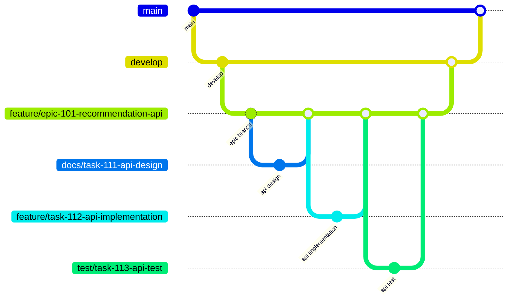
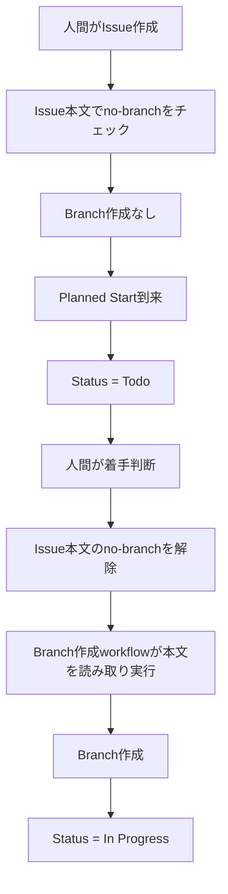
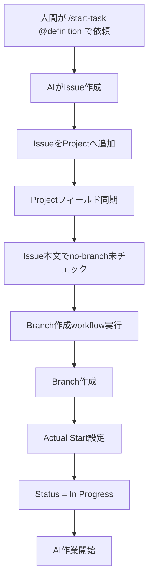

# ブランチ運用ルール

## 1. 目的

本ドキュメントは、Gift Recommendation Service におけるブランチ運用ルールを定義する。

ブランチは、Issueに紐づく作業実体として扱う。  
本プロジェクトでは、Issueを作業計画、Projectsを進捗・予定・実績管理、Branchを作業実体、PRをレビュー正本、docsを成果物正本として運用する。

本ドキュメントでは、以下を定義する。

- ブランチ種別
- ブランチ命名規則
- Branch base / PR target
- 人主導タスク運用におけるブランチ作成
- AI主導タスク運用におけるブランチ作成
- no-branch制御
- コミットメッセージ運用
- PR作成・レビュー連携
- 禁止事項

---

## 2. 関連ドキュメントとの責務分担

ブランチ運用に関連する正本は以下とする。

| 項目                                          | 正本ドキュメント                       |
| --------------------------------------------- | -------------------------------------- |
| Issue種別、Issueタイトル、Issue本文、ラベル   | Issue運用ルール                        |
| ProjectsのStatus、Phase、予定・実績管理       | Projects運用ルール                     |
| Branch命名、Branch base、PR target、merge方針 | 本ドキュメント                         |
| コミットメッセージ運用                        | 本ドキュメント                         |
| AI Agentのコミットメッセージ生成ルール        | `.cursor/rules/git-commit-message.mdc` |
| Git hook配置                                  | プロジェクトディレクトリ構成定義書     |
| GitHub Actions workflow仕様                   | 各GitHub Actionsワークフロー仕様書     |
| ディレクトリ配置                              | プロジェクトディレクトリ構成定義書     |

本ドキュメントでは、ProjectsのStatus値やIssue本文項目の詳細は重複定義しない。  
必要な場合は、Projects運用ルールおよびIssue運用ルールを参照する。

---

## 3. ブランチ運用の基本方針

**Task Issue** では、以下を原則とする。

```text
1 Task Issue = 1 Projects Task = 1 Branch = 1 PR
```

**Epic Issue** では、次を原則とする（上記の 1:1:1:1 は Task に限定する）。

```text
1 Epic Issue = 1 Epic Branch = 1 Epic PR（PR target: develop）
```

配下の各 Task Issue は、それぞれ 1 Task Branch = 1 Task PR（PR target: 親 Epic Branch）を持つ。Epic Branch は、配下 Task Branch を統合する一時的な親ブランチとして扱う。

| 要素     | 役割                                |
| -------- | ----------------------------------- |
| Issue    | 作業計画                            |
| Projects | 進捗・予定・実績管理                |
| Branch   | 作業実体                            |
| PR       | レビュー正本                        |
| docs     | 成果物正本                          |
| Slack    | 通知・サマリ                        |
| ai-logs  | Issue化前・例外・横断影響・実験ログ |

---

## 4. ブランチ種別

### 4.1 永続ブランチ

| ブランチ  | 役割                       |
| --------- | -------------------------- |
| `main`    | 本番反映済みの安定ブランチ |
| `develop` | 開発統合ブランチ           |

#### main

`main` は、本番反映済みの安定ブランチとする。

通常作業用ブランチから `main` へ直接PRを作成しない。

#### develop

`develop` は、開発統合ブランチとする。

Epic Branchの統合先として利用する。

---

### 4.2 作業用ブランチ

| ブランチ種別 | 役割                                                                                                  |
| ------------ | ----------------------------------------------------------------------------------------------------- |
| Epic Branch  | **成果物識別子単位**（原則）または ID 未整備領域の機能・領域単位（例外）の親ブランチ |
| Task Branch  | 実作業単位の子ブランチ                                                                                |

#### Epic Branch

Epic Branchは、**Epic Issue 単位**（[Issue運用ルール](./Issue運用ルール.md) §4.1）の一時統合先として利用する。Epic 粒度は識別子単位を原則とし、ID 未整備領域のみ機能・領域単位を例外として残す。

例（原則: 識別子単位）：

```text
feature/epic-300-api-pub-002-recommendation-run
feature/epic-310-api-int-002-reco-recommendation-run
feature/epic-320-scr-002-recommendation-input
feature/epic-330-batch-003-rakuten-item-pseudo-diff
feature/epic-340-mod-reco-001-recommendation-orchestrator
```

例（例外: ID 未整備領域）：

```text
feature/epic-101-recommendation-api
```

Epic Branchは、原則として `develop` から作成し、最終的に `develop` へPRを作成する。配下 Task Branch が触ってよいファイル範囲は、対応する Epic Definition の `epic_scope.allowed_paths`（[成果物一覧×Task Definition化方針書](../AIエージェント運用/成果物一覧×Task%20Definition化方針書.md) §3.5）に従う。

#### Task Branch

Task Branchは、実際の作業を行うブランチである。

例：

```text
docs/task-111-recommendation-api-design
test/task-112-recommendation-api-unit-test
```

Task Branchは、原則として親Epic Branchから作成し、親Epic BranchへPRを作成する。

---

## 5. ブランチ反映フロー

### 5.1 標準フロー

標準フローは、Task Branch から **親 Epic Branch** へ PR し、Epic Branch から `develop`、`develop` から `main` へ反映する基本フローである。Task Branch から `develop` へ直接 PR しない（§7.3 参照）。

```text
Task Branch
  ↓ PR（親 Epic Branch へ）
Epic Branch
  ↓ PR
develop
  ↓ PR
main
```

---

### 5.2 AI並列開発・機能単位統合フロー

§5.1 と同一の反映経路を用い、AI主導タスクや複数 Task を並列で進める場合の統合イメージを以下に示す。

```text
Task Branch
  ↓ PR
Epic Branch
  ↓ PR
develop
  ↓ PR
main
```



---

## 6. ブランチ命名規則

### 6.1 基本形式

ブランチ名は以下の形式に統一する。

```text
<type>/<unit>-<issue番号>-<english-summary>
```

| 要素              | 内容                     | 取得元                        |
| ----------------- | ------------------------ | ----------------------------- |
| `type`            | 作業種別                 | Issueラベル `type: xxx`       |
| `unit`            | 作業単位                 | Issueラベル `unit: xxx`       |
| `issue番号`       | GitHub Issue番号         | Issue番号                     |
| `english-summary` | 作業概要の英語kebab-case | Issue本文またはBranch summary |

---

### 6.2 type

`type` はIssueラベル `type: xxx` から取得する。

| type       | 用途                   |
| ---------- | ---------------------- |
| `feature`  | 機能追加               |
| `fix`      | 不具合修正             |
| `docs`     | ドキュメント作成・修正 |
| `refactor` | リファクタリング       |
| `chore`    | 設定・CI・雑務         |
| `test`     | テスト追加・修正       |
| `hotfix`   | 緊急修正               |
| `spike`    | 調査・検証             |

例：

```text
type: docs
```

上記ラベルから、ブランチ名では `docs` を使用する。

---

### 6.3 unit

`unit` はIssueラベル `unit: xxx` から取得する。

| unit   | 用途                           |
| ------ | ------------------------------ |
| `epic` | Epic Issueに紐づく親ブランチ   |
| `task` | Task Issueに紐づく作業ブランチ |

例：

```text
unit: task
```

上記ラベルから、ブランチ名では `task` を使用する。

---

### 6.4 english-summary

`english-summary` は英語のkebab-caseで記載する。

良い例：

```text
recommendation-api-design
recommendation-api-implementation
update-projects-workflow
```

悪い例：

```text
RecommendationAPIDesign
レコメンドAPI設計
recommendation_api_design
```

---

### 6.5 命名例

```text
feature/epic-101-recommendation-api
docs/task-111-recommendation-api-design
feature/task-112-recommendation-api-implementation
test/task-113-recommendation-api-unit-test
chore/task-120-update-projects-workflow
```

---

## 7. Branch base / PR target

### 7.1 原則

| Issue種別 | Branch base   | PR target     |
| --------- | ------------- | ------------- |
| Epic      | `develop`     | `develop`     |
| Task      | 親Epic Branch | 親Epic Branch |

---

### 7.2 Epic Branch

Epic Branchは、`develop` から作成する。

```text
develop
  ↓
feature/epic-101-recommendation-api
```

Epic BranchのPR targetは `develop` とする。

```text
feature/epic-101-recommendation-api
  ↓ PR
develop
```

---

### 7.3 Task Branch

Task Branchは、親Epic Branchから作成する。

```text
feature/epic-101-recommendation-api
  ↓
docs/task-111-recommendation-api-design
```

Task BranchのPR targetは、親Epic Branchとする。

```text
docs/task-111-recommendation-api-design
  ↓ PR
feature/epic-101-recommendation-api
```

Task Branchから `develop` へ直接PRを作成しない。

---

## 8. ブランチ作成制御

### 8.1 基本方針

ブランチは、原則としてGitHub Actions workflowまたはscriptにより自動作成する。

Issue本文の `no-branch` チェックのみを正本とする。GitHub Label `no-branch` は**定義しない・付与しない**（[Issue運用ルール](./Issue運用ルール.md) §15.1）。

ブランチ作成制御は、以下の流れで行う。

```text
Issue本文の no-branch チェック
  ↓
Branch作成 workflow が Issue 本文を読み取り Branch 作成要否を判定
  ↓
Branch作成
```

`.github/workflows/` および Issue テンプレートの実装は、本運用方針に合わせる。現行ファイルが旧 Label 運用の場合は後続タスクで更新する。

---

### 8.2 ブランチ作成条件

Branch作成workflowは、以下をすべて満たす場合にブランチを作成する。

| 条件                           | 内容                                         |
| ------------------------------ | -------------------------------------------- |
| Issueがopenである              | close済みIssueは対象外                       |
| `unit` を判定できる            | `unit: epic` または `unit: task` が存在する  |
| `type` を判定できる            | `type: xxx` が存在する                       |
| `english-summary` を判定できる | Issue本文またはBranch summaryが存在する      |
| Issue本文で `no-branch` 未チェック | Branch作成対象（本文が正本。Label は見ない） |
| 同名ブランチが未作成である     | 重複作成しない                               |
| base branchが存在する          | Epicはdevelop、Taskは親Epic Branchが存在する |

---

### 8.3 人主導タスクにおけるブランチ作成

人主導タスクでは、未来着手予定のIssueを先に作成する場合がある。

そのため、Issue作成時は原則として Issue 本文で `no-branch` を**チェック**し、ブランチを作成しない（§8.1、[Issue運用ルール](./Issue運用ルール.md) §15 参照）。



---

### 8.4 AI主導タスクにおけるブランチ作成

AI主導タスクでは、人間の `/start-task @definition` を起点として、AIがIssue作成からPR作成まで進める。

そのため、Issue作成時は原則として Issue 本文で `no-branch` を**チェックしない**。



---

## 9. PR作成ルール

### 9.1 PR作成先

| ブランチ種別 | PR作成先      |
| ------------ | ------------- |
| Epic Branch  | `develop`     |
| Task Branch  | 親Epic Branch |

---

### 9.2 PRとIssueの紐づけ

PRは必ず対象Issueに紐づける。

PR本文の Issue 参照キーワードは、[Task Definition設計書](../AIエージェント運用/Task%20Definition設計書.md) §22・§39 および `prompts/templates/pr/task-pr.md` を正本とする。

| 対象    | PR本文のIssue参照（原則）               |
| ------- | --------------------------------------- |
| Task PR | `Related to #<Task Issue番号>`          |
| Epic PR | 必要に応じて `Closes #<Epic Issue番号>` |

Task PR では、原則として `Closes #<Task Issue番号>` を使用しない。後続 Task で前段 Task の成果物修正が発生する可能性があるため、Task Issue の自動 close に依存しない。  
Task Issue の close タイミングは、Projects運用ルールおよび Issue運用ルールに従う。

---

### 9.3 PR作成後のStatus

PR作成後のStatus更新は、Projects運用ルールを正本とする。

原則として、PR作成時に対象IssueのStatusを以下へ更新する。

```text
AI Review
```

人主導タスクであっても、品質担保のため原則としてAI Reviewを経由する。

標準的な遷移は以下とする。

```text
In Progress
  ↓ PR作成
AI Review
  ↓ AIレビューOK
Human Review
  ↓ 人間レビューOK / merge
Done
```

---

## 10. コミットメッセージ運用ルール

### 10.1 基本方針

本プロジェクトでは、コミットメッセージは日本語で記載する。

人主導運用でCursorの `Generate Commit Message` を使用する場合も、日本語コミットメッセージを使用する。

ただし、Cursorの自動生成結果が必ず日本語になることは保証しない。  
自動生成結果が英語になった場合は、人間が手動で日本語へ修正してからcommitする。

AI Agentがcommit messageを作成する場合は、`.cursor/rules/git-commit-message.mdc` に従う。

`.cursorrules` は採用しない。

---

### 10.2 標準形式

コミットメッセージは以下の形式を標準とする。

```text
<type>: <日本語の変更概要>
```

`type` は英語でよい。  
`:` 以降の変更概要は日本語必須とする。

---

### 10.3 type

`type` は、Issueラベル分類「作業種別」または変更内容に応じて選択する。

| type       | 用途                       |
| ---------- | -------------------------- |
| `docs`     | ドキュメント追加・修正     |
| `feat`     | 機能追加                   |
| `fix`      | 不具合修正                 |
| `test`     | テスト追加・修正           |
| `refactor` | 振る舞いを変えない内部改善 |
| `chore`    | 設定・運用・雑務           |
| `hotfix`   | 緊急修正                   |
| `spike`    | 調査・検証                 |

---

### 10.4 例

```text
docs: AIエージェント共通Rules設計書を追加
docs: Projects運用ルールを最新化
fix: Issue同期ワークフローのno-branch判定を修正
test: Recommendation APIの単体テストを追加
chore: worktree作成スクリプトの初期設定を追加
```

---

### 10.5 禁止事項

以下は禁止する。

- 英語のみのコミットメッセージでcommitすること
- 変更内容が分からない抽象的なメッセージにすること
- Issue / PR / docsの正本関係と矛盾する内容を書くこと
- secretや個人情報をコミットメッセージに含めること
- `.env` の値、APIキー、token等をコミットメッセージに含めること

---

### 10.6 強制チェック

日本語コミットメッセージの徹底は、`.githooks/commit-msg` により補助する。

`.githooks/commit-msg` は、日本語を含まないコミットメッセージを拒否する。

Git hookを有効化するため、初回セットアップ時に以下を実行する。

```bash
git config core.hooksPath .githooks
```

Git hookはローカルGit設定であるため、リポジトリに `.githooks/commit-msg` が存在するだけでは自動的に有効化されない。

---

### 10.7 Git自動生成メッセージの扱い

`Merge`、`Revert` などGitが自動生成する特殊なコミットメッセージは、必要に応じて例外として許容する。

ただし、人間またはAI Agentが通常作業で作成するcommit messageは、日本語を含めることを必須とする。

---

## 11. AIレビュー・人間レビュー後の修正

AIレビューまたは人間レビューで修正指摘がある場合は、同一Issue・同一Branchで修正する。

```text
AI Review / Human Review
  ↓ 修正指摘
In Progress
  ↓ 修正対応
AI Review
```

新しいIssueを作成するのは、以下の場合に限定する。

- 指摘内容が当初Issueの作業範囲を超える
- 横断影響が大きい
- 別Epic / 別Taskとして管理すべき
- 人間判断が必要な追加要件である

---

## 12. 並列作業時の運用

AI主導で複数Taskを並列実行する場合は、親Epic Branchを統合先とする。

```text
docs/task-111-api-design
feature/task-112-api-implementation
test/task-113-api-test
  ↓
feature/epic-101-recommendation-api
  ↓
develop
```

並列作業時は、以下を確認する。

| 観点            | 確認内容                                                      |
| --------------- | ------------------------------------------------------------- |
| 親Epic Branch   | Task Branchのbase / targetが同じ親Epic Branchであること       |
| 変更範囲        | Task Definitionのtarget_files / exclusive_filesと整合すること |
| generated       | 生成物の変更が他Taskへ影響しないこと                          |
| OpenAPI / Orval | 横断影響がある場合は専用Taskとして扱うこと                    |
| conflict        | 同一ファイルを複数Taskで同時編集しないこと                    |
| worktree        | 1 Task Branch = 1 worktreeで作業領域を分離すること            |

---

## 13. workflow仕様書

ブランチ作成に関するworkflow仕様は、以下の仕様書を正本とする。

```text
docs/06_実装設計/github_actions/Issue同期とブランチ作成ワークフロー仕様書.md
```

workflow実装ファイルは以下に配置する。

```text
.github/workflows/
```

GitHub Actions workflowファイルは `.github/workflows/` 直下に配置する。

サブディレクトリは作成せず、分類はファイル名prefixで表現する。

例：

```text
.github/workflows/gh-automation-issue-branch-create.yml
```

---

## 14. 禁止事項

以下は禁止する。

- `main` へTask Branchから直接PRを作成すること
- Task Branchから `develop` へ直接PRを作成すること
- 親Epic Branchが存在しない状態でTask Branchを作成すること
- Issue 本文の no-branch チェックが ON の Issue に Branch を作成すること（`branch.no_branch: true` / 人主導タスク。Label `no-branch` は使用しない。正本: [Issue運用ルール](./Issue運用ルール.md) §15.1）
- 同一Issueに対して複数Branchを作成すること
- 同一Branchで複数Issueの作業を混在させること
- ブランチ名に日本語を含めること
- ブランチ名にスペース、アンダースコア、大文字を混在させること
- 英語のみのコミットメッセージで通常commitすること
- secretや個人情報をコミットメッセージに含めること
- Orval等のgeneratedファイルを、影響確認なしに複数Taskで同時変更すること
- GitHub Actions workflowを仕様書なしで追加・変更すること
- `.github/workflows/` 配下にサブディレクトリを作成すること
- `.cursorrules` をコミットメッセージ制御目的で追加すること

---

## 15. 関連ドキュメント

| ドキュメント                              | 役割                                                           |
| ----------------------------------------- | -------------------------------------------------------------- |
| プロジェクト運営基本方針                  | プロジェクト全体の運営方針を定義                               |
| Projects運用ルール                        | Status、Phase、予定・実績管理、Project同期を定義               |
| Issue運用ルール                           | Issue種別、Issueタイトル、Issue本文、ラベルを定義              |
| Task Definition設計書                     | AI作業依頼条件、target_files、exclusive_filesを定義            |
| AIエージェント共通Rules設計書             | `.cursor/rules/` の設計方針を定義                              |
| AI Agent定義設計書                        | Worker / Fixer等の責務と権限を定義                             |
| worktree運用ルール                        | 並列AI作業時のworktree利用を定義                               |
| Issue同期とブランチ作成ワークフロー仕様書 | Branch自動作成の詳細仕様を定義                                 |
| PR作成時Status更新ワークフロー仕様書      | PR作成時のStatus更新を定義                                     |
| PR merge時Status更新ワークフロー仕様書    | merge後のDone更新を定義                                        |
| プロジェクトディレクトリ構成定義書        | workflow、scripts、docs、`.cursor/`、`.githooks/` の配置を定義 |

---

## 16. 一言まとめ

ブランチはIssueに紐づく作業実体である。

```text
Issue = 作業計画
Projects = 進捗・予定・実績管理
Branch = 作業実体
PR = レビュー正本
docs = 成果物正本
```

ブランチ命名規則は以下に統一する。

```text
<type>/<unit>-<issue番号>-<english-summary>
```

Task Branchは、親Epic Branchから作成し、親Epic BranchへPRを作成する。

```text
Task Branch → Epic Branch → develop → main
```

人主導タスクでは、Issue 本文の `no-branch` チェックにより未来着手予定IssueのBranch作成を抑止する。

AI主導タスクでは、Issue作成時に原則Branchを自動作成する。

コミットメッセージは、以下の形式で日本語を含める。

```text
<type>: <日本語の変更概要>
```

日本語コミットメッセージの徹底は、`.cursor/rules/git-commit-message.mdc` と `.githooks/commit-msg` により補助する。
