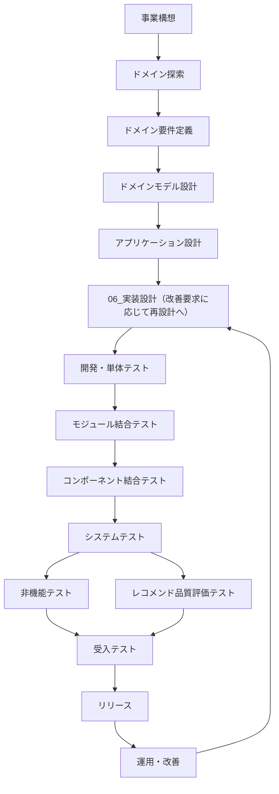

# プロジェクト工程定義

## 1. 目的

本ドキュメントは、Gift Recommendation Service MVP におけるプロジェクト工程を定義する。

本プロジェクトでは、事業構想から設計、実装、各種テスト、リリース、運用改善までを工程として分割し、成果物、Issue、GitHub Projects、docsディレクトリを工程単位で管理する。

本ドキュメントでは、以下を定義する。

- プロジェクト工程の正式名称
- docs配下の工程別ディレクトリとの対応
- GitHub Projects の Phase フィールドに設定する工程値
- 各工程の目的と主な成果物
- 補助分類である `00_共通` と `90_PoC` の位置づけ

---

## 2. 工程定義一覧

| Phase | docsディレクトリ               | 工程名                   | 概要                                                                          |
| ----- | ------------------------------ | ------------------------ | ----------------------------------------------------------------------------- |
| P1    | `01_事業構想/`                 | 事業構想                 | 事業目的、提供価値、顧客課題、ビジネスモデル、MVP方針を定義する               |
| P2    | `02_ドメイン探索/`             | ドメイン探索             | 業務領域、主要概念、業務ルール、関係者の言葉、ドメイン仮説を整理する          |
| P3    | `03_ドメイン要件定義/`         | ドメイン要件定義         | ドメイン観点で実現すべき要件、リソース、正本、制約を定義する                  |
| P4    | `04_ドメインモデル設計/`       | ドメインモデル設計       | ユビキタス言語、ドメイン概念、集約、状態遷移、論理データ構造を設計する        |
| P5    | `05_アプリケーション設計/`     | アプリケーション設計     | システム構成、処理構成、機能、モジュール、API、画面、バッチ、外部IFを設計する |
| 06_実装設計 | `06_実装設計/`           | 実装設計                 | 実装可能な粒度でAPI、画面、モジュール、DB、GitHub Actions、CI/CD等を設計する  |
| P7    | `07_開発・単体テスト/`         | 開発・単体テスト         | ソースコード、設定ファイル、ワークフロー等を実装し、単体テストを行う          |
| P8    | `08_モジュール結合テスト/`     | モジュール結合テスト     | 同一コンポーネント内の複数モジュールを組み合わせて検証する                    |
| P9    | `09_コンポーネント結合テスト/` | コンポーネント結合テスト | web / api / reco / batch / DB 等のコンポーネント間連携を検証する              |
| P10   | `10_システムテスト/`           | システムテスト           | システム全体の業務フロー、E2E、主要ユースケースを検証する                     |
| P11   | `11_非機能テスト/`             | 非機能テスト             | 性能、セキュリティ、可用性、運用性、監視性などの非機能要件を検証する          |
| P12   | `12_レコメンド品質評価テスト/` | レコメンド品質評価テスト | レコメンド結果の妥当性、説明理由、ランキング品質、意味空間の品質を評価する    |
| P13   | `13_受入テスト/`               | 受入テスト               | MVPとして受け入れ可能か、人間視点・業務視点で最終確認する                     |
| P14   | `14_リリース/`                 | リリース                 | 本番反映、リリース手順、リリース判定、初期稼働確認を行う                      |
| P15   | `15_運用・改善/`               | 運用・改善               | 運用、障害対応、モニタリング、フィードバック、改善活動を管理する              |

---

## 3. 補助分類

以下は工程ではなく、工程横断の補助分類として扱う。

| 分類 | docsディレクトリ | 名称 | 位置づけ                                                                                              |
| ---- | ---------------- | ---- | ----------------------------------------------------------------------------------------------------- |
| C0   | `00_共通/`       | 共通 | プロジェクト全体で参照する共通資料、テンプレート、用語、ルールを配置する                              |
| X90  | `90_PoC/`        | PoC  | 技術検証、外部API疎通検証、性能フィジビリティなど、正式工程に入る前または工程横断で行う検証を配置する |

---

## 4. GitHub Projects Phase フィールド定義

GitHub Projects の `Phase` フィールドの正式値は、[Projects運用ルール](./Projects運用ルール.md) §6 を正本とする。

本節は、工程定義と docs ディレクトリの対応を示す要約である。Task Definition の `project.fields.phase`、Issue 本文の Phase 同期項目も、同じ正式値を使用する。

| Phase値                        | 対応docsディレクトリ                |
| ------------------------------ | ----------------------------------- |
| `01_事業構想`                  | `docs/01_事業構想/`                 |
| `02_ドメイン探索`              | `docs/02_ドメイン探索/`             |
| `03_ドメイン要件定義`          | `docs/03_ドメイン要件定義/`         |
| `04_ドメインモデル設計`        | `docs/04_ドメインモデル設計/`       |
| `05_アプリケーション設計`    | `docs/05_アプリケーション設計/`     |
| `06_実装設計`                  | `docs/06_実装設計/`                 |
| `07_開発・単体テスト`          | `docs/07_開発・単体テスト/`         |
| `08_モジュール結合テスト`      | `docs/08_モジュール結合テスト/`     |
| `09_コンポーネント結合テスト`  | `docs/09_コンポーネント結合テスト/` |
| `10_システムテスト`            | `docs/10_システムテスト/`           |
| `11_非機能テスト`              | `docs/11_非機能テスト/`             |
| `12_レコメンド品質評価テスト`  | `docs/12_レコメンド品質評価テスト/` |
| `13_受入テスト`                | `docs/13_受入テスト/`               |
| `14_リリース`                  | `docs/14_リリース/`                 |
| `15_運用・改善`                | `docs/15_運用・改善/`               |
| `90_PoC`                       | `docs/90_PoC/`                      |

`00_共通` は、原則としてProjectsのPhase値には設定しない。

`90_PoC` は、PoC Issue を管理する場合に Phase として設定してよい。成果物は `docs/90_PoC/` に配置し、Phase 値 `90_PoC` と対応させる。

---

## 5. 工程別の主な成果物

| Phase | 工程名                   | 主な成果物                                                                        |
| ----- | ------------------------ | --------------------------------------------------------------------------------- |
| P1    | 事業構想                 | 事業構想書、MVP方針、サービス価値仮説、ターゲットユーザー定義                     |
| P2    | ドメイン探索             | ドメイン概念メモ、Gift Meaning検討、競合整理、ユーザー課題整理                    |
| P3    | ドメイン要件定義         | MVPスコープ、リソース定義、正本定義、ドメイン入出力定義、要件定義                 |
| P4    | ドメインモデル設計       | ドメイン概念一覧、概念連関図、集約定義、状態遷移、論理ER、テーブル方針            |
| P5    | アプリケーション設計     | システム構成図、処理構成定義、機能一覧、モジュール一覧、API一覧、画面一覧         |
| 06_実装設計 | 実装設計           | API仕様書、画面仕様書、バッチ仕様書、モジュール仕様書、DB物理設計、Workflow仕様書 |
| P7    | 開発・単体テスト         | 実装コード、単体テストコード、単体テストケース、単体テスト結果                    |
| P8    | モジュール結合テスト     | モジュール結合テスト計画、テストケース、テスト結果                                |
| P9    | コンポーネント結合テスト | コンポーネント結合テスト計画、API連携テスト、バッチ連携テスト、テスト結果         |
| P10   | システムテスト           | システムテスト計画、E2Eテストケース、業務フローテスト結果                         |
| P11   | 非機能テスト             | 性能テスト、セキュリティテスト、監視・運用性テスト、非機能検証結果                |
| P12   | レコメンド品質評価テスト | 評価ケース、期待結果、ランキング評価、理由文評価、品質評価レポート                |
| P13   | 受入テスト               | 受入テスト計画、受入観点、受入テスト結果、MVP受入判定                             |
| P14   | 運用・改善               | 運用手順、障害対応手順、改善バックログ、モニタリング結果、改善レポート            |
| P15   | リリース                 | リリース手順書、リリース判定、リリースノート、初期稼働確認結果                    |

---

## 6. 工程遷移イメージ



---

## 7. docsディレクトリとの対応ルール

工程とdocsディレクトリは、以下の関係を正とする。

```text
P1  事業構想                     -> docs/01_事業構想/
P2  ドメイン探索                 -> docs/02_ドメイン探索/
P3  ドメイン要件定義             -> docs/03_ドメイン要件定義/
P4  ドメインモデル設計           -> docs/04_ドメインモデル設計/
P5  アプリケーション設計         -> docs/05_アプリケーション設計/
06_実装設計                     -> docs/06_実装設計/
P7  開発・単体テスト             -> docs/07_開発・単体テスト/
P8  モジュール結合テスト         -> docs/08_モジュール結合テスト/
P9  コンポーネント結合テスト     -> docs/09_コンポーネント結合テスト/
P10 システムテスト               -> docs/10_システムテスト/
P11 非機能テスト                 -> docs/11_非機能テスト/
P12 レコメンド品質評価テスト     -> docs/12_レコメンド品質評価テスト/
P13 受入テスト                   -> docs/13_受入テスト/
P14 リリース                     -> docs/14_リリース/
P15 運用・改善                   -> docs/15_運用・改善/
```

---

## 8. 運用ルール

### 8.1 Phaseとdocs配置の整合

IssueまたはTask Definitionで指定する `Phase` と、成果物の配置先docsディレクトリは整合させる。

例（Task Issue）：

```text
Phase = 06_実装設計
出力先 = docs/06_実装設計/...
```

#### 8.1.1 Epic Issue と Task Issue で Phase の意味が異なる

工程番号と docs ディレクトリの対応（§7）は変更しない。一方、Projects の `Phase` フィールドに載せる値の**意味**は Issue 種別で異なる（[Projects運用ルール](./Projects運用ルール.md) §6.1、[Issue運用ルール](./Issue運用ルール.md) §4.1.1 を正本とする）。

| Issue種別 | Phase の意味 | docs 配置との関係 |
| --------- | ------------ | ----------------- |
| Task Issue | 当該 Task の主成果物が属する工程 | `Phase` と配置先 docs を整合させる（§8.1 の例） |
| 識別子単位 Epic Issue | Epic クローズ条件の完了ゲート工程（原則 `07_開発・単体テスト`） | Epic の `Phase` は完了ゲート。配下の 06 成果物は子 Task の `Phase` と `docs/06_実装設計/` で管理する |
| 機能・領域単位 Epic Issue | Epic Definition で指定する完了ゲート | Definition に従う |

識別子単位 Epic を `06_実装設計` のみに設定してはならない（配下に 07 成果物を含むため、Projects 上の Epic `Phase` と実態が不整合になる）。

### 8.2 テスト工程の分割

テスト工程は、以下のように分割して管理する。

| テスト工程               | 目的                                                         |
| ------------------------ | ------------------------------------------------------------ |
| 開発・単体テスト         | 実装単位、関数単位、モジュール内単位の検証                   |
| モジュール結合テスト     | 同一コンポーネント内のモジュール間連携検証                   |
| コンポーネント結合テスト | web / api / reco / batch / DB などのコンポーネント間連携検証 |
| システムテスト           | システム全体の業務フロー検証                                 |
| 非機能テスト             | 性能、セキュリティ、可用性、監視性などの検証                 |
| レコメンド品質評価テスト | レコメンド結果、ランキング、理由文、品質観点の検証           |
| 受入テスト               | MVPとしてリリース可能かの最終確認                            |

### 8.3 PoCの扱い

PoCは正式工程とは分離し、`docs/90_PoC/` に配置する。

PoC結果が正式成果物に反映される場合は、該当する工程のdocs配下へ成果物として再整理する。

例：

```text
docs/90_PoC/性能フィジビリティ/
  ↓ 結果を設計へ反映
docs/06_実装設計/cross_cutting/
```

---

## 9. 禁止事項

以下は禁止する。

- Phaseフィールドに [Projects運用ルール](./Projects運用ルール.md) §6 未定義の工程名を設定すること
- docs配下に工程番号なしの工程ディレクトリを追加すること
- `14_運用改善` と `14_運用・改善` のように表記揺れを混在させること
- テスト工程をすべて `結合・総合テスト` に集約して管理すること
- PoC成果物を正式成果物として扱い、工程docsへ再整理せずに参照し続けること
- リリース成果物を `14_運用・改善/` 配下に混在させること

---

## 10. 一言まとめ

本プロジェクトの工程は、以下の15工程で管理する。

```text
01_事業構想
02_ドメイン探索
03_ドメイン要件定義
04_ドメインモデル設計
05_アプリケーション設計
06_実装設計
07_開発・単体テスト
08_モジュール結合テスト
09_コンポーネント結合テスト
10_システムテスト
11_非機能テスト
12_レコメンド品質評価テスト
13_受入テスト
14_リリース
15_運用・改善
```

`00_共通` は工程横断の共通資料置き場、`90_PoC` は技術検証・試行錯誤の置き場として扱う。
