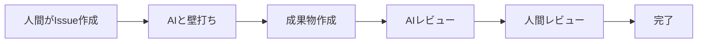
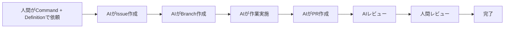
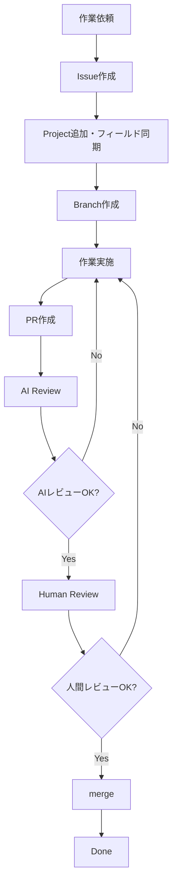

# プロジェクト運営基本方針

## 1. 目的

本ドキュメントは、Gift Recommendation Service におけるプロジェクト運営の基本方針を定義する。

本プロジェクトでは、人間とAIエージェントが協業し、GitHub、docs、prompts、AIログ、Slackを組み合わせて、設計・開発・テスト・リリース・運用改善を進める。

本ドキュメントは、細かな運用手順ではなく、以下の全体方針を定義する。

- 人間とAIエージェントの役割分担
- 工程ごとの主導方針
- Issue / Projects / Branch / PR / docs の位置づけ
- 成果物とレビューの考え方
- AI主導運用の基本原則
- 関連運用ルールとの責務分担

---

## 2. 基本思想

本プロジェクトでは、AIエージェントを作業実行の中心に置きつつ、最終的な品質責任は人間が持つ。

AIエージェントは、成果物作成、設計補助、実装、テスト、レビュー、調査を高速に進めるための作業主体である。

一方で、以下は人間が責任を持つ。

- 事業判断
- 要件・方針の最終判断
- 成果物の最終レビュー
- リリース判断
- 運用改善方針の判断
- AIエージェントへの指示設計
- AIエージェント運用ルールの改善

本プロジェクトでは、AIを「完全自動の責任者」ではなく、制御可能で改善可能なパートナーとして扱う。

---

## 3. 運営原則

| 原則         | 内容                                                             |
| ------------ | ---------------------------------------------------------------- |
| Issue起点    | すべての作業はIssueを起点に管理する                              |
| Projects管理 | 進捗、予定、実績はGitHub Projectsで管理する                      |
| Branch作業   | 実作業はIssueに紐づくBranchで行う                                |
| PRレビュー   | レビュー、作業結果、修正履歴はPRを中心に管理する                 |
| docs正本     | 設計書、仕様書、テスト結果、運用手順はdocsを正本とする           |
| AI活用       | 明確に定義できる作業はAIエージェントに実施させる                 |
| 人間責任     | 最終判断と品質責任は人間が持つ                                   |
| 段階的改善   | 運用ルール、テンプレート、プロンプト、ワークフローは継続改善する |

---

## 4. 正本関係

本プロジェクトにおける主要管理対象の正本関係は以下とする。

| 対象     | 位置づけ                            |
| -------- | ----------------------------------- |
| Issue    | 作業計画の正本                      |
| Projects | 進捗・予定・実績管理の正本          |
| Branch   | 作業実体                            |
| PR       | レビュー正本                        |
| docs     | 成果物正本                          |
| prompts  | AI作業指示・Task Definitionの正本   |
| ai-logs  | Issue化前・例外・横断影響・実験ログ |
| Slack    | 通知・サマリ                        |

Slackは通知・サマリ用途であり、作業計画や成果物の正本にはしない。

---

## 5. プロジェクト工程

本プロジェクトでは、以下の工程を前提に運営する。

| 工程                         | 主な目的                                         | 主導方針           |
| ---------------------------- | ------------------------------------------------ | ------------------ |
| 01\_事業構想                 | 事業目的、提供価値、MVP方針を定める              | 人主導             |
| 02\_ドメイン探索             | ドメイン概念、業務ルール、仮説を整理する         | 人主導             |
| 03\_ドメイン要件定義         | ドメイン要件、リソース、正本、制約を定義する     | 人主導             |
| 04\_ドメインモデル設計       | ドメインモデル、集約、論理構造を設計する         | 人主導             |
| 05\_アプリケーション設計     | 機能、モジュール、API、画面、処理構成を設計する  | 人主導＋AI支援     |
| 06\_実装設計                 | 実装可能な粒度で仕様を設計する                   | AI主導＋人レビュー |
| 07\_開発・単体テスト         | 実装と単体テストを行う                           | AI主導＋人レビュー |
| 08\_モジュール結合テスト     | 同一コンポーネント内の結合を検証する             | AI主導＋人レビュー |
| 09\_コンポーネント結合テスト | web / api / reco / batch / DB 間の連携を検証する | AI主導＋人レビュー |
| 10\_システムテスト           | システム全体の業務フローを検証する               | AI主導＋人レビュー |
| 11\_非機能テスト             | 性能、セキュリティ、運用性等を検証する           | AI主導＋人レビュー |
| 12\_レコメンド品質評価テスト | レコメンド品質、理由文、ランキングを評価する     | AI主導＋人レビュー |
| 13\_受入テスト               | MVPとして受入可能か確認する                      | 人主導＋AI支援     |
| 14\_リリース                 | 本番反映、リリース判定、初期稼働確認を行う       | 人主導＋AI支援     |
| 15\_運用・改善               | 運用、障害対応、改善活動を行う                   | 人主導＋AI支援     |

上記は原則であり、作業の性質に応じて人主導・AI主導を切り替えてよい。

---

## 6. 人間とAIエージェントの役割

### 6.1 人間の役割

人間は、プロジェクトの最終責任者として以下を担う。

- 事業方針の決定
- 要件・設計方針の判断
- AIエージェントへの作業依頼
- Task Definitionの作成・レビュー
- PRの最終レビュー
- リリース判断
- 運用改善の意思決定

### 6.2 AIエージェントの役割

AIエージェントは、定義された入力、制約、テンプレート、レビュー観点に基づき、以下を担う。

- 作業計画案の作成
- Issue本文の生成
- 設計書・仕様書の作成
- ソースコード変更
- テストコード作成
- 単体テスト・検証
- PR作成
- AIレビュー
- レビュー指摘対応
- Slack通知・サマリ作成

---

## 7. AIエージェント体制

AIエージェントは、役割ごとに分けて定義する。

| 役割            | 主な責務                                                                         |
| --------------- | -------------------------------------------------------------------------------- |
| Orchestrator AI | 人間からの依頼を解析し、Task Definition確認、Issue作成、作業分割、進行制御を行う |
| Worker AI       | Issue / Branch単位で設計、実装、テストなどの作業を実施する                       |
| Reviewer AI     | PR、成果物、コード、テスト結果をレビューする                                     |
| Fixer AI        | AIレビュー・人間レビューの指摘に基づき、同一Branchで修正する                     |
| Support AI      | 調査、整合性確認、影響分析、要約などを補助する                                   |

AIエージェントを分ける目的は、責務を明確化し、作業品質とレビュー独立性を高めることである。

---

## 8. 作業運用パターン

本プロジェクトでは、主に以下2つの作業運用パターンを使い分ける。

## 8.1 人主導運用

人主導運用は、主に上流工程や判断要素が大きい作業で利用する。



主な対象は以下である。

- 事業構想
- ドメイン探索
- ドメイン要件定義
- ドメインモデル設計
- アプリケーション設計
- リリース判断
- 運用改善方針

---

## 8.2 AI主導運用

AI主導運用は、入力・出力・完了条件を明確に定義できる作業で利用する。



主な対象は以下である。

- 実装設計
- 開発・単体テスト
- 各種テスト設計
- GitHub Actions実装
- CI/CD関連作業
- レビュー指摘対応
- 整合性チェック

---

## 9. 標準ワークフロー

本プロジェクトの標準ワークフローは以下とする。



人主導タスクでも、PR作成後は原則としてAI Reviewを経由する。

---

## 10. Issue / Projects / Branch / PR の基本関係

Task Issueでは、以下を原則とする（Epic Issue の Branch / PR 関係は [ブランチ運用ルール](./ブランチ運用ルール.md) §3 参照）。

```
1 Task Issue = 1 Projects Task = 1 Branch = 1 PR
```

| 対象     | 原則                                |
| -------- | ----------------------------------- |
| Issue    | 作業単位を明確にする                |
| Projects | Status、Phase、予定・実績を管理する |
| Branch   | Issue単位で作成する                 |
| PR       | Branch単位で作成する                |
| docs     | 成果物を保存する                    |

Epic Issueは、複数Task Issueを束ねる単位として利用する。

Task Branchは、原則として親Epic Branchから作成し、親Epic BranchへPRを作成する。

---

## 11. 成果物管理方針

成果物は、原則としてdocs配下で管理する。

| 成果物種別                 | 配置先                          |
| -------------------------- | ------------------------------- |
| 共通資料                   | `docs/00_共通/`                 |
| 事業構想成果物             | `docs/01_事業構想/`             |
| ドメイン探索成果物         | `docs/02_ドメイン探索/`         |
| ドメイン要件成果物         | `docs/03_ドメイン要件定義/`     |
| ドメインモデル成果物       | `docs/04_ドメインモデル設計/`   |
| アプリケーション設計成果物 | `docs/05_アプリケーション設計/` |
| 実装設計成果物             | `docs/06_実装設計/`             |
| 開発・単体テスト成果物     | `docs/07_開発・単体テスト/`     |
| 各種テスト成果物           | `docs/08_...` 〜 `docs/13_...`  |
| リリース成果物             | `docs/14_リリース/`             |
| 運用改善成果物             | `docs/15_運用・改善/`           |
| PoC成果物                  | `docs/90_PoC/`                  |

詳細なディレクトリ構成は、ディレクトリ構成定義書を正本とする。

---

## 12. prompts / Task Definition 方針

AI主導運用では、個別作業依頼をTask Definitionとして定義する。

Task Definitionには、以下を記載する。

- 作業目的
- 作業範囲
- 対象外
- 入力資料
- 出力成果物
- 完了条件
- 確認観点
- Project同期項目
- Branch作成条件
- AIログレベル
- Slack通知条件

AIエージェントへの依頼は、可能な限りCommandとDefinitionの組み合わせで行う。

例：

```
/start-task @definition
/review-pr @definition
/fix-review-comments @definition
```

---

## 13. AIログ方針

AIログは、通常作業ログをすべて保存する場所ではない。

Issue作成後の作業計画はIssue、作業結果とレビューはPR、成果物はdocsに記録する。

`ai-logs/` は以下に限定して利用する。正本は [AIログ運用ルール](../AIエージェント運用/AIログ運用ルール.md) §4・§6 とする。

| 種別                    | 保存先                     | 用途                                        |
| ----------------------- | -------------------------- | ------------------------------------------- |
| Issue化前フィードバック | `ai-logs/intake/`          | Issue化前の事前確認、人間へのフィードバック |
| 作業停止・例外          | `ai-logs/incidents/`       | 作業不可、入力不足、権限不足、依存未完了    |
| 人間判断待ち            | `ai-logs/human-decisions/` | AIだけでは判断できない設計・仕様・運用判断  |
| 横断影響                | `ai-logs/cross-cutting/`   | OpenAPI / Orval / generated 等の横断影響    |
| AI運用検証              | `ai-logs/experiments/`     | AI運用検証、PoC的な試行錯誤                 |

---

## 14. レビュー方針

レビューは、AIレビューと人間レビューの2段階を基本とする。

```
AI Review → Human Review
```

| レビュー     | 目的                                                                     |
| ------------ | ------------------------------------------------------------------------ |
| AI Review    | 機械的整合性、テンプレート準拠、入力資料との整合、明らかな漏れを確認する |
| Human Review | 方針妥当性、事業判断、品質判断、リリース可否を確認する                   |

AIレビューは品質を底上げするための事前チェックである。

最終判断は人間レビューで行う。

---

## 15. 自動化方針

GitHub Actions、script、AIエージェントにより、以下を自動化する。

- Issue作成時のProject追加
- Projectフィールド同期
- Label同期
- no-branch制御
- Branch作成
- Planned Start到来によるStatus更新
- PR作成時のStatus更新
- PR merge時のDone更新
- Slack通知
- CI実行
- テスト実行

GitHub Actions workflowは、仕様書を作成したうえで実装する。

---

## 16. 例外・停止時の扱い

AIエージェントが作業を継続できない場合は、無理に作業を進めない。

以下の場合は、人間へフィードバックする。

- 入力資料が不足している
- 前提条件が不明確
- 作業範囲が曖昧
- 依存Issueが未完了
- 権限が不足している
- 競合リスクが高い
- 横断影響が大きい
- 人間判断が必要

Issue化前のフィードバックは `ai-logs/intake/` に記録する。

Issue化後の作業停止・例外はIssueまたはPRに記録する。

---

## 17. 禁止事項

以下は禁止する。

- Issueなしで作業を開始すること
- Projectsだけに作業内容を記録すること
- Slack通知だけで作業記録を完結させること
- AIレビューだけで完了判断すること
- docsに残すべき成果物をPRコメントだけで済ませること
- GitHub Actions workflowを仕様書なしで作成・変更すること
- AI主導タスクでTask Definitionなしに大規模作業を依頼すること
- 人間レビューなしでmainへ反映すること
- シークレット情報をdocs、prompts、ai-logs、Issue、PRに記載すること

---

## 18. 関連ドキュメント

| ドキュメント                              | 役割                                          |
| ----------------------------------------- | --------------------------------------------- |
| プロジェクト工程定義                      | 工程、Phase、docsディレクトリ対応を定義       |
| ディレクトリ構成定義書                    | リポジトリ全体の配置ルールを定義              |
| Projects運用ルール                        | ProjectsのStatus、Phase、予定・実績管理を定義 |
| Issue運用ルール                           | Issue作成、Issue本文、ラベル、親子関係を定義  |
| ブランチ運用ルール                        | Branch命名、Branch base、PR targetを定義      |
| Git運用ルール                             | merge、保護ブランチ、リリース反映方針を定義   |
| AIエージェント活用型 開発運用フロー設計書 | AI主導運用の詳細フローを定義                  |
| Task Definition設計書                     | AI作業依頼条件を定義                          |
| Issueテンプレート設計書                   | Issue本文構造を定義                           |
| PRテンプレート設計書                      | PR本文構造を定義                              |
| GitHub Actionsワークフロー仕様書          | 自動化workflowの仕様を定義                    |

---

## 19. 一言まとめ

本プロジェクトは、人間とAIエージェントが協業して進める。

AIエージェントは、設計・実装・テスト・レビューを高速化する作業主体である。

人間は、方針判断、品質責任、最終レビュー、リリース判断を担う。

運営の基本関係は以下である。

```
Issue = 作業計画
Projects = 進捗・予定・実績管理
Branch = 作業実体
PR = レビュー正本
docs = 成果物正本
```

作業はIssue起点で開始し、Branchで実施し、PRでレビューし、docsに成果物を残す。

AI主導タスクでは、CommandとTask Definitionにより作業を依頼し、AI Reviewを経てHuman Reviewへ進める。

最終的な品質責任は人間が持つ。
