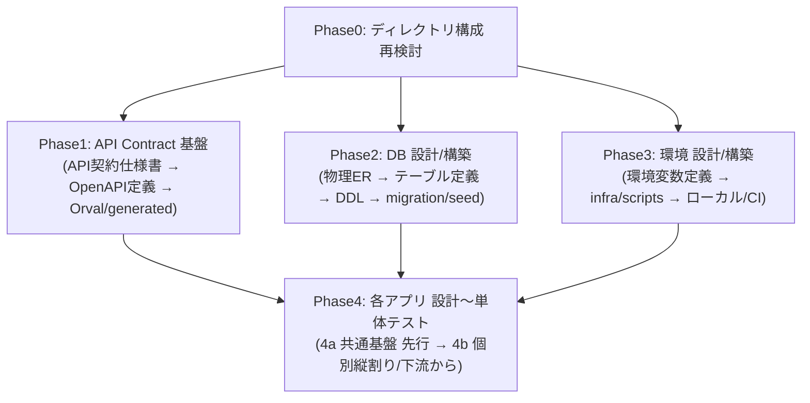

# 実装フェーズ実行プロセス設計書

## 1. 目的

本ドキュメントは、**06_実装設計 から 07_開発・単体テスト**（以下「実装フェーズ」）を、再現性のある段取りで実行するための**プロセス正本**である。

これまで実装フェーズの進め方は、個別チャット・一時メモ・複数の正本docs（[プロジェクト工程定義](./プロジェクト工程定義.md) / [成果物一覧×Task Definition化方針書](../AIエージェント運用/成果物一覧×Task%20Definition化方針書.md) / [Contract Gate運用設計書](../AIエージェント運用/Contract%20Gate運用設計書.md) / [プロジェクトディレクトリ構成定義書](../ディレクトリ構成/プロジェクトディレクトリ構成定義書.md) ほか）に分散していた。本書はそれらを横断し、「**どのPhaseを、どの順序で、どの単位（Epic/Task）に分割し、どこを並列化するか**」を一望できる正本として整理する。

本書では、以下を定義する。

- 設計・開発プロセスの考え方（今後の個人開発でも再利用できる原則）
- 実装フェーズの段取り（Phase0〜Phase4 / 4a共通基盤先行・4b個別縦割り）
- 各PhaseのEpic/Task分割・依存・並列（worktree/マルチエージェント）方針
- L2実行の進め方（既存Command/Definition基盤への載せ方）

---

## 2. 適用範囲と正本関係

### 2.1 適用範囲

本書は、アプリケーション設計（05）が概ね完成し、実装フェーズ（06→07）に着手する段階で参照する。Cycleをまたいで再利用する「プロセスの考え方」と、今回Cycleの具体段取りの両方を含む。

### 2.2 正本関係（本書の位置づけ）

本書は**プロセスの考え方と段取りの正本**である。個別の方針・規約の詳細は既存正本を正とし、本書は要点＋参照に留める（[docs-consistency](../../../.cursor/rules/docs-consistency.mdc) の重複抑制）。

| 対象 | 正本 | 本書での扱い |
| ---- | ---- | ------------ |
| 工程定義（01〜15・06→07順序） | [プロジェクト工程定義](./プロジェクト工程定義.md) | 参照（段取りの土台） |
| Task化単位・Epic粒度・Epic間依存 | [成果物一覧×Task Definition化方針書](../AIエージェント運用/成果物一覧×Task%20Definition化方針書.md) §3〜§5 | 参照（分割表の根拠） |
| API契約確定ゲート | [Contract Gate運用設計書](../AIエージェント運用/Contract%20Gate運用設計書.md) | 参照（Phase1→4の前提） |
| ディレクトリ・配置 | [プロジェクトディレクトリ構成定義書](../ディレクトリ構成/プロジェクトディレクトリ構成定義書.md) | 参照（Phase0の対象） |
| Command実行手順 | `.cursor/commands/*.md` | 参照（L2実行手順） |
| 実装フェーズの段取り・並列方針 | **本書** | **正本** |

> 本書はプロセスの正本であり、方針そのものを変更するものではない。既存正本との矛盾を発見した場合は、推測で解消せず Human 確認へ回す（[project-operation](../../../.cursor/rules/project-operation.mdc) §6）。

---

## 3. 設計・開発プロセスの考え方（再利用可能な原則）

実装フェーズを進めるうえで、Cycleをまたいで再利用できる原則を以下に定める。

| 原則 | 内容 | 根拠・狙い |
| ---- | ---- | ---------- |
| 1. 基盤先行 → 縦割り | 横断的な基盤（契約・共通資産）を先に固め、その後に機能単位の縦割り実装を積み上げる | 縦割り内での重複実装・横断衝突を防ぐ |
| 2. API契約先行（Contract Gate） | API契約（人間可読契約＋OpenAPI）を確定し、Gate通過を実装着手の前提にする | provider/consumer の手戻り・I/F不整合を防ぐ |
| 3. 共通基盤の横断Epic化 | 共通資産（共通UI / middleware / domain中核 / infra client 等）は特定の機能Epicに所有させず、`allowed_paths`=共通ディレクトリの**横断Epic**として先行する | 複数Epicが共通ディレクトリを奪い合う `allowed_paths` 逸脱を防ぐ |
| 4. 依存の下流からの積み上げ | 実装の縦割りは依存の下流（被呼び出し側）から着手する | 上流が下流の確定I/Fを前提に実装できる |
| 5. 過剰設計回避＋還元ループ | 共通基盤は「確実に共通な中核」とI/F・デザインルールのみ先行し、細部は縦割り中に共通基盤へリファクタ還元する | 先に作り込みすぎる無駄を避ける |
| 6. 各アプリ「共通基盤 → 個別縦割り」の2段構成 | Web / API / Reco / Batch とも、共通基盤（4a）→ 個別縦割り（4b）の2段で進める | 原則1〜5をアプリ単位に適用した形 |
| 7. Phaseの薄い依存は並列化 | 相互依存が薄いPhase/基盤は別worktree・別エージェントで並列実行する | スループット向上（[worktree](../../../.cursor/rules/worktree.mdc)） |
| 8. 1成果物=1Task / 1Task=1Branch=1PR | Task粒度は1成果物、Epic粒度は識別子単位を原則とする | 既存方針（成果物化方針書 §3・§3.5、AGENTS.md §12）に準拠 |

---

## 4. 段取り全体像（Phase0〜Phase4）

提案順序（ディレクトリ → API Contract → DB → 環境 → 各アプリ設計〜単体テスト）を基本採用し、(A) API契約仕様書の先行差し込み、(B) 各アプリの「共通基盤先行 → 個別縦割り」化、の2点を補正する。



| 順序 | 並列可否 | 説明 |
| ---- | -------- | ---- |
| Phase0 | 単独先行 | 全体の前提（`allowed_paths` 等の確定）。完了まで他Phaseの本格着手を避ける |
| Phase1〜3 | 相互に並列可 | Phase0完了後は依存が薄く、別worktree並列可 |
| Phase4 | Phase1〜3完了後 | 基盤が揃ってから着手。内部は 4a → 4b |

### 4.1 API契約仕様書まわりの前提（補正A）

API契約の雛形は3種で役割分担する（[api-contract-spec.md](../../../prompts/templates/docs/api-contract-spec.md) 冒頭の役割分担）。本書は契約Task / 実装Taskを**分離した「分離後モデル」を正**とする（進行中の `contract-impl-task-separation` Epic の結論を前提）。

| 雛形 | 役割 | 正本/扱い |
| ---- | ---- | --------- |
| `api-contract-spec.md`（API契約仕様書） | 人間可読のAPI契約（I/F確定面）。Contract Taskで確定し Contract Gate の前提 | Phase1（契約） |
| `openapi-spec.md`（OpenAPI定義書） | 機械可読のOpenAPI定義（Orval生成入力） | Phase1。正本 `packages/contracts/openapi/*.yaml` |
| `api-implementation-spec.md`（API実装仕様書） | 確定契約・generatedを前提とした内部実装仕様 | Phase4（実装設計） |

> 現行の成果物化方針書 §3 / §5 は「`api-contract-spec.md` + `api-implementation-spec.md`（1成果物に統合）」と記載されている。本書は分離後モデルを前提とするため、両者が分離されるまでの過渡期は、進行中 Epic の確定結果を優先する（不整合がHuman判断を要する場合は停止）。

### 4.2 各アプリの2段構成（補正B）

各アプリ（Web / API / Reco / Batch）とも「共通基盤（横断Epic・先行）→ 個別縦割り（実装設計→実装→単体テスト）」の2段で進める。共通基盤を縦割り内で作ると重複実装または横断衝突に陥るため、横断Epic（`allowed_paths`=共通ディレクトリ）として先行する。

> 実例: [SCR-002 epic.yaml](../../../prompts/definitions/epics/scr-002-recommendation-input/epic.yaml) の `allowed_paths` は共通UI（`apps/web/src/components/**`）を含まない。共通UIは画面Epicの所有物ではなく、横断Epicで先行する必要がある。

---

## 5. 各Phase詳細

### Phase0: ディレクトリ構成 再検討

- monorepo全体（`apps/` `packages/` `db/` `infra/` `scripts/` `docs/`）を点検し、必要なら [プロジェクトディレクトリ構成定義書](../ディレクトリ構成/プロジェクトディレクトリ構成定義書.md) を見直す。
- 既知の不整合を解消: `AGENTS.md` のツリー例の旧 `openapi/` 表記 vs 正本 `packages/contracts/`（[2026-06-01 human-decision](../../../ai-logs/human-decisions/2026-06-01-openapi-contract-home-packages-contracts.md)）。
- 進行中Epicの結論を取り込む: `reco-directory-architecture-redesign`（reco構成）、`contract-impl-task-separation`（Contract正本パス・Gate）。
- generated配置（`apps/web/src/generated/api/`・`apps/api/src/generated/reco-client/`）と各Definitionの `allowed_paths` / 旧 `openapi/` 参照を最新パスへ整合。
- **出力**: 更新版 構成定義書 + `AGENTS.md` / Definitions のパス整合。破壊的な再構成が必要な場合はHuman承認を要する。

### Phase1: API Contract 基盤

- **1a API契約仕様書**（06設計 / Contract Task）: `api-contract-spec.md` 準拠で API-PUB-002 / API-INT-002 ほか（[API一覧](../../05_アプリケーション設計/アプリ/api/API一覧.md) 定義済み10本）の契約面を確定。
- **1b OpenAPI定義**（Contract Task）: `openapi-spec.md` 準拠で `packages/contracts/openapi/public-api.yaml` / `internal-reco-api.yaml` を作成。
- **1c Orval設定 + generated生成**（Contract Task）: `orval.config.ts` → web/api の generated。
- **Contract Gate**: [Contract Gate運用設計書](../AIエージェント運用/Contract%20Gate運用設計書.md) 通過を、実装Task（Phase4b / `api-implementation-spec.md`）の開始条件として明文化。

### Phase2: DB 設計/構築

- 物理ER → enum/コード定義 → テーブル定義書 → DDL → `db/migrations` / `db/seeds` → データ保持・削除方針書。
- 入力は完成済みの [論理ER](../../05_アプリケーション設計/アプリ/database/論理ER.md) / 正本定義表。

### Phase3: 環境 設計/構築

- 環境変数定義書（既存 [環境設計書](../../06_実装設計/cross_cutting/環境設計書.md) / [基盤構成設計書](../../06_実装設計/cross_cutting/基盤構成設計書.md) を入力）→ `.env.example` → `infra/` / `scripts/` → ローカル開発手順 / CI基盤。

### Phase4: 各アプリ 設計〜単体テスト（共通基盤先行 → 個別縦割り）

原則: 各アプリとも「共通基盤（横断Epic・先行）→ 個別縦割り」の2段（§3 原則6、§4.2）。

#### Phase4a: アプリ横断＆各アプリ共通基盤（先行）

| 対象 | 共通基盤の範囲（例） |
| ---- | -------------------- |
| アプリ横断（`packages/`） | `code-definitions`（Feature/Semantic/error_code 等。Phase2 enumと整合）/ `shared-logic`（Feature Engine・正規化・Meaning射影、reco/batch共通）/ `shared-types` / `test-fixtures` |
| Web | デザインルール・`UIコンポーネント一覧` → `apps/web/src/components/**`・`src/styles/**`（共通UI）→ `tests/component/` |
| API | `src/middlewares/`（validation/error/CORS）+ `src/infrastructure/logger/`（trace_id/error_log）+ `src/infrastructure/db/`（Repository基盤）+ 共通 error response + reco-client wrapper 基盤 → `tests/unit/` |
| Reco | 推薦パイプライン基盤（`pipeline/` input_parse〜reason の枠）+ `domain/`（推薦ドメイン中核）+ `infrastructure/`（db/vector_store/external_ai/logger）+ `config/` → `tests/unit/` |
| Batch | `infrastructure/` 共通（rakuten client/db writer/object_storage/external_ai/logger）+ `application/` + `config/` 基盤 → `tests/unit/` |

#### Phase4b: 各単位の縦割り（共通基盤前提）

- 順序（下流から）: `MOD-RECO-001` → `API-INT-002` → `API-PUB-002` → `SCR-002`、`BATCH` は並列可。
- 各単位で `06実装設計仕様書 → 07実装 → 07単体テスト` を一気通貫。実装設計仕様書はアプリ別雛形（API=`api-implementation-spec.md` / Web=画面仕様書 / Reco=モジュール仕様書 / Batch=バッチ仕様書）。
- 前提: API系の実装Task着手は Phase1 の Contract Gate 通過、SCR は Web共通基盤(4a)、各モジュール/ジョブはアプリ共通基盤(4a) の完了。
- 還元ループ: 縦割り中に新たな共通化候補が出たら共通基盤(4a)へリファクタ還元（§3 原則5）。
- Epic Projects Phase は完了ゲート `07_開発・単体テスト`、子Taskで 06/07 を分ける（成果物化方針書 §3.5.1）。

---

## 6. Phase別 Epic/Task 分割表（L2実行の設計図）

各Phaseの「Epic候補 / Task候補 / Definition種別 / 依存 / 並列方針」を一覧化する。粒度・依存・Epic間依存の根拠は成果物化方針書 §3.5 / §5 を正とし、本表はその実装フェーズ向けの具体化である。

> 凡例: 並列方針の「並列可」は別worktree・別エージェントでの同時実行が可能なことを示す（[worktree](../../../.cursor/rules/worktree.mdc)）。

### 6.1 Phase0（ディレクトリ構成 再検討）

| Epic候補 | Task候補 | Definition種別 | 依存 | 並列方針 |
| -------- | -------- | -------------- | ---- | -------- |
| 機能・領域単位Epic（`directory-structure-review`） | ① 構成定義書 再点検・更新 / ② `AGENTS.md`・Definitions の旧 `openapi/` 参照整合 / ③ generated配置パス整合 | `task-definition` | 進行中 `reco-directory-architecture-redesign` / `contract-impl-task-separation` の結論 | ②③は①確定後に着手。①は単独先行 |

### 6.2 Phase1（API Contract 基盤）

| Epic候補 | Task候補 | Definition種別 | 依存 | 並列方針 |
| -------- | -------- | -------------- | ---- | -------- |
| `API-PUB-002` / `API-INT-002` ほか（識別子単位Epic） | 1a API契約仕様書（1 API = 1Task） | `task-definition`（契約面） | Phase0 | API単位で並列可 |
| 同上 | 1b OpenAPI定義（1 API変更 = 1Contract Task） | `contract-definition` | 1a | generated影響のため契約Taskを直列化 |
| 横断Epic（`api-contract-orval` 等） | 1b OpenAPI定義（横断） / 1c Orval設定 + generated生成 | `contract-definition` | 1a | generated一括生成は集約（並列不可） |
| **Phase1 マイルストーン Epic**（機能・領域単位・例外。例: `phase1-api-contract-foundation`） | 第1波/第2波の契約 docs + OpenAPI + generated を **1 本の Epic PR で `develop` に統合** | `epic` | 識別子 Epic / 横断 Epic 上の Phase1 成果 | 第1波完了後に第2波マイルストーンを同型で実施 |

**Phase1 と `develop` 反映の使い分け（案A）:**

| 管理単位 | Phase1 作業 | `develop` への反映タイミング |
| -------- | ----------- | ---------------------------- |
| 識別子単位 Epic（`API-PUB-002` / `API-INT-002` 等） | 1a 契約仕様書・Phase4b 縦串（実装仕様書→実装→単体テスト） | **Phase4b 縦串完了時の Epic PR のみ**（Phase1 単体では merge しない） |
| 横断 Epic（`api-contract-orval` 等） | 1b OpenAPI / 1c Orval・generated（識別子 Epic Branch または横断 Branch 上） | 識別子 Epic PR ではなく **Phase1 マイルストーン Epic PR** 経由 |
| Phase1 マイルストーン Epic | 識別子/横断 Branch 上の Phase1 成果を staging 統合し Contract Gate 確認 | **第1波/第2波ごとに 1 本の Epic PR → `develop`** |

- 識別子 Epic Branch 上の Contract Gate は **マイルストーン Epic PR 前の staging 確認**として実施する。
- Phase4b 実装 Task の前提は、対象 API の **Phase1 マイルストーン Epic が `develop` に merge 済み**であること（[Contract Gate運用設計書](../AIエージェント運用/Contract%20Gate運用設計書.md) §4 / §6）。

### 6.3 Phase2（DB 設計/構築）

| Epic候補 | Task候補 | Definition種別 | 依存 | 並列方針 |
| -------- | -------- | -------------- | ---- | -------- |
| 機能・領域単位Epic（`db-physical-design`） | ① 物理ER / ② enum・コード定義 / ③ テーブル定義書（1テーブル=1Task） / ④ DDL（1変更=1Task） / ⑤ migration・seed / ⑥ データ保持・削除方針書 | `task-definition`（③④は表/DDL） | Phase0。入力は論理ER（完成済み） | ①→②→③（テーブル単位で並列可）→④→⑤の順。②はPhase4a `code-definitions` と整合 |

### 6.4 Phase3（環境 設計/構築）

| Epic候補 | Task候補 | Definition種別 | 依存 | 並列方針 |
| -------- | -------- | -------------- | ---- | -------- |
| 機能・領域単位Epic（`environment-setup`） | ① 環境変数定義書 / ② `.env.example` / ③ `infra/`・`scripts/` / ④ ローカル開発手順 / ⑤ CI基盤 | `task-definition` | Phase0。入力は環境設計書・基盤構成設計書（既存） | Phase1・Phase2と並列可。①→②→③→④/⑤ |

### 6.5 Phase4a（共通基盤・先行）

| Epic候補 | Task候補 | Definition種別 | 依存 | 並列方針 |
| -------- | -------- | -------------- | ---- | -------- |
| 横断Epic（`packages-foundation`） | code-definitions / shared-logic / shared-types / test-fixtures | `task-definition` | Phase2（enum整合）・Phase1（型整合） | パッケージ単位で並列可 |
| 横断Epic（`web-foundation`） | デザインルール・共通UIコンポーネント・styles・component test | `task-definition` | Phase0 | API/Reco/Batch基盤と並列可 |
| 横断Epic（`api-foundation`） | middleware / logger / db Repository基盤 / 共通error / reco-client wrapper基盤 | `task-definition` | Phase1（contract）・Phase3（env） | Web/Reco/Batch基盤と並列可 |
| 横断Epic（`reco-foundation`） | pipeline枠 / domain中核 / infrastructure / config | `task-definition` | Phase1・Phase2・Phase3 | 他基盤と並列可 |
| 横断Epic（`batch-foundation`） | infrastructure共通 / application / config基盤 | `task-definition` | Phase2・Phase3 | 他基盤と並列可 |

### 6.6 Phase4b（個別縦割り・共通基盤前提）

| Epic候補（識別子単位） | Task候補 | Definition種別 | 依存 | 並列方針 |
| ---------------------- | -------- | -------------- | ---- | -------- |
| `MOD-RECO-001`（Recommendation Orchestrator） | モジュール仕様書 → 実装 → 単体テスト | `task-definition` | Phase4a `reco-foundation` | 最下流。先行着手 |
| `API-INT-002`（Reco推薦実行） | API実装仕様書 → 実装 → 単体テスト | `task-definition` | Contract Gate(Phase1)・`api-foundation`・`MOD-RECO-001` | MOD-RECO後 |
| `API-PUB-002`（レコメンド実行） | API実装仕様書 → 実装 → 単体テスト | `task-definition` | Contract Gate(Phase1)・`api-foundation`・`API-INT-002` | API-INT後 |
| `SCR-002`（レコメンド条件入力画面） | 画面仕様書 → 実装 → 単体テスト | `task-definition` | `web-foundation`・`API-PUB-002` | API-PUB後 |
| `BATCH-*`（楽天商品取り込み等） | バッチ仕様書 → 実装 → 単体テスト | `task-definition` | Phase4a `batch-foundation` | fixtureで単体テスト可。相対的に並列可 |

> 縦割りの依存方向は成果物化方針書 §3.5.3（SCR → API-PUB → API-INT → MOD-RECO）に従う。本表は「下流から積み上げる」着手順を示す。

---

## 7. L2実行の進め方（既存Command/Definition基盤への載せ方）

Phase0〜4の実作業（L2）は、既存のCommand/Definition基盤に載せてEpic/Task化し、worktree分離・マルチエージェントで段階実行する。

### 7.1 実行フロー

```text
Definition作成（prompts/definitions/epics|tasks/<workstream>/**）
 ↓
/start-epic   … Epic Issue起票 → workflowがEpic Branch作成・Project同期
 ↓
/start-task   … Task Issue起票 → workflowがTask Branch作成（base=親Epic Branch）
 ↓
/work-issue   … 実作業（成果物作成・実装・単体テスト）
 ↓
/create-pr    … Task PR（target=親Epic Branch）
 ↓
/review-pr    … AI Review
 ↓
Human Review → Human merge
```

- 基本単位: `1 Epic = 1領域/成果物群`、`1 Task = 1成果物`、`1 Task = 1 Branch = 1 PR`（AGENTS.md §12）。
- Issue起票後の Branch作成・Project同期・Label付与は `issue-metadata-project-branch.yml` が自動実行する（Issue本文の `###` 機械可読セクションを使用）。
- machine account（`okuri-ai-bot`）でcommit/push/PR、Human Review/mergeは `ryo-chan-k6`（[AI機械アカウント運用設計書](../AIエージェント運用/AI機械アカウント運用設計書.md)）。

### 7.2 並列・マルチエージェント方針

| 段階 | 並列方針 |
| ---- | -------- |
| Phase0 | 単独先行（全体の `allowed_paths` 確定が前提） |
| Phase1〜3 | 相互依存が薄く、別worktreeで並列可 |
| Phase4a | 基盤（packages / Web / API / Reco / Batch）ごとに別エージェント並列可 |
| Phase4b | 下流から積み上げ（MOD-RECO → API-INT → API-PUB → SCR、Batch並列）。API系はContract Gate、SCR/各モジュール/各ジョブは4a完了が前提 |

- worktree運用は [worktree](../../../.cursor/rules/worktree.mdc) に従い、`1 Task Branch = 1 worktree`、同一worktree/Branchの同時編集を避ける。

---

## 8. Human判断ポイント（停止/確認）

- 新規・既存正本docs間の矛盾、方針そのものの変更が必要になった場合。
- Phase0で大規模なディレクトリ再構成（破壊的影響）が必要になった場合。
- 各PhaseのEpic/Task分割粒度の妥当性。
- 各Phase EpicのPR最終merge判断。
- API破壊的変更・DB schema変更・generated横断影響が発生する場合。

---

## 9. 関連ドキュメント

| ドキュメント | 関係 |
| ------------ | ---- |
| [プロジェクト工程定義](./プロジェクト工程定義.md) | 工程06→07の正本順序 |
| [成果物一覧×Task Definition化方針書](../AIエージェント運用/成果物一覧×Task%20Definition化方針書.md) | Task化単位・Epic粒度・Epic間依存（§3〜§5） |
| [Contract Gate運用設計書](../AIエージェント運用/Contract%20Gate運用設計書.md) | Phase1→Phase4bの契約ゲート |
| [プロジェクトディレクトリ構成定義書](../ディレクトリ構成/プロジェクトディレクトリ構成定義書.md) | Phase0の対象・配置正本 |
| [AIエージェント活用型 開発運用フロー設計書](../AIエージェント運用/AIエージェント活用型_開発運用フロー設計書.md) | AI運用全体フロー |
| `.cursor/commands/*.md` | L2実行の各Command手順 |
| [worktree](../../../.cursor/rules/worktree.mdc) | 並列作業の安全条件 |
