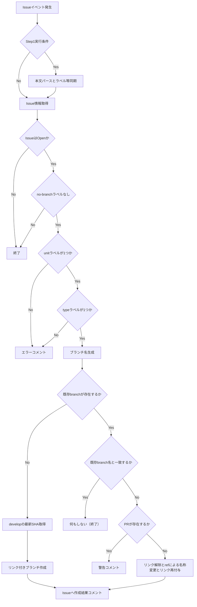

# Issue同期とブランチ作成ワークフロー

## 1. ワークフローツール

本ワークフローは **GitHub Actions** を利用して実装する。

実装ファイル：`.github/workflows/issue-opened-sync-metadata-and-branch.yml`（表示名: **Issue metadata sync and create branch**）

Project の **Phase / Priority / Area** を Issue 本文から同期する処理は別ワークフロー（`.github/workflows/issue-opened-set-project-fields-from-issue-body.yml`）。仕様の正本は [Issue作成時Projectフィールド同期ワークフロー.md](./Issue作成時Projectフィールド同期ワークフロー.md)。フィールド一覧は [Projects運用ルール](../Projects運用ルール.md) を参照。

### 1.1 目的（2段階）

1. **Issue メタデータ同期（Step 1）**  
   Task 用 Issue フォーム（`.github/ISSUE_TEMPLATE/base.yml`）から作成された Issue の本文（`### 見出し` 形式）を読み取り、次を自動設定する。
   - **Labels**: `unit:*` / `type:*` / `area:*` / `priority:*` / `ai-agent` / `human-led` / 補助（`blocked` / `risk: high` / `no-branch`）
   - **Milestone**: ドロップダウン値がリポジトリのオープンな Milestone タイトルと一致する場合に紐づけ。「なし」で Milestone を外す。
   - **Relationships（Sub-issue）**: 親 Issue 欄の `#番号` を親の **Issue `number`** として解釈し、REST `POST .../issues/{parent_number}/sub_issues` で子を追加する。ボディの `sub_issue_id` は **`#` 表示番号ではなく**、子 Issue の REST オブジェクトの **`id`（数値 ID）** を渡す（GitHub API 仕様）。
2. **作業ブランチの作成・リネーム（Step 2）**  
   Issue の状態・**同期後の**ラベル情報に基づき、作業用ブランチを作成またはリネームする。

併せて、作成した作業ブランチを **Issue の Development（リンク済みブランチ）として表示可能な状態** にすることを要件とする。単に Git の `refs/heads/...` を追加するだけでは Development に表示されない場合があるため、Issue との **linked branch** を張る API（後述の GraphQL `createLinkedBranch` 等）を用いる。

### 1.2 `GITHUB_TOKEN` による再トリガーについて

Step 1 が `GITHUB_TOKEN` で Issue を更新しても、同一リポジトリ内の別ワークフロー実行は原則 **自動では起動しない**（GitHub の制限）。そのため **`issues.opened` の同一実行内**で Step 1 の直後に Step 2 を走らせ、ラベル付与後のブランチ作成を完結させる。

人が UI でラベルを変更した場合は従来どおり `labeled` / `unlabeled` / `edited` で本ワークフローが再実行され、Step 1 は条件によりスキップされ、Step 2 のみが評価される。

対象リポジトリ：

```
GiftRecommendAPP_MVP_CYCLE_3
```

## 2. トリガー（イベント定義）

以下のイベントをトリガーとする。

| トリガー        | 内容                                         |
| --------------- | -------------------------------------------- |
| Issue作成       | Issueが新規作成された場合                    |
| Issueラベル変更 | `unit:*` / `type:*` 等が付与・変更された場合 |
| 手動実行        | GitHub Actions画面から再実行する場合         |

GitHub Actions上の想定：

```
on:
  issues:
    types:
      - opened
      - labeled
      - unlabeled
      - edited
  workflow_dispatch:
    inputs:
      issue_number: ...
      dry_run: ...
      sync_metadata: ...  # true のときのみ Step 1 を実行（既定 false）
```

補足：

- **Step 1（メタデータ同期）**が実行されるのは `issues.opened`、または `workflow_dispatch` で `sync_metadata` が `true` のときのみ。それ以外の Issue イベントでは Step 1 はスキップし、Step 2（ブランチ処理）のみ行う。
- ProjectsのStatus変更を直接トリガーにするのはGitHub Actions標準では扱いづらいため、初期運用では対象外とする。
- Status連動が必要な場合は、別途Projects連携ワークフローで対応する。

### Step 1（メタデータ同期）仕様

| 項目 | 内容 |
| ---- | ---- |
| 対象本文 | Issue 本文に `### 作業単位` が含まれる場合のみ Task フォームとみなし同期する。含まれない場合は no-op（手動作成 Issue 等）。 |
| ラベル合成 | フォームから算出した **管轄ラベル**（上記プレフィックスおよび補助ラベル）を置き換え、それ以外の既存ラベルは維持する。 |
| unit/type 検証 | フォームから `unit:*` および `type:*` がそれぞれ1つに確定できない場合はラベル・Milestone・親子の同期を行わない（警告ログ）。 |
| Milestone | セクション「プロジェクト工程」が存在し、先頭行が `なし` なら Milestone 解除。それ以外はオープンな Milestone のタイトルと **完全一致** で解決。見つからない場合は Issue コメントで警告（ブランチ処理は続行）。 |
| 親子 | 親Issue欄の `#数字` で親の `number` を決定し、子は `issues.get` の **`id`** を `sub_issue_id` に渡して Sub-issue を登録。自分自身・親が Open でない・API 失敗時はコメントで通知しブランチ処理は続行。API 失敗時のコメントには **`status` とレスポンス本文の先頭**を含め、原因切り分けに使う。 |
| dry_run | `workflow_dispatch` の `dry_run=true` のとき、Step 1 も API 呼び出しを行わずログのみ。 |

### Issue フォーム本文のパース

GitHub Issue forms は各フィールドを `### {フィールドのラベル}` 見出し以下に保存する。Step 1 は [base.yml](../../../../.github/ISSUE_TEMPLATE/base.yml) の `attributes.label` と同一の見出し文字列でセクションを抽出する。

- **対象領域（複数選択）**: 改行・カンマ・読点で分割し、`area:*` に変換する。実際のレンダリングが変わった場合はサンプル Issue の本文を確認してパーサを調整する。

### Milestone とテンプレートの運用

Issue テンプレートの「プロジェクト工程」ドロップダウン `options` は、リポジトリの **オープンな Milestone タイトル** と一致させること。Milestone を追加・改名したら **テンプレートも追随**する。

## 3. 対象スコープ

以下のIssueを対象とする。

| 条件       | 内容                                         |
| ---------- | -------------------------------------------- |
| Issue種別  | GitHub Issue                                 |
| Issue状態  | Open                                         |
| リポジトリ | 本リポジトリ内のIssue                        |
| 作業単位   | `unit: epic` または `unit: task` を持つIssue |
| 作業種別   | `type:*` を持つIssue                         |

対象外：

| 対象外                      | 理由                     |
| --------------------------- | ------------------------ |
| Closed Issue                | 作業対象外               |
| Pull Request                | PRは対象外               |
| ラベル不足Issue             | ブランチ名を確定できない |
| 既にブランチ作成済みのIssue | 二重作成防止             |

## 4. 作成条件

以下をすべて満たす場合にブランチを作成する。

| 条件                             | 内容                           |
| -------------------------------- | ------------------------------ |
| IssueがOpenである                | 作業対象であること             |
| `unit:*` が1つだけ付与されている | `epic` / `task` を判定するため |
| `type:*` が1つだけ付与されている | branch prefixを判定するため    |
| ブランチ未作成である             | 二重作成防止                   |
| ブランチ作成対象外ラベルがない   | 例：`no-branch`                |

推奨する対象ラベル：

```
unit: epic
unit: task

type: feature
type: fix
type: docs
type: refactor
type: chore
type: test
type: hotfix
type: spike
```

任意で除外ラベルを定義する。

```
no-branch
```

## 5. インプット

本ワークフローは、Issueのメタデータをインプットとする。

| インプット          | 取得元       | 用途              |
| ------------------- | ------------ | ----------------- |
| Issue番号           | Issue number | ブランチ名に利用  |
| Issueの Node ID   | GraphQL `repository.issue` 等 | `createLinkedBranch` の `issueId` に利用 |
| Issueタイトル       | Issue title  | summary生成に利用 |
| Issue状態           | Issue state  | Open判定          |
| Issue本文（Step 1） | `issues.opened` の payload または `issues.get` | Task フォームの場合、ラベル・Milestone・親子の同期 |
| Labels（Step 2）    | Issue labels（Step 1 後の `issues.get`） | unit/type 判定   |
| Default base branch | 固定値       | 通常は`develop`   |
| 既存branch一覧      | Git refs API | 二重作成判定      |
| Milestone 一覧      | REST `issues.listMilestones` | Step 1 でタイトル解決 |

REST API の Issue 取得だけでは Node ID が得られない場合があるため、実装では GraphQL で Issue を解決する、または同等の方法で Node ID を取得する。

### Issue とブランチのリンク（Development）

GitHub Issue 右ペインの **Development** にブランチが表示されるには、Issue に **リンクされたブランチ（linked branch）** として登録されている必要がある（Issue 画面の「Create a branch」と同様のメタデータ）。Pull Request を Issue に紐づける方法でも Development 周辺の表示は更新されるが、本ワークフローは **ブランチ作成時点で linked branch を張る** ことを必須とする。

| 項目 | 内容 |
| ---- | ---- |
| 新規作成 | **GraphQL の `createLinkedBranch` ミューテーション**（または GitHub がそれと同等のリンクを張る公式 API）を用い、`develop` 先端のコミット OID と決定したブランチ名で **リンク付きブランチを作成**する。 |
| REST のみ | **`git.createRef`（REST）のみでのブランチ作成は採用しない**（リンクが張られず、Development に表示されないため）。 |
| 参考 | [createLinkedBranch](https://docs.github.com/en/graphql/reference/mutations#createlinkedbranch)、[Changelog（linked branch 用 GraphQL）](https://github.blog/changelog/2022-10-31-graphql-apis-for-creating-a-branch-linked-to-an-issue/) |

#### 既存ブランチの名称変更（rename）とリンクの扱い（方針A）

Git の ref に対する「新規作成 → 検証 → 旧 ref 削除」は従来どおり **ref レベル**で行う。一方、Issue の Development に期待ブランチ名が正しく載るよう、**linked branch のメタデータと ref の整合**を取る。方針は次とする（**方針A**）。

1. **旧ブランチの Issue リンクを解く**  
   Issue に紐づく linked branch を解除する（例: GraphQL `deleteLinkedBranch`。入力は linked branch の ID 等、実装時に GitHub のスキーマに従う）。
2. **Git ref による名称変更**  
   既存の「ブランチ名変更の実装制約」に従い、旧 branch の先端 SHA を維持したまま新名称の ref を作成し、検証後に旧 ref を削除する。実装上は `createLinkedBranch` で期待名の ref を同一 SHA で作成し、その後に旧 ref を削除する手順とする。
3. **期待ブランチ名でリンクを付け直す**  
   手順 2 の `createLinkedBranch` により、期待名のブランチが Issue にリンクされる。  
   手順 2 と 3 の順序・API の組み合わせは、GitHub の制約（例: 既存 ref と `createLinkedBranch` の競合）に合わせて実装時に確定する。原則として **名称変更後も Issue の Development に期待ブランチ名が表示されること** を満たす。

利用する主なラベル：

| ラベル分類 | 例           | 用途         |
| ---------- | ------------ | ------------ |
| 作業単位   | `unit: task` | branch scope |
| 作業種別   | `type: docs` | branch type  |
| 除外       | `no-branch`  | 作成対象外   |

## 6. 処理ロジック

処理フローは以下とする。



### 処理詳細

| 処理         | 内容                                                                                                                                                         |
| ------------ | ------------------------------------------------------------------------------------------------------------------------------------------------------------ |
| Issue取得    | イベントpayloadから Issue 情報を取得する。linked branch 操作用に **Issue の Node ID** が必要な場合は GraphQL 等で解決する。 |
| Label判定    | `unit:*` / `type:*` を抽出                                                                                                                                   |
| 除外判定     | `no-branch` があれば終了                                                                                                                                     |
| branch名生成 | 命名ルールに従って生成                                                                                                                                       |
| 既存確認     | 下記の`既存確認処理詳細`を参照                                                                                                                               |
| 一致判定     | 生成したbranch名と既存branch名を比較                                                                                                                         |
| PR存在確認   | 対象branchに紐づくopen状態のPRが存在するか確認<br/>base / head 両方を確認し、対象branchがheadのPRを対象とする                                                |
| base取得     | `develop` の最新commit SHAを取得                                                                                                                             |
| branch作成   | ブランチ命名ルールに従った名称で **Issue にリンクした作業ブランチ** を作成する（GraphQL `createLinkedBranch` 等。単なる `git.createRef` のみとしない）。 |
| branch名変更 | **方針A** に従い、旧 linked branch の解除 → Git ref による安全な名称変更（下記「ブランチ名変更の実装制約」）→ 期待名でのリンク再付与を行う。 |
| 結果通知     | Issueにコメント投稿                                                                                                                                          |
| 警告通知     | PR存在時は自動変更せずIssueに警告コメント投稿                                                                                                                |

### 既存確認処理詳細

- 既存branchの特定は、Issue番号を基準に以下の手順で行う。
- ※本プロジェクトでは「1 Issue = 1 branch」の前提だが、人為ミス・過去データ・異常系を考慮し、複数検出時は自動処理せず検知のみを行う。

1. 既存branch検索
   - 以下の正規表現でbranchを検索する。
   ```
   ^.+/(epic|task)-<issue番号>-.*
   ```
2. 検索結果の評価 - 検索結果に応じて以下の処理を行う。
   | 件数 | 処理 |
   | ------- | -------------------------------- |
   | 0件 | 既存branch無しとして新規作成する |
   | 1件 | 対象branchとして扱う |
   | 2件以上 | 異常状態とみなし処理を停止し、Issueにエラーコメントを投稿する |

3. 異常時の処理
   - 複数branchが検出された場合は、自動で修正せず、手動対応とする。
   - Issueコメント例：

   ```
   対応するbranchが複数存在します。

   検出されたbranch：
   - feature/task-12-xxx
   - docs/task-12-yyy

   対応：不要なbranchを削除し、1つに統一してください。
   ```

### ブランチ名変更の実装制約

- Git のブランチ名に対する rename 専用 API はないため、ref レベルでは **`新branch作成（新名称）`→`旧branch削除`** の方法で実現する。Issue の Development との整合は上記 **方針A**（リンク解除 → `createLinkedBranch` 等による新 ref＋リンク → 旧 ref 削除）で行う。
- ref の変更について、下記チェックを行うこと。
  - 新branch作成後の旧branchの存在確認
  - 旧branch削除前の変更無し確認
    1. ブランチ名変更処理開始時点での旧branchのcommit SHAを取得
    2. 削除直前に再取得
    3. 処理開始時点のSHAと削除実行時点のSHAを比較し、不一致であれば処理中断
- ブランチ名変更を安全に行うために、以下の条件を満たす場合のみブランチ名の変更を実施することとする。

```
・PR未作成
・旧branchがremoteに存在する
・新branchが存在しない
・旧branchの最新commit SHAを取得できる
・新branch作成成功後のみ旧branch削除
```

## 7. ブランチ命名ルール

基本形式は以下とする。

```
<type>/<unit>-<issue番号>-<english-summary>
```

| 要素                | 取得元              | 例                       |
| ------------------- | ------------------- | ------------------------ |
| `<type>`            | `type:*` label      | `docs`                   |
| `<unit>`            | `unit:*` label      | `task`                   |
| `<issue番号>`       | Issue number        | `12`                     |
| `<english-summary>` | Issue titleから生成 | `update-branch-strategy` |

例：

```
docs/task-12-update-branch-strategy
feature/epic-20-api-recommendation
test/task-33-api-integration-test
chore/task-41-setup-project-fields
```

### type変換ルール

| Label            | Branch type |
| ---------------- | ----------- |
| `type: feature`  | `feature`   |
| `type: fix`      | `fix`       |
| `type: docs`     | `docs`      |
| `type: refactor` | `refactor`  |
| `type: chore`    | `chore`     |
| `type: test`     | `test`      |
| `type: hotfix`   | `hotfix`    |
| `type: spike`    | `spike`     |

### unit変換ルール

| Label        | Branch unit |
| ------------ | ----------- |
| `unit: epic` | `epic`      |
| `unit: task` | `task`      |

### summary生成ルール

- Issue Titleから英語kebab-caseのsummaryを下記方式にて生成する。

```
LLM生成 + sanitize + fallback
```

- LLM失敗時はfallbackし、`issue-<issue番号>`とする。

### 例

```
feature/task-12-issue-12
```

sanitizeルール：

```
・英小文字化
・空白はハイフン
・使用可能文字は a-z, 0-9, -
・連続ハイフンは1つに圧縮
・先頭/末尾のハイフンは削除
```

## 8. アウトプット

本ワークフローのアウトプットは以下とする。

| アウトプット       | 内容             |
| ------------------ | ---------------- |
| Git branch         | 作業用ブランチ（リモート ref） |
| Issue とブランチの関連 | Issue の **Development** に、当該作業ブランチが linked branch として表示される状態 |
| Issue comment      | 作成結果コメント |
| GitHub Actions log | 実行ログ         |

Issueコメント例：

```
ブランチを自動作成しました。

- Branch: `docs/task-12-update-branch-strategy`
- Base: `develop`
- Trigger: `issues.opened`
```

既に存在する場合：

```
対応ブランチは既に存在します。

- Branch: `docs/task-12-update-branch-strategy`
```

## 9. エラー処理 / 例外

| エラー                 | 処理                            |
| ---------------------- | ------------------------------- |
| `unit:*` が存在しない  | ブランチ作成せずIssueへコメント |
| `unit:*` が複数存在    | ブランチ作成せずIssueへコメント |
| `type:*` が存在しない  | ブランチ作成せずIssueへコメント |
| `type:*` が複数存在    | ブランチ作成せずIssueへコメント |
| `develop` が存在しない | ワークフロー失敗                |
| 同名ブランチが存在     | 正常終了扱い                    |
| summary生成失敗        | fallback summaryを使用          |
| GitHub APIエラー       | ワークフロー失敗                |
| GraphQL mutation 失敗（`createLinkedBranch` / `deleteLinkedBranch` 等） | ワークフロー失敗、または Issue コメントで通知（運用で決定） |
| 権限不足               | ワークフロー失敗                |

エラーコメント例：

```
ブランチを自動作成できませんでした。

理由：
- `type:*` ラベルが設定されていません。

対応：
- `type: docs` など、作業種別ラベルを1つ設定してください。
```

## 10. 冪等性設計

### 基本方針

同一Issueに対して複数回ワークフローが実行されても、常に**同一の最終状態に収束すること**を保証する。

### 冪等性方針

| 観点                     | 方針                         |
| ------------------------ | ---------------------------- |
| 同一Issueで再実行        | 同じbranch名を再生成する     |
| branch未存在             | 新規作成                     |
| branch存在かつ名称一致   | 何もしない                   |
| branch存在かつ名称不一致 | 条件に応じて名称変更         |
| PR未作成                 | branch名変更を許可           |
| PR作成済み               | branch名変更を行わず警告     |
| workflow_dispatch        | 常に再評価し必要な処理を実行 |

### branch名変更ポリシー

```
・branch名はIssueの最新状態（unit/type/title）に追従する
・ただし、PR作成後はbranch名を固定する
```

### 安全制約

| 制約           | 内容                       |
| -------------- | -------------------------- |
| PR存在時       | branch名変更禁止           |
| main / develop | 対象外                     |
| 同名branch存在 | 上書きしない               |
| rename失敗     | 旧branchを保持しエラー通知 |
| linked branch の再付与失敗 | 旧 ref を保持しエラー通知（中間状態を避けるため、実装でトランザクション性を担保すること） |

## 11. 権限 / 実行主体

- 実行主体は GitHub Actions とする。
- 必要権限は下記。

| 権限              | 用途              |
| ----------------- | ----------------- |
| `contents: write` | branch作成・ref 更新 |
| `issues: write`   | Issueコメント投稿 |
| `pull-requests: read` | オープン PR の head 判定（名称変更可否） |
| `contents: read`  | base branch参照   |

- `GITHUB_TOKEN` で GraphQL API（`https://api.github.com/graphql`）にアクセスし `createLinkedBranch` 等を呼び出す。通常、上記 `contents` / `issues` の権限で足りるが、実装時にミューテーションが拒否される場合は GitHub のドキュメントに従い必要な権限を追加する。
- OpenAI API等でsummary生成を行う場合は、Repository SecretsにAPI Keyを登録する。

```
OPENAI_API_KEY
```

## 12. 運用方法

### 基本運用

1. **Task** Issue テンプレートから Issue を作成する（必須フィールドを入力する）。
2. `issues.opened` でワークフローが実行され、**Step 1** でラベル・Milestone・親子が同期され、**Step 2** でブランチが作成される。
3. テンプレートを使わない場合は、従来どおり手動で `unit:*` / `type:*` 等を付与し、`labeled` / `edited` 等のイベントで **Step 2** が動作する（Step 1 は本文マーカーが無いためスキップ）。
4. 対応ブランチが作成され、Issue の **Development** に当該ブランチが表示されることを確認する。
5. 作業者またはAIエージェントがブランチをcheckoutして作業する。

### 手動再実行

- ブランチ作成に失敗した場合は、以下のいずれかで再実行する。
  - ラベル修正後に再度Issueを編集する
  - GitHub Actions の `workflow_dispatch` から手動実行する（**本文からラベル等をやり直す**場合は `sync_metadata=true`。既定では Step 1 はスキップされ Step 2 のみ）。

### 除外したい場合

- ブランチを作成しないIssueには以下を付与する。

```
no-branch
```

#### 例

```
- 調査メモ
- 議論用Issue
- ブランチ不要の管理Issue
```

### 作成後の作業

- 作業者は以下の流れで作業する。

```
git fetch origin
git checkout <created-branch>
```

#### 例

```
git fetch origin
git checkout docs/task-12-update-branch-strategy
```

### PR作成との関係

- 本ワークフローは **ブランチ作成と Issue への linked branch の付与** を行う。PR の作成は行わない。
- PR作成は別ワークフローで扱う。
- PR を開き Issue に紐づけた場合、Development の表示は **ブランチ** から **PR** に寄ることがある（GitHub の UI 挙動）。本仕様の必須要件は **ブランチ作成時点での linked branch 表示** とする。

| タスク種別 | PR作成           |
| ---------- | ---------------- |
| 人主導     | 手動作成         |
| AI主導     | Draft PR自動作成 |
