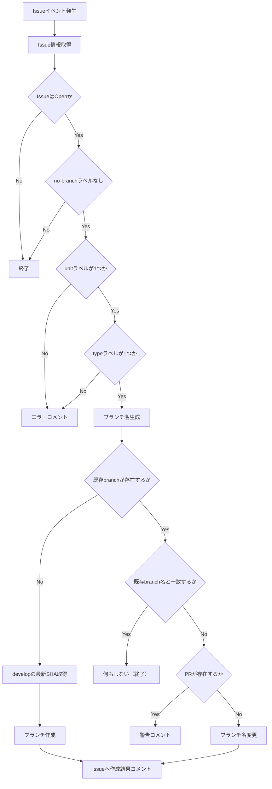

# ブランチ自動作成ワークフロー

## 1. ワークフローツール

本ワークフローは **GitHub Actions** を利用して実装する。

目的は、Issueの状態・ラベル情報に基づき、作業開始時に対応する作業用ブランチを自動作成することである。

対象リポジトリ：

```
GiftRecommendAPP_MVP_CYCLE_3
```

## 2. トリガー（イベント定義）

以下のイベントをトリガーとする。

| トリガー        | 内容                                         |
| --------------- | -------------------------------------------- |
| Issue作成       | Issueが新規作成された場合                    |
| Issueラベル変更 | `unit:*` / `type:*` 等が付与・変更された場合 |
| 手動実行        | GitHub Actions画面から再実行する場合         |

GitHub Actions上の想定：

```
on:
  issues:
    types:
      - opened
      - labeled
      - unlabeled
      - edited
  workflow_dispatch:
```

補足：

- ProjectsのStatus変更を直接トリガーにするのはGitHub Actions標準では扱いづらいため、初期運用では対象外とする。
- Status連動が必要な場合は、別途Projects連携ワークフローで対応する。

## 3. 対象スコープ

以下のIssueを対象とする。

| 条件       | 内容                                         |
| ---------- | -------------------------------------------- |
| Issue種別  | GitHub Issue                                 |
| Issue状態  | Open                                         |
| リポジトリ | 本リポジトリ内のIssue                        |
| 作業単位   | `unit: epic` または `unit: task` を持つIssue |
| 作業種別   | `type:*` を持つIssue                         |

対象外：

| 対象外                      | 理由                     |
| --------------------------- | ------------------------ |
| Closed Issue                | 作業対象外               |
| Pull Request                | PRは対象外               |
| ラベル不足Issue             | ブランチ名を確定できない |
| 既にブランチ作成済みのIssue | 二重作成防止             |

## 4. 作成条件

以下をすべて満たす場合にブランチを作成する。

| 条件                             | 内容                           |
| -------------------------------- | ------------------------------ |
| IssueがOpenである                | 作業対象であること             |
| `unit:*` が1つだけ付与されている | `epic` / `task` を判定するため |
| `type:*` が1つだけ付与されている | branch prefixを判定するため    |
| ブランチ未作成である             | 二重作成防止                   |
| ブランチ作成対象外ラベルがない   | 例：`no-branch`                |

推奨する対象ラベル：

```
unit: epic
unit: task

type: feature
type: fix
type: docs
type: refactor
type: chore
type: test
type: hotfix
type: spike
```

任意で除外ラベルを定義する。

```
no-branch
```

## 5. インプット

本ワークフローは、Issueのメタデータをインプットとする。

| インプット          | 取得元       | 用途              |
| ------------------- | ------------ | ----------------- |
| Issue番号           | Issue number | ブランチ名に利用  |
| Issueタイトル       | Issue title  | summary生成に利用 |
| Issue状態           | Issue state  | Open判定          |
| Labels              | Issue labels | unit/type判定     |
| Default base branch | 固定値       | 通常は`develop`   |
| 既存branch一覧      | Git refs API | 二重作成判定      |

利用する主なラベル：

| ラベル分類 | 例           | 用途         |
| ---------- | ------------ | ------------ |
| 作業単位   | `unit: task` | branch scope |
| 作業種別   | `type: docs` | branch type  |
| 除外       | `no-branch`  | 作成対象外   |

## 6. 処理ロジック

処理フローは以下とする。



### 処理詳細

| 処理         | 内容                                                                                                                                                         |
| ------------ | ------------------------------------------------------------------------------------------------------------------------------------------------------------ |
| Issue取得    | イベントpayloadからIssue情報を取得                                                                                                                           |
| Label判定    | `unit:*` / `type:*` を抽出                                                                                                                                   |
| 除外判定     | `no-branch` があれば終了                                                                                                                                     |
| branch名生成 | 命名ルールに従って生成                                                                                                                                       |
| 既存確認     | 下記の`既存確認処理詳細`を参照                                                                                                                               |
| 一致判定     | 生成したbranch名と既存branch名を比較                                                                                                                         |
| PR存在確認   | 対象branchに紐づくopen状態のPRが存在するか確認<br/>base / head 両方を確認し、対象branchがheadのPRを対象とする                                                |
| base取得     | `develop` の最新commit SHAを取得                                                                                                                             |
| branch作成   | ブランチ命名ルールに従った名称でbranchを作成（内部的には refs/heads/<branch> を作成）                                                                        |
| branch名変更 | branch名変更時は、旧branchが指している最新commit SHAを取得しその同一commit SHAを指す新branchを作成した後、新branch作成成功を確認してから旧branchを削除する。 |
| 結果通知     | Issueにコメント投稿                                                                                                                                          |
| 警告通知     | PR存在時は自動変更せずIssueに警告コメント投稿                                                                                                                |

### 既存branch名確認処理詳細

- 既存branchの特定は、Issue番号を基準に以下の手順で行う。
- ※本プロジェクトでは「1 Issue = 1 branch」の前提だが、人為ミス・過去データ・異常系を考慮し、複数検出時は自動処理せず検知のみを行う。

1. 既存branch検索
   - 以下の正規表現でbranchを検索する。
   ```
   ^.+/(epic|task)-<issue番号>-.*
   ```
2. 検索結果の評価 - 検索結果に応じて以下の処理を行う。
   | 件数 | 処理 |
   | ------- | -------------------------------- |
   | 0件 | 既存branch無しとして新規作成する |
   | 1件 | 対象branchとして扱う |
   | 2件以上 | 異常状態とみなし処理を停止し、Issueにエラーコメントを投稿する |

3. 異常時の処理
   - 複数branchが検出された場合は、自動で修正せず、手動対応とする。
   - Issueコメント例：

   ```
   対応するbranchが複数存在します。

   検出されたbranch：
   - feature/task-12-xxx
   - docs/task-12-yyy

   対応：不要なbranchを削除し、1つに統一してください。
   ```

### ブランチ名変更の実装制約

- GitHub APIにはrename APIがないため、`新branch作成（新名称）`→`旧branch削除`の方法で実現する。下記チェックを行うこと。
  - 新branch作成後の旧branchの存在確認
  - 旧branch削除前の変更無し確認
    1. ブランチ名変更処理開始時点での旧branchのcommit SHAを取得
    2. 削除直前に再取得
    3. 処理開始時点のSHAと削除実行時点のSHAを比較し、不一致であれば処理中断
- ブランチ名変更を安全に行うために、以下の条件を満たす場合のみブランチ名の変更を実施することとする。

```
・PR未作成
・旧branchがremoteに存在する
・新branchが存在しない
・旧branchの最新commit SHAを取得できる
・新branch作成成功後のみ旧branch削除
```

## 7. ブランチ命名ルール

基本形式は以下とする。

```
<type>/<unit>-<issue番号>-<english-summary>
```

| 要素                | 取得元              | 例                       |
| ------------------- | ------------------- | ------------------------ |
| `<type>`            | `type:*` label      | `docs`                   |
| `<unit>`            | `unit:*` label      | `task`                   |
| `<issue番号>`       | Issue number        | `12`                     |
| `<english-summary>` | Issue titleから生成 | `update-branch-strategy` |

例：

```
docs/task-12-update-branch-strategy
feature/epic-20-api-recommendation
test/task-33-api-integration-test
chore/task-41-setup-project-fields
```

### type変換ルール

| Label            | Branch type |
| ---------------- | ----------- |
| `type: feature`  | `feature`   |
| `type: fix`      | `fix`       |
| `type: docs`     | `docs`      |
| `type: refactor` | `refactor`  |
| `type: chore`    | `chore`     |
| `type: test`     | `test`      |
| `type: hotfix`   | `hotfix`    |
| `type: spike`    | `spike`     |

### unit変換ルール

| Label        | Branch unit |
| ------------ | ----------- |
| `unit: epic` | `epic`      |
| `unit: task` | `task`      |

### summary生成ルール

- Issue Titleから英語kebab-caseのsummaryを下記方式にて生成する。

```
LLM生成 + sanitize + fallback
```

- LLM失敗時はfallbackし、`issue-<issue番号>`とする。

### 例

```
feature/task-12-issue-12
```

sanitizeルール：

```
・英小文字化
・空白はハイフン
・使用可能文字は a-z, 0-9, -
・連続ハイフンは1つに圧縮
・先頭/末尾のハイフンは削除
```

## 8. アウトプット

本ワークフローのアウトプットは以下とする。

| アウトプット       | 内容             |
| ------------------ | ---------------- |
| Git branch         | 作業用ブランチ   |
| Issue comment      | 作成結果コメント |
| GitHub Actions log | 実行ログ         |

Issueコメント例：

```
ブランチを自動作成しました。

- Branch: `docs/task-12-update-branch-strategy`
- Base: `develop`
- Trigger: `issues.opened`
```

既に存在する場合：

```
対応ブランチは既に存在します。

- Branch: `docs/task-12-update-branch-strategy`
```

## 9. エラー処理 / 例外

| エラー                 | 処理                            |
| ---------------------- | ------------------------------- |
| `unit:*` が存在しない  | ブランチ作成せずIssueへコメント |
| `unit:*` が複数存在    | ブランチ作成せずIssueへコメント |
| `type:*` が存在しない  | ブランチ作成せずIssueへコメント |
| `type:*` が複数存在    | ブランチ作成せずIssueへコメント |
| `develop` が存在しない | ワークフロー失敗                |
| 同名ブランチが存在     | 正常終了扱い                    |
| summary生成失敗        | fallback summaryを使用          |
| GitHub APIエラー       | ワークフロー失敗                |
| 権限不足               | ワークフロー失敗                |

エラーコメント例：

```
ブランチを自動作成できませんでした。

理由：
- `type:*` ラベルが設定されていません。

対応：
- `type: docs` など、作業種別ラベルを1つ設定してください。
```

## 10. 冪等性設計

### 基本方針

同一Issueに対して複数回ワークフローが実行されても、常に**同一の最終状態に収束すること**を保証する。

### 冪等性方針

| 観点                     | 方針                         |
| ------------------------ | ---------------------------- |
| 同一Issueで再実行        | 同じbranch名を再生成する     |
| branch未存在             | 新規作成                     |
| branch存在かつ名称一致   | 何もしない                   |
| branch存在かつ名称不一致 | 条件に応じて名称変更         |
| PR未作成                 | branch名変更を許可           |
| PR作成済み               | branch名変更を行わず警告     |
| workflow_dispatch        | 常に再評価し必要な処理を実行 |

### branch名変更ポリシー

```
・branch名はIssueの最新状態（unit/type/title）に追従する
・ただし、PR作成後はbranch名を固定する
```

### 安全制約

| 制約           | 内容                       |
| -------------- | -------------------------- |
| PR存在時       | branch名変更禁止           |
| main / develop | 対象外                     |
| 同名branch存在 | 上書きしない               |
| rename失敗     | 旧branchを保持しエラー通知 |

## 11. 権限 / 実行主体

- 実行主体は GitHub Actions とする。
- 必要権限は下記。

| 権限              | 用途              |
| ----------------- | ----------------- |
| `contents: write` | branch作成        |
| `issues: write`   | Issueコメント投稿 |
| `contents: read`  | base branch参照   |

- OpenAI API等でsummary生成を行う場合は、Repository SecretsにAPI Keyを登録する。

```
OPENAI_API_KEY
```

## 12. 運用方法

### 基本運用

1. Issueを作成する
2. 必須ラベルを設定する
   - `unit:*`
   - `type:*`
3. ワークフローが自動実行される
4. 対応ブランチが作成される
5. 作業者またはAIエージェントがブランチをcheckoutして作業する

### 手動再実行

- ブランチ作成に失敗した場合は、以下のいずれかで再実行する。
  - ラベル修正後に再度Issueを編集する
  - GitHub Actionsの`workflow_dispatch`から手動実行する

### 除外したい場合

- ブランチを作成しないIssueには以下を付与する。

```
no-branch
```

#### 例

```
- 調査メモ
- 議論用Issue
- ブランチ不要の管理Issue
```

### 作成後の作業

- 作業者は以下の流れで作業する。

```
git fetch origin
git checkout <created-branch>
```

#### 例

```
git fetch origin
git checkout docs/task-12-update-branch-strategy
```

### PR作成との関係

- 本ワークフローは **ブランチ作成のみ** を行う。
- PR作成は別ワークフローで扱う。

| タスク種別 | PR作成           |
| ---------- | ---------------- |
| 人主導     | 手動作成         |
| AI主導     | Draft PR自動作成 |
