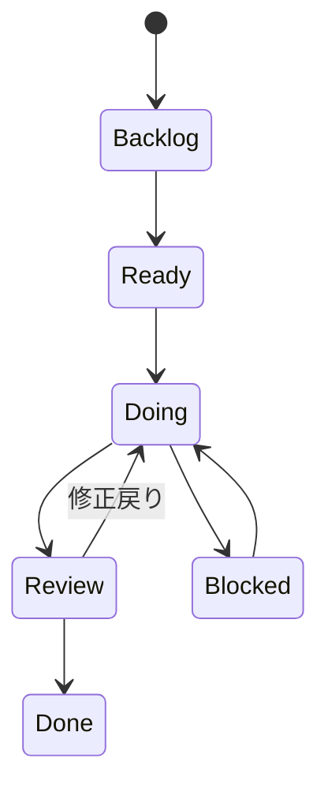

# Projects運用ルール

## Projects運用方針

- Projectsで進捗、課題管理を行う。
- スケジュールは、下記2つの粒度で管理する。
  - マスタスケジュール粒度
    - 開発工程（実装設計、開発、単体テスト、、、）の粒度で予実管理。
    - ツールはMilestoneを利用し、IssueにMilestoneを割り当てて各IssueをMilestoneでラップするイメージ。
  - WBS粒度
    - タスク（作業もしくはranking機能設計、ranking機能開発のような粒度）粒度で予実管理。
    - ツールはIssueをProjectsと紐づけて、Projects連携時にStart Date, Due Dateなどの予実管理用フィールドを設定するイメージ。
    - 成果物単位で予実管理したい場合は、Sub-issueを作成し、タスク（Issue）の子要素として管理する。

## Projcetsフィールド定義

| フィールド           | 概要                                               | 凡例                                                        |
| -------------------- | -------------------------------------------------- | ----------------------------------------------------------- |
| Title                | タスク名                                           | -                                                           |
| Phase                | プロジェクト工程                                   | [プロジェクト工程定義.md](../プロジェクト工程定義.md)を参照 |
| Priority             | 優先度                                             | 下記参照                                                    |
| Status               | 状況                                               | Backlog/Ready/Doing/Blocked/Review/Done                     |
| Planned Start        | 予定開始日                                         | 2026/4/25                                                   |
| Due Date             | 予定終了日                                         | 2026/4/26                                                   |
| Actual Start         | 実績開始日                                         | 2026/4/25                                                   |
| Actual End           | 実績終了日                                         | 2026/4/26                                                   |
| Estimate             | 難易度・作業量目安 ※簡易的な工数見積もり       | XS/S/M/L/XL                                                 |
| Milestone            | マイルストーン ※マスタスケジュールの矢羽根期日 | 2026/5/21                                                   |
| Linked pull requests | リンクされたPR                                     | -                                                           |
| Area                 | 対象領域                                           | web/api/reco/batch/docs                                     |
| Assignees            | 担当者                                             | -                                                           |

### GitHub Actions による Project フィールド同期

Task Issue 作成時に Project の **Phase / Priority / Area** を本文から同期するワークフローの **仕様の正本**は次とする（実装・トリガー・パース・リトライ・エラー処理の詳細はこちら）。

- [Issue作成時Projectフィールド同期ワークフロー](./GitHub%20Actions仕様書/Issue作成時Projectフィールド同期ワークフロー.md)

---

### Status定義

| Status       | 説明                                     |
| ------------ | ---------------------------------------- |
| Backlog      | 着手開始予定日がまだのタスク             |
| Todo         | 着手予定日を過ぎたタスク                 |
| In progress  | 着手中のタスク                           |
| AI Review    | AIエージェントレビューステータスのタスク |
| Human Review | 人レビューステータスのタスク             |
| Done         | 対応完了したタスク                       |

---

#### Status状態遷移

### Area定義

| Status  | 説明                                       |
| ------- | ------------------------------------------ |
| infra   | CI/CD / hosting / env / infrastructure領域 |
| project | Issue / Projects / GitHub運用領域          |
| db      | DB / schema / migration領域                |
| docs    | docs成果物・設計書領域                     |
| batch   | Batch / ETL / 定期処理領域                 |
| reco    | Recommendation / FastAPI 推薦処理領域      |
| web     | Web / Next.js / UI領域                     |
| api     | API / Express / BAckend API領域            |
