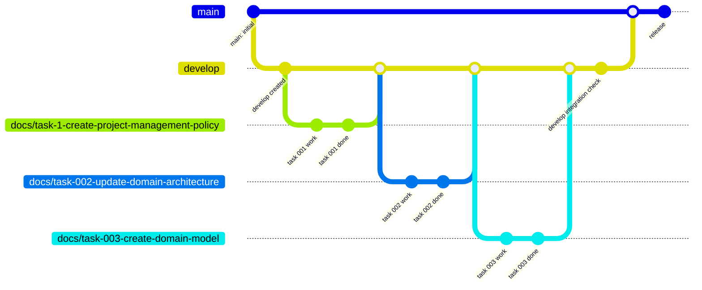
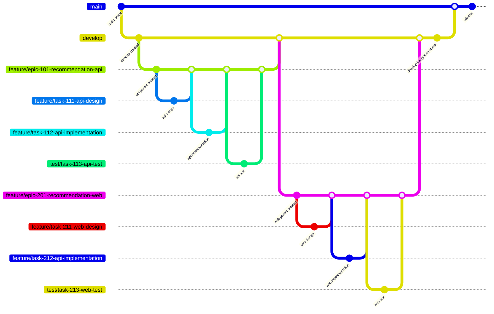

# ブランチ運用ルール

## ブランチ戦略

- [プロジェクト工程ごとの人×AIの役割分担](./プロジェクト共通運用ルール.md)を踏まえて、ブランチ反映フローは下記の2パターンで定義する
  - 人主導PTN：標準フロー
  - AI主導PTN：AI並列開発・機能単位統合用の拡張フロー
- 上記2パターンの反映フロー実現のため、ブランチは下記の責務定義とする。
  - 永続化ブランチ
    - main：本番ブランチ
    - develop：統合ブランチ
  - 作業用ブランチ
    - Epicブランチ：作業用親ブランチ。機能単位の一時統合環境
    - Issueブランチ：作業用子ブランチ。作業単位

### 標準フロー：作業用ブランチ→develop→main



### AI並列開発・機能単位統合用の拡張フロー：作業用子ブランチ→作業用親ブランチ→develop→main



## ブランチ命名ルール

### 基本形式

```
<type>/<unit>-<issue番号>-<english-summary>

　type: Issueラベル分類「作業種別」から取得
　　　　（凡例）
　　　　　　type: feature
　　　　　　type: fix
　　　　　　type: docs
　　　　　　type: refactor
　　　　　　type: chore
　　　　　　type: test
　　　　　　type: hotfix
　　　　　　type: spike
　
unit: Issueラベル分類「作業単位」から取得
　　　　（凡例）
　　　　　　unit: epic
　　　　　　unit: task
```

#### 例

```
feature/epic-101-recommendation-api
feature/task-111-api-design
test/task-112-api-test
docs/task-120-update-policy
```

## ブランチ作成運用ルール

- ブランチは原則、ワークフロースクリプトにて自動作成する。
  - `Issue:ブランチ＝1:1`の関係であり、Issueの作成は要否を検討したうえで作成する。そのため、Issueが存在する場合はブランチでの変更作業も想定済みという考えに則る。
- ブランチ自動作成ワークフローの仕様は下記に示す。

## ブランチ自動作成ワークフロー仕様

仕様書は[ブランチ自動作成ワークフロー](./GitHub%20Actions仕様書/ブランチ自動作成ワークフロー.md)を参照すること。
