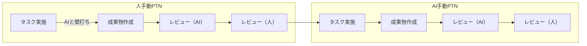
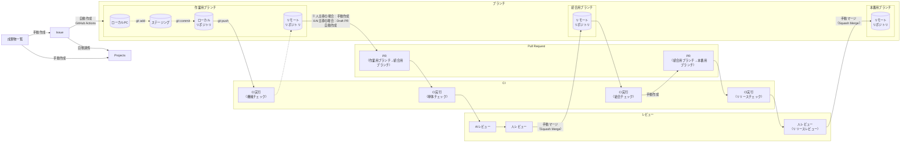

# プロジェクト共通運用ルール

## 全体方針

- 人とAIエージェント（サブエージェント含む）で協業してプロジェクトを推進する
  - スピードを出すために、原則成果物の作成・作業はAIエージェントにて実施する
  - AIエージェントの作業品質のばらつきを抑える工夫（制御し、改善可能な運用）を検討する
    - AIエージェントはあくまで、`優秀なパートナー社員`として捉える。それ以上でも以下でもない。
  - ただ、`最終的な品質責任は人にある`ことを大前提として、人は、成果物レビューやAIエージェント実行のプロンプト作成にパワーをかける
    - すなわち、`事前のプロジェクト運営ルール、方針書、成果物定義、雛形、レビュー観点を作り込み、かつ柔軟にPDCAを回すことを重要視する`
- 作業工程特性を考慮し、一意的な運用方針にしないこと
  - 要件定義検討や方針書など、全体影響のある作業や作成成果物の対象と役割、相互連関の有無が明確でないフェーズでは、原則、人が手動してプロジェクトを推進する`直接タスク`を前提で計画する
    - `ドメイン設計部分`、`リリース、運用改善`が該当すると考える
  - 実装設計以降のような、作成成果物が明確かつ、相互連関がない（と推定する）フェーズでは、原則、AIエージェント手動でプロジェクトを推進する`並行タスク`を前提で計画する
    - すべてを並行タスクとするわけではなく、機能ごとの設計、開発は並行して行うが、各機能ごとでは`タスク実施（AI）→レビュー（AI）→レビュー（人）→後続タスク（AI）→・・・`のような直列タスクにすることで、スピードと品質を確保しながら推進する
    - `アプリ設計以降（通常開発でPTR導入する工程）`が該当すると考える

## プロジェクト工程ごとの人×AIの役割分担

| プロジェクト工程     | 人      | AI      |
| -------------------- | ------- | ------- |
| 事業構想             | ◎主担当 | △副担当 |
| ドメイン探索         | ◎主担当 | △副担当 |
| ドメイン要件定義     | ◎主担当 | △副担当 |
| ドメインモデル設計   | ◎主担当 | △副担当 |
| アプリケーション設計 | △副担当 | ◎主担当 |
| 実装設計             | △副担当 | ◎主担当 |
| 開発                 | △副担当 | ◎主担当 |
| 結合・総合テスト     | △副担当 | ◎主担当 |
| リリース             | ◎主担当 | △副担当 |
| 運用・改善           | ◎主担当 | △副担当 |

## 利用ツール

- ソースコード管理及び進捗、課題等の管理ツールは`GitHub`を利用する。
  - ソースコード管理：Gitリポジトリ
  - スケジュール管理：GitHub Projects、Milestone
  - タスク管理：GitHub Issue
  - 課題管理：GitHub Issue

## 全体ワークフロー

