# 成果物連関図

## 1. 概要

本ドキュメントは、Gift Recommendation Service MVP Cycle 3 における成果物間の依存関係を定義する。

各成果物を個別に作成するだけでなく、前工程成果物から後工程成果物へどのように設計情報が引き継がれるかを明確にする。

---

## 2. 成果物連関図

```mermaid
flowchart TD

%% ---------------------
%% P1 事業構想
%% ---------------------
subgraph p1[ P1 事業構想 ]
    a1[課題定義書]
    a2[ターゲット定義書]
    a3[価値仮説定義書]
    a4[MVPスコープ定義書]
    a5[Instagram初期運用案]
end

a1 --> a4
a2 --> a4
a3 --> a4
a2 --> a5
a3 --> a5

%% ---------------------
%% P2 ドメイン探索
%% ---------------------
subgraph p2[ P2 ドメイン探索 ]
    b1[ドメイン概念一覧]
    b2[ユビキタス言語集]
    b3[ドメイン概念連関図]
    b4[ユースケース一覧]
end

b1 --> b2
b1 --> b3
b2 --> b3
b3 --> b4

%% ---------------------
%% P3 ドメイン要件定義
%% ---------------------
subgraph p3[ P3 ドメイン要件定義 ]
    c1[機能要件定義書]
    c2[非機能要件定義書]
    c3[MVP対象機能一覧]
    c4[制約・対象外一覧]
end

c1 --> c3
c1 --> c4
c2 --> c4

%% ---------------------
%% P4 ドメインモデル設計
%% ---------------------
subgraph p4[ P4 ドメインモデル設計 ]
    d1[ドメインモデル]
    d2[コンテキスト境界定義書]
    d13[Recommendation Request定義書]
    d3[Gift Meaning Space定義書]
    d4[Feature定義書]
    d5[Semantic Concept定義書]
    d6[Featureルール定義書]
    d7[Semanticルール定義書]
    d14[Retrieval定義書]
    d8[Matching定義書]
    d9[Ranking定義書]
    d10[Recommendation Result定義書]
    d11[Reason生成定義書]
    d15[Recommendation Feedback定義書]
    d12[Evaluation評価定義書]
end

d1 --> d2
d1 --> d13
d2 --> d3
d3 --> d4
d3 --> d5
d4 --> d6
d5 --> d6
d5 --> d7

d13 --> d14
d6 --> d14
d7 --> d14

d14 --> d8
d6 --> d8
d7 --> d8

d8 --> d9
d9 --> d10
d9 --> d11
d10 --> d11

d10 --> d15
d11 --> d15

d13 --> d12
d6 --> d12
d7 --> d12
d14 --> d12
d8 --> d12
d9 --> d12
d10 --> d12
d11 --> d12
d15 --> d12

%% ---------------------
%% P5 アプリケーション設計
%% ---------------------
subgraph p5[ P5 アプリケーション設計 ]
    e1[処理フロー概要図]
    e2[システム論理構成図]
    e3[利用技術スタック整理表]
    e4[システム物理構成図]

    e5[画面一覧]
    e6[画面遷移図]

    e7[機能一覧]
    e8[モジュール一覧]
    e9[Recoモジュール一覧]
    e10[機能×モジュール対応表]

    e11[リソース一覧]
    e12[リソース責務定義表]
    e13[正本定義表]
    e14[状態遷移設計書]
    e15[論理ER]
    e16[テーブル一覧]

    e17[API設計方針書]
    e18[API一覧]
    e19[認証・認可設計書]
    e20[エラーコード定義書]

    e21[バッチ設計方針書]
    e22[バッチ一覧]
    e23[バッチ依存関係図]
    e24[バッチ実行スケジュール設計書]
    e43[外部商品データ連携設計書]

    e25[インターフェース一覧]
    e26[ログ・Observability設計書]

    e27[テスト定義書]
    e28[テスト方針書]
    e29[全体テスト計画書]

    e30[DevOps方針書]
    e31[リポジトリ戦略設計書]
    e32[GitHub運用ルール]
    e33[Issue運用ルール]
    e34[Issueラベル設計書]
    e35[Issueテンプレート定義書]
    e36[GitHub Projects運用設計書]
    e37[PR運用ルール]
    e38[ブランチ戦略設計書]
    e39[CI・CD方針書]
    e40[GitHub Actions自動化設計書]
    e41[ブランチ自動作成ワークフロー仕様書]
    e42[AIエージェント運用ルール]
end

e1 --> e2
e2 --> e3
e3 --> e4

e5 --> e6

e7 --> e8
e8 --> e9
e8 --> e10
e9 --> e10

e11 --> e12
e12 --> e13
e13 --> e15
e14 --> e15
e15 --> e16

e17 --> e18
e19 --> e18
e20 --> e18

e21 --> e22
e22 --> e23
e23 --> e24
e21 --> e43
e43 --> e22
e43 --> e25

e15 --> e25
e18 --> e25
e22 --> e25
e26 --> e25

e27 --> e28
e28 --> e29

e30 --> e31
e30 --> e32
e32 --> e33
e33 --> e34
e34 --> e35
e32 --> e36
e32 --> e37
e32 --> e38
e32 --> e39
e39 --> e40
e40 --> e41
e30 --> e42

%% ---------------------
%% 06_実装設計
%% ---------------------
subgraph phase06[ 06_実装設計 ]
    f1[物理ER]
    f2[enum定義書]
    f4[テーブル定義書]
    f5[DDL]
    f6[初期データ定義書]
    f7[マイグレーション方針書]
    f8[データ保持・削除方針書]

    f9[ワイヤーフレーム]
    f10[UIコンポーネント一覧]
    f11[デザインルール]
    f12[画面設計書]

    f13[API仕様書]
    f14[OpenAPI定義書]
    f15[Recoモジュール仕様書]
    f16[バッチ仕様書]

    f17[基盤構成設計書]
    f18[環境設計方針書]
    f19[環境変数定義書]
end

f1 --> f4
f2 --> f4
f4 --> f5
f2 --> f6
f7 --> f5
f8 --> f4

f9 --> f10
f10 --> f11
f9 --> f12
f10 --> f12
f11 --> f12

f13 --> f14

f17 --> f18
f18 --> f19

%% ---------------------
%% P7 開発
%% ---------------------
subgraph p7[ P7 開発 ]
    g1[README・開発手順書]
    g2[開発標準書]
    g3[ソースコード]
    g4[マイグレーションファイル]
    g5[DB構築手順書]
    g6[基盤環境構築手順書]
    g7[CI/CD設定]
end

g1 --> g3
g2 --> g3
g4 --> g5
g6 --> g3
g7 --> g3

%% ---------------------
%% P8 結合・総合テスト
%% ---------------------
subgraph p8[ P8 結合・総合テスト ]
    h1[テスト観点一覧]
    h2[テストケース一覧]
    h3[テスト結果記録]
    h4[不具合管理表]
    h5[テスト実施報告書]
end

h1 --> h2
h2 --> h3
h3 --> h4
h3 --> h5
h4 --> h5

%% ---------------------
%% P9 リリース
%% ---------------------
subgraph p9[ P9 リリース ]
    i1[リリース手順書]
    i2[デプロイ設定書]
    i3[リリース判定チェックリスト]
    i4[ロールバック手順書]
    i5[リリースノート]
end

i1 --> i2
i2 --> i3
i4 --> i3
i3 --> i5

%% ---------------------
%% P10 運用・改善
%% ---------------------
subgraph p10[ P10 運用・改善 ]
    j1[フィードバック分類表]
    j2[サービス分析設計書]
    j3[オフライン評価設計書]
    j4[特徴量分布監視設計書]
    j5[特徴量分布評価・判断ガイド]
    j6[正規化統計量管理設計書]
    j7[改善バックログ運用ルール]
    j8[成果物一覧]
    j9[成果物連関図]
end

j2 --> j1
j3 --> j7
j4 --> j5
j5 --> j6
j1 --> j7
j8 --> j9

%% ---------------------
%% 工程間接続
%% ---------------------

%% P1 -> P2
a4 --> b1
a4 --> b4

%% P2 -> P3
b4 --> c1
b4 --> c2

%% P3 -> P4
c1 --> d1
c3 --> d1
c4 --> d1
c1 --> d13
c3 --> d13
c4 --> d13

%% P3 -> P5
c1 --> e7
c2 --> e3
c2 --> e26
c3 --> e7
c4 --> e7

%% P4 -> P5
d1 --> e11
d2 --> e8
d13 --> e18
d13 --> e15
d14 --> e9
d14 --> e18
d14 --> e43
d8 --> e9
d9 --> e9
d10 --> e18
d10 --> e15
d15 --> e18
d15 --> e15
d12 --> e26
d12 --> e27

%% 05_アプリケーション設計 -> 06_実装設計
e4 --> f17
e5 --> f9
e6 --> f12
e9 --> f15
e15 --> f1
e16 --> f4
e17 --> f13
e18 --> f13
e19 --> f13
e20 --> f13
e21 --> f16
e22 --> f16
e24 --> f16
e43 --> f16
e43 --> f15

%% P5 -> P7
e31 --> g1
e39 --> g7
e42 --> g2

%% 06_実装設計 -> 07_開発・単体テスト
f4 --> g4
f5 --> g4
f6 --> g5
f7 --> g4
f12 --> g3
f13 --> g3
f14 --> g3
f15 --> g3
f16 --> g3
f17 --> g6
f18 --> g6
f19 --> g6

%% 05_アプリケーション設計 / 06_実装設計 -> 08_モジュール結合テスト
e29 --> h1
f13 --> h2
f15 --> h2
f16 --> h2
f12 --> h2

%% P8 -> P9
h5 --> i3

%% P9 -> P10
i5 --> j2

%% P4/P5 -> P10
d12 --> j3
d15 --> j1
e26 --> j4

%% P8 -> P10
h3 --> j1
h4 --> j7
```


---

## 3. 読み方

| 区分             | 説明                                                                                                                        |
| ---------------- | --------------------------------------------------------------------------------------------------------------------------- |
| 同一工程内の矢印 | その工程の中での作成順・依存関係を表す                                                                                      |
| 工程間の矢印     | 前工程成果物が後続工程成果物のインプットになることを表す                                                                    |
| P4内の流れ       | Request → Meaning定義 → Retrieval → Matching → Ranking → Result → Reason → Feedback → Evaluation の推薦ロジック設計順を表す |
| P5内の流れ       | アプリケーション、DB、API、Batch、外部商品データ連携、DevOps、Testの設計群を表す                                            |
| P10内の流れ      | 評価・分析・フィードバック結果を改善バックログへ接続する運用改善ループを表す                                                |

---

## 4. 重要な設計上の接続

### 4.1 Recommendation Request定義書の接続

Recommendation Request定義書は、以下の成果物の前提となる。

| 接続先                  | 理由                                                         |
| ----------------------- | ------------------------------------------------------------ |
| Retrieval定義書         | 予算条件、NG条件、好み、避けたい条件を候補抽出に利用するため |
| API一覧 / API仕様書     | レコメンド実行APIのrequest bodyの正本になるため              |
| 論理ER / テーブル定義書 | recommendation_request系テーブルの前提になるため             |
| Evaluation評価定義書    | 評価ケースの入力構造と対応するため                           |

---

### 4.2 Retrieval定義書の接続

Retrieval定義書は、Matchingより前の候補抽出責務を定義する。

```text
Recommendation Request
↓
Hard Filter
↓
Candidate Retrieval
↓
Matching
```
| 接続先                   | 理由                                                            |
| ------------------------ | --------------------------------------------------------------- |
| Matching定義書           | Matching対象となるcandidate itemを生成するため                  |
| Recoモジュール一覧       | Candidate Retrieval / Hard Filterモジュールの責務を定義するため |
| 外部商品データ連携設計書 | 候補商品検索に必要な商品データ・Embeddingを定義するため         |
| API仕様書                | レコメンド実行APIの内部処理に影響するため                       |

---

### 4.3 Recommendation Feedback定義書の接続

Recommendation Feedback定義書は、推薦結果に対するユーザー反応を改善ループに接続する。

```text
Recommendation Result
↓
User Feedback
↓
Evaluation / Analysis
↓
Improvement Backlog
```
| 接続先                      | 理由                                               |
| --------------------------- | -------------------------------------------------- |
| Recommendation Result定義書 | どの推薦結果・商品に対するFeedbackかを紐づけるため |
| Reason生成定義書            | 推薦理由が役に立ったかを評価するため               |
| Evaluation評価定義書        | feedbackを評価・改善データとして利用するため       |
| フィードバック分類表        | feedbackの分類・分析に利用するため                 |
| 改善バックログ運用ルール    | 改善Issueへ接続するため                            |

---

### 4.4 外部商品データ連携設計書の接続

外部商品データ連携設計書は、商品取得・商品意味推定・Embedding生成の前提となる。

```text
External Product API
↓
Item Data
↓
Semantic / Feature / Embedding
↓
Retrieval / Matching / Ranking
```
| 接続先                    | 理由                                                               |
| ------------------------- | ------------------------------------------------------------------ |
| バッチ一覧 / バッチ仕様書 | 商品取得・更新・意味推定・Embedding生成バッチを定義するため        |
| Retrieval定義書           | 候補抽出に必要な商品データと検索用データを提供するため             |
| Recoモジュール仕様書      | 商品Feature・Embeddingを推薦処理で利用するため                     |
| インターフェース一覧      | 外部APIとの接続をIFとして定義するため                              |
| テーブル定義書            | item / item_feature / item_embedding等のテーブル設計に影響するため |

---

## 5. 注意事項

- 本図は成果物間の論理的な依存関係を示すものであり、必ずしも全成果物を完全に直列作成する必要はない
- GitHub Projects上では、各成果物をIssueまたはTaskとして管理する
- 成果物を追加・削除・統合した場合は、本図と成果物一覧を同時に更新する
- 特にP4の推薦ロジック系成果物は、後続のAPI設計・DB設計・Reco実装設計・評価設計に強く影響するため、変更時は影響範囲を確認する
- Request / Retrieval / Matching / Ranking / Result / Reason / Feedback / Evaluation は一連の推薦パイプラインとして整合性を確認する
