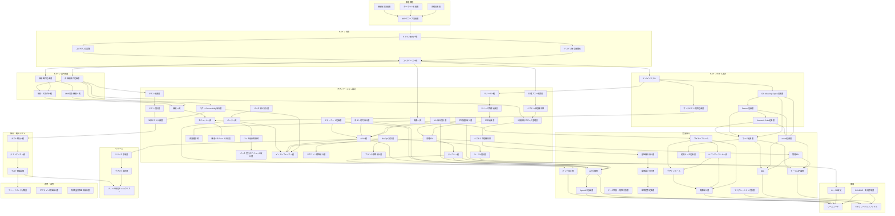

# 成果物連関図

```mermaid
flowchart TD

%% ---------------------
%% P1 事業構想
%% ---------------------
subgraph p1[事業構想]
    a1[課題定義書]
    a2[ターゲット定義書]
    a3[価値仮説定義書]
    a4[MVPスコープ定義書]
end

    a1 --> a4
    a2 --> a4
    a3 --> a4

%% ---------------------
%% P2 ドメイン探索
%% ---------------------
subgraph p2[ドメイン探索]
    b1[ドメイン概念一覧]
    b2[ユビキタス言語集]
    b3[ドメイン概念連関図]
    b4[ユースケース一覧]
end

    b1 --> b2
    b1 --> b3 --> b4
    b2 --> b4

%% ---------------------
%% p3 ドメイン要件定義
%% ---------------------

subgraph p3[ドメイン要件定義]
    c1[機能要件定義書]
    c2[非機能要件定義書]
    c3[MVP対象機能一覧]
    c4[制約・対象外一覧]
end

    c1 --> c3
    c1 --> c4
    c2 --> c4

%% ---------------------
%% p4 ドメインモデル設計
%% ---------------------

subgraph p4[ドメインモデル設計]
    d1[ドメインモデル]
    d2[コンテキスト境界定義書]
    d3[Gift Meaning Space定義書]
    d4[Feature定義書]
    d5[Semantic Rule定義書]
end

    d1 --> d2
    d1 --> d3 --> d4 --> d5

%% ---------------------
%% p5 アプリケーション設計
%% ---------------------
subgraph p5[アプリケーション設計]
    e1[処理フロー概要図]
    e2[システム論理構成図]
    e3[利用技術スタック整理表]
    e4[システム物理構成図]
    e5[画面一覧]
    e6[画面遷移図]
    e7[機能一覧]
    e8[モジュール一覧]
    e9[機能×モジュール対応表]
    e10[リソース一覧]
    e11[リソース責務定義表]
    e12[正本定義表]
    e13[状態遷移設計書]
    e14[ログ・Observability設計書]
    e15[論理ER]
    e16[テーブル一覧]
    e17[API設計方針書]
    e18[認証・認可設計書]
    e19[エラーコード定義書]
    e20[API一覧]
    e21[バッチ設計方針書]
    e22[バッチ一覧]
    e23[バッチ依存関係図]
    e24[バッチ実行スケジュール設計書]
    e25[インターフェース一覧]
    e26[テスト定義書]
    e27[テスト方針書]
    e28[全体テスト計画書]
    e29[DevOps方針書]
    e30[リポジトリ戦略設計書]
    e31[ブランチ戦略設計書]
    e32[CI・CD方針書]
end

    e1 --> e2 --> e3 --> e4
    e5 --> e6
    e7 --> e8 --> e9
    e10 --> e11 --> e12 --> e15
    e13 --> e15
    e13 --> e20
    e14 --> e25
    e14 --> e28
    e15 --> e16
    e17 --> e20
    e18 --> e20
    e19 --> e20
    e21 --> e22 --> e23 --> e24
    e15 --> e25
    e20 --> e25
    e22 --> e25
    e26 --> e27 --> e28
    e29 --> e30
    e29 --> e31
    e29 --> e32

%% ---------------------
%% p6 実装設計
%% ---------------------
subgraph p6[実装設計]
    f1[物理ER]
    f2[enum定義書]
    f3[コード定義書]
    f4[テーブル定義書]
    f5[DDL]
    f6[ワイヤーフレーム]
    f7[UIコンポーネント一覧]
    f8[デザインルール]
    f9[画面設計書]
    f10[API仕様書]
    f11[OpenAPI定義書]
    f12[バッチ仕様書]
    f13[初期データ定義書]
    f14[マイグレーション方針書]
    f15[データ保持・削除方針書]
    f16[基盤構成設計書]
    f17[環境設計方針書]
    f18[環境変数定義書]
end

    f1 --> f4
    f2 --> f4
    f3 --> f4
    f1 --> f5
    f2 --> f5
    f3 --> f5
    f6 --> f7 --> f8
    f6 --> f8
    f6 --> f9
    f7 --> f9
    f8 --> f9
    f3 --> f13
    f10 --> f11
    f16 --> f17 --> f18

%% ---------------------
%% p7 開発
%% ---------------------

subgraph p7[開発]
    g1[README・開発手順書]
    g2[CI・CD設定]
    g3[ソースコード]
    g4[マイグレーションファイル]
end

    g1 --> g3
    g1 --> g4
    g2 --> g3

%% ---------------------
%% p8 結合・総合テスト
%% ---------------------
subgraph p8[結合・総合テスト]
    h1[テスト観点一覧]
    h2[テストケース一覧]
    h3[テスト結果記録]
end

    h1 --> h2 --> h3

%% ---------------------
%% p9 リリース
%% ---------------------
subgraph p9[リリース]
    i1[リリース手順書]
    i2[デプロイ設定書]
    i3[リリース判定チェックリスト]
end

    i1 --> i2 --> i3

%% ---------------------
%% p10 運用・改善
%% ---------------------
subgraph p10[運用・改善]
    j1[フィードバック分類表]
    j2[オフライン評価設計書]
    j3[特徴量分布監視設計書]
end

%% ---------------------
%% 接続（工程間）
%% ---------------------

%% 事業構想→ドメイン探索
a4 --> b1

%% ドメイン探索→ドメイン要件定義
b4 --> c1
b4 --> c2

%% ドメイン探索→ドメインモデル設計
b4 --> d1

%% ドメイン探索→アプリケーション設計
b4 --> e1
b4 --> e5

%% ドメイン要件定義→アプリケーション設計
c2 --> e3
c2 --> e14
c2 --> e26
c3 --> e7
c4 --> e7

%% ドメインモデル設計→アプリケーション設計
d1 --> e10
d2 --> e8

%% ドメインモデル設計→実装設計
d3 --> f2
d3 --> f3
d4 --> f2
d4 --> f3
d5 --> f2
d5 --> f3

%% アプリケーション設計→実装設計
e15 --> f1
e16 --> f4
e5 --> f6
e13 --> f10
e16 --> f10
e17 --> f10
e18 --> f10
e19 --> f10
e20 --> f10
e16 --> f12
e22 --> f12
e4 --> f16

%% アプリケーション設計→開発
e32 --> g2

%% アプリケーション設計→結合・総合テスト
e28 --> h1

%% アプリケーション設計→リリース
e29 --> i1

%% 実装設計→開発
f9 --> g3
f10 --> g3
f11 --> g3
f12 --> g3
f4 --> g4
f5 --> g4
f14 --> g4

%% 結合・総合テスト→リリース
h3 --> i3

%% 結合・総合テスト→運用・改善
h3 --> j1

```
