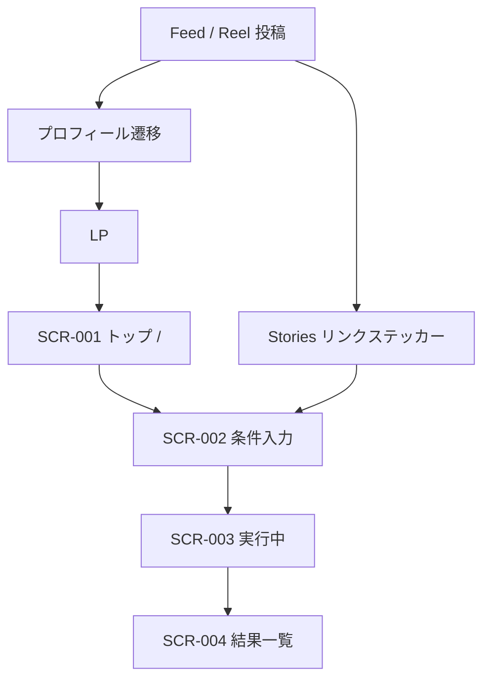

# Instagram初期運用案

## 1. ドキュメント情報

| 項目       | 内容                         |
| ---------- | ---------------------------- |
| 成果物名   | Instagram初期運用案          |
| 工程       | P1 事業構想                  |
| 配置       | `docs/01_事業構想/`          |
| 状態       | 案（Human未承認）            |
| 作成日     | 2026-08-21                   |
| 対象期間例 | 2026-08-24 〜 2026-09-22     |

本ドキュメントは、OKURI 贈の初期ユーザー獲得に向けた Instagram 運用の整理結果である。

本ドキュメントは、サービス仕様・API・画面・マスタの正本ではない。Relationship / Occasion / 画面遷移 / 価値仮説の正本は関連docsを優先する。本ドキュメントと正本が矛盾する場合は、正本を優先し、本ドキュメントを更新対象とする。

Human Review 前の案であり、開始日、公開Web URL、商品画像の掲載、Bio運用は未確定である。

---

## 2. 目的

- コアターゲット（S01 意味重視×迷い層）へ、サービスの差別化（意味で選べる）を伝えること
- Instagram 投稿を「ギフトメディア化」せず、推薦実行まで接続する導線を定義すること
- 初期30日の投稿テーマを、マスタ上の Relationship × Occasion に対応づけること

完了指標はフォロワー数ではない。完了指標は推薦実行（API-PUB-002）とする。

---

## 3. 方針判断の要約

| 項目                         | 判断（案）                                                                 |
| ---------------------------- | -------------------------------------------------------------------------- |
| SNSをやるか                  | やる。ギフトは季節性が強く、S01の悩みが言語化しやすい                      |
| 主チャネル                   | 初期は Instagram 1本                                                       |
| TikTok                       | Instagram で勝ち型が出てから横展開                                         |
| Facebook                     | 初期のオーガニック投稿先にはしない。Meta広告の配信面としては別判断         |
| 投稿の主役                   | 商品ではなく判断（相手・場面・失敗回避と特別感のバランス）                 |
| ユースケース投稿             | 行う。ただしおすすめ商品一覧で完結させない                                 |
| あるある投稿                 | 行う。入口として強い。出口は推薦実行                                       |
| Bio                          | 30日間は LP 固定                                                           |
| Pair 単位の Deep link        | Stories のリンクステッカーに持たせる                                       |
| 日付の置き方                 | 2026-08-24（月）起算。Day 29 が敬老の日（2026-09-21）                      |

---

## 4. 前提（正本から確認できる事実）

### 4.1 獲得したいユーザー

| 項目           | 内容                                       | 正本                 |
| -------------- | ------------------------------------------ | -------------------- |
| コアターゲット | 意味重視×迷い層（S01）                     | ターゲット定義書     |
| ペルソナ傾向   | 忙しく、比較するが決めきれない             | ターゲット定義書     |
| 提供価値       | 意味で選べる / 安全に攻められる / 迷わず決められる | 価値仮設定義書 |
| リスク         | 意味が理解されない                         | 価値仮設定義書 R01   |

### 4.2 投稿が対応すべき入力

ユーザーがサービスで必ず入れる条件は、Relationship と Occasion である。予算上限は画面上必須である。

| 画面     | 内容                                                                 | 正本                    |
| -------- | -------------------------------------------------------------------- | ----------------------- |
| SCR-001  | `/`。主CTA「ギフトを探す」で SCR-002 へ                              | トップ画面画面仕様書    |
| SCR-002  | `/recommendations`。`relationshipCode` / `occasionCode` 必須         | レコメンド条件入力画面画面仕様書 |
| クエリ復元 | `relationshipCode` / `occasionCode` / `budgetMin` / `budgetMax` / `topK` をクエリから復元できる | SCR-002 実装 |
| 予算     | `budgetMax` は画面必須。Deep link でも推薦実行まであと1入力残る      | SCR-002                 |
| 購入     | 本サービスでは行わない。外部EC                                       | SCR-001 / MVPスコープ定義書 |

### 4.3 初期30日で使う Relationship × Occasion

コードは `relationship_master` / `occasion_master` の seed に存在する値のみを使う。義母・義父の専用コードは無い。敬老の日は `family_parent`（親）で案内する。

`pair_rule` の有無は Featureルール定義書 §9.3 に従う。初期30日で主に使う組み合わせは以下である。

| relationship_code  | 表示名     | occasion_code      | 表示名       | pair_rule |
| ------------------ | ---------- | ------------------ | ------------ | --------- |
| `family_parent`    | 親         | `birthday`         | 誕生日       | あり      |
| `family_parent`    | 親         | `seasonal_event`   | 季節イベント | なし      |
| `boss`             | 上司       | `birthday`         | 誕生日       | あり      |
| `boss`             | 上司       | `thanks`           | お礼         | あり      |
| `business_partner` | 取引先     | `thanks`           | お礼         | あり      |
| `friend_close`     | 親しい友人 | `thanks`           | お礼         | あり      |
| `friend_close`     | 親しい友人 | `birthday`         | 誕生日       | あり      |
| `friend_casual`    | 友人・知人 | `thanks`           | お礼         | あり      |
| `lover`            | 恋人       | `birthday`         | 誕生日       | あり      |
| `lover`            | 恋人       | `anniversary`      | 記念日       | あり      |
| `spouse`           | 配偶者     | `anniversary`      | 記念日       | あり      |
| `colleague`        | 同僚       | `farewell`         | 送別         | あり      |
| `colleague`        | 同僚       | `wedding_gift`     | 結婚祝い     | なし      |

`pair_rule` なしの2件は、季節需要（残暑見舞い・敬老の日、秋の結婚祝い）を優先した例外である。

初期30日で使わない `pair_rule` 対象は、`business_partner × apology`、`family_child × birthday`、`other × other` である。理由は、S01 の初期到達と季節需要を優先するためである。

---

## 5. チャネル方針（案）

| 媒体        | 初期30日           | 理由                                                                 |
| ----------- | ------------------ | -------------------------------------------------------------------- |
| Instagram   | 主戦場             | 保存される判断コンテンツと、Stories のリンク導線が両立する           |
| TikTok      | 後回し             | 娯楽で終わりやすい。Instagram の勝ち型を横展開する                   |
| Facebook    | オーガニック対象外 | S01（20代後半）のオーガニック獲得先としては弱い                      |

投稿の型が固まる前に3媒体を同時運用すると、複製コストだけ増える。

---

## 6. 投稿から推薦実行までの導線（案）

Instagram の Feed 本文URLは、原則クリックできない前提で組む。



### 6.1 標準導線（Bio）

役割は信頼と世界観の受け皿である。30日間固定してよい。

1. 投稿（あるある・判断）で保存・プロフィール遷移を取る
2. Bio から LP（`https://ryo-chan-k6.github.io/GiftRecommendAPP_LP/`）へ
3. LP の「ギフトを探す」からアプリ `/`（SCR-001）へ
4. `/recommendations` で相手・場面・予算を入力
5. レコメンド実行。購入は外部EC

### 6.2 短縮導線（Stories）

役割は獲得である。Pair提案の日の主CTAとする。

1. 投稿で判断の軸だけ見せる。商品名は結論にしない
2. Stories のリンクステッカーから、相手と場面が入った条件入力へ直送する
3. ユーザーは予算上限を入れて実行する
4. 結果の推薦理由を見て、必要なら条件を変えて再実行する

Deep link の形は以下である。`{APP_ORIGIN}` は公開Webの正式URLに置き換える。正式URLは本ドキュメント作成時点で未確定である。

```text
{APP_ORIGIN}/recommendations?relationshipCode={relationship_code}&occasionCode={occasion_code}
```

例（親 × 誕生日）:

```text
{APP_ORIGIN}/recommendations?relationshipCode=family_parent&occasionCode=birthday
```

### 6.3 CTAの言葉

| 投稿タイプ | Feedでの仕事                 | 送る先                         | 言わないこと                 |
| ---------- | ---------------------------- | ------------------------------ | ---------------------------- |
| あるある   | 共感と保存。自分ごと化       | プロフィール（LP）             | おすすめ3選で完結させる      |
| 判断       | 失敗回避と特別感の軸を教える | プロフィール、または翌日のPair | Feature名をユーザーに使わせる |
| Pair提案   | その相手×場面で実行させる    | Stories Deep link              | 商品リンクを先に置く         |
| 季節       | 今やる理由を作る             | Stories Deep link              | 通年のランキングに戻す       |
| 使い方     | 3手で実行できると示す        | LP と `/recommendations`       | 機能説明を長くする           |

ユーザー向けの言葉は「失敗回避」と「特別感」までとする。`formality` / `safety` / `emotion` 等の Feature 名は投稿に出さない。

### 6.4 実装上の制約（事実）

| 制約                         | 内容                                                                                         | 影響                         |
| ---------------------------- | -------------------------------------------------------------------------------------------- | ---------------------------- |
| `budgetMax` 画面必須         | Deep link でも推薦実行まで完了しない                                                         | CTAは「予算だけ入れて実行」  |
| UTMの保持                    | フォーム保存時にクエリを form 項目だけで作り直すため、入力操作後に UTM が消える              | 初回ページビューで計測する   |
| 義母・義父                   | `relationship_master` に専用コードが無い                                                     | 「親」で試してよいと案内する |
| 公開Web URL                  | 正本上未確定                                                                                 | `{APP_ORIGIN}` が埋まらないと短縮導線が LP 止まりになる |

---

## 7. 投稿タイプ

初期30日の内訳は以下とする。

| タイプ   | 本数 | 形式の基本 | 目的                     |
| -------- | ---: | ---------- | ------------------------ |
| あるある |    8 | Reel       | 認知。S01の感情に刺す    |
| 判断     |    6 | Carousel   | 理解。軸を教える         |
| Pair提案 |   10 | Carousel   | 獲得。Deep link で実行   |
| 季節     |    3 | Reel / Carousel | 今やる理由         |
| 使い方   |    3 | Carousel   | 導線の説明               |
| 合計     |   30 |            | Feed 1本 / 日            |

Feed とは別に、Stories はほぼ毎日出す。投票・質問・リンクの3種を使う。Feed は判断の資産、Stories は獲得の導線とする。

---

## 8. 週次の仕事

日付は 2026-08-24 起算の例である。開始日をずらす場合は、季節枠（残暑見舞い・敬老の日）だけ組み替える。

| 週  | 日付            | 週の仮説                               | 主 Pair                                 | 成功の見方                         |
| --- | --------------- | -------------------------------------- | --------------------------------------- | ---------------------------------- |
| W1  | 8/24 〜 8/30    | ギフトメディアではないと覚えられる     | 親×誕生日、上司×誕生日                 | 保存とプロフィール遷移             |
| W2  | 8/31 〜 9/6     | 同じ用途でも相手で判断が変わる         | 上司 / 取引先 / 親しい友人 × お礼       | Storiesリンクのクリック            |
| W3  | 9/7 〜 9/13     | 私的ギフトでは特別感を厚くしてよい     | 恋人×誕生日/記念日、親友×誕生日         | 入力画面到達                       |
| W4  | 9/14 〜 9/22    | 季節需要で推薦実行を取る               | 親×季節イベント（敬老の日）             | 9/21前後の推薦実行数               |

---

## 9. 初期30日カレンダー

### 9.1 投稿一覧

| Day | 日付       | 曜 | タイプ   | 形式      | Pair                 | pair_rule | テーマ                                       |
| --: | ---------- | -- | -------- | --------- | -------------------- | --------- | -------------------------------------------- |
|   1 | 2026-08-24 | 月 | 使い方   | Carousel  | なし                 | なし      | OKURIは商品ランキングではない                |
|   2 | 2026-08-25 | 火 | あるある | Reel      | 親 × 誕生日          | あり      | 比較した末に無難へ落ちる                     |
|   3 | 2026-08-26 | 水 | 判断     | Carousel  | 親 × 誕生日          | あり      | 親の誕生日は感謝を厚く、攻めるのは少しだけ   |
|   4 | 2026-08-27 | 木 | Pair提案 | Carousel  | 親 × 誕生日          | あり      | 親 × 誕生日で試す                            |
|   5 | 2026-08-28 | 金 | あるある | Reel      | 上司 × 誕生日        | あり      | 上司の誕生日が一番怖い                       |
|   6 | 2026-08-29 | 土 | 判断     | Carousel  | 上司 × 誕生日        | あり      | 上司の誕生日は親密に寄せすぎない             |
|   7 | 2026-08-30 | 日 | 季節     | Reel      | 親 × 季節イベント    | なし      | 残暑見舞い、まだ間に合う                     |
|   8 | 2026-08-31 | 月 | あるある | Reel      | 上司 × お礼          | あり      | お礼が忖度に見える                           |
|   9 | 2026-09-01 | 火 | Pair提案 | Carousel  | 上司 × お礼          | あり      | 上司 × お礼で試す                            |
|  10 | 2026-09-02 | 水 | 判断     | Carousel  | 取引先 × お礼        | あり      | 取引先は儀礼を一段上げる                     |
|  11 | 2026-09-03 | 木 | Pair提案 | Carousel  | 取引先 × お礼        | あり      | 取引先 × お礼で試す                          |
|  12 | 2026-09-04 | 金 | あるある | Reel      | 親しい友人 × お礼    | あり      | 親しい友人へのお礼が堅すぎる                 |
|  13 | 2026-09-05 | 土 | Pair提案 | Carousel  | 親しい友人 × お礼    | あり      | 親しい友人 × お礼で試す                      |
|  14 | 2026-09-06 | 日 | 使い方   | Carousel  | なし                 | なし      | 投稿から推薦までの3手                        |
|  15 | 2026-09-07 | 月 | あるある | Reel      | 恋人 × 誕生日        | あり      | 恋人の誕生日で無難を選ぶ                     |
|  16 | 2026-09-08 | 火 | Pair提案 | Carousel  | 恋人 × 誕生日        | あり      | 恋人 × 誕生日で試す                          |
|  17 | 2026-09-09 | 水 | 判断     | Carousel  | 恋人 × 記念日        | あり      | 記念日はストーリーを厚くする                 |
|  18 | 2026-09-10 | 木 | Pair提案 | Carousel  | 恋人 × 記念日        | あり      | 恋人 × 記念日で試す                          |
|  19 | 2026-09-11 | 金 | あるある | Reel      | 親しい友人 × 誕生日  | あり      | 親友の趣味が分からない                       |
|  20 | 2026-09-12 | 土 | Pair提案 | Carousel  | 親しい友人 × 誕生日  | あり      | 親しい友人 × 誕生日で試す                    |
|  21 | 2026-09-13 | 日 | 季節     | Carousel  | 同僚 × 結婚祝い      | なし      | 秋から増える同僚の結婚祝い                   |
|  22 | 2026-09-14 | 月 | あるある | Reel      | 親 × 季節イベント    | なし      | 敬老の日、毎年同じ物になる                   |
|  23 | 2026-09-15 | 火 | 判断     | Carousel  | 親 × 季節イベント    | なし      | 敬老の日は感謝を厚く、派手さは抑える         |
|  24 | 2026-09-16 | 水 | Pair提案 | Carousel  | 親 × 季節イベント    | なし      | 親 × 季節イベントで試す                      |
|  25 | 2026-09-17 | 木 | Pair提案 | Carousel  | 配偶者 × 記念日      | あり      | 配偶者 × 記念日で試す                        |
|  26 | 2026-09-18 | 金 | あるある | Reel      | 同僚 × 送別          | あり      | 送別会の個人ギフトが難しい                   |
|  27 | 2026-09-19 | 土 | Pair提案 | Carousel  | 同僚 × 送別          | あり      | 同僚 × 送別で試す                            |
|  28 | 2026-09-20 | 日 | 判断     | Carousel  | 友人・知人 × お礼    | あり      | 知り合い程度なら安全性を少し上げる           |
|  29 | 2026-09-21 | 月 | 季節     | Reel      | 親 × 季節イベント    | なし      | 敬老の日当日                                 |
|  30 | 2026-09-22 | 火 | 使い方   | Carousel  | なし                 | なし      | 30日の型を残して、次の自分のシーンへ         |

### 9.2 フック / CTA / Stories

| Day | フック | CTA | Stories |
| --: | ------ | --- | ------- |
|   1 | ギフト選びが難しいのは、商品が多すぎるからではない。何を伝えたいかを比較できないから。 | プロフィールのリンクから、関係性と場面を入れて試す | 3枚で世界観。キャッチ、Before/After、LPへリンク |
|   2 | レビューを30分見て、結局ハンドクリームを買う。親の誕生日あるある。 | 保存。自分の親だと答えが変わる。リンクはプロフィール | 投票「無難に逃げる / 少し特別にしたい」 |
|   3 | 親への誕生日で先に決めるのは商品名ではない。失敗したくない気持ちと、日頃の感謝のどちらを厚くするか。 | この軸で見てから商品を見る。相手と場面はリンク先で入っている | 図解1枚。失敗回避寄り / 特別感寄りの二択 |
|   4 | 同じ「親の誕生日」でも、無難に寄せるか感謝を出すかで候補が変わる。商品を先に出さない。 | ストーリーのリンクから、相手=親・用途=誕生日の状態で予算だけ入れて実行 | リンクステッカー必須。予算の目安だけ添える |
|   5 | 上司の誕生日、親密すぎても失礼、無難すぎても気持ちが届かない。 | 共感したら保存。自分の職場の距離感はリンク先で試す | 投票「近い上司 / 距離のある上司」 |
|   6 | 上司×誕生日で厚くするのは特別感ではない。礼儀と安全性。親密さは抑える。 | この判断を自分の上司で試す。リンクはプロフィール | 「ブランドが無難すぎるのも失敗」を1枚で補足 |
|   7 | お中元を逃した人へ。残暑見舞いは「遅れ」ではなく、今の関係性を整える場面。 | 親への季節の贈り物は、プロフィールから用途=季節イベントで試す | 期限の目安だけ。商品名は出さない |
|   8 | お世話になりましたの品が、いつの間にか値段の話になっている。 | お礼は気持ちではなく礼儀の設計。保存して職場の距離で試す | 質問スタンプ「最近お礼を渡した相手は？」 |
|   9 | 上司へのお礼で厚くするのは感情ではない。礼儀と安全性。 | ストーリーから相手=上司・用途=お礼で実行。予算だけ入れる | リンクステッカー必須 |
|  10 | 同じお礼でも、上司と取引先では厚くする軸が違う。取引先は儀礼性をさらに上げる。 | 相手が取引先なら、お礼のリンクから試す | 上司お礼との違いを1枚で対比 |
|  11 | 攻めたい気持ちを抑えた先に、失礼のないお礼がある。 | ストーリーのリンクから実行。商品は結果画面で見る | リンクステッカー必須 |
|  12 | 親しい友人なのに、手土産が取引先と同じ顔になっている。 | 距離が近いほど、温かさを足してよい。プロフィールへ | 投票「友人へのお礼、堅い / くだけすぎ」 |
|  13 | 親しい友人へのお礼は、礼儀を少し下げ、温かさを足す。 | 同じお礼でも相手で変わる、を体験する。リンクはストーリー | リンクステッカー必須。上司お礼投稿を引用 |
|  14 | Instagramでは答えの商品を渡さない。相手と場面を入れて、予算だけ入れて実行する。 | プロフィールのリンクはLP。ストーリーのリンクがその投稿の相手・場面 | 画面遷移を3枚。入力 → 実行中 → 結果 |
|  15 | 好きな人の誕生日ほど、失敗が怖くて無難になる。 | 特別感を出したいなら、先に意味の軸を決める。保存 | 投票「今年は無難 / 少し攻める」 |
|  16 | 恋人の誕生日は、意味性と特別感を厚くする。上司の誕生日とは逆。 | ストーリーから相手=恋人・用途=誕生日で実行 | リンクステッカー必須。Day6の上司判断を対比引用 |
|  17 | 記念日で失敗しやすいのは、高いものを選ぶことではない。二人の文脈が入っていないこと。 | ストーリー性を厚くした候補を、リンク先で見る | 「いつもの誕生日」との違いを1枚 |
|  18 | 記念日は感情とストーリーを一段上げる。商品名より先に、何を記念するかを入れる。 | 好みの自由記述に「二人の文脈」を足して実行してよい | リンクステッカー必須 |
|  19 | 一番近い友人なのに、欲しいものが分からない。近いほど、外れが怖い。 | 分からなくてよい。カジュアルな特別感の軸で絞る。プロフィールへ | 質問「今いちばんギフトに困っている相手は？」 |
|  20 | 親しい友人の誕生日は、堅さを下げ、楽しさと特別感を足す。 | ストーリーから実行。NGに「実用だけ」と入れて差を見てもよい | リンクステッカー必須 |
|  21 | 職場の結婚祝い、個人で渡すと金額も距離感も見えなくなる。 | 同僚×結婚祝いは、礼儀を残したまま気持ちを乗せすぎない。リンクはプロフィール | 「ご祝儀とは別に品を渡すか」投票 |
|  22 | 敬老の日に困ると、去年と同じ品になる。感謝は同じでも、関係は1年分進んでいる。 | 季節の贈り物こそ、相手と場面を入れ直す。保存 | カウントダウン開始。敬老の日は9/21 |
|  23 | 親への季節ギフトで先に決めるのは、驚かせることではない。日頃言えていない感謝を乗せるかどうか。 | 用途は季節イベント。相手は親。リンクはストーリー | 実母 / 義父母で迷う人へ「親」で試してよい旨を1枚 |
|  24 | 敬老の日前に、相手と場面だけ入れて候補を見ておく。当日に商品から入らない。 | ストーリーから実行。今週の主CTA | リンクステッカー必須。Deep link をこのPairに合わせる |
|  25 | 長い関係の記念日は、新しさより二人の文脈。恋人の記念日とは厚くする場所が違う。 | 配偶者の記念日がある人は、ストーリーから実行 | リンクステッカー。恋人記念日投稿を対比引用 |
|  26 | 花束のあと、自分だけ何を渡すかで止まる。 | 送別は礼儀と、少しのストーリー。保存 | 秋の異動・退職の気配に合わせて質問スタンプ |
|  27 | 同僚の送別は、親密さを上げすぎず、一緒に働いた文脈だけ足す。 | ストーリーから相手=同僚・用途=送別で実行 | リンクステッカー必須 |
|  28 | 親しい友人と同じお礼を、あまり親しくない相手に出すと、重くなる。 | 距離が分からないときは、安全性を少し上げて試す | 親しい友人お礼との対比。リンクは任意 |
|  29 | 今日贈る人へ。まだ商品名から入らなくてよい。相手は親、用途は季節イベント。 | ストーリーのリンクから予算だけ入れて実行。本日の主KPI | 終日リンクステッカー。午前・昼・夜で同じ導線を再掲 |
|  30 | 見て終わった人と、相手と場面を入れて実行した人で、OKURIの価値は分かれる。 | 次に贈る相手をコメントする。こちらで入力の言葉に翻訳する | 質問スタンプ「次に困っているギフトは？」を調査入口にする |

### 9.3 Deep link 対応表

Pair なしの日は `{APP_ORIGIN}/` または LP に送る。無理に条件を埋めない。

| Day | relationshipCode     | occasionCode       | パス |
| --: | -------------------- | ------------------ | ---- |
|   4 | `family_parent`      | `birthday`         | `/recommendations?relationshipCode=family_parent&occasionCode=birthday` |
|   9 | `boss`               | `thanks`           | `/recommendations?relationshipCode=boss&occasionCode=thanks` |
|  11 | `business_partner`   | `thanks`           | `/recommendations?relationshipCode=business_partner&occasionCode=thanks` |
|  13 | `friend_close`       | `thanks`           | `/recommendations?relationshipCode=friend_close&occasionCode=thanks` |
|  16 | `lover`              | `birthday`         | `/recommendations?relationshipCode=lover&occasionCode=birthday` |
|  18 | `lover`              | `anniversary`      | `/recommendations?relationshipCode=lover&occasionCode=anniversary` |
|  20 | `friend_close`       | `birthday`         | `/recommendations?relationshipCode=friend_close&occasionCode=birthday` |
|  21 | `colleague`          | `wedding_gift`     | `/recommendations?relationshipCode=colleague&occasionCode=wedding_gift` |
|  24 | `family_parent`      | `seasonal_event`   | `/recommendations?relationshipCode=family_parent&occasionCode=seasonal_event` |
|  25 | `spouse`             | `anniversary`      | `/recommendations?relationshipCode=spouse&occasionCode=anniversary` |
|  27 | `colleague`          | `farewell`         | `/recommendations?relationshipCode=colleague&occasionCode=farewell` |
|  29 | `family_parent`      | `seasonal_event`   | `/recommendations?relationshipCode=family_parent&occasionCode=seasonal_event` |

Day 3 / 6 / 10 など判断投稿の翌日が Pair提案である場合、Stories リンクは Pair提案の日を主とする。判断の日はプロフィール誘導でよい。

---

## 10. アカウント初期設定（案）

| 項目         | 内容                                                       |
| ------------ | ---------------------------------------------------------- |
| 名前         | OKURI 贈                                                   |
| ユーザー名   | `okuri` が取れるならそれを優先する                         |
| Bio 1行目    | 「何を伝えたいか」で選ぶギフト                             |
| Bio 2行目    | 相手と場面を入れると、候補の意味が変わる                   |
| リンク       | LP を30日間固定                                            |
| ハイライト   | 使い方 / 親 / 上司 / 恋人 / 季節                           |

| 枠        | 頻度 | 目的                           |
| --------- | ---- | ------------------------------ |
| Feed 1本  | 毎日 | 判断の資産。保存されること     |
| Stories   | 毎日 | 投票・質問・Deep link          |
| Reel      | あるある・季節の日 | 新規到達             |
| Carousel  | 判断・Pair・使い方 | 保存と再訪           |

---

## 11. 見る指標（案）

以下の目標値は仮説である。フォロワー数は監視するが、最適化対象にしない。

| 指標           | 定義                                      | 初期の見方                               |
| -------------- | ----------------------------------------- | ---------------------------------------- |
| 推薦実行       | Instagram経由の API-PUB-002 成功数        | North star。W4 敬老の日前後で初めて意味が出る |
| 入力画面到達   | `/recommendations` のセッション           | Deep link が機能しているかの確認         |
| 入力完了率     | 到達のうち実行まで行った割合              | `budgetMax` 必須が摩擦になっていないか   |
| プロフィール遷移 | Instagramインサイト                     | あるある・判断が入口になっているか       |
| リンククリック | Stories / Bio                             | Pair提案の日にクリックが乗るか           |
| 保存数         | Feedインサイト                            | 判断Carouselが資産化しているか           |

計測の接続方法（アナリティクス実装、UTM保持の改修要否）は未確定である。

---

## 12. 始めない方がよいこと

| やらないこと                                         | 理由                                                                 |
| ---------------------------------------------------- | -------------------------------------------------------------------- |
| おすすめ商品5選で毎日終える                          | ギフトメディアと同じになり、推薦実行の理由が消える                   |
| Instagram / TikTok / Facebook を同時に始める         | 型が固まる前に複製コストだけ増える                                   |
| `pair_rule` のない組み合わせを初期の主戦場にする     | 体験と投稿の約束がずれやすい。季節枠だけ例外                         |
| Feature名を投稿に出す                                | ユーザーが学ぶべきは「失敗回避と特別感」まで                         |
| 公開体験が不十分なまま商品紹介を量産する             | ギフトまとめアカウントとして固定される                               |

---

## 13. Human判断が必要な事項

| 確認           | 区分         | 内容                                                                 |
| -------------- | ------------ | -------------------------------------------------------------------- |
| 公開Web URL    | 未確認       | Deep link の `{APP_ORIGIN}`。無いと Stories は LP 止まりになる       |
| 体験の完走     | 確認が必要   | Relationship / Occasion / 予算を入れて結果と理由まで出るか           |
| Bio 固定       | 推奨案       | 30日は LP 固定。週替わりPairは Stories にだけ持たせる                |
| 商品画像       | Human判断    | 出すなら「判断の例」に限定。景表法・アフィリエイト表示が必要         |
| 開始日         | Human判断    | 本カレンダーは 2026-08-24 起算。ずらす場合は季節枠を組み替える       |
| 本ドキュメントの採否 | Human判断 | 案のまま運用するか、方針書へ昇格するか                           |

判断しない場合のリスクは、ギフトまとめアカウントとして固定されること、または公開体験が無い状態で流入だけ増えることである。

---

## 14. 関連正本

| ドキュメント                         | 本ドキュメントでの使い方                         |
| ------------------------------------ | ------------------------------------------------ |
| [ターゲット定義書](./ターゲット定義書.md) | S01、ペルソナ、非対象ユーザー                  |
| [価値仮設定義書](./価値仮設定義書.md) | 提供価値、意味が理解されないリスク             |
| [課題定義書](./課題定義書.md)         | 意味選択、季節ギフトの背景                     |
| [MVPスコープ定義書](./MVPスコープ定義書.md) | 決済・会員なし。検証対象は意味ベース推薦 |
| [SCR-001 トップ画面画面仕様書](../06_実装設計/web/SCR-001_トップ画面画面仕様書.md) | `/` と LP 整合、主CTA |
| [SCR-002 レコメンド条件入力画面画面仕様書](../06_実装設計/web/SCR-002_レコメンド条件入力画面画面仕様書.md) | 入力項目、クエリ復元 |
| [Featureルール定義書](../04_ドメインモデル設計/Featureルール定義書.md) §9.3 | pair_rule の対象組み合わせ |
| `supabase/seeds/masters/01_relationship_occasion_master.sql` | Relationship / Occasion の code と表示名 |
| [デザインルール](../05_アプリケーション設計/アプリ/web/デザインルール.md) | LP URL、サービス表示名 OKURI 贈 |
