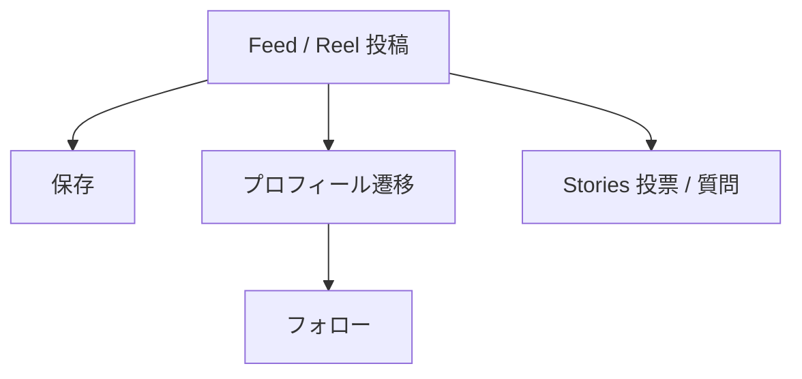

# Instagram初期運用案

## 1. ドキュメント情報

| 項目       | 内容                         |
| ---------- | ---------------------------- |
| 成果物名   | Instagram初期運用案          |
| 工程       | P1 事業構想                  |
| 配置       | `docs/01_事業構想/`          |
| 状態       | 案（Human未承認）            |
| 作成日     | 2026-08-21                   |
| 更新日     | 2026-08-22                   |
| 対象期間例 | 2026-08-24 〜 2026-09-22     |
| このフェーズの範囲 | Instagramへの毎日投稿とフォロワー増加。アプリ実行・Deep link は含まない |

本ドキュメントは、OKURI 贈の Instagram アカウントを、初期30日で毎日着実に育てるための投稿計画である。

本ドキュメントは、サービス仕様・API・画面・マスタの正本ではない。Relationship / Occasion / 価値仮説の正本は関連docsを優先する。本ドキュメントと正本が矛盾する場合は、正本を優先し、本ドキュメントを更新対象とする。

Human Review 前の案であり、開始日、商品画像の掲載、アカウント名は未確定である。

---

## 2. 目的

このフェーズの目的は、次の3点に限る。

- コアターゲット（S01 意味重視×迷い層）へ、商品ランキングではない判断コンテンツを毎日届けること
- §7 の5タイプ（あるある / 判断 / Pair提案 / 季節 / 使い方）で Feed 1本 / 日を30日続けること
- フォロワーを地道に増やすこと

完了指標は、投稿の実施と Instagram 上の反応（保存、フォロー、リーチ、プロフィール遷移）とする。

アプリでのレコメンド実行（API-PUB-002）、公開Web URL、Stories の Deep link は、このフェーズの目的に含めない。投稿の材料として実レコメンド結果を使う想定もしない。これらは §15 の次フェーズとする。

---

## 3. 方針判断の要約

| 項目                         | 判断（案）                                                                 |
| ---------------------------- | -------------------------------------------------------------------------- |
| SNSをやるか                  | やる。ギフトは季節性が強く、S01の悩みが言語化しやすい                      |
| 主チャネル                   | 初期は Instagram 1本                                                       |
| TikTok                       | Instagram で勝ち型が出てから横展開                                         |
| Facebook                     | 初期のオーガニック投稿先にはしない。Meta広告の配信面としては別判断         |
| 投稿の主役                   | 商品ではなく判断（相手・場面・失敗回避と特別感のバランス）                 |
| ユースケース投稿             | 行う。ただしおすすめ商品一覧で完結させない                                 |
| あるある投稿                 | 行う。入口として強い。出口はこのフェーズでは保存とフォロー                 |
| Pair提案                     | 相手×場面を具体化する投稿。アプリで試させることはしない                   |
| Bio                          | 世界観の説明。アプリ誘導はこのフェーズの必須にしない                       |
| アプリ実行 / Deep link       | 次フェーズ。初期30日の計画対象外                                           |
| 日付の置き方                 | 2026-08-24（月）起算。Day 29 が敬老の日（2026-09-21）                      |

---

## 4. 前提（正本から確認できる事実）

### 4.1 届けたいユーザー

| 項目           | 内容                                       | 正本                 |
| -------------- | ------------------------------------------ | -------------------- |
| コアターゲット | 意味重視×迷い層（S01）                     | ターゲット定義書     |
| ペルソナ傾向   | 忙しく、比較するが決めきれない             | ターゲット定義書     |
| 提供価値       | 意味で選べる / 安全に攻められる / 迷わず決められる | 価値仮設定義書 |
| リスク         | 意味が理解されない                         | 価値仮設定義書 R01   |

投稿は S01 の感情（決めきれない、失敗したくない、特別感も出したい）に刺す。アプリの入力項目を埋めることは、このフェーズでは求めない。

### 4.2 投稿テーマとしての相手 × 場面

Pair提案のテーマは、マスタ上の Relationship と Occasion に対応づける。表示名を投稿で勝手に増やさない。義母・義父の専用コードは無いため、敬老の日は「親」で案内する。

code を残す理由は、テーマの揺れを防ぐこと、および次フェーズでアプリ導線を足すときに同じ組み合わせを使えることである。このフェーズの投稿制作に、画面仕様や API は使わない。

### 4.3 初期30日で使う Relationship × Occasion

コードは `relationship_master` / `occasion_master` の seed に存在する値のみを使う。

`pair_rule` の有無は Featureルール定義書 §9.3 に従う。判断投稿で「厚くする軸」を説明するときの根拠にする。初期30日で主に使う組み合わせは以下である。

| relationship_code  | 表示名     | occasion_code      | 表示名       | pair_rule |
| ------------------ | ---------- | ------------------ | ------------ | --------- |
| `family_parent`    | 親         | `birthday`         | 誕生日       | あり      |
| `family_parent`    | 親         | `seasonal_event`   | 季節イベント | なし      |
| `boss`             | 上司       | `birthday`         | 誕生日       | あり      |
| `boss`             | 上司       | `thanks`           | お礼         | あり      |
| `business_partner` | 取引先     | `thanks`           | お礼         | あり      |
| `friend_close`     | 親しい友人 | `thanks`           | お礼         | あり      |
| `friend_close`     | 親しい友人 | `birthday`         | 誕生日       | あり      |
| `friend_casual`    | 友人・知人 | `thanks`           | お礼         | あり      |
| `lover`            | 恋人       | `birthday`         | 誕生日       | あり      |
| `lover`            | 恋人       | `anniversary`      | 記念日       | あり      |
| `spouse`           | 配偶者     | `anniversary`      | 記念日       | あり      |
| `colleague`        | 同僚       | `farewell`         | 送別         | あり      |
| `colleague`        | 同僚       | `wedding_gift`     | 結婚祝い     | なし      |

`pair_rule` なしの2件は、季節需要（残暑見舞い・敬老の日、秋の結婚祝い）を優先した例外である。投稿では用途の表示名を「季節イベント」「結婚祝い」とし、敬老の日・残暑見舞いと併記してよい。

初期30日で使わない `pair_rule` 対象は、`business_partner × apology`、`family_child × birthday`、`other × other` である。理由は、S01 の初期到達と季節需要を優先するためである。

---

## 5. チャネル方針（案）

| 媒体        | 初期30日           | 理由                                                                 |
| ----------- | ------------------ | -------------------------------------------------------------------- |
| Instagram   | 主戦場             | 保存される判断コンテンツと、Stories の投票・質問が両立する           |
| TikTok      | 後回し             | 型が固まる前に複製コストだけ増える                                   |
| Facebook    | オーガニック対象外 | 初期は1媒体に集中する。広告配信面としては別判断                      |

投稿の型が固まる前に3媒体を同時運用しない。

---

## 6. Instagram 内の動き（案）

このフェーズの導線は Instagram 内で完結する。Feed 本文の URL は原則クリックできない前提で組む。アプリ画面へ送らない。



### 6.1 標準の動き

1. 投稿（あるある・判断・Pair・季節・使い方）を毎日1本出す
2. 保存とプロフィール遷移を取る
3. プロフィールで世界観を確認し、フォローする
4. Stories では投票・質問で会話する。リンクステッカーは使わない

### 6.2 CTAの言葉

| 投稿タイプ | Feedでの仕事                 | このフェーズの出口             | 言わないこと                 |
| ---------- | ---------------------------- | ------------------------------ | ---------------------------- |
| あるある   | 共感と保存。自分ごと化       | 保存、フォロー                 | おすすめ3選で完結させる      |
| 判断       | 失敗回避と特別感の軸を教える | 保存、翌日の Pair 投稿へ接続   | Feature名をユーザーに使わせる |
| Pair提案   | その相手×場面を具体化する    | 保存、コメント、投票           | 商品リンクを先に置く。アプリで実行させる |
| 季節       | 今この投稿を見る理由を作る   | 保存、リーチ                   | 通年のランキングに戻す       |
| 使い方     | このアカウントの読み方を示す | フォロー、ハイライト           | アプリの操作説明を長くする   |

ユーザー向けの言葉は「失敗回避」と「特別感」までとする。`formality` / `safety` / `emotion` 等の Feature 名は投稿に出さない。

---

## 7. 投稿タイプ

初期30日の内訳は以下とする。**このフェーズの計画対象は、この表の投稿を実施することである。**

| タイプ   | 本数 | 形式の基本 | 目的                     |
| -------- | ---: | ---------- | ------------------------ |
| あるある |    8 | Reel       | 認知。S01の感情に刺す    |
| 判断     |    6 | Carousel   | 理解。軸を教える         |
| Pair提案 |   10 | Carousel   | 具体的な相手×場面を提示する |
| 季節     |    3 | Reel / Carousel | 今見る理由を作る     |
| 使い方   |    3 | Carousel   | このアカウントの読み方   |
| 合計     |   30 |            | Feed 1本 / 日            |

Feed とは別に、Stories はほぼ毎日出す。投票と質問の2種を使う。Feed は判断の資産、Stories は会話とする。リンクステッカーは次フェーズである。

---

## 8. 週次の仕事

日付は 2026-08-24 起算の例である。開始日をずらす場合は、季節枠（残暑見舞い・敬老の日）だけ組み替える。残暑見舞い（Day 7）は開始が遅れると使えないため、その場合は削除して差し替えてよい。

| 週  | 日付            | 週の仮説                               | 主 Pair                                 | 成功の見方                         |
| --- | --------------- | -------------------------------------- | --------------------------------------- | ---------------------------------- |
| W1  | 8/24 〜 8/30    | ギフトメディアではないと覚えられる     | 親×誕生日、上司×誕生日                 | 毎日投稿できたか。保存とフォロー   |
| W2  | 8/31 〜 9/6     | 同じ用途でも相手で判断が変わる         | 上司 / 取引先 / 親しい友人 × お礼       | 保存と Stories の投票              |
| W3  | 9/7 〜 9/13     | 私的ギフトでは特別感を厚くしてよい     | 恋人×誕生日/記念日、親しい友人×誕生日 | フォロワー増、保存                 |
| W4  | 9/14 〜 9/22    | 季節の話題でリーチを取る               | 親×季節イベント（敬老の日）             | 9/21前後のリーチと保存             |

---

## 9. 初期30日カレンダー

### 9.1 投稿一覧

| Day | 日付       | 曜 | タイプ   | 形式      | Pair                 | pair_rule | テーマ                                       |
| --: | ---------- | -- | -------- | --------- | -------------------- | --------- | -------------------------------------------- |
|   1 | 2026-08-24 | 月 | 使い方   | Carousel  | なし                 | なし      | このアカウントは商品ランキングではない       |
|   2 | 2026-08-25 | 火 | あるある | Reel      | 親 × 誕生日          | あり      | 比較した末に無難へ落ちる                     |
|   3 | 2026-08-26 | 水 | 判断     | Carousel  | 親 × 誕生日          | あり      | 親の誕生日は感謝を厚く、攻めるのは少しだけ   |
|   4 | 2026-08-27 | 木 | Pair提案 | Carousel  | 親 × 誕生日          | あり      | 親 × 誕生日を具体化する                      |
|   5 | 2026-08-28 | 金 | あるある | Reel      | 上司 × 誕生日        | あり      | 上司の誕生日が一番怖い                       |
|   6 | 2026-08-29 | 土 | 判断     | Carousel  | 上司 × 誕生日        | あり      | 上司の誕生日は親密に寄せすぎない             |
|   7 | 2026-08-30 | 日 | 季節     | Reel      | 親 × 季節イベント    | なし      | 残暑見舞い、まだ間に合う                     |
|   8 | 2026-08-31 | 月 | あるある | Reel      | 上司 × お礼          | あり      | お礼が忖度に見える                           |
|   9 | 2026-09-01 | 火 | Pair提案 | Carousel  | 上司 × お礼          | あり      | 上司 × お礼を具体化する                      |
|  10 | 2026-09-02 | 水 | 判断     | Carousel  | 取引先 × お礼        | あり      | 取引先は儀礼を一段上げる                     |
|  11 | 2026-09-03 | 木 | Pair提案 | Carousel  | 取引先 × お礼        | あり      | 取引先 × お礼を具体化する                    |
|  12 | 2026-09-04 | 金 | あるある | Reel      | 親しい友人 × お礼    | あり      | 親しい友人へのお礼が堅すぎる                 |
|  13 | 2026-09-05 | 土 | Pair提案 | Carousel  | 親しい友人 × お礼    | あり      | 親しい友人 × お礼を具体化する                |
|  14 | 2026-09-06 | 日 | 使い方   | Carousel  | なし                 | なし      | あるある・判断・Pairの読み方                 |
|  15 | 2026-09-07 | 月 | あるある | Reel      | 恋人 × 誕生日        | あり      | 恋人の誕生日で無難を選ぶ                     |
|  16 | 2026-09-08 | 火 | Pair提案 | Carousel  | 恋人 × 誕生日        | あり      | 恋人 × 誕生日を具体化する                    |
|  17 | 2026-09-09 | 水 | 判断     | Carousel  | 恋人 × 記念日        | あり      | 記念日はストーリーを厚くする                 |
|  18 | 2026-09-10 | 木 | Pair提案 | Carousel  | 恋人 × 記念日        | あり      | 恋人 × 記念日を具体化する                    |
|  19 | 2026-09-11 | 金 | あるある | Reel      | 親しい友人 × 誕生日  | あり      | 親しい友人の趣味が分からない                 |
|  20 | 2026-09-12 | 土 | Pair提案 | Carousel  | 親しい友人 × 誕生日  | あり      | 親しい友人 × 誕生日を具体化する              |
|  21 | 2026-09-13 | 日 | 季節     | Carousel  | 同僚 × 結婚祝い      | なし      | 秋から増える同僚の結婚祝い                   |
|  22 | 2026-09-14 | 月 | あるある | Reel      | 親 × 季節イベント    | なし      | 敬老の日、毎年同じ物になる                   |
|  23 | 2026-09-15 | 火 | 判断     | Carousel  | 親 × 季節イベント    | なし      | 敬老の日は感謝を厚く、派手さは抑える         |
|  24 | 2026-09-16 | 水 | Pair提案 | Carousel  | 親 × 季節イベント    | なし      | 親 × 季節イベントを具体化する                |
|  25 | 2026-09-17 | 木 | Pair提案 | Carousel  | 配偶者 × 記念日      | あり      | 配偶者 × 記念日を具体化する                  |
|  26 | 2026-09-18 | 金 | あるある | Reel      | 同僚 × 送別          | あり      | 送別会の個人ギフトが難しい                   |
|  27 | 2026-09-19 | 土 | Pair提案 | Carousel  | 同僚 × 送別          | あり      | 同僚 × 送別を具体化する                      |
|  28 | 2026-09-20 | 日 | 判断     | Carousel  | 友人・知人 × お礼    | あり      | 知り合い程度なら安全性を少し上げる           |
|  29 | 2026-09-21 | 月 | 季節     | Reel      | 親 × 季節イベント    | なし      | 敬老の日当日                                 |
|  30 | 2026-09-22 | 火 | 使い方   | Carousel  | なし                 | なし      | 30日の型を残して、次に見たいシーンを聞く     |

### 9.2 フック / CTA / Stories

CTA は保存、フォロー、投票、コメントに限る。アプリ実行やリンクステッカーは書かない。

| Day | フック | CTA | Stories |
| --: | ------ | --- | ------- |
|   1 | ギフト選びが難しいのは、商品が多すぎるからではない。何を伝えたいかを比較できないから。 | フォロー。毎日、相手と場面の判断を積む | 3枚で世界観。キャッチ、Before/After、このアカウントがやること |
|   2 | レビューを30分見て、結局ハンドクリームを買う。親の誕生日あるある。 | 保存。自分の親だと答えが変わる | 投票「無難に逃げる / 少し特別にしたい」 |
|   3 | 親への誕生日で先に決めるのは商品名ではない。失敗したくない気持ちと、日頃の感謝のどちらを厚くするか。 | 保存。軸を先に決める | 図解1枚。失敗回避寄り / 特別感寄りの二択 |
|   4 | 同じ「親の誕生日」でも、無難に寄せるか感謝を出すかで候補が変わる。商品を先に出さない。 | 保存。自分の親ならどちらを厚くするかコメント | 投票「感謝を厚く / 失敗回避を厚く」 |
|   5 | 上司の誕生日、親密すぎても失礼、無難すぎても気持ちが届かない。 | 共感したら保存 | 投票「近い上司 / 距離のある上司」 |
|   6 | 上司×誕生日で厚くするのは特別感ではない。礼儀と安全性。親密さは抑える。 | 保存。自分の上司の距離感を思い出す | 「ブランドが無難すぎるのも失敗」を1枚で補足 |
|   7 | お中元を逃した人へ。残暑見舞いは「遅れ」ではなく、今の関係性を整える場面。 | 保存。期限の目安だけ。商品名は出さない | 残暑見舞い、まだ考える人はいるかの質問 |
|   8 | お世話になりましたの品が、いつの間にか値段の話になっている。 | 保存。お礼は気持ちではなく礼儀の設計 | 質問スタンプ「最近お礼を渡した相手は？」 |
|   9 | 上司へのお礼で厚くするのは感情ではない。礼儀と安全性。 | 保存。職場の距離で答えが変わる | Day6の上司判断を引用 |
|  10 | 同じお礼でも、上司と取引先では厚くする軸が違う。取引先は儀礼性をさらに上げる。 | 保存。対比を残す | 上司お礼との違いを1枚で対比 |
|  11 | 攻めたい気持ちを抑えた先に、失礼のないお礼がある。 | 保存。取引先のお礼で先に決める軸 | 投票「無難に寄せる / 少し気持ちを乗せる」 |
|  12 | 親しい友人なのに、手土産が取引先と同じ顔になっている。 | 保存。距離が近いほど温かさを足してよい | 投票「友人へのお礼、堅い / くだけすぎ」 |
|  13 | 親しい友人へのお礼は、礼儀を少し下げ、温かさを足す。 | 保存。同じお礼でも相手で変わる | 上司お礼投稿を引用して対比 |
|  14 | このアカウントは答えの商品を渡さない。あるあるで共感し、判断で軸を学び、Pairで場面を具体化する。 | フォロー。読み方が分かったらハイライトへ | 3タイプの違いを3枚 |
|  15 | 好きな人の誕生日ほど、失敗が怖くて無難になる。 | 保存。特別感を出したいなら先に軸を決める | 投票「今年は無難 / 少し攻める」 |
|  16 | 恋人の誕生日は、意味性と特別感を厚くする。上司の誕生日とは逆。 | 保存。Day6の上司判断と対比する | Day6を引用 |
|  17 | 記念日で失敗しやすいのは、高いものを選ぶことではない。二人の文脈が入っていないこと。 | 保存。「何を記念するか」を先に置く | 「いつもの誕生日」との違いを1枚 |
|  18 | 記念日は感情とストーリーを一段上げる。商品名より先に、何を記念するかを入れる。 | 保存。二人の文脈をコメントしてよい | 投票「毎年同じ / 今年は文脈を足す」 |
|  19 | 一番近い友人なのに、欲しいものが分からない。近いほど、外れが怖い。 | 保存。分からなくてよい。カジュアルな特別感の軸で絞る | 質問「今いちばんギフトに困っている相手は？」 |
|  20 | 親しい友人の誕生日は、堅さを下げ、楽しさと特別感を足す。 | 保存。実用だけに寄せない | 投票「楽しさ / 実用」 |
|  21 | 職場の結婚祝い、個人で渡すと金額も距離感も見えなくなる。 | 保存。礼儀を残したまま気持ちを乗せすぎない | 「ご祝儀とは別に品を渡すか」投票 |
|  22 | 敬老の日に困ると、去年と同じ品になる。感謝は同じでも、関係は1年分進んでいる。 | 保存。季節の贈り物こそ相手と場面を入れ直す | カウントダウン。敬老の日は9/21 |
|  23 | 親への季節ギフトで先に決めるのは、驚かせることではない。日頃言えていない感謝を乗せるかどうか。 | 保存。派手さより感謝 | 実母 / 義父母で迷う人へ「親」で考えてよい旨を1枚 |
|  24 | 敬老の日前に、商品名から入らない。相手は親、場面は季節の贈り物。 | 保存。今週の主テーマ | 投票「毎年同じ / 今年は感謝を厚く」 |
|  25 | 長い関係の記念日は、新しさより二人の文脈。恋人の記念日とは厚くする場所が違う。 | 保存。恋人記念日投稿と対比 | 恋人記念日投稿を引用 |
|  26 | 花束のあと、自分だけ何を渡すかで止まる。 | 保存。送別は礼儀と、少しのストーリー | 秋の異動・退職の気配に合わせて質問スタンプ |
|  27 | 同僚の送別は、親密さを上げすぎず、一緒に働いた文脈だけ足す。 | 保存。距離感の軸を残す | 投票「職場の距離、近い / 遠い」 |
|  28 | 親しい友人と同じお礼を、あまり親しくない相手に出すと、重くなる。 | 保存。距離が分からないときは安全性を少し上げる | 親しい友人お礼との対比 |
|  29 | 今日贈る人へ。まだ商品名から入らなくてよい。相手は親、場面は季節の贈り物。 | 保存。本日の季節投稿 | 午前・昼・夜で同じ軸を再掲。リンクは出さない |
|  30 | 30日で残したいのは商品名ではなく、相手と場面で軸が変わるという見方である。 | 次に見たい相手・場面をコメントする | 質問スタンプ「次に困っているギフトは？」 |

---

## 10. アカウント初期設定（案）

| 項目         | 内容                                                       |
| ------------ | ---------------------------------------------------------- |
| 名前         | OKURI 贈                                                   |
| ユーザー名   | `okuri` が取れるならそれを優先する                         |
| Bio 1行目    | 「何を伝えたいか」で選ぶギフト                             |
| Bio 2行目    | 相手と場面で、判断の軸が変わる                             |
| リンク       | このフェーズでは必須にしない。置くなら LP で世界観の補足   |
| ハイライト   | 使い方 / 親 / 上司 / 恋人 / お礼 / 季節                    |

| 枠        | 頻度 | 目的                           |
| --------- | ---- | ------------------------------ |
| Feed 1本  | 毎日 | 判断の資産。保存されること     |
| Stories   | 毎日 | 投票・質問。会話               |
| Reel      | あるある・季節の日 | 新規到達             |
| Carousel  | 判断・Pair・使い方 | 保存と再訪           |

---

## 11. 見る指標（案）

このフェーズの最適化対象は、毎日投稿できたことと、Instagram 上の反応である。数値目標は仮説であり、未設定で開始してよい。

| 指標             | 定義                         | 初期の見方                               |
| ---------------- | ---------------------------- | ---------------------------------------- |
| 投稿実施         | Feed 1本 / 日が予定どおりか  | 最優先。途切れたらカレンダーを組み替える |
| フォロワー数     | Instagramインサイト          | 地道な増加を見る。急増は求めない         |
| 保存数           | Feedインサイト               | 判断・Pair の Carousel が資産化しているか |
| リーチ           | Feed / Reel インサイト       | あるある・季節が入口になっているか       |
| プロフィール遷移 | Instagramインサイト          | 世界観が伝わっているか                   |
| Stories 投票数   | Storiesインサイト            | 会話が起きているか                       |

アプリ経由の推薦実行数、入力画面到達、UTM は、このフェーズでは見ない。

---

## 12. 始めない方がよいこと

| やらないこと                                         | 理由                                                                 |
| ---------------------------------------------------- | -------------------------------------------------------------------- |
| おすすめ商品5選で毎日終える                          | ギフトまとめと同じになり、判断アカウントにならない                   |
| Instagram / TikTok / Facebook を同時に始める         | 型が固まる前に複製コストだけ増える                                   |
| アプリ実行や Deep link を初期30日の完了条件にする    | 投稿が止まり、フォロワーが増えない                                   |
| Feature名を投稿に出す                                | ユーザーが学ぶべきは「失敗回避と特別感」まで                         |
| 商品紹介を量産する                                   | ギフトまとめアカウントとして固定される                               |

---

## 13. Human判断が必要な事項

| 確認           | 区分         | 内容                                                                 |
| -------------- | ------------ | -------------------------------------------------------------------- |
| 開始日         | Human判断    | 本カレンダーは 2026-08-24 起算。ずらす場合は季節枠を組み替える       |
| 商品画像       | Human判断    | 出すなら「判断の例」に限定。景表法・表示が必要                       |
| ユーザー名     | Human判断    | `okuri` が取れない場合の候補                                         |
| Bio のリンク   | 推奨案       | このフェーズでは無し、または LP。アプリ URL は置かない               |
| 本ドキュメントの採否 | Human判断 | 案のまま運用するか、方針書へ昇格するか                           |

公開Web URL とアプリ体験の完走は、次フェーズの判断である。このフェーズを始めない理由にはしない。

判断しない場合のリスクは、ギフトまとめアカウントとして固定されること、または投稿が始まらないことである。

---

## 14. 関連正本

| ドキュメント                         | 本ドキュメントでの使い方                         |
| ------------------------------------ | ------------------------------------------------ |
| [ターゲット定義書](./ターゲット定義書.md) | S01、ペルソナ                                  |
| [価値仮設定義書](./価値仮設定義書.md) | 提供価値、意味が理解されないリスク             |
| [課題定義書](./課題定義書.md)         | 意味選択、季節ギフトの背景                     |
| [MVPスコープ定義書](./MVPスコープ定義書.md) | 検証対象の要約。このフェーズの投稿範囲ではない |
| [Featureルール定義書](../04_ドメインモデル設計/Featureルール定義書.md) §9.3 | 判断投稿で厚くする軸の根拠 |
| `supabase/seeds/masters/01_relationship_occasion_master.sql` | Relationship / Occasion の code と表示名 |
| [デザインルール](../05_アプリケーション設計/アプリ/web/デザインルール.md) | サービス表示名 OKURI 贈、LP URL（Bioに置く場合） |

画面仕様（SCR-001 / SCR-002）は次フェーズで参照する。このフェーズの投稿制作の入力にはしない。

---

## 15. 次フェーズ（この計画の対象外）

フォロワーが付き、投稿の型が安定したあとに検討する。初期30日の完了条件ではない。

- Stories のリンクステッカーから、相手×場面入りの条件入力へ送る
- Bio から LP、LP からアプリへ送る
- 完了指標を推薦実行（API-PUB-002）へ移す
- 公開Web URL（`{APP_ORIGIN}`）の確定
- 計測（UTM、Instagram経由の実行数）

次フェーズの Deep link の形のメモ（実装しない、投稿CTAにも使わない）:

```text
{APP_ORIGIN}/recommendations?relationshipCode={relationship_code}&occasionCode={occasion_code}
```
