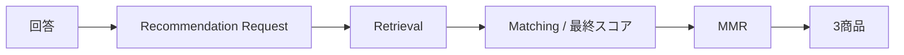

# MVPスコープ定義書

## 1. 概要

### 1.1 目的

- MVP（Minimum Viable Product）のスコープを定義する
- 価値仮説を最小コストで検証するための対象機能・非対象機能を明確化する

### 1.2 改訂

| 項目 | 内容 |
| ---- | ---- |
| 更新日 | 2026-08-31 |
| 決定 | Human。検証対象を診断UXによる「贈る」到達へ差し替え |
| 記録 | `ai-logs/human-decisions/2026-08-31-gift-giving-ux-pivot.md` |

---

## 2. 前提整理

### 2.1 検証対象の価値仮説（再掲）

一問一答形式のゲーム感覚UXにより、候補過多の意思決定負荷を下げ、ユーザーを「贈る」まで誘導できる。

正本は [価値仮設定義書](./価値仮設定義書.md) とする。

### 2.2 検証対象ユーザー

- 先送り層（S01）
- 正本は [ターゲット定義書](./ターゲット定義書.md) とする

### 2.3 初期の対象範囲

- Occasion / Relationship / 商品ジャンルは限定する
- 具体値は未確定。実装容易性と利用頻度（シーンの起きやすさ）、先送りの起きやすさで選定する

---

## 3. MVPの目的

### 3.1 検証目的

診断UXが、先送りを減らし、「贈る」到達（商品確定かつ外部リンク遷移）を増やすかを検証する。

### 3.2 検証したい問い（重要）

| ID | 検証問い |
| -- | -------- |
| Q01 | 一問一答は、条件フォームや長い一覧より最後まで進むか |
| Q02 | 出口を3商品に限定すると、1つを確定できるか |
| Q03 | 確定後、楽天アフィリエイトURLへ遷移するか |

検証しないこと:

- 意味スコアが理解されるか
- 購入完了するか（対象外）
- 既存ギフトECより推薦精度が上か（テーブルステークス以上は見ない）

---

## 4. MVPスコープ定義

### 4.1 対象機能（In Scope）

| 機能ID | 機能名 | 概要 |
| ------ | ------ | ---- |
| F01 | 一問一答 | 回答で条件を狭める。ゲーム感覚の体験 |
| F02 | Request写像 | 回答を Recommendation Request へ変換する |
| F03 | 推奨商品群生成 | 限定したシーン×相手×ジャンルで候補を作る |
| F04 | 最終スコア + MMR | 内部ロジックは既存を用いる |
| F05 | 3商品提示 | 1位・2位・3位のみ |
| F06 | 選択性向レポート | 回答から分かる傾向の最小表示 |
| F07 | 商品確定 | 3つのうち1つを選ぶ |
| F08 | 外部リンク遷移 | 確定商品の楽天アフィリエイトURLへ遷移する |
| F09 | おすすめ理由 | 3商品それぞれに理由を付ける |

### 4.2 非対象機能（Out of Scope）

| 分類 | 内容 | 理由 |
| ---- | ---- | ---- |
| 決済 | 購入機能 | 「贈る」成功は遷移まで |
| 配送 | 配送管理 | EC機能は対象外 |
| 会員管理 | ログイン / ユーザー管理 | MVPでは不要 |
| 類似商品リスト | 1位〜3位の類似商品内部ページ | 後続候補。実装負荷が高ければ初回対象外 |
| 高精度モデル | 精度最大化 | テーブルステークス以上は後工程 |
| 制限時間 | 3秒制限など | 未確定。初回必須にしない |

---

## 5. スコープ境界（重要）

### 5.1 やること

- 一問一答で先送りせずに3商品まで進める体験を提供する
- 1商品を確定し、外部リンクへ遷移させる
- 仮説検証に必要な最小機能だけを実装する
- 初期の Occasion / Relationship / ジャンルを限定する

### 5.2 やらないこと

- 完全なEC体験
- 意味の可視化を前面の価値にすること
- 精度最大化
- 全シーン・全関係性への対応
- 類似商品の回遊（初回は対象外としてよい）

---

## 6. 機能詳細（MVPレベル）

### 6.1 体験フロー

### 6.2 裏側処理（既存ロジックを用いる）

内部の最終スコア計算・MMR・理由生成の本体は、本MVPで作り直さない。変えるのは入力の作り方と、出口を3件に固定することである。

### 6.3 診断の出口（Human 決定）

| 項目 | 決定 |
| ---- | ---- |
| 件数 | 3商品（1位、2位、3位） |
| 多様性 | MMR を加味する |
| 類似商品リンク | レポートに内部ページリンクを付けてよい |
| 類似商品の初回 | 実装負荷が高ければ対象外 |

### 6.4 「贈る」成功（Human 決定）

次をともに満たしたときを成功とする。

1. 3商品のうち1つを確定する
2. その商品の楽天アフィリエイトURLへ遷移する

---

## 7. データスコープ

### 7.1 使用データ

| 種別 | 内容 |
| ---- | ---- |
| 商品データ | 楽天API等。初期ジャンルは限定 |
| テキスト | 商品名・説明 |
| メタデータ | カテゴリ・タグ |
| アフィリエイトURL | 外部遷移先 |

### 7.2 非対象データ

- 画像解析（初期は除外）
- レビュー詳細解析（簡易利用のみ）
- 外部ECの購入完了データ

---

## 8. 技術スコープ

### 8.1 使用技術（MVP）

| 領域 | 技術 |
| ---- | ---- |
| フロント | Next.js |
| API | Express |
| レコメンド | FastAPI |
| DB | PostgreSQL + pgvector |
| Embedding | OpenAI |

### 8.2 非対象

- マイクロサービス分割
- スケーリング設計
- 高可用性構成

---

## 9. KPI仮説

### 9.1 行動指標

| 指標 | 目的 |
| ---- | ---- |
| 診断完了率 | 一問一答が最後まで進むか |
| 商品確定率 | 3商品から1つを選べるか |
| 外部リンク遷移率 | 確定後に外部へ進むか |
| 贈る到達率 | 主成功。確定かつ遷移 |

### 9.2 成功基準（仮）

- 贈る到達が、従来の条件フォーム＋長い一覧より高い（比較方法は未確定）
- 定性で「先送りせずに進められた」

数値閾値は未設定である。

---

## 10. リスク・前提条件

### 10.1 リスク

| リスクID | 内容 | 対応 |
| -------- | ---- | ---- |
| R01 | 設問がRequestに写像できない | 写像を先に設計する |
| R02 | 3商品でも確定しない | 出口と理由を検証する |
| R03 | 推奨品質がテーブルステークスを下回る | 限定ジャンルで品質を見る |
| R04 | 画面・体験の作り込みが大きい | 類似商品と制限時間は初回対象外 |

### 10.2 前提条件

- 内部の最終スコアと MMR は既存を使える
- 低精度でも、体験仮説の検証は可能
- 決済なしで「贈る」到達を定義してよい

---

## 11. 今後の展開

### 11.1 MVP後の拡張

- 類似商品リスト
- 設問の改善、任意の制限時間
- Occasion / Relationship / ジャンルの拡大
- Feature精緻化（裏側品質）

### 11.2 未確定事項

- 初期 Occasion / Relationship / ジャンルの具体値
- 設問セット、設問数、制限時間
- 診断画面の画面ID・遷移（既存 SCR-002 との関係）
- KPI数値目標
- 従来フォームとの A/B 実施有無
