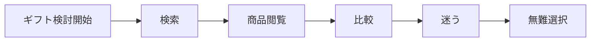

# ターゲット定義書

## 1. 概要

### 1.1 目的

- 本サービスにおける最適化対象ユーザーを明確化する
- レコメンドロジック（意味空間・スコアリング）の前提条件を定義する

## 2. ターゲット定義方針

### 2.1 セグメンテーション軸

| 軸               | 説明                               |
| ---------------- | ---------------------------------- |
| ギフト頻度       | 年間のギフト回数                   |
| 関係性重視度     | 相手との関係性をどれだけ重視するか |
| 意思決定スタイル | 直感 / 比較 / 安全志向             |
| リスク許容度     | 失敗に対する許容度                 |

### 2.2 セグメント分類（全体像）

| セグメントID | セグメント名    | 特徴                           | 優先度 |
| ------------ | --------------- | ------------------------------ | ------ |
| S01          | 意味重視×迷い層 | 意味は重視するが言語化できない | High   |
| S02          | 安全志向層      | 失敗回避が最優先               | Mid    |
| S03          | 直感即決層      | 深く考えず選ぶ                 | Low    |

## 3. コアターゲット定義

### 3.1 コアターゲット

- セグメントID：S01
- セグメント名：意味重視×迷い層

#### 選定理由（推論）

- 最も意思決定支援の価値が高い
- 既存サービスで解決されていない
- レコメンドの差別化が最も効く

### 3.2 サブターゲット

| セグメントID | 理由                                   |
| ------------ | -------------------------------------- |
| S02          | 安全性指標（Social軸）の価値検証に有効 |

## 4. ペルソナ定義

### 4.1 基本情報

- 名前：田中 太郎
- 年齢：28歳
- 性別：男性
- 職業：ITエンジニア
- 年収：500万円
- 居住地：都市部

### 4.2 ライフスタイル・価値観

- 忙しく時間がない
- 効率的に意思決定したい
- 人間関係は大切にするが、表現が苦手

### 4.3 行動特性（事実）

- ECサイトで検索する
- レビュー・ランキングを確認する
- 比較するが決めきれない

### 4.4 心理特性（推論）

- 「失敗したくない」という不安が強い
- 「特別感を出したい」という欲求がある
- 何を基準に選べばよいか分からない

## 5. ユーザー行動モデル

### 5.1 行動フロー

### 5.2 意思決定プロセス

| フェーズ | 行動         | 課題           | 感情 |
| -------- | ------------ | -------------- | ---- |
| 認知     | ギフトを探す | 選択肢が多い   | 面倒 |
| 検討     | 比較する     | 判断基準がない | 不安 |
| 決定     | 購入する     | 自信がない     | 妥協 |

## 6. ニーズ・課題

### 6.1 顕在ニーズ（事実）

- 「いい感じのギフトを探したい」
- 「失敗したくない」

### 6.2 潜在ニーズ（推論）

- 「相手との関係性に合った意味を伝えたい」
- 「無難ではないが安全な選択をしたい」

### 6.3 課題一覧

| 課題ID | 内容               | 深刻度 |
| ------ | ------------------ | ------ |
| P01    | 意味で比較できない | High   |
| P02    | 判断基準がない     | High   |
| P03    | 選択に時間がかかる | Mid    |

## 7. 価値仮説（Value Hypothesis）

### 7.1 提供価値

- 意味ベースで選べる
- 安全性と特別感のバランス提示
- 意思決定時間の短縮

### 7.2 差別化ポイント

- 商品ではなく「意味」でレコメンド
- Social / Symbolic軸での評価
- リスク指標を考慮したランキング

## 8. KPI影響仮説

### 8.1 行動指標

| 指標     | 期待変化 |
| -------- | -------- |
| CTR      | 向上     |
| CVR      | 向上     |
| 選択時間 | 短縮     |

### 8.2 心理指標

- 納得感の向上
- 不安の低減
- 満足度向上

## 9. スコープ

### 9.1 対象ユーザー（In Scope）

- ギフト選択に迷うユーザー
- 意味を重視するが言語化できないユーザー

### 9.2 非対象ユーザー（Out of Scope）

- 明確な商品指定があるユーザー
- 価格最優先のユーザー

## 10. リスク・前提条件

### 10.1 リスク

| リスクID | 内容                     | 対応       |
| -------- | ------------------------ | ---------- |
| R01      | 意味モデルが理解されない | UI改善     |
| R02      | 精度不足                 | モデル改善 |

### 10.2 前提条件

- ユーザーは意味で意思決定したい
- 意味は構造化可能である

## 11. 今後の展開

### 11.1 次工程へのインプット

- Meaning空間設計
- Feature定義
- スコアリング設計

### 11.2 未確定事項

- セグメント粒度
- KPI閾値
