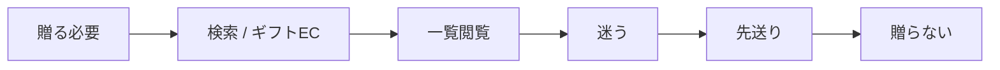
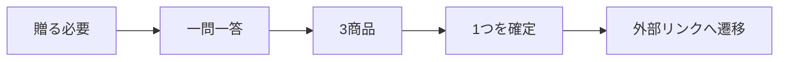

# ターゲット定義書

## 1. 概要

### 1.1 目的

- 本サービスにおける最適化対象ユーザーを明確化する
- 「贈る」まで至らせる体験（診断UX）と、裏側の推奨商品群生成の前提条件を定義する

### 1.2 改訂

| 項目 | 内容 |
| ---- | ---- |
| 更新日 | 2026-08-31 |
| 決定 | Human。コアターゲットを先送り層へ差し替え |
| 記録 | `ai-logs/human-decisions/2026-08-31-gift-giving-ux-pivot.md` |

---

## 2. ターゲット定義方針

### 2.1 セグメンテーション軸

| 軸 | 説明 |
| -- | ---- |
| 贈る意思 | 贈りたい気持ちがあるか / 義務感があるか |
| 先送り傾向 | 期限まで開かない、開いて閉じるか |
| 候補負荷耐性 | 多数一覧を比較し切れるか |
| 商品指定の有無 | 欲しい品が決まっているか |

### 2.2 セグメント分類（全体像）

| セグメントID | セグメント名 | 特徴 | 優先度 |
| ------------ | ------------ | ---- | ------ |
| S01 | 先送り層 | 贈りたいが候補が多く、決めきれず贈らない | High |
| S02 | 推奨充足層 | 既存ギフトECの特集・フィルタで決まる | Low |
| S03 | 明確指定層 | 商品が決まっている | 対象外 |

---

## 3. コアターゲット定義

### 3.1 コアターゲット

- セグメントID：S01
- セグメント名：先送り層

#### 選定理由

- 最大課題は「贈る」まで至らないことである（課題定義書）
- 既存ギフトECは推奨商品群の提示までを充足しており、S02は主戦場にしない
- 診断UXの価値は、決めきれず先送りする人に最も効く（推論）

### 3.2 サブターゲット

初期は置かない。S02 は獲得できても、最適化対象にはしない。

### 3.3 初期のシーン × 相手

初回リリースでは Occasion / Relationship / 商品ジャンルを限定する（Human 決定）。

具体値は未確定である。選定基準は次とする。

| 基準 | 内容 |
| ---- | ---- |
| 実装容易性 | 設問・推奨群・ジャンルを狭く保てる |
| 利用頻度 | ギフトシーンが繰り返し起きやすい |
| 先送りの起きやすさ | 候補が多く、期限がある |

候補（未確定。採用ではない）:

- 相手: 親、義父母
- 場面: 季節儀礼、お礼、誕生日
- ジャンル: 消えもの（酒・スイーツ・花 等）

---

## 4. ペルソナ定義

### 4.1 基本情報

- 名前：田中 太郎
- 年齢：28歳
- 性別：男性
- 職業：ITエンジニア
- 年収：500万円
- 居住地：都市部

### 4.2 ライフスタイル・価値観

- 忙しく時間がない
- 人間関係は大切にするが、贈る手続きを後回しにする
- 失敗はしたくないが、長い比較作業はしたくない

### 4.3 行動特性（観察・推論）

- ギフトECやランキングを開くことがある
- 特集やおすすめを眺める
- 候補が多く、1つに決められず閉じる
- 期限が過ぎて贈らないことがある

### 4.4 心理特性（推論）

- 「何が喜ばれるか」の大枠は分かるが、この中の1つに落とせない
- 一覧を見ると面倒になり、今日やらなくてよいと思う
- カタログに逃げるのは気が引ける場合がある

---

## 5. ユーザー行動モデル

### 5.1 行動フロー（As-Is）

### 5.2 行動フロー（To-Be 仮説）

### 5.3 意思決定プロセス

| フェーズ | 行動 | 課題 | 感情 |
| -------- | ---- | ---- | ---- |
| 認知 | 贈る必要に気づく | 後でやろうと思う | 面倒 |
| 検討 | おすすめを見る | 候補が多い | 疲れ |
| 決定 | 1つに落とせない | 先送り | 先延ばし |
| 実行 | 贈らない | 到達しない | 後ろめたさ |

---

## 6. ニーズ・課題

### 6.1 顕在ニーズ

- 「何を贈ればいいか、早く決めたい」
- 「失敗したくない」

### 6.2 潜在ニーズ（推論）

- 「長い一覧を見ずに終わりたい」
- 「選んだ感じは残したい」

### 6.3 課題一覧

| 課題ID | 内容 | 深刻度 |
| ------ | ---- | ------ |
| P01 | シーン×相手で喜ばれるものが分からない | Mid（前提） |
| P02 | おすすめ候補が多すぎる | High |
| P03 | 先送りして贈らない | High |

---

## 7. 価値仮説（再掲）

正本は [価値仮設定義書](./価値仮設定義書.md) とする。ここでは要点のみ記す。

### 7.1 提供価値

- 一問一答で先送りせずに進める
- 3商品から1つを確定できる
- 外部リンクへ遷移できる

### 7.2 差別化ポイント

- 推奨品質そのものではなく、「贈る」まで運ぶ体験
- 出口は3商品に限定する
- ゲーム感覚の一問一答

---

## 8. KPI影響仮説

正本は価値仮設定義書 §7 とする。

| 指標 | 期待変化 |
| ---- | -------- |
| 診断完了率 | フォームより高い |
| 商品確定率 | 長い一覧より高い |
| 外部リンク遷移率 | 確定後に発生する |
| 贈る到達率 | 主指標。確定かつ遷移 |

---

## 9. スコープ

### 9.1 対象ユーザー（In Scope）

- 贈りたい気持ち、または贈る必要があり、候補が多くて先送りするユーザー
- 初回は限定した Occasion / Relationship / ジャンルの利用者

### 9.2 非対象ユーザー（Out of Scope）

- 欲しい商品が決まっているユーザー
- 価格最優先で指名買いするユーザー
- 既存ギフトECの特集だけで決まるユーザー（獲得できても最適化しない）

---

## 10. リスク・前提条件

### 10.1 リスク

| リスクID | 内容 | 対応 |
| -------- | ---- | ---- |
| R01 | 先送りの主因が候補数ではない | 開始率と完了率を分けて見る |
| R02 | 診断が軽すぎて贈答にそぐわない | 定性評価で見る |
| R03 | 初期シーンが狭すぎて利用が起きない | 頻度と先送りのバランスで選定する |

### 10.2 前提条件

- シーン×相手の推奨商品群は既存相当で足りる
- 「贈る」成功は商品確定と外部リンク遷移である

---

## 11. 今後の展開

### 11.1 次工程へのインプット

- 初期 Occasion / Relationship / ジャンルの決定
- 診断設問設計
- MVPスコープ定義書

### 11.2 未確定事項

- 初期の相手・場面・ジャンルの具体値
- 設問セットと制限時間
- セグメントのこれ以上の細分化
- KPI閾値
