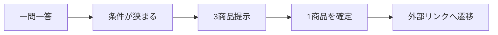

# 価値仮設定義書

## 1. 概要

### 1.1 目的

- 本サービスが提供する価値仮説を明確化する
- ユーザー行動の変化を定義し、KPI設計および体験・レコメンド設計の前提とする

### 1.2 改訂

| 項目 | 内容 |
| ---- | ---- |
| 更新日 | 2026-08-31 |
| 決定 | Human。中核仮説を「意味の可視化」から「診断UXで贈るまで運ぶ」へ差し替え |
| 記録 | `ai-logs/human-decisions/2026-08-31-gift-giving-ux-pivot.md` |
| 課題の正本 | [課題定義書](./課題定義書.md) |

---

## 2. 前提整理

### 2.1 対象ユーザー（再掲）

- 先送り層（S01）
- 贈りたいが、おすすめ候補が多く決めきれず、贈るまで至らないユーザー

詳細は [ターゲット定義書](./ターゲット定義書.md) を正とする。

### 2.2 仮説の層（重要）

| 層 | 内容 | 扱い |
| -- | ---- | ---- |
| 難しさの前提 | ギフトシーン × 相手ごとに、何を贈ると喜ばれるか分からない | 市場前提。これ自体は差別化しない |
| サービス前提 | シーン × 相手の推奨商品群を提示する | テーブルステークス。既存ギフトECと同品質で足りる（判断） |
| 最大の課題 | 「贈る」アクションまで誘導できていない | 本丸 |
| 要因仮説 | おすすめ候補が多すぎて意思決定負荷が高く、先送りする | 最大課題の原因 |
| 解決仮説 | 一問一答形式のゲーム感覚UXが、負荷を下げ贈るまで運ぶ | 検証対象の価値仮説 |

### 2.3 現状課題（要約）

| 課題ID | 内容 |
| ------ | ---- |
| P01 | シーン×相手で喜ばれるものが分からない（前提） |
| P02 | 推奨群は得られても候補が多い（要因） |
| P03 | 先送りし、贈らない（最大課題） |

---

## 3. 価値仮説（Core Value Hypothesis）

### 3.1 中核仮説（推論・Human採択）

一問一答形式のゲーム感覚UXにより、候補過多の意思決定負荷を下げ、ユーザーを「贈る」まで誘導できる。

本サービスにおける「贈る」の成功は、次の2つをともに満たしたときとする。

1. 提示した3商品のうち1つを確定する
2. その商品の外部商品リンク（楽天アフィリエイトURL）へ遷移する

購入完了は成功定義に含めない（決済は対象外）。

### 3.2 補助仮説（推論）

| 仮説ID | 仮説内容 |
| ------ | -------- |
| VH01 | 短い一問一答は、条件フォームや長い一覧より開始・完了しやすい |
| VH02 | 出口を MMR 込みの3商品に限定すると、確定まで至りやすい |
| VH03 | 選択性向レポートは、確定した1つを贈る納得を補強する |
| VH04 | Feature / 最終スコア / MMR は、推奨商品群の内部生成手段として既存品質を満たせる |

### 3.3 捨てた中核仮説

次は、前面の価値仮説としては採用しない。

- 贈答の意味（Social × Symbolic）を可視化すれば、ユーザーは意思決定できる

裏側の Feature / Ranking は、シーン×相手の推奨商品群を作る手段として残してよい。

---

## 4. 提供価値定義

### 4.1 提供価値一覧

| 価値ID | 価値 | 内容 |
| ------ | ---- | ---- |
| V01 | 先送りせずに進める | 一問一答で条件が狭まり、長い一覧を読まなくてよい |
| V02 | 3つから確定できる | 出口は1位・2位・3位の3商品に限定する |
| V03 | 贈る手前まで運ぶ | 確定した商品の楽天アフィリエイトURLへ遷移できる |

### 4.2 価値の構造



---

## 5. 価値提供メカニズム

### 5.1 前面（体験）

- 一問一答で回答を進める
- ある程度条件が揃ったら、選択性向レポートと3商品を提示する
- ユーザーは1商品を確定し、外部商品リンクへ進む

### 5.2 裏側（推奨商品群の生成）

- 回答を Recommendation Request へ写像する
- Feature / Retrieval / Matching / 最終スコア / MMR で3商品を決める
- おすすめ理由を付ける
- この層は既存ギフトECの推奨品質に追いつくための手段であり、前面の訴求にはしない

### 5.3 診断の出口（Human 決定）

| 項目 | 決定 |
| ---- | ---- |
| 提示件数 | 3商品（1位、2位、3位） |
| 順位付け | 最終スコアに MMR（多様性）を加味する |
| 類似商品 | レポートから、各順位の類似商品リスト（内部ページ）へリンクしてよい |
| 類似商品の初回MVP | 実装負荷が高ければ対象外としてよい |

### 5.4 提供ロジック（簡略）

```text
診断回答
  → Recommendation Request
  → 最終スコア + MMR
  → 3商品（1位 / 2位 / 3位）
  → 1商品確定
  → 楽天アフィリエイトURLへ遷移
```

---

## 6. ユーザー行動変化仮説

### 6.1 Before / After

| 項目 | Before | After |
| ---- | ------ | ----- |
| 開始 | 検索・フィルタ・特集を開く | 一問一答を始める |
| 途中 | 多数の候補を比較し、疲れる | 質問に答え、候補が減る |
| 出口 | 一覧を閉じる / 先送り | 3つのうち1つを確定する |
| 実行 | 贈らない | 外部リンクへ遷移する |

### 6.2 行動変化（推論）

- 開いて閉じる → 最後まで進める
- 多数比較 → 3択で確定
- 先送り → 外部リンクへ進む

---

## 7. KPI仮説

### 7.1 行動指標

| 指標 | 定義 | 仮説 |
| ---- | ---- | ---- |
| 診断完了率 | 開始から3商品提示まで | フォーム入力より高い |
| 商品確定率 | 3商品のうち1つを確定 | 長い一覧より高い |
| 外部リンク遷移率 | 確定後のアフィリエイト遷移 | 「贈る」到達の構成要素 |
| 贈る到達率 | 商品確定 かつ 外部リンク遷移 | 主KPI |

### 7.2 心理指標（推論）

| 指標 | 仮説 |
| ---- | ---- |
| 面倒さ | 低減 |
| 先送り感 | 低減 |
| 確定への納得 | レポートで補強 |

---

## 8. 検証方法

### 8.1 オフライン評価

- シーン×相手に対する推奨商品群の最低品質（テーブルステークス）
- 3商品の多様性（MMRが効いているか）

### 8.2 オンライン評価

- 診断完了率
- 商品確定率
- 外部リンク遷移率
- 贈る到達率

### 8.3 定性評価

- 先送りせずに進められたか
- 3つの中から選べたか
- ゲーム感覚が軽すぎて贈答にそぐわないと感じないか

---

## 9. リスク・前提条件

### 9.1 リスク

| リスクID | 内容 | 対応 |
| -------- | ---- | ---- |
| R01 | 候補過多が先送りの主因ではない | 開始率と完了率を分離して見る |
| R02 | 3商品でも確定しない | 理由・レポート・CTAを検証する |
| R03 | 診断が遊びに終わり、遷移しない | 成功を遷移まで置く |
| R04 | 推奨品質が既存ECを下回る | テーブルステークスとして別途見る |

### 9.2 前提条件

- シーン×相手の推奨商品群は既存相当で足りる
- 決済を持たず、外部リンク遷移を「贈る」到達と定義する
- 一問一答の回答は、内部の Request / スコアリングに写像できる

---

## 10. 今後の展開

### 10.1 次工程へのインプット

- 診断設問設計
- 設問から Recommendation Request への写像
- 画面（診断 / レポート / 3商品 / 外部遷移）
- 初期 Occasion / Relationship / ジャンルの選定

### 10.2 未確定事項

- 設問内容、設問数、制限時間の有無
- 初期ターゲットの Occasion / Relationship / ジャンル具体値
- 類似商品リストの採用時期
- KPIの数値目標
