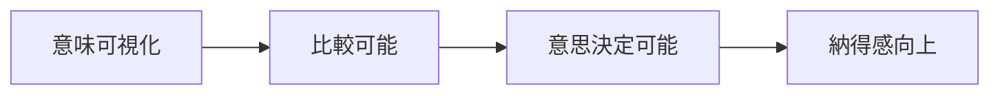

# 価値仮設定義書

## 1. 概要

### 1.1 目的

- 本サービスが提供する価値仮説を明確化する
- ユーザー行動の変化を定義し、KPI設計およびレコメンドロジック設計の前提とする

## 2. 前提整理

### 2.1 対象ユーザー（再掲）

- 意味重視×迷い層（S01）
- 「意味で選びたいが、選べないユーザー」

### 2.2 現状課題（要約）

| 課題ID | 内容                   |
| ------ | ---------------------- |
| P01    | 意味で比較できない     |
| P02    | 判断基準がない         |
| P03    | 意思決定に時間がかかる |

## 3. 価値仮説（Core Value Hypothesis）

### 3.1 中核仮説（推論）

- ユーザーは「贈答の意味（関係性・感情）」を定量化・可視化することで、意思決定が可能になる

### 3.2 補助仮説（推論）

| 仮説ID | 仮説内容                                        |
| ------ | ----------------------------------------------- |
| VH01   | 意味の可視化により比較が可能になる              |
| VH02   | リスク指標により意思決定の不安が低減する        |
| VH03   | 意味×安全性のバランス提示により納得感が向上する |

## 4. 提供価値定義

### 4.1 提供価値一覧

| 価値ID | 価値             | 内容                       |
| ------ | ---------------- | -------------------------- |
| V01    | 意味で選べる     | 商品ではなく意味で比較可能 |
| V02    | 安全に攻められる | 無難と特別のバランス提示   |
| V03    | 迷わず決められる | 意思決定時間短縮           |

### 4.2 価値の構造



## 5. 価値提供メカニズム

### 5.1 概要

- 意味を特徴量化（Feature）
- 意味空間（Social × Symbolic）に射影
- スコアリングによるランキング生成

### 5.2 詳細（推論）

| 要素     | 内容               |
| -------- | ------------------ |
| Social   | 安全性・社会適合性 |
| Symbolic | 感情・特別感       |
| Risk     | 失敗確率           |

### 5.3 提供ロジック（簡略）

```text
最終スコア =
意味適合度（Symbolic）
× 安全性（Social）
× リスク補正
```

## 6. ユーザー行動変化仮説

### 6.1 Before / After

| 項目     | Before       | After      |
| -------- | ------------ | ---------- |
| 比較軸   | 商品スペック | 意味       |
| 意思決定 | 不安・迷い   | 納得・確信 |
| 選択結果 | 無難         | 最適       |

### 6.2 行動変化（推論）

- レビュー依存 → 意味スコア参照
- 長時間比較 → 短時間決定
- 無難選択 → 意図的選択

## 7. KPI仮説

### 7.1 行動指標

| 指標     | 仮説             |
| -------- | ---------------- |
| CTR      | 意味可視化で向上 |
| CVR      | 納得感向上で向上 |
| 滞在時間 | 短縮（効率化）   |

### 7.2 心理指標（推論）

| 指標   | 仮説 |
| ------ | ---- |
| 納得感 | 向上 |
| 不安   | 低減 |
| 満足度 | 向上 |

## 8. 検証方法

### 8.1 オフライン評価

- 意味一致度
- ランキング精度

### 8.2 オンライン評価

- A/Bテスト
- CTR / CVR

### 8.3 定性評価

- ユーザーインタビュー
- フィードバック分析

## 9. リスク・前提条件

### 9.1 リスク

| リスクID | 内容               | 対応       |
| -------- | ------------------ | ---------- |
| R01      | 意味が理解されない | UI改善     |
| R02      | 精度不足           | モデル改善 |

---

### 9.2 前提条件

- 意味は構造化可能である
- ユーザーは意味で意思決定したい

## 10. 今後の展開

### 10.1 次工程へのインプット

- Feature定義
- Meaning空間設計
- スコアリング設計

### 10.2 未確定事項

- 重み調整
- Feature粒度
