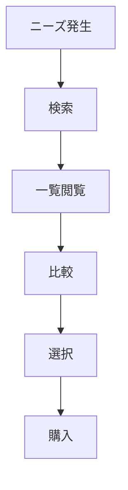
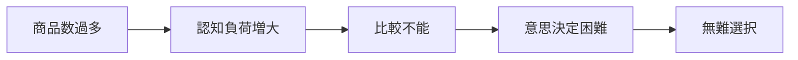

# 課題定義書

## 1. 概要

### 1.1 背景

- 個人的に、母の日や父の日及び、義父・義母へのお中元などを面倒くさがって贈っていなかった。ただ、その意義はぼんやりと理解はしており、相手への気持ちを伝える手段としてギフトを贈りたいとはずっと思っている。
- では、なぜ贈ることができないのか（面倒くさがってしまうのか）、なぜ贈ることに意義があるのかを考えたときに、以下であると考えた。
  - 贈ることを「サポート」することは現代のIT技術で可能ではないか
  - 贈答行為は`日本の古来から続く文化`であり、単なる贈答にとどまらず、`日本文化への興味、理解深める`ことにつながるのではないか
- ギフトにも`慣習的なギフト（お中元、お歳暮など）`や`個人的なギフト（誕生日、結婚記念日など）`、`中間的な慣習性と個人性をもつギフト（昇進祝い、出産祝い）など`多種なカテゴリが想定される。  
  多様なコンテキストにおけるギフトが存在する中で、すべてのコンテキストを踏まえた調査ではないと想定しているが、ギフト市場自体は古くから起業マーケティングの対象として着目されている程度には市場規模があり、マーケット自体も安定して推移している認識。
- （なぜ今この課題に取り組むのか）
- 現状のギフト市場、特にEC市場に対する各企業のアプローチに着目すると、レビュー、ランキングなどの`商品軸の比較`に最適化されていると感じている。  
  しかし、ギフト用とにおいては、`商品選択`ではなく、`意味選択（気持ち・関係性の表現）`が重要であると考える。

### 1.2 目的

- 本プロジェクトの目的は下記とする。
  - 本サービスを通して、ギフト贈答を行う人口を増やし、贈答者、贈答相手ともに満足度を高めること

```
　本サービスは、ギフトを「モノの授受」ではなく「コミュニケーションの表現」として捉え、ギフト選びを「検索問題」から「意思決定問題」として捉え直す。
```

- 本サービスを通して、贈答イベント自体の文化的背景に興味を持ってもらうこと
- 本プロジェクトにおける位置づけ

## 2. 対象ユーザー定義

### 2.1 ユーザーセグメント

| セグメントID | セグメント名   | 特徴                               | 想定シーン     |
| ------------ | -------------- | ---------------------------------- | -------------- |
| U01          | ライトギフト層 | 年数回のギフト、明確な商品知識なし | 誕生日・母の日 |
| U02          | 関係性重視層   | 相手との関係性を重視               | 恋人・友人     |
| U03          | 安全志向層     | 失敗回避を最優先                   | 上司・ビジネス |

### 2.2 ペルソナ（必要に応じて）

- 性別：男性
- 年齢：28歳
- 贈答相手：実母
- 職業：ITエンジニア
- ライフスタイル：忙しく時間がない
- 行動特性：検索ベースで商品を探すが決めきれない
- 課題意識：「無難過ぎず、でも失敗しないギフトを選びたい」

## 3. 現状分析（As-Is）

### 3.1 現在のユーザー行動フロー



### 3.2 現状の課題（事実ベース）

| 課題ID | 課題内容                         | 発生タイミング | 根拠（データ/観察）                                                                                                                          |
| ------ | -------------------------------- | -------------- | -------------------------------------------------------------------------------------------------------------------------------------------- |
| P01    | ニーズの自己理解不足             | 検索           | ギフトの対象は`他者`であるため、ニーズの把握が困難                                                                                           |
| P02    | 膨大な商品数に対する比較の難しさ | 比較           | 商品数が膨大にある（別ショップの同一商品も存在する）なかで、多面的な商品選択の判断基準（ギフトのニーズ）に対して意思決定判断をするのが難しい |

### 3.3 現状の制約条件

- 技術的制約：
  - ギフト選びのコンテキスト類推が難しい
  - ギフト選択のコンテキストに対応できる商品のメタデータ体系化が難しい
- 業務的制約：
  - ギフト選びのコンテキスト類推が難しい（贈答元、贈答相手、イベント）
- コスト制約：
  - 商品数が膨大なため、データ管理コストも膨大

## 4. 課題構造分析

### 4.1 課題の分類

| 分類         | 内容                 |
| ------------ | -------------------- |
| 認知課題     | 選択肢が多すぎる     |
| 意思決定課題 | 意味の比較ができない |
| 実行課題     | 時間がない           |

### 4.2 課題の因果関係



## 5. 本質課題（Core Problem）

### 5.1 本質課題の定義

- ユーザーは「贈答の意味（関係性・感情）」を軸に意思決定したいが、それを比較・評価できないため、商品スペックに依存した選択に陥っている

### 5.2 本質課題の根拠

- 行動が「レビュー」「ランキング」に収束している
- 意味情報は非構造化されている
- 意思決定の最終判断が曖昧

## 6. 仮説（Hypothesis）

### 6.1 課題に対する仮説

| 仮説ID | 仮説内容                     | 根拠       | 検証方法       |
| ------ | ---------------------------- | ---------- | -------------- |
| H01    | 意味を定量化すれば選択できる | 心理モデル | ABテスト       |
| H02    | Social/SYmbolic軸で表現可能  | 理論設計   | オフライン評価 |
| H03    | リスク指標が意思決定に効く   | 行動観察   | CTR/選択率     |

### 6.2 ユーザー行動仮説

- ユーザーは「失敗回避（Social）」と「特別感（Symbolic）」のバランスで意思決定する

## 7. 解決方針（方向性レベル）

### 7.1 解決アプローチ

- 意味の構造化（特徴量化）
- 意味空間への射影
- 意味ベースランキング

### 7.2 提供価値（Value Proposition）

- 「意味」で選べる（ギフトコンテキストをベースとしたレコメンド）
- 失敗しないが無難ではない
- 選択時間の短縮

## 8. スコープ定義

### 8.1 対象範囲（In Scope）

- ギフトレコメンド
- 意味特徴量生成
- ランキングロジック

### 8.2 非対象範囲（Out of Scope）

- 決済
- 配送管理

## 9. 成功指標（KPI仮定）

### 9.1 定量指標

| 指標     | 定義         | 目標値 |
| -------- | ------------ | ------ |
| CTR      | クリック率   | +20%   |
| CVR      | 購入率       | +10%   |
| 選択時間 | 意思決定時間 | -30%   |

### 9.2 定性指標

- 選びやすい
- 納得感がある

## 10. リスクと前提条件

### 10.1 リスク

| リスクID | 内容               | 影響度 | 対応方針    |
| -------- | ------------------ | ------ | ----------- |
| R01      | 意味モデル精度不足 | 高     | 継続学習    |
| R02      | データ不足         | 中     | 外部API活用 |

### 10.2 前提条件

- 意味が定量化可能である
- ユーザーは意味で意思決定する

## 11. 今後の展開

### 11.1 次工程へのインプット

- Meaningモデル定義
- Feature設計
- スコアリングロジック

### 11.2 未確定事項

- Feature粒度
- 重み最適化
