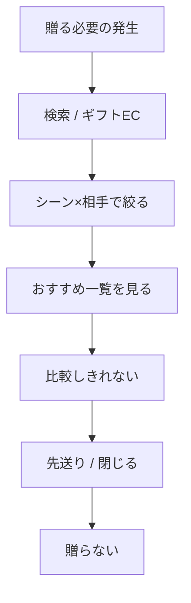
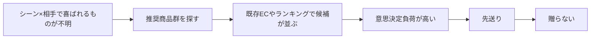

# 課題定義書

## 1. 概要

### 1.1 背景

- 個人的に、母の日や父の日及び、義父・義母へのお中元などを面倒くさがって贈っていなかった。ただ、その意義はぼんやりと理解はしており、相手への気持ちを伝える手段としてギフトを贈りたいとはずっと思っている。
- では、なぜ贈ることができないのか（面倒くさがってしまうのか）、なぜ贈ることに意義があるのかを考えたときに、以下であると考えた。
  - 贈ることを「サポート」することは現代のIT技術で可能ではないか
  - 贈答行為は`日本の古来から続く文化`であり、単なる贈答にとどまらず、`日本文化への興味、理解深める`ことにつながるのではないか
- ギフトにも`慣習的なギフト（お中元、お歳暮など）`や`個人的なギフト（誕生日、結婚記念日など）`、`中間的な慣習性と個人性をもつギフト（昇進祝い、出産祝い）など`多種なカテゴリが想定される。
  多様なコンテキストにおけるギフトが存在する中で、すべてのコンテキストを踏まえた調査ではないと想定しているが、ギフト市場自体は古くから企業マーケティングの対象として着目されている程度には市場規模があり、マーケット自体も安定して推移している認識。
- ギフト選びの難しさの前提は、「ギフトシーン × 相手ごとに、どんなものを贈ると喜ばれるかが分からない」ことである。
- 既存のギフトEC（ギフトモール、Anny 等）は、シーン・相手・予算でのフィルタやおすすめ特集により、推奨商品群の提示までを充足している。
- 本サービスでも、商品データの最終ランキング等により、既存ギフトECの推奨商品群と同品質の提示は可能である、という前提に立つ（品質そのものは検証対象。差別化の主戦場にはしない）。
- この状況で解けていない最大の課題は、「贈る」というユーザーアクションまで誘導することである。
- その要因仮説は、おすすめ商品候補が多すぎて意思決定負荷が高く、先送りしてしまうことである。

### 1.2 目的

- 本プロジェクトの目的は下記とする。
  - 本サービスを通して、ギフト贈答を行う人口を増やし、贈答者、贈答相手ともに満足度を高めること

```
　本サービスは、ギフトを「モノの授受」ではなく「コミュニケーションの表現」として捉え、
　ギフト選びを「検索問題」から「贈るまで至らせる意思決定問題」として捉え直す。
```

- 本サービスを通して、贈答イベント自体の文化的背景に興味を持ってもらうこと
- 本プロジェクトにおける位置づけ

### 1.3 改訂

| 項目 | 内容 |
| ---- | ---- |
| 更新日 | 2026-08-31 |
| 決定 | Human。課題・価値の積み上げを差し替え |
| 記録 | `ai-logs/human-decisions/2026-08-31-gift-giving-ux-pivot.md` |

---

## 2. 対象ユーザー定義

### 2.1 ユーザーセグメント

| セグメントID | セグメント名 | 特徴 | 想定シーン | 優先度 |
| ------------ | ------------ | ---- | ---------- | ------ |
| U01 | 先送り層 | 贈りたいが候補が多く、決めきれず先送りする | 季節儀礼・誕生日・お礼 | High |
| U02 | 推奨充足層 | 既存ギフトECの特集・フィルタで足りる | 祝い事全般 | Low |
| U03 | 明確指定層 | 欲しい商品が決まっている | 指名買い | 対象外 |

詳細は [ターゲット定義書](./ターゲット定義書.md) を正とする。

### 2.2 ペルソナ（必要に応じて）

- 性別：男性
- 年齢：28歳
- 贈答相手：実母 / 義父母（初期の相手候補。確定は未了）
- 職業：ITエンジニア
- ライフスタイル：忙しく時間がない
- 行動特性：ギフトECやランキングを開くが、一覧を見て閉じる / 期限まで先送りする
- 課題意識：「何が喜ばれるかはだいたい分かるが、この中から1つに決められない」

---

## 3. 現状分析（As-Is）

### 3.1 現在のユーザー行動フロー



### 3.2 現状の課題

| 課題ID | 課題内容 | 発生タイミング | 区分 | 根拠 |
| ------ | -------- | -------------- | ---- | ---- |
| P01 | シーン×相手で何が喜ばれるか分からない | 検討開始 | 前提 | ギフト対象は他者。好みの把握が困難 |
| P02 | 推奨商品群は得られても候補が多い | 一覧閲覧 | 要因 | 既存ギフトECでもフィルタ後に多数が並ぶ |
| P03 | 意思決定負荷が高く先送りする | 比較〜決定 | 最大課題の直前 | 観察。期限まで開かない / 開いて閉じる |
| P04 | 「贈る」まで至らない | 実行 | 最大課題 | 贈答人口が増えない |

### 3.3 現状の制約条件

- サービス前提：
  - シーン×相手ごとの推奨商品群提示は、ギフトサービスとして必須（テーブルステークス）
  - ここでの差別化は狙わない
- 技術的制約：
  - ギフト文脈に対応する商品メタデータの整備コスト
- 業務的制約：
  - MVPでは決済・配送を持たない。外部EC（楽天アフィリエイトURL）へ遷移する
- コスト制約：
  - 商品数が膨大なため、データ管理コストも膨大。初期は Occasion / Relationship / ジャンルを限定する

---

## 4. 課題構造分析

### 4.1 課題の分類

| 分類 | 内容 | 本サービスの主戦場か |
| ---- | ---- | -------------------- |
| 認知課題 | シーン×相手で喜ばれるものが分からない | いいえ（前提。既存ECが充足） |
| 負荷課題 | 推奨候補が多すぎて吟味できない | はい（要因） |
| 実行課題 | 先送りし、贈らない | はい（最大課題） |

### 4.2 課題の因果関係



---

## 5. 本質課題（Core Problem）

### 5.1 本質課題の定義

ユーザーは、シーン×相手に対する推奨商品群には到達できる。  
しかしおすすめ候補が多すぎて意思決定負荷が高く、先送りするため、「贈る」まで至らない。

### 5.2 本質課題の根拠

- 既存ギフトECはシーン・相手・予算のフィルタとおすすめ特集を持つが、結果は多数の羅列になる
- 高精度なレコメンドでも、出力が長い一覧である限り、負荷は残る（推論）
- 先送りの結果、贈答行為自体が行われない（原体験・観察）

### 5.3 本サービスが解かないこと

- 既存ギフトECより優れた「おすすめ品質」そのものでの勝負
- 意味スコアをユーザーに理解させること自体を価値にすること

---

## 6. 仮説（Hypothesis）

### 6.1 課題に対する仮説

| 仮説ID | 仮説内容 | 区分 | 検証方法 |
| ------ | -------- | ---- | -------- |
| H01 | シーン×相手の推奨商品群提示は既存ECで充足している | 前提 | 競合公開面の確認 |
| H02 | 候補過多が先送りの主因である | 要因仮説 | 一覧提示 vs 少数提示の完了率比較 |
| H03 | 一問一答のゲーム感覚UXが、負荷を下げ「贈る」まで運ぶ | 解決仮説 | 診断完了率、商品確定率、外部リンク遷移率 |

### 6.2 ユーザー行動仮説

- ユーザーは「喜ばれるものを選びたい」が、多数候補の吟味を先送りする
- 短い一問一答は、フォーム入力や長い一覧より開始・完了しやすい（推論）

---

## 7. 解決方針（方向性レベル）

### 7.1 解決アプローチ

- 一問一答形式の意思決定UX（ゲーム感覚）
- 回答に応じて条件を狭め、最終スコアと MMR で少数提示する
- 裏側の Feature / Retrieval / Matching / Ranking は、シーン×相手の推奨商品群を作る手段として用いる（前面の価値にはしない）

### 7.2 提供価値（Value Proposition）

- 候補を絞り込む過程自体が短く、先送りしにくい
- 出口は3商品に限定され、1つを確定できる
- 確定した商品の外部リンク（楽天アフィリエイトURL）へ進める

---

## 8. スコープ定義

### 8.1 対象範囲（In Scope）

- 一問一答による条件形成
- シーン×相手（初期は限定）に対する推奨商品群の生成
- 最終スコア + MMR による3商品提示
- 選択性向レポート（MVP最小）
- 商品確定と外部商品リンク遷移

### 8.2 非対象範囲（Out of Scope）

- 決済
- 配送管理
- 購入完了の計測（外部EC側の購入は本サービスの成功定義に含めない）
- 1位〜3位それぞれの類似商品リスト（後続候補。初回MVPは対象外としてよい）

---

## 9. 成功指標（KPI仮定）

「贈る」の成功は、本サービス上では次の2つをともに満たしたときとする（Human 決定）。

1. 提示した3商品のうち1つを確定する
2. その商品の外部商品リンク（楽天アフィリエイトURL）へ遷移する

### 9.1 定量指標

| 指標 | 定義 | 目標値 |
| ---- | ---- | ------ |
| 診断完了率 | 診断開始から3商品提示まで到達した割合 | 未設定 |
| 商品確定率 | 3商品提示後、1商品を確定した割合 | 未設定 |
| 外部リンク遷移率 | 確定後、楽天アフィリエイトURLへ遷移した割合 | 未設定 |
| 贈る到達率 | 商品確定かつ外部リンク遷移した割合 | 未設定（本KPIが主） |

### 9.2 定性指標

- 先送りせずに最後まで進められた
- 3つの中から選べた

---

## 10. リスクと前提条件

### 10.1 リスク

| リスクID | 内容 | 影響度 | 対応方針 |
| -------- | ---- | ------ | -------- |
| R01 | 候補過多以外が先送りの主因である | 高 | 開始率・完了率を分けて見る |
| R02 | 3商品でも先送りする | 高 | 出口CTAと理由表示を検証する |
| R03 | 外部遷移後に購入されない | 中 | 成功定義は遷移まで。購入は対象外と明示する |
| R04 | 推奨商品群の品質不足 | 中 | テーブルステークスとして最低品質を見る |

### 10.2 前提条件

- シーン×相手の推奨商品群は、既存ギフトEC相当で足りる
- MVPは決済を持たず、外部リンク遷移をもって「贈る」到達とする

---

## 11. 今後の展開

### 11.1 次工程へのインプット

- 価値仮設定義書
- ターゲット定義書
- MVPスコープ定義書
- 診断設問と Recommendation Request の写像（別Task）

### 11.2 未確定事項

- 初回リリースの Occasion / Relationship / 商品ジャンルの具体値
- 一問一答の設問セット、制限時間の有無
- 診断完了率等の数値目標
- 類似商品リストの後続採用可否
