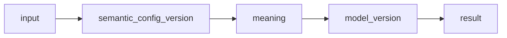

# 1. 設計前提（Fix）

## ■ ドメインの分解軸

| レイヤ | 内容             |
| ------ | ---------------- |
| 入力   | ユーザー条件     |
| 実行   | 推薦処理単位     |
| 推定   | 意味・特徴量生成 |
| 検索   | 候補抽出         |
| 比較   | 一致度計算       |
| 順位   | スコアリング     |
| 出力   | 結果             |
| 記録   | ログ             |
| 計測   | メトリクス       |
| 統計   | 分布             |
| 評価   | 改善判断         |
| 改善   | バージョン管理   |

---

## ■ 境界定義（最重要）

```
semantic_config_version = 意味の作り方
model_version           = 順位の決め方
```

---

# 2. ドメイン概念一覧（最終版）

---

## ■ 入力・実行・出力

| 概念名       | 英語名                     | 種別 | 概要               |
| ------------ | -------------------------- | ---- | ------------------ |
| 推薦要求     | user_request               | 入力 | ユーザーの推薦依頼 |
| 推薦条件     | user_request_condition     | 入力 | 入力条件の分解     |
| 推薦実行     | recommendation_run         | 実行 | 推薦処理単位       |
| 候補商品     | candidate_item             | 検索 | retrieval後の候補  |
| 推薦結果     | recommendation_result      | 出力 | 結果集合           |
| 推薦結果商品 | recommendation_result_item | 出力 | 個別商品           |

---

## ■ User Meaning

| 概念名               | 英語名                  | 種別 | 概要                   |
| -------------------- | ----------------------- | ---- | ---------------------- |
| 外部条件特徴量       | external_feature        | 計算 | relationship等から推定 |
| 内部条件特徴量       | internal_feature        | 計算 | 嗜好・NGから推定       |
| ユーザー生特徴量     | user_feature_raw        | 計算 | 統合後・未正規化       |
| ユーザー正規化特徴量 | user_feature_normalized | 計算 | 正規化後               |
| ユーザー意味射影     | user_meaning_projection | 計算 | social / symbolic      |
| 文脈重み             | lambda_ctx              | 計算 | 意図係数               |
| 好みコンテキスト     | preferred_context       | 計算 | embedding用            |
| 非好みコンテキスト   | non_preferred_context   | 計算 | embedding用            |
| 好みEmbedding        | preferred_embedding     | 計算 | 検索用                 |
| 非好みEmbedding      | non_preferred_embedding | 計算 | 検索用                 |

---

## ■ Item Meaning / Retrieval

| 概念名           | 英語名                  | 種別 | 概要                |
| ---------------- | ----------------------- | ---- | ------------------- |
| 商品シグナル     | item_signal             | 計算 | 原データ            |
| 商品属性サマリ   | item_attribute_summary  | 計算 | signal統合          |
| 商品コンテキスト | item_context            | 計算 | embedding入力       |
| 商品Embedding    | item_embedding          | 計算 | retrieval用ベクトル |
| 商品コンセプト   | item_concept            | 計算 | 意味ラベル          |
| 商品生特徴量     | item_feature_raw        | 計算 | 未正規化            |
| 商品正規化特徴量 | item_feature_normalized | 計算 | 正規化後            |
| 商品意味射影     | item_meaning_projection | 計算 | social / symbolic   |

---

## ■ Matching / Ranking

| 概念名       | 英語名           | 種別 | 概要       |
| ------------ | ---------------- | ---- | ---------- |
| 特徴量距離   | feature_distance | 計算 | 距離       |
| 特徴量一致度 | feature_match    | 計算 | 一致度     |
| 社会的一致度 | social_match     | 計算 | social     |
| 象徴的一致度 | symbolic_match   | 計算 | symbolic   |
| 文脈スコア   | context_score    | 計算 | λ適用      |
| 人気スコア   | popularity_score | 計算 | 人気補正   |
| リスクスコア | risk_score       | 計算 | リスク補正 |
| 商品一致度   | item_match_score | 計算 | 総合一致   |
| 最終スコア   | final_score      | 計算 | ranking用  |

---

## ■ 記録 / 計測 / 統計

| 概念名         | 英語名                    | 種別 | 概要       |
| -------------- | ------------------------- | ---- | ---------- |
| フェーズログ   | phase_log                 | 記録 | 実行履歴   |
| エラーログ     | error_log                 | 記録 | エラー     |
| 表示ログ       | view_log                  | 記録 | impression |
| クリックログ   | click_log                 | 記録 | click      |
| メトリクスログ | metric_log                | 計測 | 数値観測   |
| 特徴量分布統計 | feature_distribution_stat | 統計 | μ, σ       |
| スコア分布統計 | score_distribution_stat   | 統計 | score分布  |

---

## ■ 評価 / 改善

| 概念名         | 英語名                   | 種別 | 概要                                   |
| -------------- | ------------------------ | ---- | -------------------------------------- |
| オフライン評価 | offline_eval_result      | 評価 | 指標評価                               |
| 人手評価       | human_eval_result        | 評価 | 評価者が対象に対して実施した評価の記録 |
| 人手評価タスク | human_eval_task          | 評価 | 人手評価を依頼・管理する作業単位       |
| フィードバック | recommendation_feedback  | 評価 | ユーザー反応                           |
| 行動分析       | behavior_analysis_result | 改善 | CTR等                                  |
| A/Bテスト      | ab_test_result           | 改善 | 比較検証                               |

---

## ■ バージョン管理（最重要）

| 概念名           | 英語名                  | 種別 | 概要                         |
| ---------------- | ----------------------- | ---- | ---------------------------- |
| 意味定義セット   | semantic_config_version | 改善 | 意味推定ロジック一式         |
| モデルバージョン | model_version           | 改善 | スコアリング・ランキング一式 |

---

# 3. 概念定義表（重要部分）

---

## semantic_config_version

| 項目         | 内容                                    |
| ------------ | --------------------------------------- |
| 目的         | 意味推定ロジックの固定                  |
| 主責務       | 入力→concept→feature→meaningの変換      |
| 含むもの     | concept定義、辞書、ルール、正規化、射影 |
| 含まないもの | rankingロジック                         |
| 一言         | 意味の作り方                            |

---

## model_version

| 項目         | 内容                      |
| ------------ | ------------------------- |
| 目的         | 順位決定ロジックの固定    |
| 主責務       | meaning→score→ranking     |
| 含むもの     | score式、補正、ランキング |
| 含まないもの | concept/feature定義       |
| 一言         | 順位の決め方              |

---

# 4. 全体構造



---

# 5. 最重要ポイント

---

## ■ ルール

### ルール1

👉 意味生成は semantic

### ルール2

👉 順位決定は model

---

## ■ 判定基準

```
その処理は「意味を作っているか？」
→ Yes = semantic

その処理は「順位を決めているか？」
→ Yes = model
```

---

# 6. 今回の改善点（Before→After）

| 観点      | Before | After              |
| --------- | ------ | ------------------ |
| 計算粒度  | 粗い   | 中間概念あり       |
| embedding | 不明確 | 明示               |
| feature   | 不完全 | raw/normalized分離 |
| concept   | 曖昧   | 管理対象化         |
| version   | 混在   | 完全分離           |
