## 1. 全体図

```mermaid
flowchart TB

  %% =========================
  %% 入力・実行・出力
  %% =========================
  subgraph SG1["入力・実行・出力"]
    A1["user_request"]
    A2["user_request_condition"]
    A3["recommendation_run"]
    A4["candidate_item"]
    A5["recommendation_result"]
    A6["recommendation_result_item"]
  end

  %% =========================
  %% User Meaning
  %% =========================
  subgraph SG2["User Meaning"]
    B1["external_feature"]
    B2["internal_feature"]
    B3["user_feature_raw"]
    B4["user_feature_normalized"]
    B5["user_meaning_projection"]
    B6["lambda_ctx"]
    B7["preferred_context"]
    B8["preferred_embedding"]
    B9["non_preferred_context"]
    B10["non_preferred_embedding"]
  end

  %% =========================
  %% Item Meaning / Retrieval
  %% =========================
  subgraph SG3["Item Meaning / Retrieval"]
    C1["item_signal"]
    C2["item_attribute_summary"]
    C3["item_context"]
    C4["item_embedding"]
    C5["item_concept"]
    C6["item_feature_raw"]
    C7["item_feature_normalized"]
    C8["item_meaning_projection"]
  end

  %% =========================
  %% Matching / Ranking
  %% =========================
  subgraph SG4["Matching / Ranking"]
    D1["feature_distance"]
    D2["feature_match"]
    D3["social_match"]
    D4["symbolic_match"]
    D5["context_score"]
    D6["popularity_score"]
    D7["risk_score"]
    D8["item_match_score"]
    D9["final_score"]
    D10["final_ranking_result"]
  end

  %% =========================
  %% 記録 / 計測 / 統計
  %% =========================
  subgraph SG5["記録 / 計測 / 統計"]
    E1["phase_log"]
    E2["error_log"]
    E3["view_log"]
    E4["click_log"]
    E5["metric_log"]
    E6["feature_distribution_stat"]
    E7["score_distribution_stat"]
  end

  %% =========================
  %% 評価 / 改善
  %% =========================
  subgraph SG6["評価 / 改善"]
    F0["offline_eval_dataset"]
    F1["offline_eval_result"]
    F2["human_eval_task"]
    F3["human_eval_result"]
    F4["recommendation_feedback"]
    F5["behavior_analysis_result"]
    F6["ab_test_result"]
  end

  %% =========================
  %% ルール / 定義 / バージョン
  %% =========================
  subgraph SG7["ルール / 定義 / バージョン"]
    G1["relationship_rule"]
    G2["occasion_rule"]
    G3["pair_rule"]
    G4["hint_dictionary"]
    G5["concept_definition"]
    G6["feature_definition"]
    G7["concept_feature_rule"]
    G8["semantic_config_version"]
    G9["model_version"]
  end

  %% =========================
  %% 連関
  %% =========================

  %% 入力・実行
  A1 --> A2
  A1 --> A3
  G8 --> A3
  G9 --> A3

  %% User Meaning
  A2 --> B1
  A2 --> B2
  G1 --> B1
  G2 --> B1
  G3 --> B1
  G4 --> B2
  B1 --> B3
  B2 --> B3
  G8 --> B3
  B3 --> B4
  G8 --> B4
  B4 --> B5
  G8 --> B5
  B5 --> B6
  A2 --> B7
  A2 --> B9
  B7 --> B8
  B9 --> B10

  %% Item Meaning / Retrieval
  C1 --> C2
  C2 --> C3
  C3 --> C4
  C2 --> C5
  G5 --> C5
  C5 --> C6
  G7 --> C6
  C6 --> C7
  G8 --> C7
  C7 --> C8
  G8 --> C8

  %% Candidate Retrieval
  B8 --> A4
  B10 --> A4
  C4 --> A4
  A2 --> A4

  %% Matching / Ranking
  B4 --> D1
  C7 --> D1
  D1 --> D2
  D2 --> D3
  D2 --> D4
  B6 --> D5
  D3 --> D5
  D4 --> D5
  A4 --> D6
  A4 --> D7
  D5 --> D8
  D6 --> D8
  D7 --> D8
  D8 --> D9
  G9 --> D2
  G9 --> D3
  G9 --> D4
  G9 --> D5
  G9 --> D6
  G9 --> D7
  G9 --> D8
  G9 --> D9
  D9 --> D10

  %% 出力
  A3 --> A5
  D10 --> A5
  A5 --> A6
  D9 --> A6

  %% 記録 / 計測 / 統計
  A3 --> E1
  A3 --> E2
  A3 --> E5
  A6 --> E3
  A6 --> E4
  E5 --> E6
  E5 --> E7

  %% 評価 / 改善
  F0 --> F1
  A6 --> F1
  E6 --> F1
  E7 --> F1

  A6 --> F2
  F2 --> F3

  A6 --> F4
  E3 --> F5
  E4 --> F5

  F1 --> F6
  F5 --> F6

  %% ルール / 定義 / バージョン
  G8 --> G1
  G8 --> G2
  G8 --> G3
  G8 --> G4
  G8 --> G5
  G8 --> G6
  G8 --> G7
```

---

# 2. 連関の読み方

## 2.1 入力から実行まで

- `user_request` が依頼の親概念
- `user_request_condition` はその構造化明細
- `recommendation_run` はその依頼を処理した実行単位
- `recommendation_run` は`semantic_config_version` と `model_version` を参照する

### 意味

- **何をどう解釈したか**
- **どう順位付けしたか**
  を run 単位で再現可能にする構造です

---

## 2.2 User Meaning 系

- 条件明細と各種 rule / dictionary から
  - `external_feature`
  - `internal_feature`
    を生成
- それを統合して `user_feature_raw`
- 正規化して `user_feature_normalized`
- 射影して `user_meaning_projection`
- そこから `lambda_ctx`

また別系統として、

- `preferred_context` → `preferred_embedding`
- `non_preferred_context` → `non_preferred_embedding`

があります

### 意味

ユーザー入力は

- **意味比較用**
- **候補検索用**
  の2方向に分岐します

---

## 2.3 Item Meaning / Retrieval 系

- `item_signal` を統合して `item_attribute_summary`
- そこから
  - `item_context`
  - `item_concept`
    に分岐
- `item_context` → `item_embedding`
- `item_concept` → `item_feature_raw` → `item_feature_normalized` → `item_meaning_projection`

### 意味

商品側も

- **検索用表現**
- **意味比較用表現**
  に分かれます

---

## 2.4 Retrieval

`candidate_item` は次を入力にして生成されます。

- `preferred_embedding`
- `non_preferred_embedding`
- `item_embedding`
- `user_request_condition`（予算やNG条件など）

### 意味

候補集合は、単なる全文検索ではなく

- embedding検索
- hard filter

の両方の結果です

---

## 2.5 Matching / Ranking

- `user_feature_normalized` と `item_feature_normalized` から `feature_distance`
- それを `feature_match` に変換
- 集約して `social_match` / `symbolic_match`
- `lambda_ctx` を使って `context_score`
- 候補商品に対して `popularity_score` / `risk_score`
- それらを束ねて `item_match_score`
- 最終的に `final_score` と `final_ranking_result`

### 意味

ここで初めて

**「どの商品が良いか」**

が決まります

---

## 2.6 出力

- `recommendation_result` は結果集合
- `recommendation_result_item` は個別商品

`final_score` は最終的に `recommendation_result_item` に反映されます

---

## 2.7 記録 / 計測 / 統計

- `phase_log` / `error_log` / `metric_log` は `recommendation_run` に紐づく
- `view_log` / `click_log` は `recommendation_result_item` に紐づく
- `feature_distribution_stat` / `score_distribution_stat` は `metric_log` 等から集約される

### 意味

- 実行ログ
- ユーザー行動ログ
- 統計監視
  を分けています

---

## 2.8 評価 / 改善

- `offline_eval_result` は結果・統計値を材料に評価
- `offline_eval_task` はオフライン評価自体の実施状態を管理する
- `human_eval_result` は人手評価
- `recommendation_feedback` はユーザー反応
- `behavior_analysis_result` は view/click から生成
- `ab_test_result` は offline評価や行動分析を比較して生成

---

# 3. 特に重要な境界

## semantic_config_version と model_version

### semantic_config_version

支配する範囲

- feature推定
- 正規化
- meaning_projection

### model_version

支配する範囲

- feature比較
- match集約
- context/popularity/risk/final score

---

# 4. 図の使い方

この図は次の用途に使えます。

- **論理ERの入力**
- **正本定義の妥当性確認**
- **モジュール別入出力定義表との突合**
- **不足概念の発見**

---

# 5. 一言でまとめ

この概念連関図では、

- 入力
- 意味推定
- 候補検索
- 一致計算
- 順位決定
- 出力
- 記録 / 計測 / 統計
- 評価 / 改善

の流れが、概念単位でつながった状態になっています。
