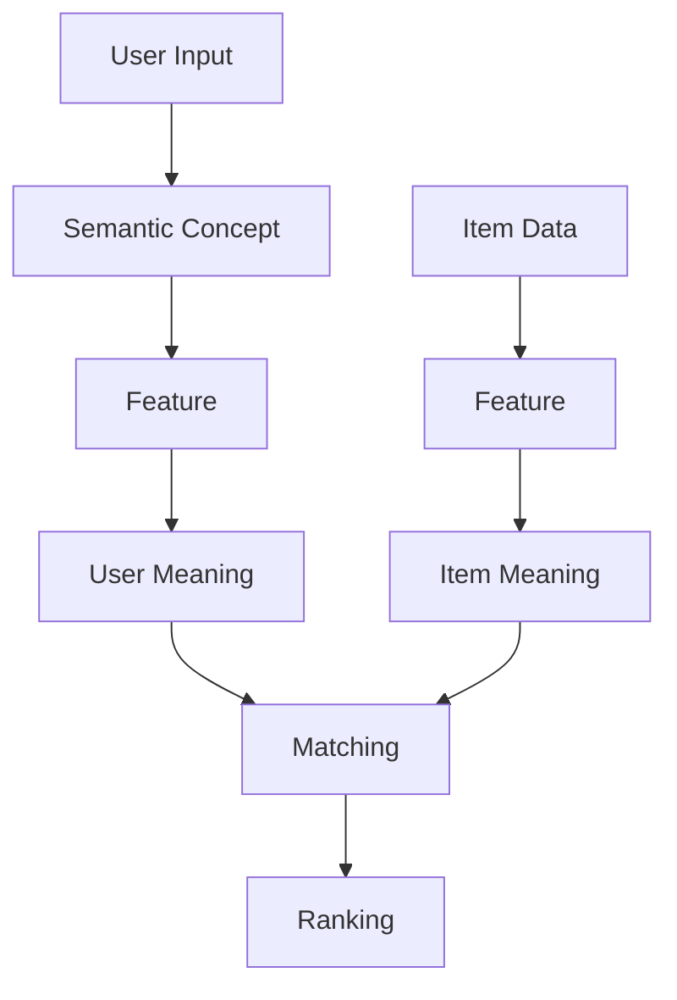

# ユビキタス言語集

## 1. 概要

本ドキュメントは、ギフトレコメンドサービスにおけるユビキタス言語を定義する。
設計・実装・分析・運用において共通の意味で使用する。

## 2. ドメイン中核概念

### 2.1 Gift Meaning（贈答意味）

| 項目 | 内容                   |
| ---- | ---------------------- |
| 定義 | 贈り物が持つ意味的価値 |
| 表現 | Social × Symbolic      |
| 備考 | 本サービスの中核概念   |

### 2.2 Gift Meaning Map（贈答意味空間）

| 項目 | 内容                                 |
| ---- | ------------------------------------ |
| 定義 | Gift Meaningを距離として扱う意味空間 |
| 軸   | Social / Symbolic                    |
| 用途 | 類似度計算・ランキング               |

### 2.3 Social（社会的適合性）

| 項目        | 内容                                                                             |
| ----------- | -------------------------------------------------------------------------------- |
| 定義        | 社会的に適切か・無難か。ギフト・マーケティングにおける`社会的コミュニケーション` |
| 構成要素    | 儀礼性、安全性、ブランド適切性                                                   |
| 対応Feature | formality / safety / brand_appropriateness                                       |

### 2.4 Symbolic（象徴的価値）

| 項目        | 内容                                                                           |
| ----------- | ------------------------------------------------------------------------------ |
| 定義        | 感情・特別感・意味性。ギフト・マーケティングにおける`象徴的コミュニケーション` |
| 構成要素    | 感情、特別感、親密性、象徴性、ストーリー性                                     |
| 対応Feature | emotion / novelty / intimacy / symbolic_identity / story_richness              |

## 3. Feature（意味特徴量）

### 3.1 定義

- Gift Meaningを構成する最小単位
- 全8次元で固定

### 3.2 Feature一覧

#### Social

| 物理名                | 論理名         | 説明       |
| --------------------- | -------------- | ---------- |
| formality             | 儀礼性         | きちんと感 |
| safety                | 安全性         | 外しにくさ |
| brand_appropriateness | ブランド適切性 | 格・品位   |

#### Symbolic

| 物理名            | 論理名       | 説明           |
| ----------------- | ------------ | -------------- |
| emotion           | 感情表現性   | 感情を伝える力 |
| novelty           | 特別感       | 新しさ・印象   |
| intimacy          | 親密性       | 関係性の近さ   |
| symbolic_identity | 象徴性       | その人らしさ   |
| story_richness    | ストーリー性 | 語れる意味     |

## 4. Context（贈答文脈）

### 4.1 定義

- 贈答の状況情報
- Relationship + Occasion で構成

### 4.2 Relationship（関係性）

- 贈り手と受け手の関係

例：

- lover（恋人）
- boss（上司）
- friend_close（親しい友人）

### 4.3 Occasion（贈答目的）

- 贈答の目的・場面

例：

- birthday（誕生日）
- thanks（お礼）
- apology（お詫び）

## 5. Semantic層

### 5.1 Semantic Concept

| 項目 | 内容                               |
| ---- | ---------------------------------- |
| 定義 | 意味の抽象カテゴリ                 |
| 役割 | ユーザー入力 → Feature変換の中間層 |
| 特徴 | polarityを持つ                     |

例：

- formal_refined（上品）
- safe_classic（無難）
- special_memorable（特別）

### 5.2 Semantic Map

| 項目 | 内容                   |
| ---- | ---------------------- |
| 定義 | Semantic Conceptの集合 |
| 役割 | Feature生成の中間表現  |

### 5.3 Hint

| 項目 | 内容                                   |
| ---- | -------------------------------------- |
| 定義 | keyword → concept → feature の変換結果 |
| 特徴 | runtime生成                            |

### 5.4 Hint Dictionary

| 項目 | 内容                   |
| ---- | ---------------------- |
| 定義 | Feature補正結果の集合  |
| 備考 | 事前定義ではなく生成物 |

## 6. Meaning表現

### 6.1 User Meaning

| 項目 | 内容               |
| ---- | ------------------ |
| 定義 | ユーザーの贈答意図 |
| 表現 | Featureベクトル    |

### 6.2 Item Meaning

| 項目 | 内容            |
| ---- | --------------- |
| 定義 | 商品が持つ意味  |
| 表現 | Featureベクトル |

## 7. レコメンド処理

### 7.1 Retrieval

| 項目 | 内容         |
| ---- | ------------ |
| 定義 | 候補商品抽出 |
| 特徴 | recall重視   |

### 7.2 Matching

| 項目 | 内容                   |
| ---- | ---------------------- |
| 定義 | UserとItemの意味一致度 |
| 方法 | Feature距離ベース      |

### 7.3 Ranking

| 項目 | 内容               |
| ---- | ------------------ |
| 定義 | 候補商品の順位付け |
| 特徴 | relevance重視      |

## 8. スコア関連

### 8.1 Context Score

| 項目 | 内容              |
| ---- | ----------------- |
| 定義 | 意味一致スコア    |
| 構成 | Social + Symbolic |

### 8.2 λ_ctx（ラムダコンテキスト）

| 項目 | 内容                     |
| ---- | ------------------------ |
| 定義 | 贈答リスク許容度         |
| 範囲 | 0〜1                     |
| 役割 | symbolic寄りかの調整係数 |

### 8.3 Risk

| 項目 | 内容             |
| ---- | ---------------- |
| 定義 | ギフト失敗リスク |
| 役割 | 減点要素         |

### 8.4 Popularity

| 項目 | 内容               |
| ---- | ------------------ |
| 定義 | 商品の一般評価     |
| 例   | レビュー評価・件数 |

## 9. 用語関係図

## 10. 命名ルール

### 10.1 基本原則

- 英語：物理名
- 日本語：論理名
- 単数形で統一

### 10.2 禁止事項

- 同義語の併用（例：意味 / コンテキスト）
- 曖昧な略語

## 11. 今後の拡張

- Feature追加は原則禁止（MVP段階）
- Semantic Conceptは追加可能
- Contextカテゴリは拡張可能
