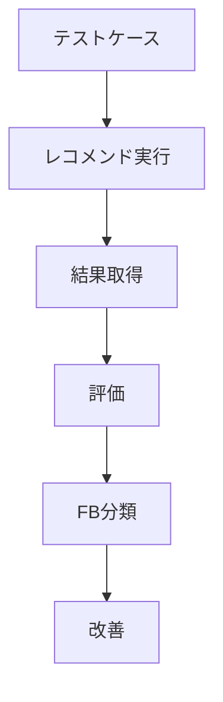
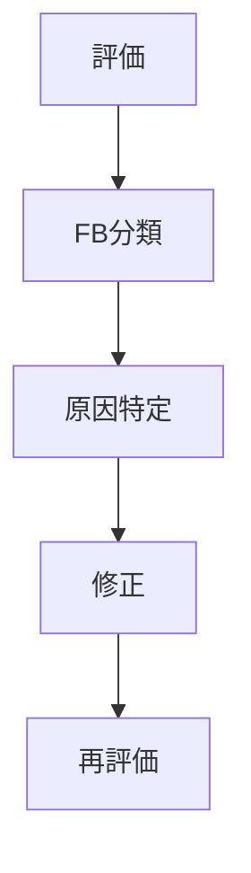

# 1. 目的

---

## 1.1 本設計の目的

本設計書の目的は、レコメンド結果の品質をオフラインで評価し、

```
評価 → 問題特定 → FB分類 → 改善
```

のループを確立することである。

---

## 1.2 本質

```
「正しいか」ではなく「改善できるか」を評価する
```

---

# 2. 評価の全体構造

---



---

# 3. 評価対象（レイヤー別）

---

| レイヤー      | 評価内容 | 主なFB      |
| ------------- | -------- | ----------- |
| User Modeling | 意図推定 | FB-01,04,05 |
| Retrieval     | 候補取得 | FB-06       |
| Matching      | 意味一致 | FB-07       |
| Ranking       | 並び順   | FB-08       |
| Output        | 最終結果 | FB-09〜14   |

---

# 4. 評価手法

---

## 4.1 2種類の評価

| 種類     | 内容     | 優先度 |
| -------- | -------- | ------ |
| 定量評価 | 数値指標 | 補助   |
| 定性評価 | 人間評価 | 最重要 |

---

---

# 5. 定量評価指標

---

## 5.1 Precision / Recall / F1

| 指標      | 意味     |
| --------- | -------- |
| Precision | 当たり率 |
| Recall    | カバー率 |
| F1        | バランス |

---

## 5.2 NDCG

- 上位の正しさを評価
- ranking品質

---

## 5.3 MMR（多様性）

- 同質化抑制

---

## 5.4 スコア分布

| 指標                             | 用途           |
| -------------------------------- | -------------- |
| context_score分布                | マッチング確認 |
| final_score分布                  | ranking確認    |
| ratio（context/popularity/risk） | バランス確認   |

---

# 6. 定性評価（最重要）

---

## 6.1 評価観点

| 観点       | 内容                             |
| ---------- | -------------------------------- |
| 意図適合   | relationship / occasion に合うか |
| 意味強度   | symbolic / social が適切か       |
| 違和感     | 不自然さ                         |
| 多様性     | バリエーション                   |
| 説明可能性 | なぜそれか                       |

---

---

## 6.2 評価スコア（例）

| 観点     | スコア |
| -------- | ------ |
| 意図適合 | 1〜5   |
| 意味強度 | 1〜5   |
| 違和感   | 1〜5   |
| 多様性   | 1〜5   |

---

---

## 6.3 最重要ルール

👉 **違和感があればNG**

---

# 7. テストケース設計（超重要）

---

## 7.1 基本構造

| 項目         | 内容                      |
| ------------ | ------------------------- |
| relationship | 恋人 / 父 / 上司          |
| occasion     | 誕生日 / 記念日           |
| 条件         | 好み / NG                 |
| 期待方向     | symbolic寄り / social寄り |

---

---

## 7.2 網羅戦略

```
relationship × occasion × λ_ctx
```

---

---

## 7.3 例

| ケース        | 内容        |
| ------------- | ----------- |
| 恋人 × 記念日 | symbolic高  |
| 父 × 父の日   | safety高    |
| 上司 × お礼   | formality高 |

---

---

# 8. FB分類との接続

---

## 8.1 評価 → FBマッピング

| 現象               | FB    |
| ------------------ | ----- |
| 意図ズレ           | FB-01 |
| λバランス異常      | FB-02 |
| item feature違和感 | FB-03 |
| conceptズレ        | FB-04 |
| 辞書問題           | FB-05 |
| retrieval漏れ      | FB-06 |
| matching不良       | FB-07 |
| ranking異常        | FB-08 |
| スコア分布         | FB-09 |
| 多様性不足         | FB-10 |
| 制約違反           | FB-11 |
| 文脈不一致         | FB-12 |
| explanationズレ    | FB-13 |
| 一貫性             | FB-14 |
| 分布異常           | FB-15 |
| 空間異常           | FB-16 |

---

---

# 9. 評価フロー

---

## 9.1 実行フロー

```
① テストケース投入
② レコメンド生成
③ 結果記録
④ 定量評価
⑤ 定性評価
⑥ FB分類
```

---

---

## 9.2 出力形式

```
{
  "case_id":"C001",
  "scores": {
    "intent_match":4,
    "meaning_strength":5
  },
  "fb": ["FB-07"]
}
```

---

---

# 10. 改善ループ設計

---

## 10.1 フロー



---

---

## 10.2 修正対象

| FB    | 修正対象      |
| ----- | ------------- |
| FB-01 | user modeling |
| FB-03 | item feature  |
| FB-06 | retrieval     |
| FB-07 | matching      |
| FB-08 | ranking       |
| FB-02 | λ_ctx         |

---

---

# 11. 評価粒度

---

| 粒度       | 内容               |
| ---------- | ------------------ |
| 単ケース   | 個別確認           |
| バッチ     | 全体傾向           |
| セグメント | relationship別など |

---

---

# 12. MVP運用方針

---

## 12.1 優先順位

1. 定性評価
2. FB分類
3. 改善ループ
4. 定量評価

---

---

## 12.2 やらないこと

| 項目           | 理由       |
| -------------- | ---------- |
| 完全自動評価   | 精度不足   |
| 複雑指標最適化 | 本質でない |

---

---

# 13. 本質（最重要）

---

## 事実

- 指標だけでは品質は測れない

---

## 結論

```
評価とは「違和感を構造化すること」
```

---

# 14. 全体整理

---

```
① 監視 → 異常検知
② 判断 → 修正判断
③ 正規化 → 空間定義
④ 評価 → 品質測定（本設計）
```
