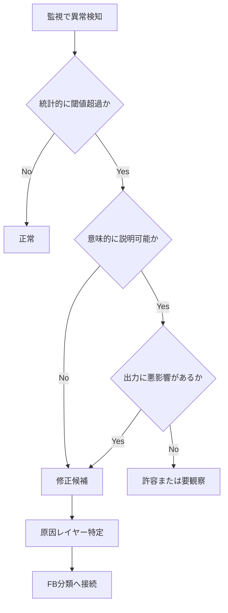

## 1. 目的

本ガイドの目的は、監視で検知された異常に対して、

- 許容してよいか
- 要観察か
- 修正対象か

を判断するための基準を定義することである。

本サービスでは、分布は「正解」ではない。

したがって、本ガイドは**理想分布への矯正基準**ではなく、

**改善要否を判断する運用基準**として位置づける。

---

## 2. 基本思想

### 2.1 前提

### 事実

- 特徴量分布は常に変動する
- 偏りそのものは必ずしも異常ではない
- 商品空間・ユーザー空間・相互作用・スコアバランスは、それぞれ異なる意味を持つ

### 結論

👉 異常判定は、単一の閾値超過ではなく、

**統計・意味・出力** の3軸で行う

---

### 2.2 判断の3軸

| 軸     | 内容                           | 主な確認観点                                     |
| ------ | ------------------------------ | ------------------------------------------------ |
| ① 統計 | 数値的にズレているか           | μ / σ / 分位 / ratio                             |
| ② 意味 | そのズレは文脈上説明できるか   | feature特性 / relationship / occasion / カテゴリ |
| ③ 出力 | 実際の推薦品質に悪影響があるか | topK / 多様性 / 印象 / explanation               |

---

### 2.3 判断原則

| 原則  | 内容                                       |
| ----- | ------------------------------------------ |
| 原則1 | 統計異常だけでは即修正しない               |
| 原則2 | 意味的に説明可能なら許容余地あり           |
| 原則3 | 出力に悪影響があれば修正優先度を上げる     |
| 原則4 | 4層のどこで異常が起きているかを切り分ける  |
| 原則5 | 「分布正常」よりも「改善可能性」を重視する |

---

## 3. 判断プロセス

---

### 3.1 全体フロー



---

### 3.2 判定区分

| 判定     | 意味               | 対応             |
| -------- | ------------------ | ---------------- |
| 正常     | 問題なし           | 継続監視         |
| 許容     | 偏りはあるが妥当   | 継続監視         |
| 要観察   | 即修正不要だが注意 | 次回レビュー対象 |
| 修正候補 | 改善検討必要       | 原因分析         |
| 修正必須 | 品質に明確影響     | 優先改善         |

---

## 4. 4層別の判断構造

本ガイドでは、異常判定を以下4層に分ける。

| 層             | 対象                        | 主な問い                         |
| -------------- | --------------------------- | -------------------------------- |
| A. item        | 商品特徴量分布              | 商品意味空間は健全か             |
| B. user        | ユーザー特徴量分布          | ユーザー意図推定は健全か         |
| C. interaction | user × item                 | 意図と候補空間は噛み合っているか |
| D. score       | context / popularity / risk | 意味と現実制約のバランスは健全か |

---

# 5. A. 商品特徴量分布 判断ガイド

---

## 5.1 目的

商品特徴量分布の評価では、

**商品意味空間そのものが表現力を保っているか** を判断する。

---

## 5.2 判断観点

| 観点                      | 内容                                 |
| ------------------------- | ------------------------------------ |
| feature単体分布           | collapse / 過集中 / 過偏りの有無     |
| Social / Symbolicバランス | 空間が片軸に潰れていないか           |
| セグメント差              | カテゴリや価格帯に応じた自然な偏りか |
| 空間表現力                | 多様な推薦候補を生み出せるか         |

---

## 5.3 許容されるケース

| ケース                                      | 判定理由           |
| ------------------------------------------- | ------------------ |
| 高級カテゴリで brand_appropriateness が高い | ドメイン由来       |
| 実用品カテゴリで novelty が低い             | カテゴリ特性       |
| story_richness が一部カテゴリで低い         | 意味特性として自然 |

---

## 5.4 修正すべきケース

| ケース                            | 理由                 | FB    |
| --------------------------------- | -------------------- | ----- |
| 全カテゴリで novelty が極端に低い | item feature推定異常 | FB-03 |
| social_mean に全体集中            | 空間崩壊             | FB-16 |
| σ が全featureで極小               | 空間collapse         | FB-15 |
| category差が不自然に消失          | 特徴量生成器の平坦化 | FB-03 |

---

## 5.5 定量判断基準

| 指標                  | 目安         | 判定     |
| --------------------- | ------------ | -------- | -------- | ------ |
| σ < 0.05              | collapse傾向 | 修正候補 |
| p90 - p10 < 0.2       | 分布圧縮     | 修正候補 |
|                       | meaning_diff | > 0.3    | 片軸偏重 | 要確認 |
| 複数featureで同時圧縮 | 空間崩壊疑い | 修正必須 |

---

## 5.6 判断のポイント

商品側では、

**「偏っているか」よりも「その偏りが商品世界として自然か」** を見る。

---

# 6. B. ユーザー特徴量分布 判断ガイド

---

## 6.1 目的

ユーザー特徴量分布の評価では、

**ユーザー意図推定が文脈差を正しく表現できているか** を判断する。

---

## 6.2 判断観点

| 観点            | 内容                                     |
| --------------- | ---------------------------------------- |
| feature単体分布 | 中央潰れ・極端偏りの有無                 |
| relationship差  | 関係性ごとの差が出ているか               |
| occasion差      | シーン差が出ているか                     |
| pair差          | relationship × occasion の意味差があるか |
| 推定器健全性    | 辞書・ルール・hintが機能しているか       |

---

## 6.3 許容されるケース

| ケース                    | 判定理由     |
| ------------------------- | ------------ |
| 父の日全体で safety 高め  | シーズン特性 |
| 恋人向けで symbolic 高め  | 関係性特性   |
| 会社関係で formality 高め | 文脈整合     |

---

## 6.4 修正すべきケース

| ケース                       | 理由                 | FB    |
| ---------------------------- | -------------------- | ----- |
| relationship差がほぼ消失     | user meaning推定失敗 | FB-01 |
| symbolic_mean が全体的に低い | symbolic解釈不全     | FB-16 |
| dictionary_hit_rate 急低下   | 辞書問題             | FB-05 |
| intimacy が恋人向けで低い    | 文脈誤推定           | FB-01 |

---

## 6.5 定量判断基準

| 指標                       | 目安         | 判定             |
| -------------------------- | ------------ | ---------------- |
| σ < 0.05                   | 中央潰れ     | 修正候補         |
| relationship別平均差が極小 | 文脈差消失   | 修正候補         |
| dictionary_hit_rate 急低下 | ルール異常   | 修正候補         |
| unknown_rate 上昇          | 解釈不能増加 | 要観察〜修正候補 |

---

## 6.6 判断のポイント

ユーザー側では、

**「意図差が出ているか」** が最重要。

平滑できれいな分布よりも、

**恋人・父・上司・誕生日・記念日などの意味差が表現されているか** を優先する。

---

# 7. C. 相互作用異常 判断ガイド

---

## 7.1 目的

相互作用評価では、

**ユーザー意図と商品候補空間が実際に噛み合っているか** を判断する。

---

## 7.2 判断観点

| 観点              | 内容                              |
| ----------------- | --------------------------------- |
| candidate取得     | preferred条件で候補が取れているか |
| non_preferred効き | 除外/減点が効いているか           |
| user-item距離     | 近い候補が十分あるか              |
| topK feature傾向  | 意図に沿う候補が上位に来るか      |

---

## 7.3 許容されるケース

| ケース                              | 判定理由     |
| ----------------------------------- | ------------ |
| ニッチ条件で候補数が少ない          | 母集団制約   |
| 特定カテゴリで symbolic候補が限定的 | 商品空間制約 |
| 一部occasionで安全寄りになる        | 実運用上自然 |

---

## 7.4 修正すべきケース

| ケース                                     | 理由                    | FB           |
| ------------------------------------------ | ----------------------- | ------------ |
| preferred candidate count が極端に少ない   | retrieval漏れ           | FB-06        |
| user symbolic高なのに topK がsocial寄り    | matching異常            | FB-07        |
| non_preferred が効かず、避けたい特徴が混入 | retrieval / ranking異常 | FB-06, FB-11 |
| topKが同質商品ばかり                       | diversity不足           | FB-10        |

---

## 7.5 定量判断基準

| 指標                                  | 目安                  | 判定             |
| ------------------------------------- | --------------------- | ---------------- |
| preferred candidate count 極小        | retrieval異常疑い     | 修正候補         |
| topK meaning_diff が user意図と逆方向 | 噛み合い不良          | 修正候補         |
| diversity proxy 低下                  | 同質化                | 要観察〜修正候補 |
| context_score 高いのに満足感低い      | concept / featureズレ | 原因再分析       |

---

## 7.6 判断のポイント

相互作用層では、

item と user が個別に正常でも問題が起きうる。

したがって、問いは

> 「正しい候補空間に、正しい意図でアクセスできているか」

である。

---

# 8. D. スコアバランス 判断ガイド

---

## 8.1 目的

スコアバランス評価では、

**context / popularity / risk の力関係が適切か** を判断する。

これは本サービスにおいて最重要の判断領域である。

---

## 8.2 前提

最終スコア：

```
final_score = context_score + popularity - risk
```

ここで、

- context_score = 意味一致
- popularity = 人気補正
- risk = 安全性・失敗回避補正

である。

---

## 8.3 判断観点

| 観点           | 内容                                 |
| -------------- | ------------------------------------ |
| context寄与    | 意味一致が機能しているか             |
| popularity寄与 | 人気が過剰支配していないか           |
| risk寄与       | 無難化しすぎていないか               |
| topK傾向       | 最終出力がどの要素に支配されているか |

---

## 8.4 許容されるケース

| ケース                              | 判定理由     |
| ----------------------------------- | ------------ |
| safety重視文脈で risk寄与がやや高い | 文脈整合     |
| 定番カテゴリで popularity寄与が高め | 実運用上自然 |
| λ_ctx低め文脈で social寄りになる    | モデル整合   |

---

## 8.5 修正すべきケース

| ケース                          | 理由                  | FB           |
| ------------------------------- | --------------------- | ------------ |
| popularity_ratio が恒常的に高い | 人気ランキング化      | FB-08, FB-10 |
| risk_ratio が高すぎる           | 無難化しすぎ          | FB-02        |
| context_ratio が低すぎる        | 意味モデル無効化      | FB-07, FB-08 |
| λ_ctx高でも出力が無難           | risk / popularity過剰 | FB-02        |

---

## 8.6 定量判断基準

| 指標                             | 目安           | 判定             |
| -------------------------------- | -------------- | ---------------- |
| popularity_ratio ≫ context_ratio | popularity支配 | 修正候補         |
| risk_ratio ≫ context_ratio       | risk支配       | 修正候補         |
| context_ratio 低すぎ             | context無効化  | 修正必須候補     |
| topK popularity_mean 高止まり    | 人気偏重       | 要観察〜修正候補 |

※ MVPでは閾値を固定値で持ちすぎず、**baseline比較 + 出力レビュー併用** を原則とする。

---

## 8.7 判断のポイント

この層では「統計正常」よりも、

> **意味レコメンドとして成立しているか**

を優先して判断する。

人気商品が出ること自体は問題ではない。

問題は、**意味一致を押しのけて人気や無難さが支配してしまうこと** である。

---

# 9. 許容 / 修正の総合判定ルール

---

## 9.1 総合ルール

| 状態                                         | 判定     |
| -------------------------------------------- | -------- |
| 統計異常なし                                 | 正常     |
| 統計異常あり + 意味説明可能 + 出力問題なし   | 許容     |
| 統計異常あり + 意味説明可能 + 出力違和感あり | 要観察   |
| 統計異常あり + 意味説明困難                  | 修正候補 |
| 出力悪化が明確                               | 修正必須 |

---

## 9.2 修正優先度

| 優先度 | 条件                                           |
| ------ | ---------------------------------------------- |
| 最優先 | 空間崩壊 / context無効化 / retrieval failure   |
| 高     | relationship差消失 / popularity支配 / risk支配 |
| 中     | 一部featureの圧縮 / diversity低下              |
| 低     | 説明可能なカテゴリ偏り                         |

---

# 10. 人間レビュー指針

---

## 10.1 レビューで見るべきこと

| 観点       | 確認内容                         |
| ---------- | -------------------------------- |
| 印象       | 無難すぎないか / 攻めすぎないか  |
| 文脈整合   | relationship / occasion に合うか |
| 多様性     | 上位候補が似すぎていないか       |
| 説明可能性 | なぜその候補なのか納得できるか   |
| 違和感     | 数値では拾えない不自然さがないか |

---

## 10.2 重要な考え方

👉 **違和感は最重要シグナル**

統計上は閾値内でも、

「恋人向けなのに感情が弱い」

「記念日なのに定番すぎる」

のような違和感があれば、改善対象として扱う。

---

# 11. FB-01〜FB-16 との接続

| 判定対象        | 主なFB                            |
| --------------- | --------------------------------- |
| item異常        | FB-03, FB-15, FB-16               |
| user異常        | FB-01, FB-04, FB-05, FB-15, FB-16 |
| interaction異常 | FB-06, FB-07, FB-10, FB-11, FB-12 |
| score異常       | FB-02, FB-08, FB-09, FB-10        |

---

# 12. MVP運用ルール

---

## 12.1 MVPで重視すること

| 項目     | 方針                           |
| -------- | ------------------------------ |
| 閾値判定 | シンプルに持つ                 |
| 判断     | 必ず人間レビュー併用           |
| 原因分析 | 4層切り分けで進める            |
| 修正     | まず重み・辞書・rule調整を優先 |

---

## 12.2 MVPでやりすぎないこと

| 項目               | 理由               |
| ------------------ | ------------------ |
| 完全自動判定       | 誤判定リスクが高い |
| 複雑すぎる閾値体系 | 運用負荷が高い     |
| 分布の理想化       | 本質でない         |

---

# 13. 本ガイドの要点

この判断ガイドの核心は、

「分布がきれいか」ではなく、

**そのズレが意味的に説明でき、出力として許容できるか** を判断することにある。

したがって、評価は常に以下で行う。

```
統計 × 意味 × 出力
```

さらに、原因切り分けは以下の4層で行う。

```
A. item
B. user
C. interaction
D. score
```
