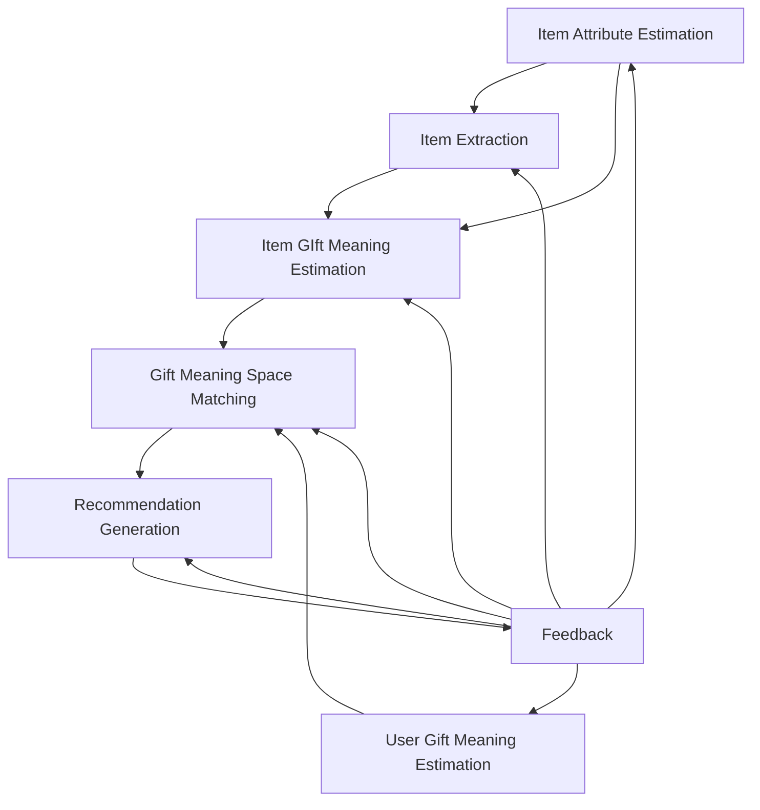

# Gift Recommendation Service

## 全体レコメンドアーキテクチャ図（最終系の大枠）

まず全体像です。


[参照元SVG: レコメンドアーキテクチャ.drawio.svg](./img/レコメンドアーキテクチャ.drawio.svg)

---

## レコメンドアーキテクチャ処理構成外観



### Item Attribute Estimation

---

#### Data PreProcessing

##### 目的・概要

- 楽天市場APIから取得した各種商品データから、商品特性素データ抽出処理 `Attribute Signal Extraction` に必要なインプットデータを抽出し、必要に応じて一次加工を行う。

##### 入力

- 楽天市場商品データ
  - apl.item
  - apl.item_market_snapshot
  - apl.item_image
  - apl.item_rank_snapshot
  - apl.item_review_snapshot

##### 出力

- text_signal
  - 商品名
  - 商品説明
  - キャッチコピー
- metadata_signal
  - ジャンル
  - タグ
- image_signal
  - 商品画像
- review_signal
  - 商品レビューコメント
  - 商品レビュー点数

##### 処理概要

---

#### Attribute Signal Extraction

##### 目的・概要

- 商品特性素データを、ユーザーが嗜好する商品特性情報との類似度を算出できるよう、商品特性素データからキーワードを抽出し、人間的な商品特性の表現に合うように加工（ラップ）する。
- 抽出対象の商品特性素データ（シグナル）は複数あるため、それぞれに対して抽出処理を行う。

---

##### Text Signal

- いわゆる商品特性（例：お洒落な、甘い、子供にやさしい など）の定性情報。

###### 入力

- text_signal
  - 商品名
  - 商品説明
  - キャッチコピー

###### 出力

- text_attribute

###### 処理概要

- PreProcessing にて抽出された定性情報を、単語ないしは文節に分解しする。
- 分解した単語ないしは文節に対して表現の補正が必要かを確認し、必要であれば修正する。
- 分解した単語ないしは文節が複数存在する場合は重複を排除する。

---

###### Metadata Signal

- ジャンル、タグなどの商品メタ情報。
- Text_Signal のような感覚的な定性情報ではなく、商品の属性を表現するもの。

###### 入力

- metadata_signal
  - ジャンル
  - タグ

###### 出力

- metadate_attribute

###### 処理概要

- PreProcessing にて抽出されたジャンル、タグを重複排除する。
- ジャンルやタグが多階層すぎたり、数が多すぎる場合は、上位階層のメタ情報を抽出するなどのチューニングを行う。

###### Image Signal

- 画像イメージから読み取れる感覚的な商品情報。
- 商品画像そのものから読み取れる感覚値だけでなく、画像全体を通して読み取れる感覚値（画像自体がユーザーに与えたい印象）までをシグナルとして扱う。

###### 入力

- image_signal
  - 商品画像

###### 出力

- image_attribute

###### 処理概要

- PreProcessing にてシグナル解析対象として抽出した画像データに対して、Deep Learning（CLIPなど）にて画像解析を行い、画像データから「お洒落な」「懐かしい」などの感覚値的な定性情報に落とし込む。
- 画像解析にて生成する定性情報は、`Text Signal` で抽出する定性情報と同じ表現空間、粒度となるイメージ。

###### Review Signal

- 商品レビュー評価コメントや、レビュー点数など。
- `★商品レビューコメントは、楽天市場のデータ利用規約及び個人情報保護の観点から、原則商用利用は不可`のため、本サービスでは検討対象外とする。

---

#### Item Attribute Estimation Set Generation

##### 目的・概要

- 商品ごとの各商品特性情報を結合し、商品単位の特性情報セットを作成し、後続の類似度算出で利用するベクトルの直接インプットデータを作成する。

##### 入力

- item_filtered
  - `Hard Filter` にてNG条件以外で抽出した商品。
- item_attribute
  - 下記を結合して生成した商品特性情報。
    - text_attribute
    - metadata_attribute
    - image_attribute
    - review_attribute

##### 出力

- filteredItem_attribute_set

##### 処理概要

- `Hard Filter` 抽出済みの商品ごとにitem_attributeをjoinしてハードフィルタ済み商品特性情報データを生成する。

---

### User Gift Meaning Estimation

#### Data Preprocessing

#### User Feature Estimation

#### User Gift Meaning Estimation

---

### Item Extraction

#### Item Hard Filter

#### User Preferred Attribute Set Generation

#### User Preferred Attribute Set Embedding

#### Item Attribute Set Embedding

#### Candidate Retrieval

---

### Item Gift Meaning Estimation

#### Item Feature Estimation

#### Item Gift Meaning Estimation

---

### Gift Meaning Space Matching

#### Feature Matching (Computation distance)

#### Correction Coefficient Calculation (Gift Risk Tolerance)

#### User Context Calculation

---

### Recommendation Generation

#### Correction Coefficient Calculation (Popularity Adjust / Risk Penalty Adjust)

#### Final Score Calculation

#### Final Ranking Calculation

#### Explanation Generation

---

### Feedback

---

### Data Model Maintenance

---

# 1. この図の見方

## 事実

このアーキテクチャは、推薦を次の流れで捉えています。

1. ユーザー入力を受ける
2. ユーザー意図を Meaning に変換する
3. 候補商品を絞る
4. 商品とユーザーの Meaning を照合する
5. popularity / risk も加味して最終順位を出す
6. 結果を返す
7. ログを蓄積して改善に回す

## 推論

今回のサービスの本質は、

**「検索条件に一致する商品を探す」のではなく、「贈答意図に意味的に合う商品を選ぶ」**

ことです。

なので、通常のEC検索アーキテクチャよりも、中央にあるべきなのは

- 商品マスタ
- キーワード検索

ではなく、

- **User Meaning Estimation**
- **Item Meaning Store**
- **Meaning Matching**

です。

---

# 2. 各モジュールの役割

---

=================================================★メンテ中★=====================================

| レイヤID | レイヤ名                | 処理 | 処理概要 |
| :------- | ----------------------- | ---- | -------- |
|          | 入力パース              |      |          |
|          | User Meaning Estimation |      |          |
|          | Item Meaning Estimation |      |          |
|          | Candidate Retrieval     |      |          |
|          | Matching                |      |          |
|          | Ranking                 |      |          |
|          | Result                  |      |          |

## ユーザー関連

### 入力

- ユーザー入力
  - Structured Text
  - Free Text

### 入力データ事前処理

- 内部用入力パラメータ（Relationship × Occasionペア）生成
- Free Textパース

### 推定処理

- ユーザー意図補助の意味的コンテキスト生成（キーワード結合）
- ユーザー意図意味ベクトル生成（embedding）
- Hint Dictionary更新
- Free Text意味推定（Hint Dictionary）
- Free Text→Gift Meaning Feature推定
- Social, Symbolic推定（ユーザー意図補助）
- Gift Meaning Feature推定（ギフト文脈要素別）
  - ルールベース推定
    - Relationship
    - Occasion
    - Relationship × Occasion
- Gift Meaning Feature推定（ギフト文脈）
- Social, Symbolic推定（ユーザー）
- Gift Meaning推定（ユーザー）
- 商品の意味的コンテキスト生成（キーワード結合）
- 商品ハードフィルタ（金額、NG条件など）
- 商品キーワードパース
- 商品キーワード抽出
  - テキストシグナル抽出
  - メタデータシグナル抽出
  - 画像シグナル抽出
  - レビューシグナル抽出
- Semantic Conctpt Spaceへの射影（キーワード→Gift Meaning Feature Spaceへ接続するための中間層）
- 商品意味ベクトル生成（embedding）
- 意味的一致商品抽出（Semantic Retrieval）
- Gift Meaning Feature推定（商品）
- 各Feature値比較（ベクトル距離計算）
- Social Match度計算
- Symbolic Match度計算
- 贈答リスク許容度計算
- コンテキストスコア計算
- スコア補正値計算
  - popularuty_adjust計算
  - risk_penalty計算
- 最終スコア計算
- 最終ランキング導出
- 説明文生成

## 2-1. 1. User Context / Intent Input

### 役割

ユーザーから推薦に必要な入力を受け取る部分です。

### 主な入力

- relationship
- occasion
- 好み特徴
- 避けたい特徴
- 予算
- NG条件

### 補足

ここではまだ「商品」は決めません。

まず集めるのは **贈答文脈** です。

---

## 2-2. 2. User Meaning Estimation

### 役割

ユーザー入力を、8つの Feature に変換します。

### 出力

- `resolved_feature`
- `user_social`
- `user_symbolic`
- `λ_ctx`

### 内部で使うもの

- `gift_context_relationship_rule`
- `gift_context_occasion_rule`
- `gift_context_pair_rule`
- `gift_context_resolved_feature`
- Semantic Concept / Hint Dictionary

### イメージ

たとえば、

- 上司へのお礼
- 失礼がない
- 少し特別感もほしい

という入力から、

- formality 高め
- safety 高め
- brand_appropriateness 高め
- novelty は少しだけ
- emotion は中程度

のようなユーザー側 Meaning を作ります。

---

## 2-3. 3. Hard Filter

### 役割

推薦以前に、明確に除外すべき条件で候補を削る層です。

### 例

- 予算外
- NGカテゴリ
- 在庫なし
- 配送不可
- 性別/年齢不整合
- 明示NG特徴

### 補足

ここは Meaning Matching の前段です。

意味的に良くても、条件違反の商品はここで落とします。

---

## 2-4. 4. Candidate Retrieval

### 役割

全商品から、意味的に近そうな商品候補を粗く抽出する層です。

### 入力

- user meaning
- 必要に応じて semantic query

### 出力

- 上位N件の候補集合

### 実装候補

- embedding類似検索
- semantic concept ベース検索
- item meaning の近傍検索

### 補足

ここではまだ最終順位は決めません。

目的は **全件比較を避けるための候補絞り込み** です。

---

## 2-5. 5. Meaning Matching

### 役割

候補商品に対して、ユーザーとの一致度を詳細に計算する層です。

### 計算対象

- featureごとの距離
- social_match
- symbolic_match

### 既存整理との対応

- `distance_f = |user_f - item_f|`
- `match_f = 1 - distance_f`
- `social_match = mean(...)`
- `symbolic_match = mean(...)`

### 補足

ここはこのサービスの中核です。

商品そのものの性質ではなく、**「ユーザーに対してどれだけ合うか」** を計算します。

---

## 2-6. 6. Final Ranking

### 役割

Matching結果に popularity / risk / 文脈重みを加味して最終順位を出す層です。

### 主な要素

- `context_score`
- `popularity`
- `risk`
- `λ_ctx`

### 既存整理との対応

```
final_score
= context_score
+ (1 - λ_ctx) * popularity
- (1 - λ_ctx) * risk
```

### 補足

ここで「無難さ寄り」か「特別感寄り」かの調整が入ります。

つまり、

- `λ_ctx` が低い → popularity / risk を重めに使う
- `λ_ctx` が高い → 意味一致をより重く見る

です。

---

## 2-7. 7. Recommendation Result

### 役割

最終的にユーザーへ提示する推薦結果を生成する層です。

### 出力例

- 推薦商品一覧
- 順位
- スコア
- 推薦理由の元情報

---

## 2-8. 8. Explanation Generation

### 役割

「なぜこの商品を勧めたのか」を説明文として出す層です。

### 説明例

- 上司向けでも失礼がなく、安心感が高い
- 定番すぎず、ほどよい特別感がある
- お礼ギフトとして文脈に合っている

### 補足

これは後から改善可能ですが、アーキテクチャ上は最初から箱を用意したほうがよいです。

理由は、**evidence保持の必要性** がここで発生するからです。

---

## 2-9. 9. User Action Logging

### 役割

推薦結果に対するユーザー行動を記録する層です。

### ログ例

- 表示された候補
- クリックした商品
- お気に入り追加
- 離脱
- 再検索
- 条件変更

### 補足

これは将来の改善の土台です。

MVPでは簡易でもよいですが、最終系では非常に重要です。

---

## 2-10. 10. Offline Evaluation / Tuning

### 役割

ログや評価データを使って、推薦精度や心理モデルを改善する層です。

### 改善対象

- relationship / occasion rule
- hint dictionary
- semantic concept
- item meaning 抽出
- popularity / risk パラメータ
- final ranking 重み

### 補足

ここがあることで、アーキテクチャが「一回作って終わり」ではなく、

**検証可能な推薦システム** になります。

---

# 3. アーキテクチャを機能群で分けるとこうなる

整理しやすいように、機能群で見ると次です。

| 機能群     | 主なモジュール                                   |
| ---------- | ------------------------------------------------ |
| 入力処理   | User Context / Intent Input                      |
| 意味推定   | User Meaning Estimation, Item Meaning Extraction |
| 候補生成   | Hard Filter, Candidate Retrieval                 |
| 精密評価   | Meaning Matching, Final Ranking                  |
| 出力       | Recommendation Result, Explanation               |
| 観測・改善 | Logging, Offline Evaluation                      |

---

# 4. この図から見えてくる重要設計論点

---

## 論点1: `Item Meaning Store` は独立モジュール

### 事実

図の中で `Item Meaning Store` は Candidate Retrieval と Meaning Matching の両方から参照されています。

### 推論

つまり `item_meaning` は単なる補助データではなく、**推薦基盤の中心ストア** です。

このため、商品マスタの付属列ではなく、独立管理の考え方は妥当です。

---

## 論点2: ルール群も独立資産

### 事実

Relationship / Occasion Rules や Hint Dictionary は User Meaning Estimation に入力されています。

### 推論

これらはアプリのコードに埋めるより、

**データとして管理・改善できる構造** にしたほうがよいです。

---

## 論点3: ログ設計が必須

### 事実

Offline Evaluation / Tuning は Recommendation Logs に依存しています。

### 推論

後で精度改善するなら、

**推薦を出すだけでなく、推薦過程と結果を観測できること**

が必要です。

---

# 5. MVPと最終系の差分も、この図で見える

---

## MVPでまず必要な部分

- User Input
- User Meaning Estimation
- Hard Filter
- Candidate Retrieval
- Meaning Matching
- Final Ranking
- Recommendation Result

## MVPでは簡易でよい部分

- Explanation Generation
- User Action Logging
- Offline Evaluation / Tuning

## 最終系で強化する部分

- 説明生成の自然文品質
- 行動ログによる改善
- A/Bテスト
- 重み自動調整
- 人手評価データとの突合

---

# 6. このあと作るべき成果物

この T1 を作ったので、次は自然に以下へ進めます。

## T2

**モジュール定義 / 機能一覧**

作る内容:

- 各モジュールの責務
- 入出力
- MVP対象か
- バッチかオンラインか

## T3

**MVP〜最終系ロードマップ**

作る内容:

- Phase1〜PhaseN
- どこまでを先に実装するか
- 何を後回しにするか

## T4

**テスト・検証方針**

作る内容:

- 各モジュールをどう評価するか
- 何を保存する必要があるか

---

# 7. 今回のT1の要点まとめ

## 事実

このサービスの全体像は、

- ユーザー意図を Meaning に変換し
- 商品の Meaning **と照合し**
- popularity / risk も加味して
- 推薦結果を出し
- ログを蓄積して改善する

という構造です。

## 推論

この構造を先に固定しておくことで、後続の

- テーブル定義
- JSON利用方針
- ログ設計
- テスト設計

がぶれにくくなります。
