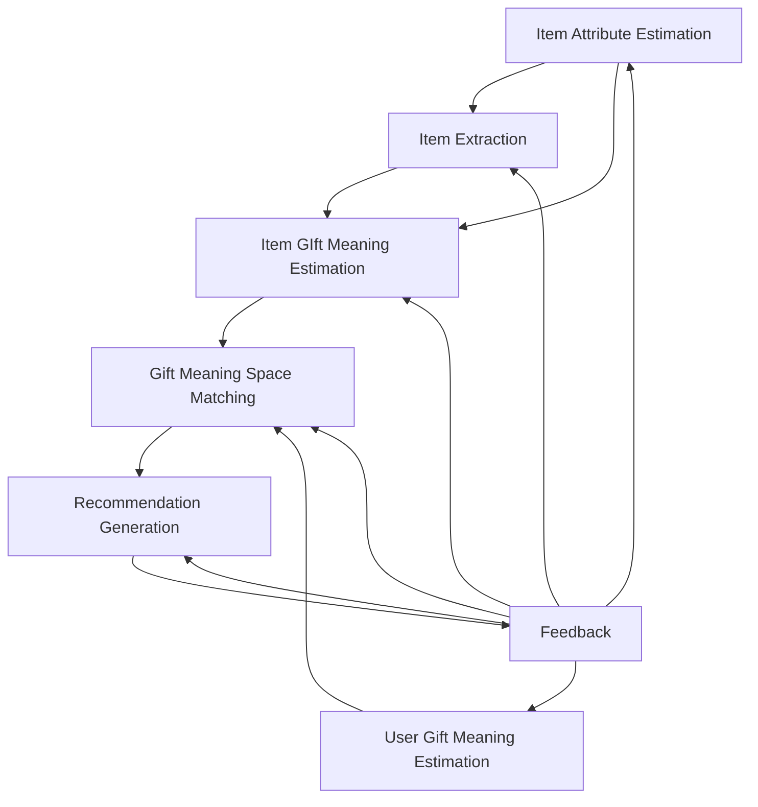

## レコメンドアーキテクチャ処理構成外観



### Item Attribute Estimation

---

#### Data PreProcessing

##### 目的・概要

- 楽天市場APIから取得した各種商品データから、商品特性素データ抽出処理 `Attribute Signal Extraction` に必要なインプットデータを抽出し、必要に応じて一次加工を行う。

##### 入力

- 楽天市場商品データ
  - apl.item
  - apl.item_market_snapshot
  - apl.item_image
  - apl.item_rank_snapshot
  - apl.item_review_snapshot

##### 出力

- text_signal
  - 商品名
  - 商品説明
  - キャッチコピー
- metadata_signal
  - ジャンル
  - タグ
- image_signal
  - 商品画像
- review_signal
  - 商品レビューコメント
  - 商品レビュー点数

##### 処理概要

---

#### Attribute Signal Extraction

##### 目的・概要

- 商品特性素データを、ユーザーが嗜好する商品特性情報との類似度を算出できるよう、商品特性素データからキーワードを抽出し、人間的な商品特性の表現に合うように加工（ラップ）する。
- 抽出対象の商品特性素データ（シグナル）は複数あるため、それぞれに対して抽出処理を行う。

---

##### Text Signal Extraction

- いわゆる商品特性（例：お洒落な、甘い、子供にやさしい など）の定性情報。

###### 入力

- text_signal
  - 商品名
  - 商品説明
  - キャッチコピー

###### 出力

- text_attribute

###### 処理概要

- PreProcessing にて抽出された定性情報を、単語ないしは文節に分解しする。
- 分解した単語ないしは文節に対して表現の補正が必要かを確認し、必要であれば修正する。
- 分解した単語ないしは文節が複数存在する場合は重複を排除する。

---

###### Metadata Signal Extraction

- ジャンル、タグなどの商品メタ情報。
- Text_Signal のような感覚的な定性情報ではなく、商品の属性を表現するもの。

###### 入力

- metadata_signal
  - ジャンル
  - タグ

###### 出力

- metadate_attribute

###### 処理概要

- PreProcessing にて抽出されたジャンル、タグを重複排除する。
- ジャンルやタグが多階層すぎたり、数が多すぎる場合は、上位階層のメタ情報を抽出するなどのチューニングを行う。

---

###### Image Signal Extraction

- 画像イメージから読み取れる感覚的な商品情報。
- 商品画像そのものから読み取れる感覚値だけでなく、画像全体を通して読み取れる感覚値（画像自体がユーザーに与えたい印象）までをシグナルとして扱う。

###### 入力

- image_signal
  - 商品画像

###### 出力

- image_attribute

###### 処理概要

- PreProcessing にてシグナル解析対象として抽出した画像データに対して、Deep Learning（CLIPなど）にて画像解析を行い、画像データから「お洒落な」「懐かしい」などの感覚値的な定性情報に落とし込む。
- 画像解析にて生成する定性情報は、`Text Signal` で抽出する定性情報と同じ表現空間、粒度となるイメージ。

---

###### Review Signal Extraction

- 商品レビュー評価コメントや、レビュー点数など。
- `★商品レビューコメントは、楽天市場のデータ利用規約及び個人情報保護の観点から、原則商用利用は不可`のため、本サービスでは検討対象外とする。

---

#### Item Attribute Integration

##### 目的・概要

- 各商品シグナルを結合し、商品ごとの商品特性情報のセット情報を生成する。

##### 入力

- text_attribute
- metadata_attribute
- image_attribute
- review_attribute

##### 出力

- item_attribute

##### 処理概要

- 入力データを結合する。
- 各特性情報の強度は情報として残しておきたいため、同一項目が複数存在する場合でも重複削除はしない。<br/>`※テスト検証を進める中で随時チューニング要否確認`
- `Hard Filter` 抽出済みの商品ごとにitem_attributeをjoinしてハードフィルタ済み商品特性情報データを生成する。

---

### User Gift Meaning Estimation

---

#### Data Preprocessing

- ユーザー入力項目は、リストから選択する入力 `Structured Input` と、自由入力 `Free Text` の二種類がある。
  - Structured Input：贈答相手、贈答イベント、金額（下限、上限）
  - Free Text　　　 ：好みの特徴、避けたい特徴、NG条件

##### 目的・概要

- `Free Text` について、ユーザーのタイプミスや全角/半角などの体裁を補完する。
- また、形態素解析を行いなどを行い、後続の推定処理のインプットとして適切なキーワードに抽出する。

##### 入力

- Free Text Input
  - desired_condition
  - non-desired_condition
  - ng_condition

##### 出力

- desired_condition_parsed
- non-desired_condition_parsed
- ng_genre
- ng_tag

##### 処理概要

- タイプミスを検知し、適切な表現に修正する。
- 全角/半角などの表現のブレを検知し、フォーマットを統一する。
- 形態素解析などにより、検索用キーワード（名詞、形容詞の２パターンを想定）に分解する。

#### User Feature Estimation

##### 目的・概要

- ユーザー入力内容から、Gift Meaning Spaceを構成するSocail, Symbolicの要素であるFeatureを推定する。
- ユーザーのギフト文脈を推察するための特徴量として使用する。
- ユーザー入力には下記の条件要因があると仮定するため、Feeatureの推定は、条件要因に合わせて多段階で推定する。
  - ユーザー環境条件
    - Relationship
    - Occasion
  - ユーザー内的条件（求める商品特性）
    - Desired Condition
    - Non-Desired Condition
    - NG Condition
- Feature推定は下記の処理にて構成する。
  - Feature推定（ユーザー環境条件要素単位）
    - Relationship_Rule_Mapping
    - Occasion_Rule_Mapping
    - Pair_Rule_Mapping
  - Feature推定（ユーザー環境条件単位）
  - Feature推定（ユーザー内的条件単位）
  - Gift Meaning要素（Social / Symbolic）推定（ユーザー環境条件単位）
  - Gift Meaning要素（Social / Symbolic）推定（ユーザー内的条件単位）
  - Gift Meaning要素（Social / Symbolic）推定

##### Relationship_Rule_Mapping

- ユーザー入力 `Relationship` からルールベースでFeature推定を行う。

###### 入力

- relationship
- relatinoship_ruleテーブル

###### 出力

- relation_features
  - relationship_formality
  - relationship_safety
  - relationship_apropriateness
  - relationship_emotion
  - relationship_novelty
  - relationship_intimacy
  - relationship_symbolic_identity
  - relationship_story_richness

###### 処理概要

- relationship_ruleテーブルで定義したrelationship⇔各featureの対応表を利用してfeature値を算出する。

##### Occasion_Rule_Mapping

- ユーザー入力 `Relationship` からルールベースでFeature推定を行う。

###### 入力

- occasion
- occasion_ruleテーブル

###### 出力

- occasion_features
  - occasion_formality
  - occasion_safety
  - occasion_apropriateness
  - occasion_emotion
  - occasion_novelty
  - occasion_intimacy
  - occasion_symbolic_identity
  - occasion_story_richness

###### 処理概要

- occasion_ruleテーブルで定義したoccasion⇔各featureの対応表を利用してfeature値を算出する。

##### Pair_Rule_Mapping

- ユーザー入力 `Relationship` からルールベースでFeature推定を行う。

###### 入力

- relationship
- occasion
- pair_ruleテーブル

###### 出力

- pair_features
  - pair_formality
  - pair_safety
  - pair_apropriateness
  - pair_emotion
  - pair_novelty
  - pair_intimacy
  - pair_symbolic_identity
  - pair_story_richness

###### 処理概要

- pair_ruleテーブルで定義したpair⇔各featureの対応表を利用してfeature値を算出する。

##### Feature Integration

- Relationship、Occasion、Pairの各featureを統合する。

###### 入力

- relationship_features
- occation_features
- pair_features

###### 出力

- integrated_features
  - integrated_formality
  - integrated_safety
  - integrated_brans_appropriateness
  - integrated_emotion
  - integrated_novelty
  - integrated_intimacy
  - integrated_symbolic_identity
  - integrated_story_richness

###### 処理概要

- reltionship_features、occasion_features、pair_featuresを統合する。
- MVPでは下記計算式にて算出（統合）する。
  ```text
  integrated_f =
  clamp(
      0.6 * relationship_f
    + 0.4 * occasion_f
    + pair_f
  )
  ```

##### User Context Estimation

###### 入力

- integrated_features

###### 出力

- context_socail
  - context_formality
  - context_safety
  - contest_brand appropiateness
- context_symbolic
  - context_emotion
  - context_novelty
  - context_intimacy
  - context_symbolic_identity
  - context_story_richness

###### 処理概要

- MVPでは単純平均を採用する。

```text
例：
context_social =
(
  integrated_formality
  + integrated_safety
  + integrated_brand_appropriateness
) / 3
```

#### User Item Condition Feature Estimation

##### 目的・概要

- `好みの条件``避けたい条件``NG条件` から、ギフト意味（Gift Meaning Social/Symbolic）を推定する。

##### 入力

- desired_condition_parsed
- non-desired_condition_parsed
- ng_condition_parsed

##### 出力

- hint_features
  - hint_formality
  - hint_safety
  - hint_brand_appropriateness
  - hint_emotion
  - hint_novelty
  - hint_intimacy
  - hint_synbolic_identuty
  - hint_story_richness
- `gift_feature_hint_dictionary`

##### 処理概要

- ギフト辞書（gift_feature_hint_dictionary）を用いて、パース済みのユーザー内的条件情報（desired,non-desired,ng）からfeatureを推定する。
- `★計算ロジックはこれから検討★`

##### User Item Condition Estimation

###### 入力

- hint_features

###### 出力

- social_hint
- symbolic_hint

###### 処理概要

- MVPでは単純平均を採用する。

```text
例：
social_hint =
(
  hint_formality
  + hint_safety
  + hint_brand_appropriateness
) / 3
```

### Item Extraction

- ユーザー入力条件を元に商品の抽出（絞り込み）を行う。
- 抽出は下記２段階で行う。
  - Item Hard Filter
  - Candidate Retrieval

---

#### Item Hard Filter

- 下記２種類の条件がある。
  - Structured_Input：金額（下限～上限）条件
  - Free Text Input：NG条件
- NG条件はフリーフォーマットのため、前処理として形態素解析にて単語（名詞、形容詞）の分解が必要。
  - 名詞の場合：item_genreを突合対象とする。
  - 形容詞の場合：item_tagを突合対象とする。<br/>`※形容詞は大量の商品がキーワードを含む可能性が高いので要考慮が必要。`

##### 目的・概要

- 確実にレコメンド商品として求めていない商品を除外する。

##### 入力

- ユーザー入力
  - price_range
  - ng_genre
  - ng_tag
- itemテーブル

##### 出力

- item_filterd

##### 処理概要

- 下記条件で商品を抽出する。
  - 価格帯（price_range）内の商品
  - item_genreがng_genreを含まない商品
  - item_tagがng_tagを含まない商品

#### Candidate Retrieval

- Item Hard Filterより後続にて行う商品抽出（候補データ抽出）処理。
- 商品特性情報（DesiredCondition, Non-Desired_Condition）を条件に、ユーザーの嗜好と商品の類似度（コサイン類似度）を算出し、候補商品を抽出する。

---

#### User Preferred Attribute Set Generation

##### 目的・概要

- ユーザーが商品に`求める`特性条件のEmbedding用コンテキストを生成する。

##### 入力

- desired_condition

##### 出力

- user_preferred_attribute_set

##### 処理概要

- desired_conditionを結合する。
- ユーザー嗜好の強度を表現するために、インプットであるdesired_conditionに同一要素が複数存在する場合でも、重複削除はしない。<br/>`※チューニングの要否は要検討`

---

#### User Preferred Attribute Set Embedding

##### 目的・概要

- ユーザーが商品に`求める`特性条件コンテキストをベクトル化する。

##### 入力

- user_preferred_attribute_set

##### 出力

- user_preferred_attribute_vector

##### 処理概要

- user_preferred_attribute_setをEmbeddingしベクトル化する。
- EmbeddingにはopenAIのAPIを利用する。<br/>`※利用技術スタックは要検討`

---

#### User Non-Preferred Attribute Set Generation

##### 目的・概要

- ユーザーが商品に`求めない`特性条件のEmbedding用コンテキストを生成する。

##### 入力

- non-desired_condition

##### 出力

- user_non-preferred_attribute_set

##### 処理概要

- non-desired_conditionを結合する。
- ユーザー嗜好の強度を表現するために、インプットであるnon-desired_conditionに同一要素が複数存在する場合でも、重複削除はしない。<br/>`※チューニングの要否は要検討`

---

#### User Non-Preferred Attribute Set Embedding

##### 目的・概要

- ユーザーが商品に`求めない`特性条件コンテキストをベクトル化する。

##### 入力

- user_non-preferred_attribute_set

##### 出力

- user_non-preferred_attribute_vector

##### 処理概要

- user_non-preferred_attribute_setをEmbeddingしベクトル化する。
- EmbeddingにはopenAIのAPIを利用する。<br/>`※利用技術スタックは要検討`

---

#### Item Attribute Set Generation

##### 目的・概要

- 商品特性情報のEmbedding用コンテキストを生成する。

##### 入力

- item_filtered
- item_attribute

##### 出力

- filterd-item_attribute_set

##### 処理概要

- item_attributeを結合する。
- 商品特性情報の強度を表現するために、インプットであるitem_attributeに同一要素が複数存在する場合でも、重複削除はしない。<br/>`※チューニングの要否は要検討`

---

#### Item Attribute Set Embedding

##### 目的・概要

- 特性条件コンテキストをベクトル化する。

##### 入力

- filtered-item_item_attribute_set

##### 出力

- filtered-item_attribute_vector

##### 処理概要

- filtered-item_attribute_setをEmbeddingしベクトル化する。
- EmbeddingにはopenAIのAPIを利用する。<br/>`※利用技術スタックは要検討`

---

#### Candidate Retrieval

##### 目的・概要

- ユーザーの商品に求める条件（商品特性）に近しい商品特性を持つ商品を候補データとして抽出する。
- 好みの特徴（Desired Condition）に対しては、`条件に近いほど良い`
- 避けたい特徴（Non-Desired Condition）に対しては`条件に近いほど悪い`
- 避けたい条件には`本当にNGな条件`と`できれば避けたい条件`の強度の異なる条件が入力されることが想定される。<br/>そのため、単純な減点方式ではなく、閾値を設定し、避けたいとの相関が特に強いと判断できる場合は、`好みの条件の一致度に関わらず、候補から除外`する方針とする。

##### 入力

- user_preferred_attribute_vector
- user_non-preferred_attribute_vector
- filtered-item_attriute_vector

##### 出力

- item_candidated

##### 処理概要

1. Desired条件を元に広めに候補取得する。
   - sim_desiredが高い商品をtopN取得する。
2. Non-Desired条件を元に`除外`または`減点`する。
   - `sim_non_desired >= threshold_ng`の場合、候補から除外する。
   - 閾値未満の場合、除外はせずに減点する。
3. 最終Retrieval Score算出
   - retrieval*score = (α * sim*desired) - (β * sim_non_desired)

---

### Item Gift Meaning Estimation

- 各商品が持つ商品特性情報からGift Meanin Fearuteを推定し、Gift Meaning Space（Social/Symbolic）に射影する。

---

#### Dictionary-Based Feature Estimation

- `商品特性 → Concept → Feature`のように、中間層Concept空間を用意し、Featureに変換するための処理。

##### 目的・概要

- 商品特性×Featureの多対多中間テーブルを用いて、商品特性を、商品特性のConcept及びFeatureに変換する。

##### 入力

- item_attribute
- item_keyword_feature_hint_dictionary

##### 出力

- item_attriibute_concept

##### 処理概要

- `item_attribute`のキーワードをキーに、辞書`item_keyword_feature_hint_dictionary`から対応する紐づくConcept及びFeatureを付与する。

---

#### Rule-Based Estimation

##### 目的・概要

- 商品特性情報をGift Meaning Spaceに射影するためにFeature推定を行う。

##### 入力

- item_attribute_concept
- item_feature_estimation_ruleテーブル

##### 出力

- item_feature_ruled-based

##### 処理概要

- `item_attribute`の持つConceptをキーに、`item_feature_estimation_rule`から対応するFeatureを付与する。

---

#### Embedding-Based Estimation

##### 目的・概要

- `★要検討★`

##### 入力

- item_attriute

##### 出力

- item_feature_embedding-based

##### 処理概要

- `★要検討★`

---

#### LLM-Based Estimation

##### 目的・概要

- `★要検討★`

##### 入力

- item_attribute

##### 出力

- item_feature_llm-based

##### 処理概要

- `★要検討★`

---

#### Item Feature Integration

##### 目的・概要

- 各方法にて導出したFeatureを結合する。

##### 入力

- item_feature_rule-based
- item_feature_embedding-based
- item_feature-llm-based

##### 出力

- item_feature
  - item_socail
  - item_symbolic

##### 処理概要

- 各ベースfeatureを重み付けしたうえで結合する。

```text
item_feature =
  w_rule * item_feature_rule-based
  w_embed * item_feature_embedding-based
  w_llm * item_feature_llm-based
```

---

### Gift Meaning Space Matching

- ユーザーコンテキスト × 商品コンテキストのマッチング。
- マッチングは最小粒度のコンテキスト情報から積み上げで一致度を積み上げ、そこに補正値を加えて算出する。
  - Featureレイヤーでの一致度算出（距離計算：`| user_f - item_f |`）
  - Gift Meaning Spaceレイヤーでの一致度算出（平均値計算：`mean(socai_f)`, `mean(symbolic_f)`）

---

#### Feature-Wise Comparision

##### 目的・概要

- ユーザーコンテキスト × 商品の各Gift Meaning Featureの距離を算出する。
- `距離が近いほど高評価`となる。

##### 入力

- user_social
  - user_formality
  - user_sefety
  - user_brand_appropriateness
- item social
  - item_formality
  - item_sefety
  - item_brand_appropriateness

- user_symbolic
  - user_emotion
  - user_novelty
  - user_intimacy
  - user_symbolic_identity
  - user_story_richness
- item_symbolic
  - item_emotion
  - item_novelty
  - item_imtimacy
  - item_symbolic_identity
  - item_story_richness

##### 出力

- formality_match
- sefety_match
- brand_appropriateness_match
- emotion_match
- novelty_match
- intimacy_match
- symbolic_identity_match
- story_richness_match

##### 処理概要

- 下記の計算式でFeature毎の距離を算出する。

```text
match_f = 1 - ( | user_f - item_f | )
```

---

#### Social Match

##### 目的・概要

- Feature毎の一致度をGift Meaning Space（Socail）観点で集約し、一致度を算出する。

##### 入力

- formality_match
- safety_match
- brand_appropriateness_match

##### 出力

- socail_match

##### 処理概要

- 下記の計算式でFeature毎の距離を集計する。

```text
socail_match =
  mean(
    formality_match,
    safety_match,
    brand_appropriateness_match
  )
```

---

#### Symbolic Match

##### 目的・概要

- Feature毎の一致度をGift Meaning Space（Symbolic）観点で集約し、一致度を算出する。

##### 入力

- emotion_match
- novelty_match
- intimacy_match
- symbolic_identity_match
- story_richness_match

##### 出力

- symbolic_match

##### 処理概要

- 下記の計算式でFeature毎の距離を集計する。

```text
symbolic_match =
  mean(
    emotion_match,
    novelty_match,
    intimacy_match,
    symbolic_identity_match,
    story_richness_match
  )
```

---

#### Correction Coefficient Calculation (Gift Risk Tolerance)

##### 目的・概要

- 下記から、ユーザーコンテキストスコアを算出する際に、Socail/Symbolicの比重を調整できるように係数で重み付けを行う。<br/>原則、Socailの方が比重が高い想定。
  - ギフトは、原則的な性質としてSymbolicよりもSocailの方が高くなると仮定する。
  - また、Symbolicは相対評価としての側面があるが、Socailは遵守すべき絶対条件としての側面を持つと仮定する。

##### 入力

- user_socail
- user_symbolic

##### 出力

- λ_ctx

##### 処理概要

- 下記の計算式にて算出する。

```text
λ_ctx =
  user_symbolic / ( user_socail + user_symbolic )
```

---

#### User Context Score Calculation

##### 目的・概要

- ユーザーコンテキスト、調整用係数から最終的なユーザーコンテキストスコアを算出する。

##### 入力

- socaial_match
- symbolic_match
- λ_ctx

##### 出力

- context_score

##### 処理概要

- 下記の計算式に算出する。

```text
context_score =
  ( 1 - λ_ctx ) * social_match
  +
  λ_ctx * symbolic_match
```

---

### Recommendation Generation

---

#### Correction Coefficient Calculation (Popularity Adjust / Risk Penalty Adjust)

##### Popularity Adjust Calculation

###### 目的・概要

- 社会的に評価されている商品を加点するための補正値。

###### 入力

- item_candidated
- item_rank_snapshotテーブル

###### 出力

- pupularity_adjust

###### 処理概要

- 下記の計算式にて算出する。

```text
pupularity_adjust = log(レビュー数) × 評価スコア
```

---

##### Risk Penalty Calculation

###### 目的・概要

- 社会的に極端に評価が低い商品を減点するための補正値。

###### 入力

`★要検討★`

###### 出力

- risk_penalty_adjust

###### 処理概要

`★要検討★`

---

#### Final Score Calculation

##### 目的・概要

- ユーザーコンテキスト及び補正値から、最終的なレコメンド最終スコアを算出する。

##### 入力

- context_score
- pupularity_adjust
- risk_penaly_adjust

##### 出力

- final_score

##### 処理概要

- 下記計算式にて算出する。

```text
final_score =
  context_score
  + pupularity_adjust
  - risk_penalty_adjust
```

---

#### Recommendation Result Generation

##### 目的・概要

- 最終的にユーザーへ提示するレコメンド結果を生成する

##### 入力

- final_score
- itemテーブル

##### 出力

- item_recommend

##### 処理概要

`★具体的抽出条件、クラスタリングなどは基本設計、詳細設計で検討★`

- 出力例
  - レコメンド商品一覧
  - 順位
  - スコア
  - レコメンド理由の元情報

---

#### Explanation Generation

##### 目的・概要

- 商品のレコメンド理由を説明する説明文を生成する。
- レコメンド商品決定までの処理で導出したユーザーコンテキストや商品特性などを踏まえて、事実と仮説を分離した上で直感的に心理的納得感及びポジティブな表現を目指す。

##### 入力

- final_score
- itemテーブル

##### 出力

- recommendation_explanation

##### 処理概要

`★具体的な処理は基本設計、詳細設計で検討★`

### Feedback

- ユーザーからのレコメンド結果の評価をデータ化し、適切なパラメータやレコメンドモデル、ロジックにフィードバックして改善する。
- 正解がなく、ユーザーの感覚値をシステムとして推定しているサービスのため、`フィードバック取込は本アプリケーションの重要機能`である。
- `日常的にフォードバック取込が可能なシステム`を目指す。

#### User Action Logging

##### 目的・概要

- クリック率やサービス離脱率などの間接的なフィードバックを蓄積する。

##### 入力

- 項目入力率
  - ユーザー環境条件
    - Relationship
    - Occasion
    - Price Range
  - ユーザー内的条件
    - Desired Condition
    - Non-Desired Condition
    - NG Condition
- Free Text入力数
  - ユーザー内的条件
    - Desired Condition
    - Non-Desired Condition
    - NG Condition
- レコメンド商品クリック率
- レコメンド結果パターン（ランキング）別クリック数分布
- 画面滞在時間

##### 出力

`★基本設計で要検討★`

##### 処理概要

`★基本設計で要検討★`

---
