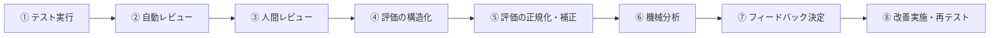

## 1. 本資料の位置づけ

本資料は、Gift Recommendation Service における **テスト・評価・フィードバック設計の最上位方針** を定義するものである。

本サービスは、通常の業務システムのように「正解が一意に定まる処理」を扱うものではない。

贈答文脈・心理モデル・商品意味推定・ランキング調整など、**主観性と仮説性を含む推薦ロジック** が中核である。

そのため、本サービスの品質改善は、単なる不具合修正ではなく、

- どの推定がズレたのか
- そのズレはどのレイヤで発生したのか
- 人間の感覚とシステムの意味空間がどう乖離しているのか
- その乖離をどのように構造化し、補正し、改善へつなぐか

を継続的に扱う必要がある。

本資料は、そのための **共通パイプライン** と **後続設計の考え方** を定める。

---

## 2. 基本思想

### 2.1 原則

本サービスにおけるテスト・評価・フィードバックは、単なる確認作業ではなく、

**人間の感覚を、システムが扱える改善可能なデータへ変換するプロセス** として設計する。

---

### 2.2 この設計が必要な理由

本サービスでは、以下のような特性がある。

- User Meaning Estimation に主観が入る
- Item Meaning Extraction に推定誤差が入る
- Matching / Ranking にパラメータ依存のズレが入る
- 「合っている / 合っていない」が感覚評価になりやすい
- 開発者・検証者・システムの3者で感覚値がズレる
- 評価結果をそのままシステムへ反映するとノイズを増幅しやすい

したがって、

**レビュー結果をそのまま改善に使うのではなく、構造化・正規化・分析を経てからフィードバックする**

ことを前提にする。

---

### 2.3 設計上の中核原則

| 原則  | 内容                                                                                             |
| ----- | ------------------------------------------------------------------------------------------------ |
| 原則1 | テスト対象は全体推薦だけでなく、推定・抽出・マッチング・ランキングなど各レイヤに分解して評価する |
| 原則2 | レビューは人間レビューだけでなく、自動レビューを必須で組み込む                                   |
| 原則3 | 感覚評価はそのまま使わず、構造化・正規化してから分析に使う                                       |
| 原則4 | フィードバック先を逆算して、必要な評価項目・観測項目を定義する                                   |
| 原則5 | 後で比較・再現できるよう、version と中間出力を保持する                                           |

---

## 3. テスト〜評価〜フィードバックの共通パイプライン

### 3.1 全体図



---

### 3.2 各段階の意味

### ① テスト実行

テストケースを実行し、推薦結果と中間値を取得する段階。

ここでは、結果だけでなく、**後で評価・分析に必要な観測データを残すこと** が重要である。

### ② 自動レビュー

分布・閾値・不変条件・一貫性など、**機械的に判定可能な異常や偏り** を検出する段階。

ここは一次フィルタであり、明らかな崩壊や異常分布を検出する。

### ③ 人間レビュー

文脈適合性・納得感・特別感・安全性など、**意味的妥当性** を人間が確認する段階。

ここで得る評価は重要だが、そのまま改善には使わない。

### ④ 評価の構造化

曖昧なレビュー結果を、feature差分、順位比較、NG判定、分布評価など、

**システムが扱える構造化データへ変換する段階** である。

### ⑤ 評価の正規化・補正

レビュアー差、尺度差、甘辛差、ばらつきなどを補正し、

**改善分析に使える比較可能な評価データへ整形する段階** である。

### ⑥ 機械分析

ズレの原因が、

- user推定なのか
- item推定なのか
- matchingなのか
- rankingなのか

を分解し、**修正対象候補を特定する段階** である。

### ⑦ フィードバック決定

分析結果をもとに、どの rule / concept / extraction / ranking / explanation を修正するかを決定する段階である。

### ⑧ 改善実施・再テスト

修正内容を新versionへ反映し、再度テストして、改善前後を比較する段階である。

---

## 4. レビュー設計の基本方針

### 4.1 レビューは二層構造で扱う

本サービスのレビューは、以下の二層で構成する。

| レビュー種別 | 役割                         | 主な対象                                    |
| ------------ | ---------------------------- | ------------------------------------------- |
| 自動レビュー | 数値・分布・一貫性・異常検知 | feature, score, space, dispersion           |
| 人間レビュー | 文脈・感覚・意味的妥当性     | recommendation, explanation, directionality |

---

### 4.2 自動レビューの位置づけ

自動レビューは、以下を確認するためのものである。

- 数値範囲が妥当か
- 分布が偏りすぎていないか
- 意図した入力差が出力差に反映されているか
- 特定ケース群で崩壊していないか
- Meaning Space / Semantic Space の構造が破綻していないか

### 代表的な自動レビュー観点

| 観点               | 例                                               |
| ------------------ | ------------------------------------------------ |
| 範囲チェック       | score が 0〜1 に収まるか                         |
| 分布チェック       | novelty が全商品で高すぎないか                   |
| 一貫性チェック     | boss ケースで formality が低すぎないか           |
| 単調性チェック     | 無難寄りケースで risk が抑制されるか             |
| 相関チェック       | safety と formality の関係が極端に崩れていないか |
| スコア差分チェック | Top1 と Top2 の差が不自然に小さすぎないか        |
| 空間チェック       | Meaning Space の特定象限に偏りすぎていないか     |

---

### 4.3 人間レビューの位置づけ

人間レビューは、システムが扱いづらい以下の判断を担う。

- relationship / occasion に合っているか
- 安全性と特別感のバランスが適切か
- 推薦理由に納得できるか
- 上位候補の並びが感覚的に自然か
- feature方向性が直感に合うか

### 代表的な人間レビュー観点

| 観点       | 説明                              |
| ---------- | --------------------------------- |
| 文脈適合性 | 贈答シーンに合うか                |
| 安全性     | 失礼・不適切・外しすぎがないか    |
| 特別感     | 必要なケースで十分に出ているか    |
| 納得感     | なぜその商品なのか説明できるか    |
| 順位妥当性 | A より B が上であるべきか         |
| 意味方向性 | system feature が期待方向と合うか |

---

## 5. テスト対象レイヤの考え方

### 5.1 テスト対象は全体推薦だけではない

本サービスでは、推薦品質は複数の推定ロジックの積み重ねで決まる。

そのため、全体推薦だけを見るのではなく、**レイヤごとの評価パイプライン** を持つ必要がある。

---

### 5.2 テスト対象レイヤ一覧

| レイヤID | レイヤ名                | 主対象                                                  |
| -------- | ----------------------- | ------------------------------------------------------- |
| L1       | 入力パース              | 自由入力キーワード、hint、NG条件の解釈                  |
| L2       | User Meaning Estimation | relationship / occasion / hint からの user feature 推定 |
| L3       | Item Meaning Extraction | 商品テキストからの concept / feature / meaning 推定     |
| L4       | Candidate Retrieval     | 候補集合の粗検索妥当性                                  |
| L5       | Matching                | user × item の feature一致度、social/symbolic一致度     |
| L6       | Ranking                 | context / popularity / risk / λ_ctx による最終順位      |
| L7       | 全体統合                | 推薦全体の納得感と説明可能性                            |

---

### 5.3 レイヤ別パイプラインの考え方

共通パイプラインの骨格は共通である。

ただし、**各レイヤごとに以下が差し替わる**。

- テスト入力
- 自動レビュー指標
- 人間レビュー観点
- 構造化する評価項目
- 分析時の切り分け観点
- フィードバック先

つまり、設計思想としては次の構造を採用する。

```
共通骨格（テスト → 自動レビュー → 人間レビュー → 構造化 → 正規化 → 分析 → フィードバック）
×
対象別プラグイン（L1〜L7ごとの評価ロジック）
```

---

## 6. 各段階の入出力定義

### 6.1 ① テスト実行

### 入力

- テストケース
- version
- ルール定義
- 商品データ
- meaningデータ
- hint / concept定義

### 出力

- user_input
- normalized_input
- user_feature
- λ_ctx
- candidate_items
- item_features
- match_detail
- score_detail
- final_ranking
- explanation_source

### 方針

**最終結果だけでなく、中間値を必ず取得する。**

---

### 6.2 ② 自動レビュー

### 入力

- テスト実行ログ
- 既定閾値
- 分布基準
- ルール整合条件

### 出力

- anomaly_flags
- distribution_summary
- threshold_violation
- consistency_check_result
- space_check_result

### 方針

**人間レビュー前に、異常・偏り・崩壊を機械的に検知する。**

---

### 6.3 ③ 人間レビュー

### 入力

- テストケース
- 推薦結果
- 中間値サマリ
- 自動レビュー結果

### 出力

- 全体評価
- feature方向性評価
- item評価
- ranking比較評価
- コメント

### 方針

**自由記述を許しつつ、後続で構造化できる粒度に留める。**

---

### 6.4 ④ 評価の構造化

### 入力

- 人間レビュー結果
- 自動レビュー結果
- テスト実行ログ

### 出力

- feature_diff
- pairwise_preference
- NG_flag
- ranking_issue
- distribution_issue
- explanation_gap

### 方針

**「なんとなく違う」を、比較可能な評価データへ変換する。**

---

### 6.5 ⑤ 評価の正規化・補正

### 入力

- 構造化評価データ
- reviewer情報
- caseカテゴリ情報
- 過去評価履歴

### 出力

- normalized_feature_diff
- normalized_preference
- reviewer_bias_adjusted_score
- confidence_weight
- anomaly_adjusted_label

### 方針

**評価値はそのまま使わない。補正済み評価だけを分析対象とする。**

---

### 6.6 ⑥ 機械分析

### 入力

- 正規化済み評価
- 実行ログ
- version情報
- 関連ルール・辞書

### 出力

- cause_hypothesis
- problem_cluster
- candidate_fix_target
- impact_scope

### 方針

**誤差を user / item / matching / ranking などに分解する。**

---

### 6.7 ⑦ フィードバック決定

### 入力

- 分析結果
- 修正優先度
- 影響範囲
- 開発方針

### 出力

- rule_fix_request
- concept_fix_request
- extraction_fix_request
- ranking_fix_request
- explanation_fix_request
- new_version_plan

### 方針

**評価を感想で終わらせず、修正対象に落とし込む。**

---

### 6.8 ⑧ 改善実施・再テスト

### 入力

- 修正指示
- 新version定義

### 出力

- 改善後version
- 再計算結果
- 再テスト結果
- 比較レポート

### 方針

**改善は必ず version 化し、前後比較可能にする。**

---

## 7. 自動レビューの明示的導入

### 7.1 本方針での位置づけ

自動レビューは補助ではなく、**正式なパイプラインの必須工程** とする。

理由は以下の通りである。

- 人間レビューだけでは検知できない分布崩壊がある
- 大量ケースに対して人手だけでは追えない
- 評価の初期フィルタを機械化できる
- 人間レビュー対象を絞れる
- 後の分析時に客観指標を持てる

---

### 7.2 自動レビュー対象の代表例

### User Meaning Estimation

- relationship と feature の整合性
- λ_ctx の分布
- case群ごとの feature偏り

### Item Meaning Extraction

- feature分布の偏り
- concept分布の偏り
- 張り付き値（0/1）
- 商品タイプ別の意味空間分布

### Matching

- matchスコア分布
- featureごとの寄与バランス
- 特定featureの不感化

### Ranking

- score差分
- popularity / risk の効き方
- λ_ctx に対する順位変化
- Top候補の多様性

---

### 7.3 Meaning Space / Semantic Space のレビュー

本サービスでは、単一scoreだけでなく、**空間構造そのもの** をレビュー対象とする。

### Meaning Space

- user_social × user_symbolic
- item_social × item_symbolic

### Semantic Space

- concept埋め込み
- hint / keyword / concept の位置関係

### 代表レビュー観点

| 空間           | 観点                                          |
| -------------- | --------------------------------------------- |
| Meaning Space  | 特定象限への偏り、ケース間移動の妥当性        |
| Semantic Space | conceptクラスタの妥当性、異常クラスタの有無   |
| Scatter分布    | feature群の異常集中、ケース群の不自然な重なり |

---

## 8. 評価値の扱い方針

### 8.1 感覚評価はそのまま使わない

本サービスでは、検証結果は感覚値を含む。

そのため、レビュー結果をそのままフィードバックログとして扱うことはしない。

---

### 8.2 正規化・補正前提の設計を採用する

以下を行う前提で設計する。

- レビュアーごとの甘辛補正
- 数値レンジ統一
- ペア比較への変換
- ケース類型ごとの基準差補正
- confidence 付与
- 異常値除外

---

### 8.3 最終的に揃えたい感覚値

本方針では、以下の3者の感覚値を徐々に揃えていく。

- 開発者の感覚
- 検証者の感覚
- システムの感覚

この「感覚値の平準化」を、

**レビュー → 構造化 → 正規化 → 分析 → フィードバック** のループで実現する。

---

## 9. 後続設計の進め方

### 9.1 設計順序の原則

本テーマは、前工程から順に細かく決めるのではなく、

**後続工程から逆算して前工程を具体化する** 方針で進める。

理由は、最終的に改善へつながる形でなければ、

評価・レビュー・テストの粒度を適切に定められないためである。

---

### 9.2 推奨設計順序

```
1. フィードバック先を定義する
↓
2. 各フィードバック先に必要な評価出力を定義する
↓
3. その評価出力を得るためのレビュー方法を定義する
↓
4. レビューのために必要な自動レビュー指標を定義する
↓
5. その指標を出すためのテスト実行ログを定義する
↓
6. これらをタスク化する
↓
7. 最後にエンティティ・テーブル設計へ落とす
```

---

### 9.3 具体的な後続成果物

この大方針の後は、以下を順に作成する。

| 順序 | 成果物                      | 目的                           |
| ---- | --------------------------- | ------------------------------ |
| 1    | フィードバック分類表        | 修正対象を定義する             |
| 2    | レイヤ別パイプライン定義    | L1〜L7ごとの評価方法を定義する |
| 3    | 自動レビュー指標一覧        | 機械レビューの具体指標を定める |
| 4    | 評価出力定義表              | 構造化評価の項目を定める       |
| 5    | 評価ログ設計                | 保存対象を定める               |
| 6    | タスク管理表                | 実行順序と担当単位に分解する   |
| 7    | エンティティ / テーブル設計 | DB設計へ落とす                 |

---

## 10. タスク化の考え方

### 10.1 タスク分解の単位

タスクは、「工程」ではなく **アウトプットが明確な単位** で切る。

### 例

- フィードバック分類の定義
- User Meaning Estimation の自動レビュー指標定義
- Ranking のペア比較評価仕様定義
- 評価構造化フォーマット定義
- reviewer補正方針定義

---

### 10.2 タスク具体化の原則

各タスクは、以下が答えられる状態にする。

- 何を入力として受け取るか
- どのような処理 / 方法で実施するか
- 何を出力するか
- その出力が、どの後続工程で使われるか

---

## 11. 本資料で確定した大方針まとめ

### 11.1 確定事項

- テスト〜評価〜フィードバックは、共通パイプラインで設計する
- ただし、レイヤごとに派生パイプラインを持つ
- 自動レビューを正式工程として組み込む
- 人間レビューは意味判断、自動レビューは異常検知を担う
- レビュー結果は構造化・正規化後のみ分析対象とする
- 評価をそのまま改善へ使わず、必ず分析を経由する
- 後続から逆算して前工程を定義する
- 最終的には、評価ログ・分析ログ・version設計までつなげる

---

## 12. 図による最終整理

### 12.1 大方針の全体図


---

### 12.2 設計順序の図


---

## 13. 次に着手すべき内容

本資料の次に着手するべき内容は以下である。

### 優先度順

1. **フィードバック分類表の作成**
2. **レイヤ別パイプライン定義（L1〜L7）**
3. **自動レビュー指標一覧の作成**
4. **評価構造化フォーマットの定義**
5. **評価ログ / 分析ログの設計方針整理**

---

## 14. Notionタスク化しやすい見出し一覧

以下は、このまま Notion の親ページ / 子ページに分割しやすい構成である。

- テスト〜評価〜フィードバック設計 大方針
  - 基本思想
  - 共通パイプライン
  - 各段階の入出力
  - 自動レビュー方針
  - レイヤ別評価方針
  - 正規化・補正方針
  - 後続設計順序
  - 次アクション

---

必要であれば次に、これをそのまま受けて

**「フィードバック分類表（Notion向けの表形式）」**

に進めます。
