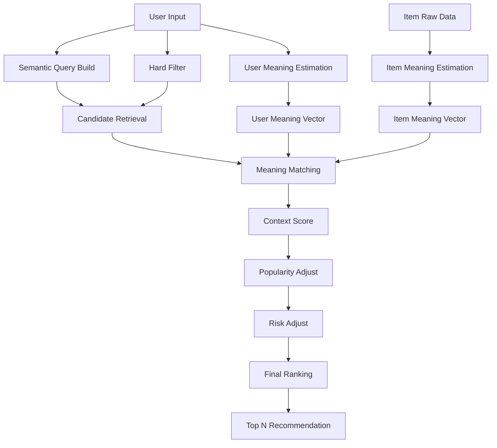
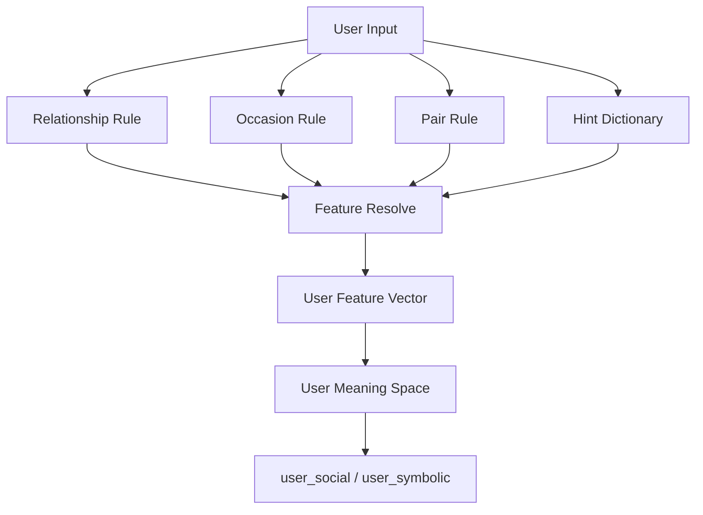
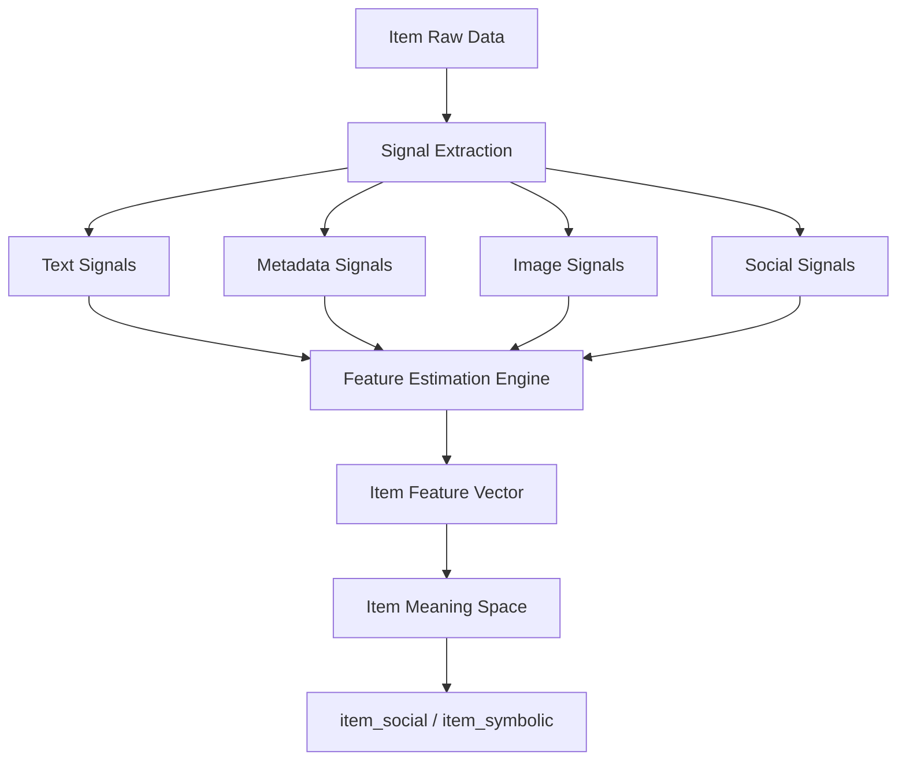
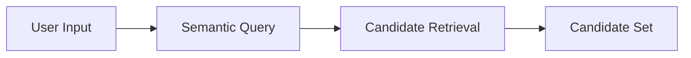
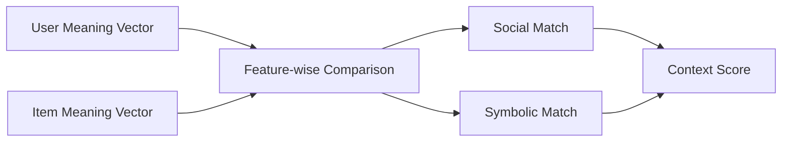
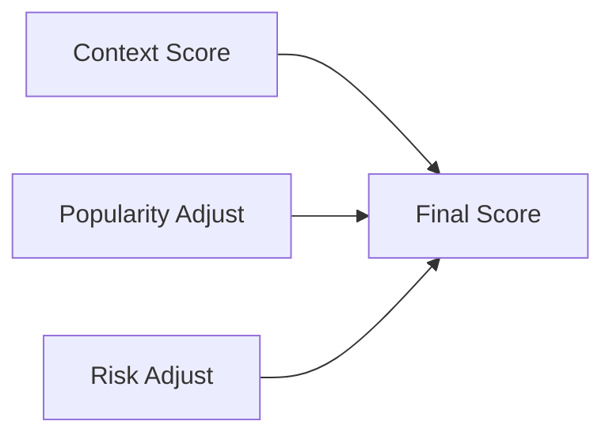
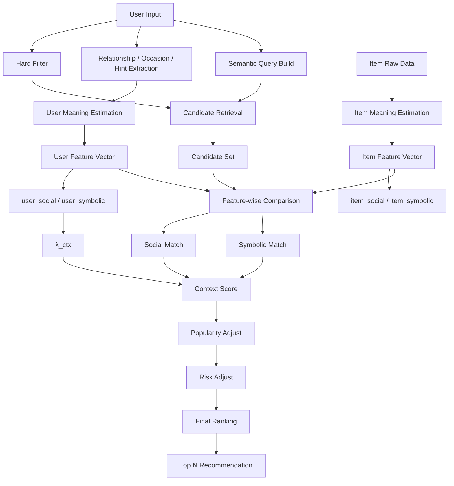

# Recommendation Architecture

---

# 1. 目的

本ドキュメントは Gift Recommendation Service における

**レコメンド全体アーキテクチャ**

を統合的に定義する。

本ドキュメントで整理するものは以下。

1. サービス全体の推薦思想
2. 全体処理フロー
3. User側意味推定の位置づけ
4. Item側意味推定の位置づけ
5. Matching / Ranking の役割分担
6. MVP〜最終形までの拡張方針

---

# 2. サービスの基本思想

## 2.1 事実

本サービスは、通常のECのような

```
商品特徴
↓
商品検索
```

ではなく、

```
贈答文脈
↓
贈答意味
↓
商品推薦
```

を中心に構築する。

つまり、ユーザーが直接探したいのは

「商品そのもの」よりも、

- どれくらい無難か
- どれくらい特別か
- どれくらい感情を乗せられるか
- どれくらい相手らしさを表現できるか

といった **贈答意味** である。

---

## 2.2 推論

このため、本サービスの中核は

```
User Meaning
×
Item Meaning
```

の一致であり、

人気順や単純なキーワード一致は補助要素に位置づく。

---

# 3. 全体アーキテクチャ図

## 3.1 統合フロー



---

# 4. 全体処理のレイヤ構造

## 4.1 事実

全体をレイヤで分けると、次の5層になる。

| レイヤ                   | 役割                                   |
| ------------------------ | -------------------------------------- |
| Input Layer              | ユーザー入力の受領                     |
| Meaning Estimation Layer | User / Item の意味推定                 |
| Retrieval Layer          | 候補商品の抽出                         |
| Matching Layer           | User Meaning × Item Meaning の一致評価 |
| Ranking Layer            | popularity / risk を含めた最終順位決定 |

---

## 4.2 推論

このレイヤ分割により、

- 検索
- 意味理解
- 最終意思決定

が混ざらず、役割が明確になる。

---

# 5. Input Layer

## 5.1 事実

ユーザー入力は、主に以下を想定する。

| 入力         | 用途                  |
| ------------ | --------------------- |
| 対象         | relationship 推定     |
| 状況         | occasion 推定         |
| 好み特徴     | semantic query / hint |
| 避けたい特徴 | semantic query / hint |
| 予算         | hard filter           |
| NG条件       | hard filter           |

---

## 5.2 推論

このうち重要なのは、同じ入力が複数レイヤに分かれて使われること。

例：

- 「予算」→ Hard Filter
- 「おしゃれ」→ Semantic Retrieval と Hint
- 「上司」→ relationship rule
- 「送別」→ occasion rule

つまり入力は、そのままではなく

**意味ごとに分解されて下流へ流れる**。

---

# 6. User Meaning Estimation Layer

## 6.1 事実

User側では、入力から Gift Meaning Feature を推定する。

### 構造



---

## 6.2 Feature Resolve

```
resolved_f =
clamp(
  0.6 * relationship_f
  + 0.4 * occasion_f
  + pair_f
  + hint_f
)
```

---

## 6.3 Meaning Space

```
user_social =
(
resolved_formality +
resolved_safety +
resolved_brand_appropriateness
) / 3
```

```
user_symbolic =
(
resolved_emotion +
resolved_novelty +
resolved_intimacy +
resolved_symbolic_identity +
resolved_story_richness
) / 5
```

---

## 6.4 推論

ここで作っているのは、

**ユーザーがどんな意味のギフトを求めているか**

である。

これは検索条件そのものではなく、

レコメンド判断に使う **意味ベクトル** である。

---

# 7. Item Meaning Estimation Layer

## 7.1 事実

商品側では、商品データから Item Meaning を推定する。



---

## 7.2 Item Feature

User側と同じ 8 feature を採用する。

| axis     | feature               |
| -------- | --------------------- |
| Social   | formality             |
| Social   | safety                |
| Social   | brand_appropriateness |
| Symbolic | emotion               |
| Symbolic | novelty               |
| Symbolic | intimacy              |
| Symbolic | symbolic_identity     |
| Symbolic | story_richness        |

---

## 7.3 Meaning Space

```
item_social =
(formality + safety + brand_appropriateness) / 3
```

```
item_symbolic =
(emotion + novelty + intimacy + symbolic_identity + story_richness) / 5
```

---

## 7.4 推論

ここで作っているのは、

**商品が贈り物としてどのような意味を持つか**

である。

つまり、

- User側 = 求める意味
- Item側 = 持っている意味

という対称構造になる。

---

# 8. Retrieval Layer

## 8.1 事実

Candidate Retrieval は、Semantic Query を使って

候補商品を広く取る層である。



---

## 8.2 役割

| 項目 | 内容                           |
| ---- | ------------------------------ |
| 目的 | 候補漏れを減らす               |
| 重視 | recall                         |
| 出力 | 候補商品集合（例: 100〜300件） |

---

## 8.3 推論

ここではまだ「最適商品」は決めない。

やることは

```
それっぽい商品を広く集める
```

だけである。

意味一致の厳密評価は次レイヤで行う。

---

# 9. Matching Layer

## 9.1 事実

Matching Layer は、Candidate Retrieval で取った候補に対して

User Meaning と Item Meaning の一致を測る。



---

## 9.2 比較の考え方

featureごとに

```
distance_f = |user_f - item_f|
```

のようにズレを見て、

そのズレを一致度に変換する。

概念上は、

```
match_f = 1 - distance_f
```

のような近さベースで考える。

---

## 9.3 Axis集約

```
social_match =
mean(
  formality_match,
  safety_match,
  brand_appropriateness_match
)
```

```
symbolic_match =
mean(
  emotion_match,
  novelty_match,
  intimacy_match,
  symbolic_identity_match,
  story_richness_match
)
```

---

## 9.4 推論

ここで見ているのは

```
高い商品が良い
```

ではなく

```
ユーザーが求める意味に近い商品が良い
```

である。

---

# 10. Context Score

## 10.1 事実

ユーザーが Social 寄りか Symbolic 寄りかは

既に User Meaning から求められる。

```
λ_ctx =
user_symbolic /
(user_social + user_symbolic)
```

---

## 10.2 Context Score

```
context_score =
(1 - λ_ctx) * social_match
+
λ_ctx * symbolic_match
```

---

## 10.3 推論

この式により、

- 無難ギフトを求めるユーザー
- 特別ギフトを求めるユーザー

で、同じ商品でも評価が変わる。

これが本サービスらしい **文脈依存ランキング** である。

---

# 11. Ranking Layer

## 11.1 事実

最終的な順位は、Context だけではなく

- popularity
- risk

も加味して決める。



---

## 11.2 popularity の役割

- 社会的安心
- 定番性
- レビュー実績
- 外しにくさの補助

---

## 11.3 risk の役割

- ニッチすぎる
- 外しやすい
- 極端な個性
- 実績不足

を抑制する。

---

## 11.4 最終スコアの考え方

概要設計レベルでは、考え方として

```
final_score =
context_score
+ popularity_adjust
- risk_penalty
```

で捉える。

---

## 11.5 推論

ここでやっているのは、

```
意味として理想
+
現実として安心
```

のバランス調整である。

---

# 12. 全体を1枚で見る

## 12.1 統合図（詳細版）



---

# 13. Gift Meaning Space の全体像

## 13.1 概念図

```
symbolic ↑

高い        |   特別・感情・関係性意味が強いギフト
            |   例: 記念品 / 花 / ストーリー性商品
            |
中間        |   おしゃれ / センス / 程よい特別感
            |
低い        |   無難 / 実用 / 定番 / 盛りすぎない
            |
            └────────────────────────────→ social
               低い                 中間                 高い
               カジュアル            バランス型            きちんと・安心・格がある
```

UserもItemも、この同じ空間に置かれる。

---

# 14. MVP〜最終形ロードマップ

## 14.1 Phase 1：MVP

### 構成

- Rule + Hint による User Meaning
- Rule + metadata / dictionary による Item Meaning
- Semantic Retrieval
- 距離ベース Matching
- popularity / risk の軽い補正

### 特徴

- 説明可能
- デバッグしやすい
- 設計妥当性を検証しやすい

---

## 14.2 Phase 2：辞書強化

### 強化内容

- Hint辞書拡張
- 商品説明辞書拡張
- phrase精度向上
- feature補正レビュー

### 目的

- User / Item 双方の meaning 推定精度向上

---

## 14.3 Phase 3：LLM補助

### 強化内容

- User自由文の concept抽出補助
- 商品説明の meaning 抽出補助
- ストーリー性・感情性の補完

### 目的

- 曖昧表現や長文への対応力向上

---

## 14.4 Phase 4：画像統合

### 強化内容

- aesthetic
- 高級感
- かわいさ
- カジュアルさ

など、見た目由来の meaning を統合

### 目的

- ギフトらしい第一印象を反映

---

## 14.5 Phase 5：Behavior Learning

### 強化内容

- click / save / purchase / skip
- user segmentごとの重み最適化
- matching / risk / popularity の調整学習

### 目的

- 実利用から推薦精度を改善

---

# 15. 各フェーズの比較表

| Phase        | User Meaning      | Item Meaning        | Matching       | Ranking                     |
| ------------ | ----------------- | ------------------- | -------------- | --------------------------- |
| Phase 1 MVP  | Rule + Hint       | Rule + metadata     | 距離ベース     | context + popularity - risk |
| Phase 2 強化 | Enhanced Hint     | Enhanced dictionary | feature改善    | 重み調整                    |
| Phase 3 LLM  | Rule + Hint + LLM | Rule + dict + LLM   | 文脈理解強化   | 文脈別補正                  |
| Phase 4 画像 | 同左              | + image meaning     | 見た目適合追加 | 高精度化                    |
| Phase 5 学習 | + behavior        | + behavior          | 学習最適化     | 個別最適化                  |

---

# 16. このアーキテクチャの本質

## 16.1 事実

本アーキテクチャは、レコメンドを以下の分業で構成する。

| 層                 | 役割                     |
| ------------------ | ------------------------ |
| Meaning Estimation | User / Item の意味を作る |
| Retrieval          | 候補を広く集める         |
| Matching           | 意味の一致を見る         |
| Ranking            | 現実的な順位にする       |

---

## 16.2 推論

この分離が重要な理由は、

- 検索と意味評価を分けられる
- popularity が主役にならない
- 商品データのノイズ耐性が上がる
- 段階的進化がしやすい

からである。

---

# 17. 最終まとめ

## 17.1 事実

本サービスの全体アーキテクチャは、

```
User Input
→ User Meaning Estimation
→ Candidate Retrieval
→ Item Meaning Estimation
→ User × Item Meaning Matching
→ Context Score
→ Popularity / Risk Adjust
→ Final Ranking
```

という構造である。

---

## 17.2 推論

この構造により、本サービスは

単なる「商品検索」ではなく、

**贈答意味を理解し、その意味に合う商品を推薦するサービス**

として成立する。

つまり本サービスのコアは、

```
何を贈るか
```

ではなく

```
どんな意味を贈るか
```

を商品選定ロジックに落としている点にある。

---

# 18. 次に作るべき概要設計書

ここまでで概要設計としてかなり骨格が揃いました。

次の候補は次の2つです。

| 候補                    | 目的                                             |
| ----------------------- | ------------------------------------------------ |
| Item Meaning Data Model | Item Meaning をどう保持するか整理する            |
| 概要設計の引継ぎメモ    | 新規チャットでも整合を崩さず継続できるようにする |

流れとしては、次は **概要設計の引継ぎメモ** を作っておくとかなり進めやすいです。
