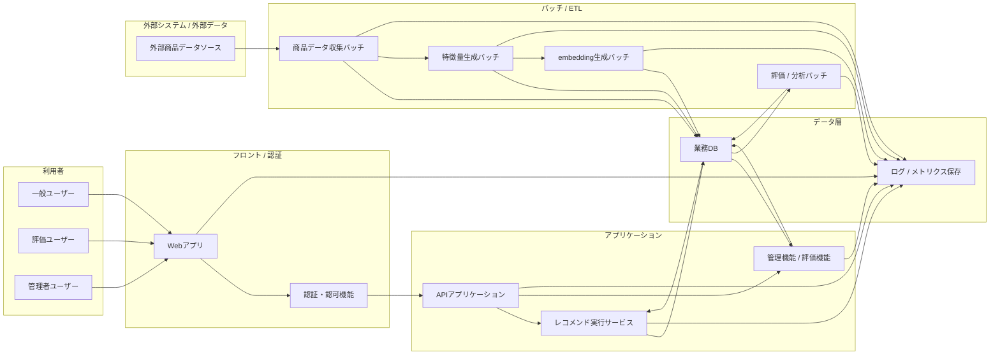

## 1. 全体図（mermaid）

---

## 2. 構成要素の定義

### 2-1. 利用者

| 要素           | 役割                                         |
| -------------- | -------------------------------------------- |
| 一般ユーザー   | レコメンド検索、結果閲覧、フィードバック入力 |
| 評価ユーザー   | 人手評価タスクの確認・評価実施               |
| 管理者ユーザー | 管理機能利用、評価/改善状況確認、運用対応    |

---

### 2-2. フロント / 認証

| 要素           | 役割                                               |
| -------------- | -------------------------------------------------- |
| Webアプリ      | 画面表示、入力受付、画面遷移制御                   |
| 認証・認可機能 | ログイン、セッション管理、ロール判定、アクセス制御 |

---

### 2-3. アプリケーション

| 要素                   | 役割                                           |
| ---------------------- | ---------------------------------------------- |
| APIアプリケーション    | フロントとのIF、業務処理の入口、各サービス呼出 |
| レコメンド実行サービス | 条件解析、意味推定、候補検索、順位付け         |
| 管理機能 / 評価機能    | 人手評価、管理者向け照会、運用系機能           |

---

### 2-4. バッチ / ETL

| 要素                 | 役割                             |
| -------------------- | -------------------------------- |
| 商品データ収集バッチ | 外部商品データ取得、保存         |
| 特徴量生成バッチ     | 商品特徴量生成                   |
| embedding生成バッチ  | 商品検索ベクトル生成             |
| 評価 / 分析バッチ    | オフライン評価、集計、分析系処理 |

---

### 2-5. データ層

| 要素                  | 役割                                             |
| --------------------- | ------------------------------------------------ |
| 業務DB                | 商品、推薦結果、評価、設定、業務データの保持     |
| ログ / メトリクス保存 | 実行ログ、行動ログ、メトリクス、観測データの保持 |

---

### 2-6. 外部システム / 外部データ

| 要素                 | 役割                 |
| -------------------- | -------------------- |
| 外部商品データソース | 商品原データの供給元 |

---

# 3. この構成図で表している責務境界

## 3-1. WebアプリとAPIアプリケーションの境界

**Webアプリ**

- UI責務
- ユーザー入力受付
- 表示制御

**APIアプリケーション**

- 業務処理入口
- 認証後の業務IF提供
- レコメンドサービスや管理機能への中継・制御

---

## 3-2. APIアプリケーションとレコメンド実行サービスの境界

**APIアプリケーション**

- リクエスト受付
- 業務フロー制御
- レスポンス返却

**レコメンド実行サービス**

- 推薦ロジック本体
- 入力条件解析
- User Meaning 推定
- 候補検索
- Matching / Ranking

---

## 3-3. オンライン処理とバッチ処理の境界

**オンライン**

- ユーザー操作に応答
- 推薦結果生成
- 評価入力受付

**バッチ**

- 外部商品データ取得
- 特徴量生成
- embedding生成
- 評価/分析集計

つまり、

**推薦時に必要な商品データは事前準備済みである** 前提です。

---

## 3-4. 業務DBとログ/メトリクス保存の境界

**業務DB**

- 正本データ
- 推薦結果
- 評価結果
- 設定情報

**ログ / メトリクス保存**

- 実行成否ログ
- ユーザー行動ログ
- 処理時間や件数などの観測値

この分離により、

- 業務データ
- 観測データ
  の責務が分かれます。

---

# 4. この図から読み取れる主要処理

## 4-1. 一般ユーザーの推薦利用

1. 一般ユーザーが Webアプリにアクセス
2. 認証・認可機能で認証
3. APIアプリケーションが入力条件を受け付ける
4. レコメンド実行サービスが推薦処理を実行
5. 業務DBの事前準備済み商品データを参照
6. 結果を Webアプリに返す
7. 行動ログはログ/メトリクス保存へ記録

---

## 4-2. 評価ユーザーの人手評価

1. 評価ユーザーが Webアプリにアクセス
2. 認証・認可機能で評価者ロールを確認
3. APIアプリケーション経由で管理機能 / 評価機能を利用
4. 評価対象や評価結果を業務DBへ保存

---

## 4-3. 商品データ準備

1. 外部商品データソースから商品情報取得
2. 商品データ収集バッチで業務DBへ保存
3. 特徴量生成バッチで特徴量生成
4. embedding生成バッチで検索ベクトル生成
5. 推薦可能商品として利用可能化

---

## 4-4. 改善ループ

1. 実行ログ・行動ログ・メトリクスを蓄積
2. 評価 / 分析バッチで分析
3. 改善検討に接続

---

# 5. この図でまだ扱っていないもの

この図は **論理構成図** なので、次はまだ含めていません。

- 実サーバ配置
- Vercel / Render / Fly.io 等の具体デプロイ
- GitHub Actions
- Secrets管理
- ネットワーク境界
- 監視基盤の実装方式
- 認証基盤の具体プロダクト

これらは後続の

- システム詳細構成図
- 基盤構成設計書
- CI/CDパイプライン設計書
- GitHub設定設計書

で扱う想定です。

---

# 6. 後続成果物との関係

| 後続成果物           | この図が効く点                   |
| -------------------- | -------------------------------- |
| システム詳細構成図   | 論理要素を物理/基盤に落とす起点  |
| 基盤構成設計書       | 実行基盤・接続関係の具体化       |
| インターフェース一覧 | 各論理要素間のIF整理             |
| 処理フロー概要図     | 処理の流れの具体化               |
| 認証認可方針書       | 認証・ロール制御の詳細化         |
| バッチ仕様書         | ETL/特徴量/embedding処理の具体化 |
| API仕様書            | Web⇔API⇔Reco の詳細化            |

---

# 7. 一言まとめ

このシステム論理構成図では、

**利用者、Webアプリ、認証・認可、API、レコメンド実行サービス、管理/評価機能、バッチ/ETL、業務DB、ログ/メトリクス保存、外部商品データソース** の責務境界と接続関係を、概要レベルで整理しています。
