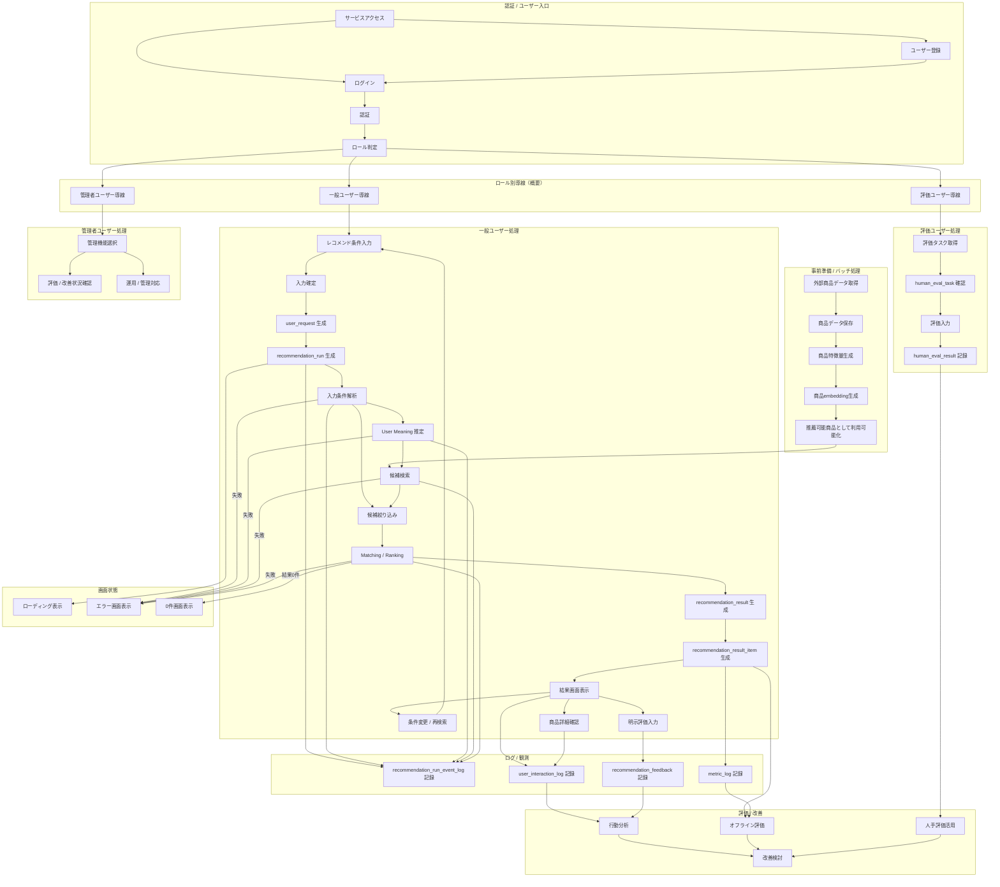

## 1. 全体方針

この処理フロー概要図は、以下を同時に表現することを目的とする。

- ユーザーの主要操作
- レコメンド実行の主処理
- 結果表示までの流れ
- 行動/評価ログの記録
- 商品データ/特徴量の事前準備との接続

---

## 2. 処理フロー概要図（mermaid）

```mermaid
flowchart TB

  %% ========================================
  %% 認証 / ユーザー入口
  %% ========================================
  subgraph AUTH["認証 / ユーザー入口"]
    A1["サービスアクセス"]
    A2["ユーザー登録"]
    A3["ログイン"]
    A4["認証"]
    A5["ロール判定"]
  end

  %% ========================================
  %% ロール別導線（概要）
  %% ========================================
  subgraph ROLE["ロール別導線（概要）"]
    R1["一般ユーザー導線"]
    R2["評価ユーザー導線"]
    R3["管理者ユーザー導線"]
  end

  %% ========================================
  %% 事前準備（バッチ）
  %% ========================================
  subgraph BATCH["事前準備 / バッチ処理"]
    B1["外部商品データ取得"]
    B2["商品データ保存"]
    B3["商品特徴量生成"]
    B4["商品embedding生成"]
    B5["推薦可能商品として利用可能化"]
  end

  %% ========================================
  %% 一般ユーザー処理
  %% ========================================
  subgraph GENERAL["一般ユーザー処理"]
    G1["レコメンド条件入力"]
    G2["入力確定"]
    G3["user_request 生成"]
    G4["recommendation_run 生成"]
    G5["入力条件解析"]
    G6["User Meaning 推定"]
    G7["候補検索"]
    G8["候補絞り込み"]
    G9["Matching / Ranking"]
    G10["recommendation_result 生成"]
    G11["recommendation_result_item 生成"]
    G12["結果画面表示"]
    G13["商品詳細確認"]
    G14["明示評価入力"]
    G15["条件変更 / 再検索"]
  end

  %% ========================================
  %% 評価ユーザー処理
  %% ========================================
  subgraph EVALUATOR["評価ユーザー処理"]
    E1["評価タスク取得"]
    E2["human_eval_task 確認"]
    E3["評価入力"]
    E4["human_eval_result 記録"]
  end

  %% ========================================
  %% 管理者ユーザー処理
  %% ========================================
  subgraph ADMIN["管理者ユーザー処理"]
    M1["管理機能選択"]
    M2["評価 / 改善状況確認"]
    M3["運用 / 管理対応"]
  end

  %% ========================================
  %% 画面状態
  %% ========================================
  subgraph UI["画面状態"]
    U1["ローディング表示"]
    U2["エラー画面表示"]
    U3["0件画面表示"]
  end

  %% ========================================
  %% ログ / 観測
  %% ========================================
  subgraph LOG["ログ / 観測"]
    L1["recommendation_run_event_log 記録"]
    L2["user_interaction_log 記録"]
    L3["recommendation_feedback 記録"]
    L4["metric_log 記録"]
  end

  %% ========================================
  %% 評価 / 改善
  %% ========================================
  subgraph IMPROVE["評価 / 改善"]
    I1["行動分析"]
    I2["オフライン評価"]
    I3["人手評価活用"]
    I4["改善検討"]
  end

  %% ========================================
  %% 認証フロー
  %% ========================================
  A1 --> A3
  A1 --> A2
  A2 --> A3
  A3 --> A4
  A4 --> A5

  %% ロール分岐
  A5 --> R1
  A5 --> R2
  A5 --> R3

  %% ========================================
  %% バッチフロー
  %% ========================================
  B1 --> B2
  B2 --> B3
  B3 --> B4
  B4 --> B5

  %% ========================================
  %% 一般ユーザー導線
  %% ========================================
  R1 --> G1
  G1 --> G2
  G2 --> G3
  G3 --> G4
  G4 --> U1

  G4 --> G5
  G5 --> G6
  B5 --> G7
  G6 --> G7
  G5 --> G8
  G7 --> G8
  G8 --> G9
  G9 --> G10
  G10 --> G11
  G11 --> G12
  G12 --> G13
  G12 --> G14
  G12 --> G15
  G15 --> G1

  %% 一般ユーザー例外
  G5 -->|失敗| U2
  G6 -->|失敗| U2
  G7 -->|失敗| U2
  G9 -->|失敗| U2
  G9 -->|結果0件| U3

  %% ========================================
  %% 評価ユーザー導線
  %% ========================================
  R2 --> E1
  E1 --> E2
  E2 --> E3
  E3 --> E4

  %% ========================================
  %% 管理者導線
  %% ========================================
  R3 --> M1
  M1 --> M2
  M1 --> M3

  %% ========================================
  %% ログ接続
  %% ========================================
  G4 --> L1
  G5 --> L1
  G6 --> L1
  G7 --> L1
  G9 --> L1

  G11 --> L4
  G12 --> L2
  G13 --> L2
  G14 --> L3

  E4 --> I3

  %% ========================================
  %% 改善接続
  %% ========================================
  L2 --> I1
  L3 --> I1
  G11 --> I2
  L4 --> I2
  I1 --> I4
  I2 --> I4
  I3 --> I4
```
