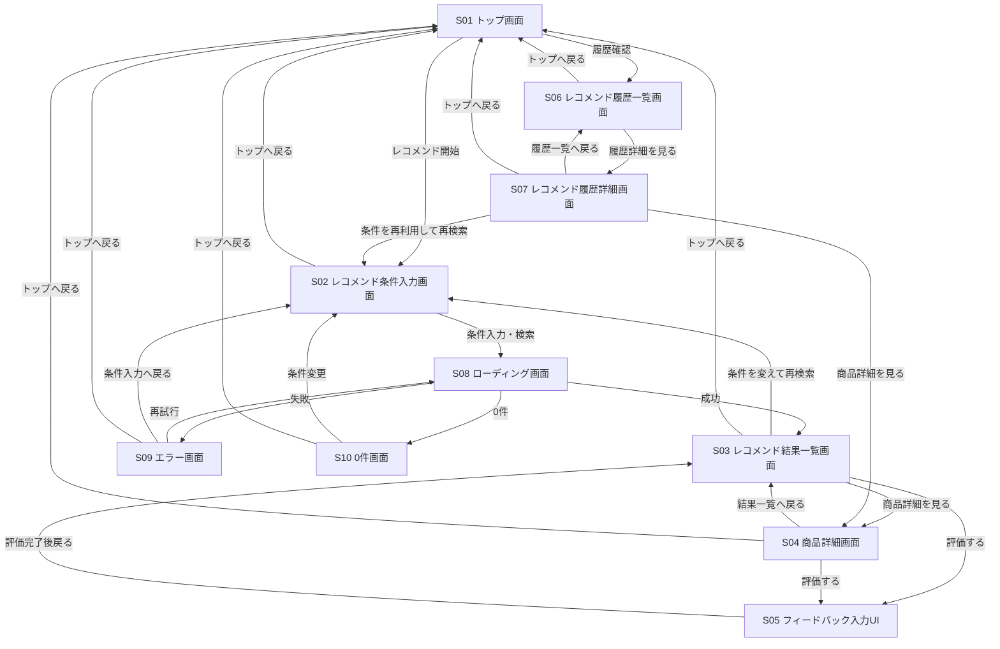
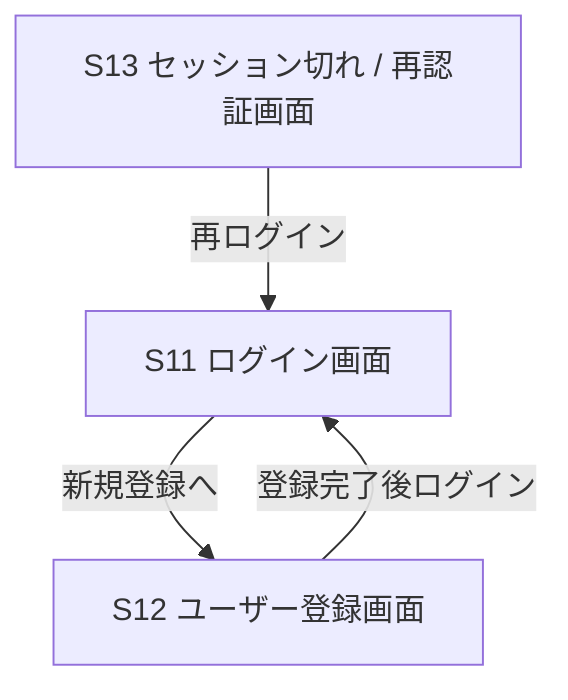
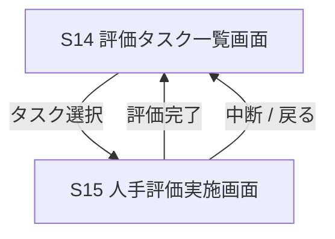
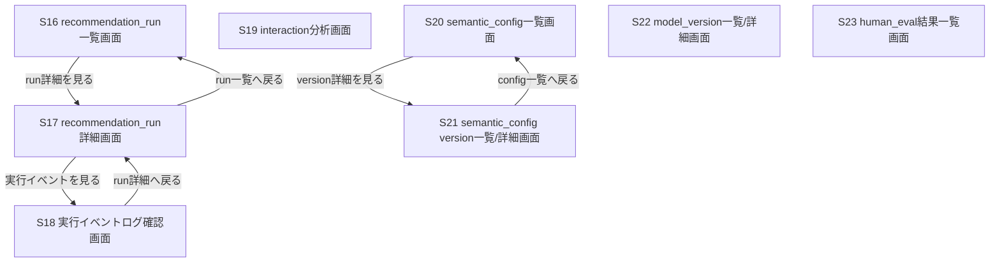
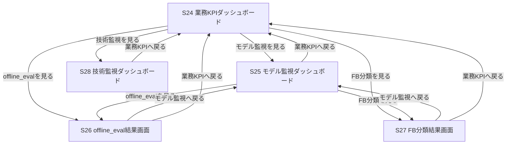
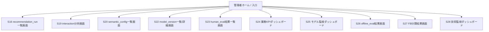

## 画面遷移図（全体）

```mermaid
flowchart TB

  %% ========================================
  %% 未認証 / 認証導線
  %% ========================================
  subgraph AUTH["未認証 / 認証導線"]
    A1["S11 ログイン画面"]
    A2["S12 ユーザー登録画面"]
    A3["S13 セッション切れ / 再認証画面"]
  end

  %% ========================================
  %% 一般ユーザー導線
  %% ========================================
  subgraph GENERAL["一般ユーザー導線"]
    G1["S01 トップ画面"]
    G2["S02 レコメンド条件入力画面"]
    G3["S08 ローディング画面"]
    G4["S03 レコメンド結果一覧画面"]
    G5["S04 商品詳細画面"]
    G6["S05 フィードバック入力UI"]
    G7["S06 レコメンド履歴一覧画面"]
    G8["S07 レコメンド履歴詳細画面"]
    G9["S09 エラー画面"]
    G10["S10 0件画面"]
  end

  %% ========================================
  %% 評価者導線
  %% ========================================
  subgraph EVALUATOR["評価者導線"]
    E1["S14 評価タスク一覧画面"]
    E2["S15 人手評価実施画面"]
  end

  %% ========================================
  %% 管理者導線
  %% ========================================
  subgraph ADMIN["管理者導線"]
    M1["S16 recommendation_run一覧画面"]
    M2["S17 recommendation_run詳細画面"]
    M3["S18 実行イベントログ確認画面"]
    M4["S19 interaction分析画面"]
    M5["S20 semantic_config一覧画面"]
    M6["S21 semantic_config version一覧/詳細画面"]
    M7["S22 model_version一覧/詳細画面"]
    M8["S23 human_eval結果一覧画面"]
  end

  %% ========================================
  %% ダッシュボード導線
  %% ========================================
  subgraph DASHBOARD["ダッシュボード導線"]
    D1["S24 業務KPIダッシュボード"]
    D2["S25 モデル監視ダッシュボード"]
    D3["S26 offline_eval結果画面"]
    D4["S27 FB分類結果画面"]
    D5["S28 技術監視ダッシュボード"]
  end

  %% ========================================
  %% 認証導線
  %% ========================================
  A1 -->|"新規登録へ"| A2
  A2 -->|"登録完了後ログイン"| A1
  A3 -->|"再ログイン"| A1

  %% ========================================
  %% ロール別分岐
  %% ========================================
  A1 -->|"一般ユーザー"| G1
  A1 -->|"評価者"| E1
  A1 -->|"管理者"| D1

  %% ========================================
  %% 一般ユーザー遷移
  %% ========================================
  G1 -->|"レコメンド開始"| G2
  G1 -->|"レコメンド履歴"| G7

  G2 -->|"条件入力・検索"| G3
  G2 -->|"トップへ戻る"| G1

  G3 -->|"成功"| G4
  G3 -->|"失敗"| G9
  G3 -->|"0件"| G10

  G4 -->|"商品詳細を見る"| G5
  G4 -->|"評価する"| G6
  G4 -->|"条件を変えて再検索"| G2
  G4 -->|"トップへ戻る"| G1

  G5 -->|"結果一覧へ戻る"| G4
  G5 -->|"評価する"| G6
  G5 -->|"トップへ戻る"| G1

  G6 -->|"評価完了後戻る"| G4

  G7 -->|"履歴詳細を見る"| G8
  G7 -->|"トップへ戻る"| G1

  G8 -->|"商品詳細を見る"| G5
  G8 -->|"履歴一覧へ戻る"| G7
  G8 -->|"条件を再利用して再検索"| G2
  G8 -->|"トップへ戻る"| G1

  G9 -->|"再試行"| G3
  G9 -->|"条件入力へ戻る"| G2
  G9 -->|"トップへ戻る"| G1

  G10 -->|"条件変更"| G2
  G10 -->|"トップへ戻る"| G1

  %% ========================================
  %% 評価者遷移
  %% ========================================
  E1 -->|"タスク選択"| E2
  E2 -->|"評価完了"| E1
  E2 -->|"中断 / 戻る"| E1

  %% ========================================
  %% 管理者・ダッシュボード遷移
  %% ========================================
  D1 -->|"run一覧を見る"| M1
  D1 -->|"モデル監視を見る"| D2
  D1 -->|"offline_evalを見る"| D3
  D1 -->|"FB分類を見る"| D4
  D1 -->|"技術監視を見る"| D5
  D1 -->|"semantic_config管理"| M5
  D1 -->|"model_version管理"| M7
  D1 -->|"human_eval結果を見る"| M8
  D1 -->|"interaction分析を見る"| M4

  M1 -->|"run詳細を見る"| M2
  M1 -->|"業務KPIへ戻る"| D1

  M2 -->|"実行イベントを見る"| M3
  M2 -->|"run一覧へ戻る"| M1
  M2 -->|"業務KPIへ戻る"| D1

  M3 -->|"run詳細へ戻る"| M2
  M3 -->|"技術監視へ遷移"| D5

  M4 -->|"業務KPIへ戻る"| D1

  M5 -->|"version詳細を見る"| M6
  M5 -->|"業務KPIへ戻る"| D1

  M6 -->|"config一覧へ戻る"| M5

  M7 -->|"業務KPIへ戻る"| D1

  M8 -->|"評価タスク状況を確認"| E1
  M8 -->|"業務KPIへ戻る"| D1

  D2 -->|"offline_evalを見る"| D3
  D2 -->|"FB分類を見る"| D4
  D2 -->|"業務KPIへ戻る"| D1

  D3 -->|"モデル監視へ戻る"| D2
  D3 -->|"業務KPIへ戻る"| D1

  D4 -->|"モデル監視へ戻る"| D2
  D4 -->|"業務KPIへ戻る"| D1

  D5 -->|"業務KPIへ戻る"| D1

  %% ========================================
  %% セッション切れ（共通）
  %% ========================================
  G1 -. セッション切れ .-> A3
  G2 -. セッション切れ .-> A3
  G4 -. セッション切れ .-> A3
  G5 -. セッション切れ .-> A3
  G6 -. セッション切れ .-> A3
  G7 -. セッション切れ .-> A3
  G8 -. セッション切れ .-> A3
  E1 -. セッション切れ .-> A3
  E2 -. セッション切れ .-> A3
  M1 -. セッション切れ .-> A3
  M2 -. セッション切れ .-> A3
  M3 -. セッション切れ .-> A3
  M4 -. セッション切れ .-> A3
  M5 -. セッション切れ .-> A3
  M6 -. セッション切れ .-> A3
  M7 -. セッション切れ .-> A3
  M8 -. セッション切れ .-> A3
  D1 -. セッション切れ .-> A3
  D2 -. セッション切れ .-> A3
  D3 -. セッション切れ .-> A3
  D4 -. セッション切れ .-> A3
  D5 -. セッション切れ .-> A3
```

## 画面遷移図（一般ユーザー導線）

```mermaid
flowchart TB

  U1["S01 トップ画面"]
  U2["S02 レコメンド条件入力画面"]
  U3["S08 ローディング画面"]
  U4["S03 レコメンド結果一覧画面"]
  U5["S04 商品詳細画面"]
  U6["S05 フィードバック入力UI"]
  U7["S06 レコメンド履歴一覧画面"]
  U8["S07 レコメンド履歴詳細画面"]
  U9["S09 エラー画面"]
  U10["S10 0件画面"]

  U1 -->|"レコメンド開始"| U2
  U1 -->|"履歴確認"| U7

  U2 -->|"条件入力・検索"| U3
  U2 -->|"トップへ戻る"| U1

  U3 -->|"成功"| U4
  U3 -->|"失敗"| U9
  U3 -->|"0件"| U10

  U4 -->|"商品詳細を見る"| U5
  U4 -->|"評価する"| U6
  U4 -->|"条件を変えて再検索"| U2
  U4 -->|"トップへ戻る"| U1

  U5 -->|"結果一覧へ戻る"| U4
  U5 -->|"評価する"| U6
  U5 -->|"トップへ戻る"| U1

  U6 -->|"評価完了後戻る"| U4

  U7 -->|"履歴詳細を見る"| U8
  U7 -->|"トップへ戻る"| U1

  U8 -->|"商品詳細を見る"| U5
  U8 -->|"履歴一覧へ戻る"| U7
  U8 -->|"条件を再利用して再検索"| U2
  U8 -->|"トップへ戻る"| U1

  U9 -->|"再試行"| U3
  U9 -->|"条件入力へ戻る"| U2
  U9 -->|"トップへ戻る"| U1

  U10 -->|"条件変更"| U2
  U10 -->|"トップへ戻る"| U1
```

## 画面遷移図（認証導線）

```mermaid
flowchart TB

  A1["S11 ログイン画面"]
  A2["S12 ユーザー登録画面"]
  A3["S13 セッション切れ / 再認証画面"]

  A1 -->|"新規登録へ"| A2
  A2 -->|"登録完了後ログイン"| A1
  A3 -->|"再ログイン"| A1
```

## 画面遷移図（評価者導線）

```mermaid
flowchart TB

  E1["S14 評価タスク一覧画面"]
  E2["S15 人手評価実施画面"]

  E1 -->|"タスク選択"| E2
  E2 -->|"評価完了"| E1
  E2 -->|"中断 / 戻る"| E1
```

## 画面遷移図（管理者導線）

```mermaid
flowchart TB

  M1["S16 recommendation_run一覧画面"]
  M2["S17 recommendation_run詳細画面"]
  M3["S18 実行イベントログ確認画面"]
  M4["S19 interaction分析画面"]
  M5["S20 semantic_config一覧画面"]
  M6["S21 semantic_config version一覧/詳細画面"]
  M7["S22 model_version一覧/詳細画面"]
  M8["S23 human_eval結果一覧画面"]

  M1 -->|"run詳細を見る"| M2
  M2 -->|"実行イベントを見る"| M3
  M2 -->|"run一覧へ戻る"| M1
  M3 -->|"run詳細へ戻る"| M2

  M5 -->|"version詳細を見る"| M6
  M6 -->|"config一覧へ戻る"| M5
```

## 画面遷移図（管理者導線（ダッシュボード））

```mermaid
flowchart TB

  D1["S24 業務KPIダッシュボード"]
  D2["S25 モデル監視ダッシュボード"]
  D3["S26 offline_eval結果画面"]
  D4["S27 FB分類結果画面"]
  D5["S28 技術監視ダッシュボード"]

  D1 -->|"モデル監視を見る"| D2
  D1 -->|"offline_evalを見る"| D3
  D1 -->|"FB分類を見る"| D4
  D1 -->|"技術監視を見る"| D5

  D2 -->|"offline_evalを見る"| D3
  D2 -->|"FB分類を見る"| D4
  D2 -->|"業務KPIへ戻る"| D1

  D3 -->|"モデル監視へ戻る"| D2
  D3 -->|"業務KPIへ戻る"| D1

  D4 -->|"モデル監視へ戻る"| D2
  D4 -->|"業務KPIへ戻る"| D1

  D5 -->|"業務KPIへ戻る"| D1
```

## ※管理者トップからの全体導線

```mermaid
flowchart TB

  T1["管理者ホーム / 入口"]
  T2["S16 recommendation_run一覧画面"]
  T3["S19 interaction分析画面"]
  T4["S20 semantic_config一覧画面"]
  T5["S22 model_version一覧/詳細画面"]
  T6["S23 human_eval結果一覧画面"]
  T7["S24 業務KPIダッシュボード"]
  T8["S25 モデル監視ダッシュボード"]
  T9["S26 offline_eval結果画面"]
  T10["S27 FB分類結果画面"]
  T11["S28 技術監視ダッシュボード"]

  T1 --> T2
  T1 --> T3
  T1 --> T4
  T1 --> T5
  T1 --> T6
  T1 --> T7
  T1 --> T8
  T1 --> T9
  T1 --> T10
  T1 --> T11
```
