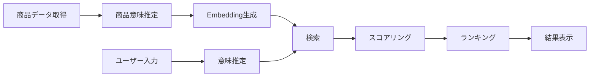

# MVP対象機能一覧

## 1. 概要

### 1.1 目的

本ドキュメントは、機能要件のうちMVPで実装対象とする機能を定義する。
価値仮説「意味で選べるか」を最小構成で検証することを目的とする。

## 2. MVP選定方針

### 2.1 基本方針

- 仮説検証に必要な最小機能のみ実装
- コア価値（意味推定・意味比較）に集中

## 3. MVP対象機能一覧

### 3.1 対象機能

| 機能ID | 機能名             | 区分 | 概要               |
| ------ | ------------------ | ---- | ------------------ |
| F01    | レコメンド条件入力 | OL   | ユーザー条件入力   |
| F02    | 意味推定           | OL   | User Meaning生成   |
| F03    | 商品検索           | OL   | 候補商品取得       |
| F04    | 意味スコアリング   | OL   | 意味一致度算出     |
| F05    | ランキング         | OL   | 順位付け           |
| F06    | 結果表示           | OL   | 商品・スコア表示   |
| F07    | フィードバック取得 | OL   | ユーザー評価収集   |
| F08    | ログ記録           | OL   | 行動・処理ログ記録 |
| F09    | 商品データ取得     | BT   | 外部データ取得     |
| F10    | 商品意味推定       | BT   | Item Meaning生成   |
| F11    | 商品Embedding生成  | BT   | 検索用ベクトル生成 |

## 4. 補助機能（優先度低）

| 機能ID | 機能名         | 備考             |
| ------ | -------------- | ---------------- |
| UC08   | レコメンド履歴 | 余力があれば実装 |
| UC09   | 人手評価取得   | 精度検証フェーズ |
| UC10   | 人手評価実施   | 精度検証フェーズ |

---

## 5. 処理区分

### 5.1 Online（OL）

- ユーザー操作に応じてリアルタイム実行

対象：

- F01〜F08

### 5.2 Batch（BT）

- 非同期で実行されるデータ処理

対象：

- F09〜F11

## 6. MVP構成

## 7. 成功条件

### 7.1 検証観点

- 意味で比較できるか
- 意思決定ができるか

### 7.2 KPI

- CTR向上
- CVR向上
- 意思決定時間短縮

## 8. 補足

- 対象外機能・制約は別ドキュメント[制約・対象外一覧.md](./（未作成）制約・対象外一覧.md)に定義する
