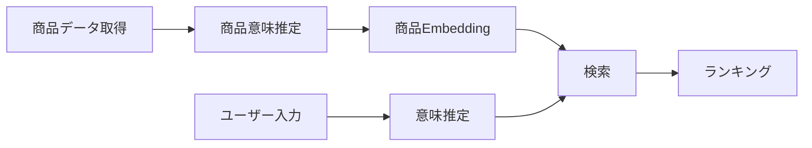

# 機能要件定義書

## 1. 概要

### 1.1 目的

本サービスの機能要件を定義し、設計・開発・テストの基準とする。

### 1.2 前提

- ユーザーは「意味（Social × Symbolic）」でギフト選択を行いたい
- 意味を可視化することで意思決定が可能になる
- MVPでは「意味で選べるか」の検証に特化する

## 2. システム概要

### 2.1 提供機能概要



## 3. 機能一覧

### 3.1 機能分類

| 分類                         | 説明                           |
| ---------------------------- | ------------------------------ |
| 入力機能                     | ユーザー条件入力               |
| ユーザーコンテキスト推定機能 | ユーザーコンテキスト特徴量生成 |
| 検索機能                     | 商品候補取得                   |
| 評価機能                     | 一致度・スコア算出             |
| 出力機能                     | 結果表示                       |
| 記録機能                     | ログ・メトリクス               |
| 商品データ取得機能           | 外部ECサイトの商品データを取得 |
| 商品意味推定                 | 商品意味特徴量推定             |

## 4. 機能要件詳細

## F01 レコメンド条件入力

### 概要

ユーザーがギフト条件を入力する

### 対応ユースケース

- UC01

### 入力

- relationship（関係性）
- occasion（用途）
- 好み条件（任意）
- 避けたい条件（任意）
- NG条件（任意）

### 出力

- user_request

### 仕様

- 入力必須項目のバリデーション
- 不正入力時はエラー表示

## F02 意味推定

### 概要

入力情報からUser Meaningを生成

### 対応ユースケース

- UC02

### 入力

- user_request

### 出力

- user_feature_normalized
- user_meaning_projection
- λ_ctx

### 処理

- Semantic Concept変換
- Feature生成
- 正規化
- Social / Symbolic射影

### 関連概念

- semantic_config_version

## F03 商品検索（Retrieval）

### 概要

候補商品を抽出

### 入力

- preferred_embedding
- non_preferred_embedding

### 出力

- candidate_item

### 仕様

- recall重視
- embeddingベース検索

## F04 意味スコアリング（Matching）

### 概要

UserとItemの意味一致度を算出

### 入力

- user_feature_normalized
- item_feature_normalized

### 出力

- social_match
- symbolic_match
- context_score

### 処理

- feature_distance算出
- 一致度変換
- Social / Symbolic集約

## F05 ランキング

### 概要

商品を順位付け

### 入力

- context_score
- popularity_score
- risk_score

### 出力

- final_score

### 計算式（MVP）

```

final_score = symbolic × social - risk

```

### 関連概念

- model_version

## F06 結果表示

### 概要

レコメンド結果を表示

### 対応ユースケース

- UC03, UC04, UC05

### 出力

- 商品一覧
- 意味スコア
- 特徴情報

### 仕様

- 空結果時はempty表示

## F07 フィードバック取得

### 概要

ユーザー評価を収集

### 対応ユースケース

- UC06

### 入力

- 評価（良い / 微妙）

### 出力

- recommendation_feedback

---

## F08 ログ記録

### 概要

システムログ・行動ログを記録

### 対応ユースケース

- UC11, UC12, UC13

### 記録対象

- recommendation_run
- view_log
- click_log
- metric_log

## F09 商品データ取得

### 概要

外部APIから商品情報を取得し、システム内に取り込む

### 入力

- APIリクエスト条件（カテゴリ、キーワード等）

### 出力

- item_signal

### 処理

- 外部API（楽天等）呼び出し
- JSONデータ取得
- 生データ保存（raw）

### 備考

- データソースは外部依存
- バッチ処理（BT）

## F10 商品意味推定（Item Meaning生成）

### 概要

商品情報から意味特徴量を生成

### 入力

- item_signal

### 出力

- item_feature_raw
- item_feature_normalized
- item_meaning_projection

### 処理

- テキスト解析（商品名・説明）
- Semantic Concept抽出
- Feature変換
- 正規化
- Social / Symbolic射影

### 関連概念

- semantic_config_version

### 区分

- バッチ処理（BT）

## F11 商品Embedding生成

### 概要

商品検索用のEmbeddingを生成

### 入力

- item_context

### 出力

- item_embedding

### 処理

- 商品テキスト統合
- Embedding生成（OpenAI等）

### 用途

- Retrievalで使用

### 区分

- バッチ処理（BT）

## 5. 非機能境界（MVP）

### 対象外

- 決済機能
- ユーザー管理
- 高精度モデル
- UI最適化

## 6. データ入出力

### 入力

- ユーザー条件
- 商品データ（外部API）

### 出力

- レコメンド結果
- ログ・メトリクス

## 7. 処理区分（OL/BT）

| 処理             | 区分 |
| ---------------- | ---- |
| レコメンド実行   | OL   |
| ログ記録         | OL   |
| 分布統計計算     | BT   |
| モデル更新       | BT   |
| 商品データ前処理 | BT   |

## 8. 成功条件

### KPI

- CTR向上
- CVR向上
- 意思決定時間短縮

## 9. 制約条件

- Featureは8次元固定
- MVPでは精度より検証優先
- 外部データ依存あり
