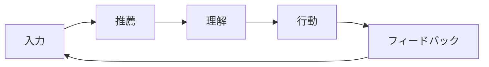

## 1. 目的

本ドキュメントは、本サービスにおけるユーザー体験（UX）の要件を定義し、

- ユーザーが意図を適切に入力できること
- 推薦結果を納得感をもって理解できること
- 行動・評価が自然に取得できること
- 改善ループに接続できること

を実現することを目的とする。

---

## 2. UX設計の基本思想（最重要）

```
・「検索」ではなく「意味入力」
・「結果提示」ではなく「納得できる推薦」
・「評価させる」ではなく「自然に行動を取らせる」
・「一発正解」ではなく「反復改善」
```

---

## 3. UX全体フロー



---

## 4. UX構成要素

| フェーズ         | 役割                    |
| ---------------- | ----------------------- |
| 入力UX           | 意図を正しく引き出す    |
| 推薦UX           | 適切に提示する          |
| 理解UX           | 納得感を与える          |
| 行動UX           | interactionを自然に取得 |
| フィードバックUX | 改善ループへ接続        |

---

# 5. 入力UX要件

---

## 5.1 目的

```
ユーザーの「曖昧な意図」を構造化する
```

---

## 5.2 入力要素

| 種類 | 内容                    |
| ---- | ----------------------- |
| 必須 | relationship / occasion |
| 条件 | budget                  |
| 任意 | 好み（free text）       |
| 任意 | NG条件                  |

---

## 5.3 UX要件

```
・入力は段階的に行う（分割UI）
・自由入力はサポート（例示・補完）
・ユーザーに考えさせすぎない
```

---

## 5.4 NG

```
・一度に全入力を強制
・専門用語を使わせる
```

---

# 6. 推薦UX要件

---

## 6.1 目的

```
意味に沿った商品を提示する
```

---

## 6.2 要件

| 項目     | 内容                 |
| -------- | -------------------- |
| 表示件数 | top_k（例：10件）    |
| 並び順   | スコア順             |
| 多様性   | MMRで担保            |
| 空結果   | 禁止（fallback必須） |

---

## 6.3 UX方針

```
・「選択肢」を提示する
・偏りすぎない
・必ず何か返す
```

---

# 7. 理解UX要件（重要）

---

## 7.1 目的

```
なぜこの商品が出たか理解できること
```

---

## 7.2 要件

| 項目         | 内容 |
| ------------ | ---- |
| 説明表示     | 必須 |
| 特徴可視化   | 推奨 |
| 意味の言語化 | 必須 |

---

## 7.3 表示例

```
・上司への誕生日に適した「フォーマルで安心感のあるギフト」
・特別感を演出できるストーリー性のある商品
```

---

## 7.4 理由

👉 ブラックボックス化防止

👉 trust向上

👉 フィードバック精度向上

---

# 8. 行動UX要件（interaction設計）

---

## 8.1 目的

```
自然な行動から評価データを取得する
```

---

## 8.2 取得対象

| 行動     | 必須 |
| -------- | ---- |
| click    | 必須 |
| favorite | 推奨 |
| purchase | 将来 |

---

## 8.3 UX要件

```
・クリックは自然発生させる
・お気に入りは簡単に
・評価を強制しない
```

---

# 9. フィードバックUX要件

---

## 9.1 目的

```
評価 → 改善ループに接続する
```

---

## 9.2 種類

| 種類   | 内容             |
| ------ | ---------------- |
| 明示的 | 良い / 悪い      |
| 暗黙的 | click / favorite |

---

## 9.3 要件

```
・簡単に評価できる
・理由入力は任意
・行動ログを優先利用
```

---

## 9.4 FB分類との接続

```
評価 → FB分類 → 修正箇所特定
```

---

# 10. 反復UX（重要）

---

## 10.1 目的

```
一発で決めるのではなく、徐々に精度を上げる
```

---

## 10.2 要件

| 項目     | 内容         |
| -------- | ------------ |
| 再検索   | 簡単にできる |
| 条件変更 | すぐ反映     |
| 履歴     | 保存         |

---

---

# 11. レスポンスUX要件

---

## 11.1 時間

| 指標 | 要件  |
| ---- | ----- |
| p50  | < 1秒 |
| p95  | < 3秒 |

---

## 11.2 ローディング

```
・スピナー表示
・処理中であることを明示
```

---

# 12. エラーUX要件

---

## 12.1 方針

```
・内部エラーは見せない
・代替結果を返す
```

---

## 12.2 表示

| ケース     | 表示         |
| ---------- | ------------ |
| fallback   | 通常表示     |
| 致命エラー | リトライ案内 |

---

---

# 13. 管理UX要件

---

## 13.1 対象

| 機能       | 内容            |
| ---------- | --------------- |
| config管理 | semantic_config |
| model管理  | version         |
| 評価       | human_eval      |

---

## 13.2 要件

```
・変更履歴可視化
・影響範囲把握
・比較可能
```

---

# 14. 観測UX要件（内部）

---

## 14.1 ダッシュボード

| 種類   | 内容           |
| ------ | -------------- |
| 技術   | latency, error |
| 業務   | CTR, success   |
| モデル | 分布           |

---

## 14.2 要件

```
・即座に異常が分かる
・原因を追える
```

---

# 15. モバイル対応

---

## 要件

```
・スマホで操作可能
・入力簡略化
```

---

# 16. MVP方針

---

## MVP

```
・シンプルUI
・入力最小化
・説明は簡易
```

---

## 将来

```
・説明強化
・可視化強化
・パーソナライズUI
```

---

# 17. 設計原則まとめ

```
・入力は簡単に
・推薦は納得感を
・行動は自然に
・評価は軽く
・改善は継続的に
```

---

# 18. 一言まとめ

```
本サービスのUXは、
「意味を入力し、納得して選び、自然に改善される体験」
である
```
