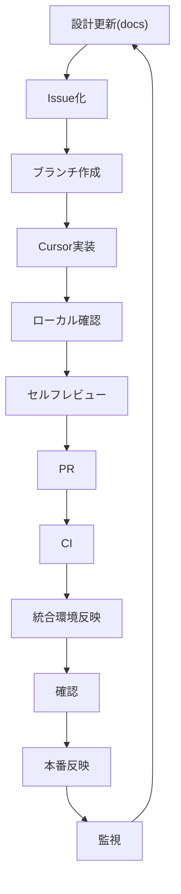

## 1. 目的

本方針書は、Gift Recommendation Service の MVP開発〜運用を、

**個人開発 × AIエージェント（Cursor中心）前提で持続可能に推進するDevOps方針**を定義するものである。

本プロジェクトは設計工程（論理設計〜非機能設計）まで完了しており、以降の目的は以下とする：

- 開発を成立させる
- 開発スピードを最大化する
- 品質を破綻させない
- 将来のチーム開発へ拡張可能な構造を維持する

---

## 2. 前提

| 項目         | 内容                          |
| ------------ | ----------------------------- |
| 開発体制     | 個人開発                      |
| 設計主体     | ChatGPT（レビュー・整理）     |
| 実装主体     | Cursor（主）                  |
| 正本         | repo内docs                    |
| 副本         | Notion                        |
| 開発方針     | MVP高速開発                   |
| システム構成 | Web / API / Reco / Batch 分離 |
| 非機能       | Observability設計済           |

---

## 3. DevOps基本思想

---

### 3.1 基本原則

- 開発速度を最優先とする
- 「壊れない最小構成」を維持する
- **AIを主開発主体として設計する**
- 人間は最終判断者とする
- 作業ではなく「仕組み」で回す
- **docs正本を唯一の真実とする**

---

### 3.2 事実と推論

### 事実

- 個人開発では工程分業不可
- AIは高速だが整合保証はしない
- 実装設計以降は複数ドキュメント整合が必須

### 推論

👉

**「repo内正本 × AIエージェント横断参照前提のDevOps」が必要**

---

# 4. 開発プロセス全体像

---

# 5. フェーズ別方針（改訂）

---

## 5.1 設計フェーズ

### 変更点（重要）

👉 ChatGPT中心 → **Cursor + docs正本中心へ移行**

---

### 実施内容

- docs（repo内）を正本として設計更新
- Cursorで関連設計書を横断参照
- ChatGPTはレビュー・補助に使用

---

### 設計確定基準

- 入出力明確
- データ責務明確
- 依存関係明確
- エラーパターン定義済
- 参照設計書と整合

---

### AI活用

| 項目         | 担当             |
| ------------ | ---------------- |
| 構造設計     | Cursor + ChatGPT |
| 整合チェック | Cursor           |
| レビュー     | ChatGPT          |
| 最終判断     | 人間             |

---

## 5.2 実装フェーズ

---

### 方針

- **Cursor主導**
- docsを入力として実装
- ファイル横断参照前提

---

### ルール（強化）

- 設計書未参照で実装禁止
- docs更新とコード更新を同一PRで行う
- 1変更1目的
- 暗黙仕様禁止

---

### AI活用

| 項目         | 担当    |
| ------------ | ------- |
| 実装         | Cursor  |
| リファクタ   | Cursor  |
| ロジック判断 | 人間    |
| 補助レビュー | ChatGPT |

---

## 5.3 テストフェーズ

（変更なし＋補強）

---

### 方針

- 重点テスト
- Observability確認必須

---

### 追加（重要）

- **Observability成立をテスト対象に含める**
- runIdトレース確認
- 分布確認可能性

---

## 5.4 リリースフェーズ

---

### 方針

- 小さく頻繁に
- Observability確認後に完了

---

### 追加チェック

- メトリクス出力確認
- 分布確認可能
- ログ追跡可能

---

## 5.5 運用フェーズ

---

### 方針

- 軽量運用
- 改善可能性重視

---

### 監視レイヤ

- System
- Application
- Business
- Model

---

# 6. 課題管理 / バグ管理

（基本維持）

---

## 変更点

👉 docs連携を追加

---

### 追加ルール

- Issueは必ずdocsと紐づける
- 設計変更はdocs更新必須

---

# 7. AI活用方針（改訂）

---

## 7.1 基本原則

- AIは実装主体
- docsが入力
- 人間が最終責任

---

## 7.2 役割分担（更新）

| 領域   | ChatGPT | Cursor | 人間 |
| ------ | ------- | ------ | ---- |
| 設計   | ○       | ◎      | ◎    |
| 実装   | △       | ◎      | ◎    |
| テスト | ○       | ◎      | ◎    |
| 判断   | ×       | ×      | ◎    |

---

## 7.3 新ルール（重要）

- docs未参照で生成禁止
- 複数ファイル参照を前提にする
- AGENTS.mdを必ず読む

---

# 8. 手動 / 自動

（変更なし）

---

# 9. 品質保証（補強）

---

## 追加

- Observability成立を品質要件に追加

---

## 必須ゲート（更新）

- build
- test
- API確認
- **runId追跡可能**
- **メトリクス出力**
- **分布確認可能**

---

# 10. 開発ルール（強化）

---

## 追加

- docs正本更新必須
- 設計書とコードの乖離禁止
- 参照設計書明示

---

# 11. リリースフロー（維持）

---

# 12. 将来拡張

---

## 追加

- AIエージェント強化（rules拡張）
- docs自動検証
- 自動レビュー

---

# 13. 結論

👉

**「Cursor主導 × docs正本 × AI横断参照」による高速かつ整合性のあるDevOps」**

---

# 14. 一言まとめ

👉

**「AIに任せるのではなく、正本を読ませて制御するDevOps」**

---

# 重要な補足（あなた向け）

今回の修正の本質はここです：

- 旧：ChatGPT中心 → 手動同期
- 新：**repo docs中心 → AIが読む**
