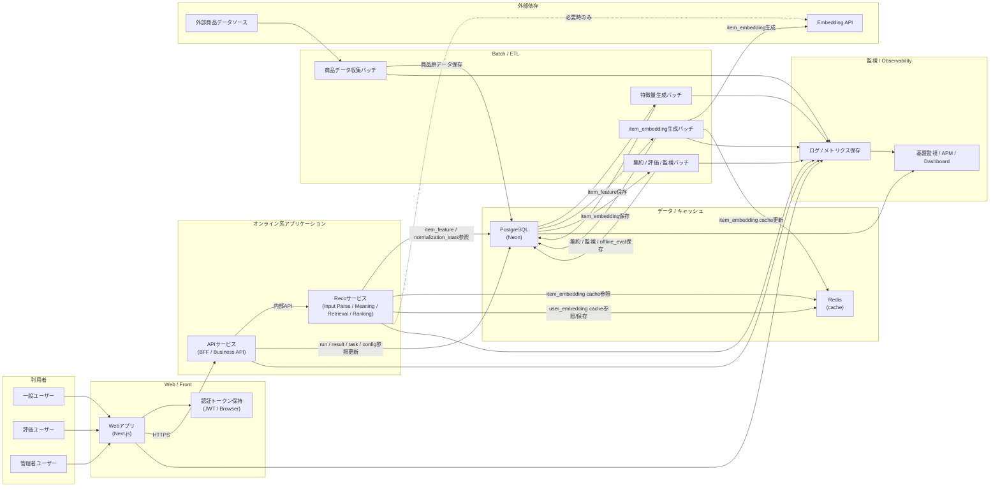
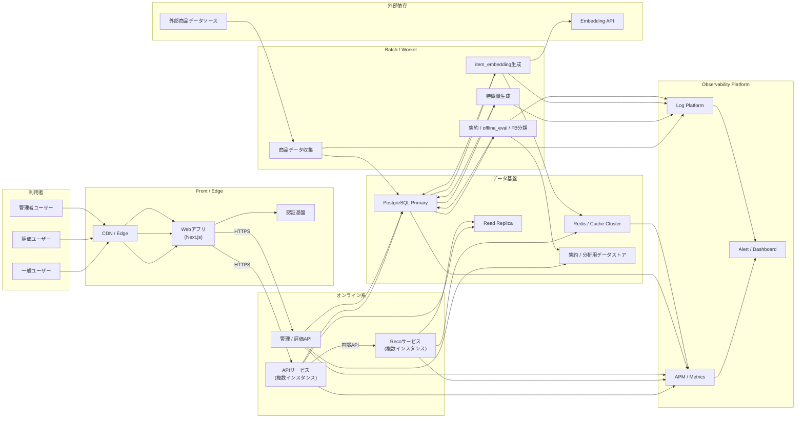

## 1. MVP構成図



---

## 2. MVP構成の補足

### 2.1 役割

- **Webアプリ**: 画面表示、入力受付、JWT保持
- **APIサービス**: 外部IF、認証後の業務制御、DB更新
- **Recoサービス**: 推薦ロジック本体
- **PostgreSQL (Neon)**: 正本・派生・集約・version 管理
- **Redis**: item_embedding / user_embedding / retrieval系の短期キャッシュ
- **Batch**: 商品データ整備、特徴量生成、embedding生成、集約・監視
- **Observability**: システム・アプリ・業務・モデル観測

### 2.2 OLの主な流れ

1. Web → API
2. API → Reco
3. Reco が DB から `item_feature` / `normalization_stats` 参照
4. Reco が Redis から `item_embedding` / `user_embedding` 参照
5. 結果を API 経由で返却
6. run / result / interaction / log / metric を保存

### 2.3 BTの主な流れ

1. 商品データ収集
2. item_feature生成
3. item_embedding生成
4. 分布監視 / quality集約 / offline_eval / FB分類

---

# 3. 将来構成図



---

# 4. 将来構成の意図

| 観点  | MVP            | 将来                   |
| ----- | -------------- | ---------------------- |
| API   | 単一           | 複数インスタンス       |
| Reco  | 単一           | 複数インスタンス       |
| DB    | Neon単一中心   | Primary / Replica 分離 |
| Cache | 単一Redis      | Cluster化              |
| 集約  | PostgreSQL中心 | 分析用データストア分離 |
| 監視  | シンプル       | APM / Log / Alert 分離 |
| 配信  | 直アクセス     | CDN / Edge 利用        |

---

# 5. 構成上の重要ポイント

### 5.1 API / Reco 分離

- **API** は外部I/Fと業務制御
- **Reco** は推薦ロジック本体
- 将来のスケールや改善を考えると、この分離は維持する

### 5.2 embedding の扱い

- **item_embedding**: BT生成、DB保存、Redisにも載せる
- **user_embedding**: OL生成、短期キャッシュのみ

### 5.3 DB / Cache の使い分け

- **DB**: 正本・version・集約・分析結果
- **Redis**: 低レイテンシ参照用キャッシュ

### 5.4 Observability

- 基盤監視だけでなく、**業務監視・モデル監視**を含む
- 特に `runId` を軸に API / Reco / log / metric を追えることが重要

---

# 6. 一言まとめ

```
MVPでは「Web / API / Reco / DB / Redis / Batch」の最小分離構成で開始し、
将来は API / Reco の水平分散、DB読み取り分離、Redisクラスタ化、
分析ストア分離によって拡張する
```
