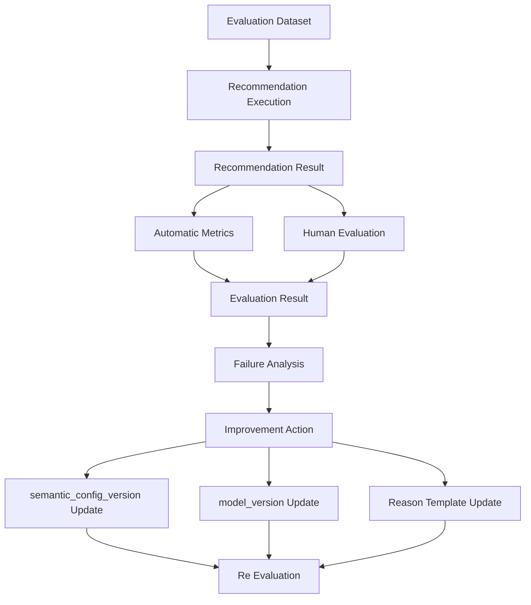

# Evaluation評価定義書

## 1. 概要

### 1.1 目的

本ドキュメントは、ギフトレコメンドサービスにおける `Evaluation` を定義する。

Evaluationとは、推薦結果・意味解釈・Feature生成・Matching・Ranking・Reason生成が、ユーザーの贈答目的に対して妥当かを評価し、改善につなげるための仕組みである。

```text
Recommendation Pipeline
↓
Evaluation
↓
Failure Analysis
↓
Rule / Model / Feature / Reason Improvement
↓
Version Update
```

---

### 1.2 本ドキュメントの位置づけ

| 成果物                      | 本ドキュメントとの関係                 |
| --------------------------- | -------------------------------------- |
| Semanticルール定義書        | Semantic Concept抽出の評価対象         |
| Featureルール定義書         | Feature生成・正規化の評価対象          |
| Matching定義書              | Feature一致度・context_scoreの評価対象 |
| Ranking定義書               | final_score・順位妥当性の評価対象      |
| Reason生成定義書            | 推薦理由の納得感・根拠性の評価対象     |
| Recommendation Result定義書 | 評価対象となる推薦結果の定義元         |
| Observability設計書         | 分布・ログ・メトリクス監視との接続先   |

---

### 1.3 基本方針

- Evaluationは、推薦品質を継続的に改善するための評価活動である
- Evaluationは、単なるログ取得ではなく、改善判断のための評価として扱う
- MVPでは、人手評価を中心にする
- 自動評価指標は、人手評価を補助するために利用する
- 推薦結果だけでなく、Semantic / Feature / Matching / Ranking / Reasonの各段階を評価する
- 評価結果は、`semantic_config_version` または `model_version` の改善判断に接続する
- 評価データセットと評価結果は、再現可能な形で保存する
- MVPでは、オンラインA/Bテストや自動最適化は対象外とする

---

## 2. Evaluationの責務

### 2.1 In Scope

| 対象           | 内容                                                        |
| -------------- | ----------------------------------------------------------- |
| 推薦結果評価   | 上位推薦商品が贈答文脈に合っているか評価する                |
| Semantic評価   | 入力文・商品情報からConceptが正しく抽出されているか評価する |
| Feature評価    | Feature値が人間の感覚と整合しているか評価する               |
| Matching評価   | context_scoreが意味的な近さを表現できているか評価する       |
| Ranking評価    | final_score順の並びが妥当か評価する                         |
| Reason評価     | 推薦理由が納得でき、根拠に基づいているか評価する            |
| リスク評価     | 不適切・外しやすい推薦が上位に出ていないか評価する          |
| 多様性評価     | 類似商品ばかりになっていないか評価する                      |
| 失敗分析       | 推薦失敗の原因を分類し、改善対象を特定する                  |
| 評価データ管理 | 評価ケース・評価結果・評価バージョンを管理する              |

---

### 2.2 Out of Scope

| 対象外               | 理由                                  | 管理先                   |
| -------------------- | ------------------------------------- | ------------------------ |
| 本番ユーザー行動分析 | MVP初期では利用データが不足するため   | 将来のAnalytics設計      |
| A/Bテスト            | トラフィック・ユーザー数が必要なため  | 将来拡張                 |
| 自動重み最適化       | 評価データ蓄積後に実施すべきため      | 将来のModel Optimization |
| 売上最大化評価       | MVPの価値仮説検証とは目的が異なるため | 事業KPI設計              |
| 個人別満足度最適化   | 認証・履歴管理が前提のため            | 将来拡張                 |
| 完全自動品質判定     | 人間の贈答判断が必要なため            | 対象外                   |

---

## 3. Evaluation全体構造

### 3.1 全体フロー



---

### 3.2 評価レイヤー

| レイヤー            | 評価対象           | 主な評価方法                  |
| ------------------- | ------------------ | ----------------------------- |
| Semantic Evaluation | Concept抽出        | 人手ラベル・抽出精度          |
| Feature Evaluation  | Feature値・分布    | 人手評価・分布監視            |
| Matching Evaluation | context_score      | 人手評価・相関確認            |
| Ranking Evaluation  | final_score / rank | NDCG@K / MRR@K / 人手順位評価 |
| Reason Evaluation   | 推薦理由           | 人手評価・禁止表現チェック    |
| Overall Evaluation  | 推薦結果全体       | ユーザー視点の妥当性評価      |

---

## 4. 評価対象

### 4.1 評価対象一覧

| 評価対象                     | 内容                          |
| ---------------------------- | ----------------------------- |
| `semantic_extraction_result` | Semantic Concept抽出結果      |
| `user_feature`               | User Feature Raw / Normalized |
| `item_feature`               | Item Feature Raw / Normalized |
| `feature_match`              | Feature単位の一致度           |
| `social_match`               | Social系一致度                |
| `symbolic_match`             | Symbolic系一致度              |
| `context_score`              | 意味一致スコア                |
| `popularity_score`           | 人気・信頼性スコア            |
| `risk_penalty`               | リスク減点                    |
| `final_score`                | 最終順位スコア                |
| `recommendation_result_item` | 推薦結果明細                  |
| `recommendation_reason`      | 推薦理由                      |

---

### 4.2 評価しないもの

| 対象                     | 理由                          |
| ------------------------ | ----------------------------- |
| 外部ECの販売実績そのもの | MVPでは制御できないため       |
| 実購入コンバージョン     | MVP初期では決済機能がないため |
| 配送満足度               | EC機能対象外のため            |
| 在庫・価格変動           | Ranking品質とは分離すべきため |

---

## 5. Evaluation Dataset

### 5.1 Evaluation Datasetとは

`Evaluation Dataset` は、推薦システムを評価するための固定評価ケース群である。

同じ入力条件に対して、異なる `semantic_config_version` / `model_version` の結果を比較するために利用する。

---

### 5.2 評価ケースの構成

評価ケースは、以下を含む。

| 項目                        | 内容                       |
| --------------------------- | -------------------------- |
| `eval_case_id`              | 評価ケースID               |
| `relationship`              | 贈る相手との関係性         |
| `occasion`                  | 贈答目的                   |
| `budget_min`                | 最低予算                   |
| `budget_max`                | 最高予算                   |
| `preferred_condition`       | 好み条件                   |
| `non_preferred_condition`   | 避けたい条件               |
| `ng_condition`              | 絶対NG条件                 |
| `free_text`                 | 自由入力                   |
| `expected_concepts`         | 期待されるSemantic Concept |
| `expected_feature_tendency` | 期待されるFeature傾向      |
| `evaluation_focus`          | このケースで確認したい観点 |

---

### 5.3 評価ケース例

| eval_case_id | relationship     | occasion    | preferred_condition                    | non_preferred_condition | evaluation_focus |
| ------------ | ---------------- | ----------- | -------------------------------------- | ----------------------- | ---------------- |
| `case_001`   | boss             | thanks      | 上品で失礼がないもの                   | カジュアルすぎるもの    | Social適合性     |
| `case_002`   | lover            | anniversary | 特別感があり気持ちが伝わるもの         | 無難すぎるもの          | Symbolic適合性   |
| `case_003`   | friend_close     | birthday    | 気を遣わせないけど少し特別感があるもの | 高級すぎるもの          | バランス         |
| `case_004`   | business_partner | apology     | きちんとしたもの                       | ユニークすぎるもの      | リスク制御       |
| `case_005`   | family_parent    | birthday    | 実用的で感謝が伝わるもの               | 派手すぎるもの          | 実用性・感情     |

---

### 5.4 Dataset種別

| dataset_type    | 内容                               | 用途           |
| --------------- | ---------------------------------- | -------------- |
| `golden`        | 人手で期待結果を精査した基準データ | 回帰評価       |
| `regression`    | 過去に失敗したケース               | 改善確認       |
| `exploratory`   | 新しいパターンを試すためのケース   | 探索評価       |
| `edge_case`     | 難しい条件・矛盾条件               | ロバスト性評価 |
| `manual_review` | 人手評価対象ケース                 | 主観品質評価   |

---

## 6. Human Evaluation

### 6.1 Human Evaluationとは

Human Evaluationは、人間が推薦結果を見て、贈答文脈に対する妥当性を評価する方式である。

本サービスは「贈答意味」を扱うため、MVPではHuman Evaluationを最重要評価とする。

---

### 6.2 評価観点

| 評価観点                 | 内容                               |
| ------------------------ | ---------------------------------- |
| `overall_fit`            | 総合的に贈り物として合っているか   |
| `social_appropriateness` | 関係性・場面に対して失礼がないか   |
| `symbolic_fit`           | 気持ち・特別感・相手らしさがあるか |
| `safety`                 | 外しにくい候補か                   |
| `novelty_balance`        | 無難さと特別感のバランスが良いか   |
| `avoidance_fit`          | 避けたい条件を避けられているか     |
| `reason_quality`         | 推薦理由に納得できるか             |
| `purchase_consideration` | 実際に候補として検討できるか       |

---

### 6.3 評価スケール

MVPでは、5段階評価を基本とする。

| score | 解釈           |
| ----: | -------------- |
|     5 | 非常に良い     |
|     4 | 良い           |
|     3 | 普通・許容範囲 |
|     2 | やや悪い       |
|     1 | 悪い           |

---

### 6.4 推奨評価項目

| 評価項目          | 形式    | 説明                     |
| ----------------- | ------- | ------------------------ |
| overall_fit_score | 1〜5    | 総合的な推薦妥当性       |
| social_score      | 1〜5    | 社会的適切性             |
| symbolic_score    | 1〜5    | 意味性・特別感           |
| reason_score      | 1〜5    | 推薦理由の納得感         |
| risk_score        | 1〜5    | 不適切さの少なさ         |
| is_acceptable     | boolean | 表示してよい候補か       |
| is_top_candidate  | boolean | 上位候補として妥当か     |
| failure_reason    | enum    | 問題がある場合の失敗分類 |
| comment           | text    | 評価者コメント           |

---

### 6.5 Human Evaluationの判定基準

| 判定         | 条件                    |
| ------------ | ----------------------- |
| 合格         | overall_fit_score >= 4  |
| 許容         | overall_fit_score = 3   |
| 改善対象     | overall_fit_score <= 2  |
| 上位候補妥当 | is_top_candidate = true |
| 表示不可     | is_acceptable = false   |

---

## 7. Semantic Evaluation

### 7.1 目的

Semantic Evaluationは、ユーザー入力・商品情報から抽出されたSemantic Conceptが妥当かを評価する。

```text
Input Text
↓
Semantic Rule
↓
Semantic Concept
↓
Human / Expected Label Comparison
```

---

### 7.2 評価項目

| 評価項目             | 内容                                      |
| -------------------- | ----------------------------------------- |
| concept_precision    | 抽出されたConceptが正しい割合             |
| concept_recall       | 抽出すべきConceptを抽出できた割合         |
| concept_f1           | precisionとrecallの調和平均               |
| intent_accuracy      | prefer / avoid / neutral判定の正確性      |
| polarity_accuracy    | asserted / negated判定の正確性            |
| hard_filter_accuracy | NG条件をHard Filter候補として分離できたか |
| evidence_quality     | evidence_textが妥当か                     |

---

### 7.3 Precision / Recall / F1

```text
Precision = 正しく抽出されたConcept数 / 抽出されたConcept数
```

```text
Recall = 正しく抽出されたConcept数 / 抽出すべきConcept数
```

```text
F1 = 2 * Precision * Recall / (Precision + Recall)
```

---

### 7.4 MVP目標値

| 指標                 |  MVP目標 |
| -------------------- | -------: |
| concept_precision    | 0.70以上 |
| concept_recall       | 0.60以上 |
| intent_accuracy      | 0.80以上 |
| hard_filter_accuracy | 0.90以上 |
| evidence_quality     | 0.70以上 |

---

### 7.5 Semantic失敗分類

| failure_type             | 内容                            |
| ------------------------ | ------------------------------- |
| `concept_missed`         | 必要なConceptを抽出できていない |
| `concept_over_extracted` | 不要なConceptを抽出している     |
| `concept_wrong`          | 誤ったConceptを抽出している     |
| `intent_wrong`           | prefer / avoidを誤っている      |
| `negation_wrong`         | 否定表現を誤っている            |
| `hard_filter_missed`     | NG条件を見逃している            |
| `evidence_invalid`       | 根拠テキストが不適切            |

---

## 8. Feature Evaluation

### 8.1 目的

Feature Evaluationは、生成された8次元Featureが人間の感覚と整合しているかを評価する。

---

### 8.2 評価対象

| 対象                    | 内容                      |
| ----------------------- | ------------------------- |
| user_feature_raw        | User側の未正規化Feature   |
| user_feature_normalized | User側の正規化済みFeature |
| item_feature_raw        | Item側の未正規化Feature   |
| item_feature_normalized | Item側の正規化済みFeature |
| feature_distribution    | Feature値の分布           |
| sigmoid_parameter       | 正規化パラメータ          |

---

### 8.3 評価観点

| 観点                  | 内容                                                   |
| --------------------- | ------------------------------------------------------ |
| 文脈妥当性            | Relationship / Occasionに対して自然なFeature値か       |
| Concept反映           | Semantic ConceptがFeatureに正しく反映されているか      |
| 過剰補正              | 特定Featureが高くなりすぎていないか                    |
| 中央寄り              | normalized_valueが0.5付近に寄りすぎていないか          |
| 飽和                  | normalized_valueが0.0または1.0付近に偏りすぎていないか |
| User / Item比較可能性 | User FeatureとItem Featureの分布が比較可能か           |

---

### 8.4 監視指標

| 指標                       | 内容                      |
| -------------------------- | ------------------------- |
| feature_mean               | Feature別平均             |
| feature_std                | Feature別標準偏差         |
| feature_p10                | Feature別10パーセンタイル |
| feature_p50                | Feature別中央値           |
| feature_p90                | Feature別90パーセンタイル |
| saturation_rate_high       | 0.95以上の割合            |
| saturation_rate_low        | 0.05以下の割合            |
| neutral_concentration_rate | 0.45〜0.55に集中する割合  |

---

### 8.5 Feature失敗分類

| failure_type                      | 内容                               |
| --------------------------------- | ---------------------------------- |
| `feature_too_high`                | Feature値が過剰に高い              |
| `feature_too_low`                 | Feature値が過剰に低い              |
| `feature_not_reflecting_concept`  | ConceptがFeatureへ反映されていない |
| `feature_over_reflecting_concept` | Conceptが過剰に反映されている      |
| `normalization_saturated`         | sigmoid後に飽和している            |
| `normalization_too_flat`          | sigmoid後に差が出ていない          |
| `user_item_distribution_mismatch` | User / Item分布が大きくズレている  |

---

## 9. Matching Evaluation

### 9.1 目的

Matching Evaluationは、Feature一致度・Social Match・Symbolic Match・Context Scoreが、人間の感じる「意味的な近さ」と整合しているかを評価する。

---

### 9.2 評価対象

| 対象             | 内容                      |
| ---------------- | ------------------------- |
| feature_distance | Feature単位距離           |
| feature_match    | Feature単位一致度         |
| social_match     | Social一致度              |
| symbolic_match   | Symbolic一致度            |
| context_score    | 意味一致スコア            |
| lambda_ctx       | Social / Symbolic統合重み |

---

### 9.3 評価観点

| 観点                   | 内容                                            |
| ---------------------- | ----------------------------------------------- |
| context_score妥当性    | 高いcontext_scoreの商品が人間にも合って見えるか |
| social_match妥当性     | 上司・取引先などでSocialが効いているか          |
| symbolic_match妥当性   | 恋人・記念日などでSymbolicが効いているか        |
| lambda_ctx妥当性       | 文脈に応じてSocial / Symbolicの重みが自然か     |
| feature_match説明性    | どのFeatureが合っているか説明できるか           |
| avoid_similarity妥当性 | 避けたい条件に近い商品を検知できているか        |

---

### 9.4 評価指標

| 指標                        | 内容                                     |
| --------------------------- | ---------------------------------------- |
| context_human_correlation   | context_scoreと人手overall_fitの相関     |
| social_human_correlation    | social_matchと人手social_scoreの相関     |
| symbolic_human_correlation  | symbolic_matchと人手symbolic_scoreの相関 |
| avoid_detection_rate        | 避けたい条件に近い商品を検知できた割合   |
| feature_explainability_rate | 上位理由に使えるFeatureが存在する割合    |

---

### 9.5 Matching失敗分類

| failure_type              | 内容                                      |
| ------------------------- | ----------------------------------------- |
| `context_score_too_high`  | 人間評価は低いのにcontext_scoreが高い     |
| `context_score_too_low`   | 人間評価は高いのにcontext_scoreが低い     |
| `social_underweighted`    | Socialが重要な場面で効いていない          |
| `symbolic_underweighted`  | Symbolicが重要な場面で効いていない        |
| `lambda_ctx_wrong`        | Social / Symbolic重みが文脈と合っていない |
| `avoid_similarity_missed` | 避けたい意味に近い商品を検知できない      |

---

## 10. Ranking Evaluation

### 10.1 目的

Ranking Evaluationは、final_scoreによる並び順が、ユーザーに提示する順序として妥当かを評価する。

---

### 10.2 評価対象

| 対象             | 内容               |
| ---------------- | ------------------ |
| context_score    | 意味一致スコア     |
| popularity_score | 人気・信頼性スコア |
| risk_penalty     | リスク減点         |
| pre_rank_score   | MMR前スコア        |
| final_score      | 最終順位スコア     |
| rank             | 表示順位           |
| MMR適用結果      | 多様性制御結果     |

---

### 10.3 評価指標

| 指標        | 内容                                      |
| ----------- | ----------------------------------------- |
| Precision@K | 上位K件のうち、適合商品が占める割合       |
| Recall@K    | 適合商品全体のうち、上位K件に含まれる割合 |
| NDCG@K      | 適合度の高い商品が上位に来ているか        |
| MRR@K       | 最初の適合商品がどれだけ上位にあるか      |
| HitRate@K   | 上位K件に適合商品が1件以上ある割合        |
| Diversity@K | 上位K件の多様性                           |
| Coverage@K  | 推薦される商品・カテゴリの広がり          |
| RiskRate@K  | 上位K件にリスク商品が含まれる割合         |

---

### 10.4 指標の使い分け

| 指標        | 使いどころ                         |
| ----------- | ---------------------------------- |
| Precision@K | 上位表示の品質を見る               |
| NDCG@K      | 順位の良さを見る                   |
| MRR@K       | 最初に良い候補が出るかを見る       |
| Diversity@K | 同質商品への偏りを見る             |
| RiskRate@K  | 危ない推薦が混ざっていないかを見る |

---

### 10.5 MVP目標値

MVP初期では、厳密な数値目標よりも改善傾向を重視する。

| 指標                  |  MVP目安 |
| --------------------- | -------: |
| Precision@10          | 0.50以上 |
| HitRate@10            | 0.80以上 |
| NDCG@10               | 継続改善 |
| RiskRate@10           | 0.10以下 |
| Human overall_fit平均 |  3.5以上 |
| Reason Score平均      |  3.5以上 |

---

### 10.6 Ranking失敗分類

| failure_type                 | 内容                                 |
| ---------------------------- | ------------------------------------ |
| `popular_but_not_contextual` | 人気はあるが文脈に合っていない       |
| `contextual_but_ranked_low`  | 文脈に合う商品が下位に沈んでいる     |
| `risk_item_ranked_high`      | リスク商品が上位に出ている           |
| `too_many_similar_items`     | 類似商品が上位に並びすぎている       |
| `diversity_overcorrected`    | 多様性を重視しすぎて品質が落ちている |
| `popularity_overweighted`    | popularity_scoreが効きすぎている     |
| `risk_underweighted`         | risk_penaltyが弱すぎる               |

---

## 11. Reason Evaluation

### 11.1 目的

Reason Evaluationは、推薦理由がユーザーにとって納得でき、根拠に基づいており、過剰表現やハルシネーションがないかを評価する。

---

### 11.2 評価観点

| 評価観点                | 内容                         |
| ----------------------- | ---------------------------- |
| reason_relevance        | 推薦商品と理由が合っているか |
| reason_groundedness     | 根拠データに基づいているか   |
| reason_clarity          | 分かりやすいか               |
| reason_persuasiveness   | 選びやすくなる説明か         |
| reason_context_fit      | 関係性・用途に合った説明か   |
| reason_non_exaggeration | 断定・誇張がないか           |
| caution_appropriateness | 注意文が適切か               |

---

### 11.3 評価項目

| 評価項目            | 形式    | 内容                   |
| ------------------- | ------- | ---------------------- |
| reason_score        | 1〜5    | 総合的な理由品質       |
| groundedness_score  | 1〜5    | 根拠性                 |
| clarity_score       | 1〜5    | 分かりやすさ           |
| context_fit_score   | 1〜5    | 文脈適合性             |
| has_hallucination   | boolean | 根拠のない事実があるか |
| has_overclaim       | boolean | 過剰表現があるか       |
| reason_failure_type | enum    | 失敗分類               |

---

### 11.4 Reason失敗分類

| failure_type            | 内容                                 |
| ----------------------- | ------------------------------------ |
| `generic_reason`        | 理由が汎用的すぎる                   |
| `wrong_context_reason`  | 関係性・用途と合わない説明           |
| `ungrounded_claim`      | 根拠のない事実を述べている           |
| `overclaim`             | 断定・保証表現が強すぎる             |
| `score_reason_mismatch` | スコア内訳と理由が矛盾している       |
| `missing_key_reason`    | 本来説明すべき強みが説明されていない |
| `too_long`              | 理由文が長すぎる                     |
| `too_vague`             | 抽象的で判断材料にならない           |

---

## 12. Overall Recommendation Evaluation

### 12.1 目的

Overall Recommendation Evaluationは、ユーザー視点で推薦結果全体が使えるかを評価する。

---

### 12.2 評価観点

| 観点       | 内容                                     |
| ---------- | ---------------------------------------- |
| 上位品質   | 上位商品が候補として妥当か               |
| 選びやすさ | 推薦理由により比較・選択しやすいか       |
| バランス   | 無難さ・特別感・実用性のバランスが良いか |
| 多様性     | 選択肢に幅があるか                       |
| 安全性     | 不適切・危険な候補が混ざっていないか     |
| 差別化     | 単なる人気順ではなく、意味で選べているか |

---

### 12.3 MVPで見るべき最重要KPI

| KPI                            | 内容                                            |
| ------------------------------ | ----------------------------------------------- |
| `top_k_acceptance_rate`        | 上位K件のうち「候補として許容」と評価された割合 |
| `best_item_rank`               | 最も良い商品が何位に出ているか                  |
| `reason_helpfulness_score`     | 理由が選択に役立つか                            |
| `risk_item_rate`               | 上位に不適切商品が混ざる割合                    |
| `meaning_recommendation_score` | 意味で選べている感覚があるか                    |

---

## 13. Failure Analysis

### 13.1 Failure Analysisとは

Failure Analysisは、評価結果が悪かった原因を分類し、改善対象を特定する分析である。

---

### 13.2 失敗分類体系

| failure_layer | failure_type               | 改善対象               |
| ------------- | -------------------------- | ---------------------- |
| Semantic      | concept_missed             | Semanticルール         |
| Semantic      | intent_wrong               | Semanticルール         |
| Feature       | feature_too_high           | Featureルール          |
| Feature       | normalization_saturated    | sigmoidパラメータ      |
| Matching      | context_score_wrong        | Matching重み・距離計算 |
| Matching      | lambda_ctx_wrong           | λ_ctx算出              |
| Ranking       | popular_but_not_contextual | Ranking重み            |
| Ranking       | risk_item_ranked_high      | Risk Penalty           |
| Reason        | ungrounded_claim           | Reason生成制約         |
| Reason        | generic_reason             | Reasonテンプレート     |
| Data          | item_data_insufficient     | 商品データ取得・ETL    |

---

### 13.3 改善先の判断

| 問題                              | 主な改善先                 |
| --------------------------------- | -------------------------- |
| 入力意図を誤解している            | Semanticルール定義書       |
| Feature値が感覚と違う             | Featureルール定義書        |
| context_scoreが人間評価と合わない | Matching定義書             |
| 人気商品ばかり上位に出る          | Ranking定義書              |
| 不適切商品が上位に出る            | Risk Penalty / Hard Filter |
| 理由が薄い                        | Reason生成定義書           |
| 商品の意味が取れない              | Item Data / Semantic抽出   |

---

## 14. 評価データモデル

### 14.1 offline_eval_dataset

論理的には以下の項目を持つ。

| 項目                    | 内容                                |
| ----------------------- | ----------------------------------- |
| offline_eval_dataset_id | 評価データセットID                  |
| dataset_name            | データセット名                      |
| dataset_type            | golden / regression / exploratory等 |
| description             | 説明                                |
| created_by              | 作成者                              |
| created_at              | 作成日時                            |
| is_active               | 有効フラグ                          |

---

### 14.2 offline_eval_case

| 項目                      | 内容                 |
| ------------------------- | -------------------- |
| offline_eval_case_id      | 評価ケースID         |
| offline_eval_dataset_id   | 評価データセットID   |
| relationship_code         | Relationship         |
| occasion_code             | Occasion             |
| budget_min                | 予算下限             |
| budget_max                | 予算上限             |
| preferred_condition       | 好み条件             |
| non_preferred_condition   | 避けたい条件         |
| ng_condition              | NG条件               |
| free_text                 | 自由入力             |
| expected_concepts         | 期待Concept JSON     |
| expected_feature_tendency | 期待Feature傾向 JSON |
| evaluation_focus          | 評価観点             |
| is_active                 | 有効フラグ           |

---

### 14.3 offline_eval_run

| 項目                       | 内容                    |
| -------------------------- | ----------------------- |
| offline_eval_run_id        | 評価実行ID              |
| offline_eval_dataset_id    | 評価データセットID      |
| semantic_config_version_id | 評価対象Semantic Config |
| model_version_id           | 評価対象Model Version   |
| run_status                 | success / failed        |
| started_at                 | 開始日時                |
| finished_at                | 終了日時                |
| summary_metrics            | 集計メトリクスJSON      |

---

### 14.4 offline_eval_result

| 項目                   | 内容               |
| ---------------------- | ------------------ |
| offline_eval_result_id | 評価結果ID         |
| offline_eval_run_id    | 評価実行ID         |
| offline_eval_case_id   | 評価ケースID       |
| recommendation_run_id  | 推薦実行ID         |
| precision_at_k         | Precision@K        |
| ndcg_at_k              | NDCG@K             |
| mrr_at_k               | MRR@K              |
| hit_rate_at_k          | HitRate@K          |
| diversity_at_k         | Diversity@K        |
| risk_rate_at_k         | RiskRate@K         |
| metric_detail          | 詳細メトリクスJSON |

---

### 14.5 human_eval_task

| 項目                     | 内容                          |
| ------------------------ | ----------------------------- |
| human_eval_task_id       | 人手評価タスクID              |
| offline_eval_run_id      | 評価実行ID                    |
| offline_eval_case_id     | 評価ケースID                  |
| recommendation_result_id | 推薦結果ID                    |
| evaluator_id             | 評価者ID                      |
| task_status              | pending / completed / skipped |
| assigned_at              | 割当日時                      |
| completed_at             | 完了日時                      |

---

### 14.6 human_eval_result

| 項目                          | 内容             |
| ----------------------------- | ---------------- |
| human_eval_result_id          | 人手評価結果ID   |
| human_eval_task_id            | 人手評価タスクID |
| recommendation_result_item_id | 推薦結果明細ID   |
| overall_fit_score             | 総合評価         |
| social_score                  | Social評価       |
| symbolic_score                | Symbolic評価     |
| reason_score                  | Reason評価       |
| risk_score                    | リスク評価       |
| is_acceptable                 | 表示許容可否     |
| is_top_candidate              | 上位候補妥当性   |
| failure_layer                 | 失敗レイヤー     |
| failure_type                  | 失敗分類         |
| comment                       | コメント         |
| evaluated_at                  | 評価日時         |

---

## 15. Evaluation運用フロー

### 15.1 MVP評価フロー

```text
1. Evaluation Datasetを作成
2. 対象versionを指定
3. 推薦パイプラインを実行
4. 自動メトリクスを算出
5. 上位結果を人手評価
6. 失敗分類を付与
7. 改善対象を特定
8. semantic_config_version / model_versionを更新
9. 同じDatasetで再評価
```

---

### 15.2 評価タイミング

| タイミング               | 評価内容                          |
| ------------------------ | --------------------------------- |
| Semanticルール変更時     | Concept抽出評価                   |
| Featureルール変更時      | Feature分布・人手評価             |
| Matching変更時           | context_score妥当性評価           |
| Ranking変更時            | Precision@K / NDCG@K / RiskRate@K |
| Reasonテンプレート変更時 | Reason評価                        |
| リリース前               | Golden Datasetによる回帰評価      |

---

### 15.3 評価単位

| 単位        | 内容                       |
| ----------- | -------------------------- |
| case単位    | 1つの入力条件に対する評価  |
| item単位    | 1つの推薦商品に対する評価  |
| top_k単位   | 上位K件全体の評価          |
| dataset単位 | 評価データセット全体の評価 |
| version単位 | version間比較              |

---

## 16. Version管理との関係

### 16.1 semantic_config_versionへのフィードバック

以下の問題は、`semantic_config_version` の改善対象とする。

| 問題                                    | 改善対象                     |
| --------------------------------------- | ---------------------------- |
| Concept抽出が誤っている                 | Semanticルール               |
| Feature値が文脈と合わない               | Featureルール                |
| sigmoid後の分布が悪い                   | 正規化パラメータ             |
| Relationship / Occasionの基準値が不自然 | Relationship / Occasion Rule |
| Concept Feature Deltaが強すぎる         | Concept Feature Rule         |

---

### 16.2 model_versionへのフィードバック

以下の問題は、`model_version` の改善対象とする。

| 問題                              | 改善対象                  |
| --------------------------------- | ------------------------- |
| context_scoreが人手評価と合わない | Matching方式              |
| Social / Symbolic重みが不自然     | lambda_ctx / Matching重み |
| 人気補正が効きすぎる              | Ranking重み               |
| リスク商品が上位に来る            | Risk Penalty              |
| 類似商品が並びすぎる              | MMR / Diversity Control   |
| Reasonが弱い                      | Reason生成テンプレート    |

---

## 17. Observabilityとの接続

### 17.1 EvaluationとObservabilityの違い

| 項目       | Evaluation                   | Observability              |
| ---------- | ---------------------------- | -------------------------- |
| 目的       | 品質を評価し改善判断する     | 状態・分布・異常を監視する |
| 主な対象   | 推薦結果・人手評価・品質指標 | ログ・メトリクス・分布     |
| タイミング | 評価実行時・リリース前       | 常時・定期                 |
| 判断       | 人間の評価を含む             | 数値監視中心               |
| 成果       | 改善方針                     | 異常検知・傾向把握         |

---

### 17.2 Observabilityへ渡す指標

| 指標                       | 用途                 |
| -------------------------- | -------------------- |
| feature_distribution       | Feature偏り監視      |
| context_score_distribution | Matching品質監視     |
| final_score_distribution   | Ranking偏り監視      |
| risk_penalty_distribution  | リスク制御監視       |
| reason_failure_rate        | Reason品質監視       |
| fallback_rate              | Reason生成安定性監視 |
| human_score_summary        | 人手評価サマリ       |

---

## 18. MVPでの扱い

### 18.1 MVP対象

| 項目                | 方針         |
| ------------------- | ------------ |
| Evaluation Dataset  | 小規模で作成 |
| Golden Dataset      | 必須         |
| Human Evaluation    | 必須         |
| Semantic Evaluation | 必須         |
| Feature分布確認     | 必須         |
| Matching評価        | 必須         |
| Ranking評価         | 必須         |
| Reason評価          | 必須         |
| Failure Analysis    | 必須         |
| version間比較       | 必須         |

---

### 18.2 MVP対象外

| 項目           | 理由                         |
| -------------- | ---------------------------- |
| A/Bテスト      | ユーザー数・トラフィック不足 |
| 自動重み最適化 | 評価データ不足               |
| オンライン学習 | MVP範囲外                    |
| 個人別評価     | 認証・履歴管理が前提         |
| 売上ベース評価 | 決済機能がないため           |
| 大規模評価基盤 | 初期検証では過剰             |

---

### 18.3 MVP初期の推奨規模

| 項目                  |            推奨値 |
| --------------------- | ----------------: |
| Golden Dataset        |      30〜50ケース |
| Regression Dataset    |      10〜20ケース |
| 1ケースあたり評価商品 |            Top 10 |
| 人手評価者            |            1〜3名 |
| 評価頻度              | 主要version変更時 |
| 詳細レビュー対象      |      Top 3〜5商品 |

---

## 19. 品質・レビュー観点

### 19.1 Evaluation設計レビュー観点

| 観点           | 確認内容                                                           |
| -------------- | ------------------------------------------------------------------ |
| 再現性         | 同じDataset・Versionで再評価できるか                               |
| 改善接続性     | 評価結果から改善対象を特定できるか                                 |
| 多層評価       | Semantic / Feature / Matching / Ranking / Reasonを分離できているか |
| 人手評価妥当性 | 評価者が判断しやすい項目になっているか                             |
| 指標妥当性     | 指標が本サービスの価値仮説に合っているか                           |
| MVP適性        | 評価設計が重すぎないか                                             |
| 失敗分類       | 失敗原因を分類できるか                                             |
| version比較    | semantic_config_version / model_versionの比較ができるか            |

---

### 19.2 よくある問題

| 問題                         | 内容                                   | 対応                      |
| ---------------------------- | -------------------------------------- | ------------------------- |
| 指標だけ良くて人間評価が低い | 自動指標が価値を捉えていない           | Human Evaluation重視      |
| 失敗原因が分からない         | 評価が最終結果だけ                     | レイヤー別評価を行う      |
| 改善しても比較できない       | Datasetが固定されていない              | Golden Datasetを固定      |
| 評価が属人的                 | 評価基準が曖昧                         | 5段階基準と失敗分類を定義 |
| Reasonだけ良く見える         | 商品自体が合っていない                 | Ranking評価と分離         |
| 人気商品に偏る               | popularityが強すぎる                   | Ranking重みを確認         |
| Feature改善が効かない        | Matching / Ranking側で打ち消されている | score_breakdownを確認     |

---

## 20. 後続成果物への引き継ぎ

### 20.1 Observability設計書への引き継ぎ

| 引き継ぎ項目        | 内容                    |
| ------------------- | ----------------------- |
| feature分布指標     | μ / σ / p10 / p50 / p90 |
| context_score分布   | Matching監視            |
| final_score分布     | Ranking監視             |
| risk_penalty分布    | リスク制御監視          |
| reason_failure_rate | Reason品質監視          |
| version別評価結果   | 改善推移の可視化        |

---

### 20.2 テスト設計書への引き継ぎ

| 引き継ぎ項目       | 内容               |
| ------------------ | ------------------ |
| Golden Dataset     | 回帰テスト用       |
| Regression Dataset | 過去失敗の再発防止 |
| Semantic期待値     | Semantic抽出テスト |
| Feature期待傾向    | Feature生成テスト  |
| Ranking期待傾向    | 順位妥当性テスト   |
| Reason禁止表現     | Reason生成テスト   |

---

### 20.3 運用設計書への引き継ぎ

| 引き継ぎ項目 | 内容               |
| ------------ | ------------------ |
| 評価頻度     | version変更時      |
| 評価担当     | 人手評価者         |
| 合格基準     | MVP品質基準        |
| 改善判断     | failure_type別対応 |
| リリース判定 | Golden Dataset結果 |

---

## 21. まとめ

Evaluationは、ギフトレコメンドサービスの推薦品質を継続改善するための評価工程である。

```text
Evaluation Dataset
↓
Recommendation Execution
↓
Automatic Metrics
+
Human Evaluation
↓
Failure Analysis
↓
semantic_config_version / model_version Improvement
```

MVPでは、以下の方針で運用する。

```text
- 人手評価を最重要とする
- Semantic / Feature / Matching / Ranking / Reasonを分離して評価する
- Golden Datasetを固定し、version間比較を可能にする
- Precision@K / NDCG@K / MRR@K等は補助指標として使う
- Reasonは根拠性・納得感・非誇張性を評価する
- 失敗分類により改善対象を特定する
- 評価結果はsemantic_config_version / model_versionの改善に接続する
```

Evaluationは「品質を測るだけの工程」ではなく、推薦ロジックを改善するための中核フィードバックループである。
